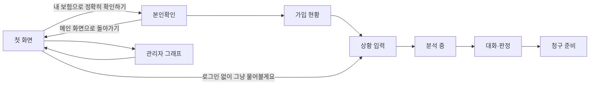

# 사용자 시나리오 — 보험길잡이

> 1. 쓰는 사람 다섯(노인·익명·무보험·다중 실손·정밀형)과 운영 쪽 셋(관리자·보고서 팀원·이어받는 개발자)을 페르소나로 두었다.
> 2. 시나리오 14개가 PRD의 기능 요구 27개와 비기능 요구 8개를 모두 한 번 이상 지난다.
> 3. 사용자 흐름은 실제 화면 순서를 따르고, 예시는 시연 계정(합성 데이터)으로 재현할 수 있다.

## 0. 범위와 전제

- 실손의료보험만 다룬다. 적재된 약관은 5개 손보사(삼성화재·현대해상·메리츠화재·한화손해보험·롯데손해보험) 것이다
- 마이데이터·건강보험은 표준 규격 형식의 더미로 동작하고, 청구 접수는 가정으로 처리한다
- 시연 계정은 합성 데이터다(`docs/demo-accounts.md`). 시나리오의 "예"는 그 계정 기준이다
- 요구는 [[INS-PRD-002]]의 항목을 가리킨다

화면 순서는 다음과 같다. 도움 챗봇은 어느 화면에서나 오른쪽 아래에 떠 있다.

## 1. 페르소나

#### P1 대충 묻는 노인 가입자

- **역할**: 실손에 든 나이 많은 가입자. 긴 입력과 로그인이 부담스럽다
- **겪는 문제**: 시나리오형 챗봇에 거부감이 있고, 상황을 짧게만 말한다. 약관은 글씨가 작고 어렵다
- **원하는 것**: 짧게 물어도 될지 말지와 그 이유를 바로 듣고, 막히면 쉽게 도움을 받는 것
- **근거**: [[INS-RFQ-002#Q5]] · [[INS-RFQ-002#Q13]]

#### P2 개인정보를 꺼리는 사람

- **역할**: 로그인하지 않고 쓰는 사람. 보험사 이름 정도만 말하거나 아예 말하지 않는다
- **겪는 문제**: 진료내역과 가입 정보를 넘기기 싫은데, 그러면 답을 못 받을까 걱정한다
- **원하는 것**: 개인정보를 주지 않고도 쓸 만한 답을 받고, 흔적이 남지 않는 것
- **근거**: [[INS-RFQ-002#Q5]]

#### P3 보험이 없는 사람

- **역할**: 실손에 들지 않았거나, 로그인했지만 연동된 실손이 없는 사람 (예: 신하율 계정)
- **겪는 문제**: 가입 정보가 없다는 이유로 흐름이 막히거나 처음 인사말로 되돌아간다
- **원하는 것**: 실손 일반 기준으로 무엇이 되고 안 되는지 듣고, 대화를 이어 가는 것
- **근거**: [[INS-RFQ-002#Q5]] · [[INS-RFQ-002#Q9]]

#### P4 여러 실손에 든 사람

- **역할**: 실손을 둘 이상 든 로그인 사용자 (예: 김민서 계정 — 삼성화재 4세대·현대해상 3세대)
- **겪는 문제**: 어디에 청구하는 게 유리한지, 둘 다 받을 수 있는지 모른다. 자기가 무엇에 들었는지도 헷갈린다
- **원하는 것**: 가입 현황부터 보고, 보험별 결과를 나란히 비교하는 것
- **근거**: [[INS-RFQ-002#Q18]]

#### P5 자세히 말하는 가입자

- **역할**: 로그인해 가입 보험과 진료내역을 불러오고, 상황을 날짜·진단·입원일수까지 말하는 사람
- **겪는 문제**: 판정을 받은 뒤 무엇을 준비해 어떻게 청구해야 하는지까지 알고 싶다
- **원하는 것**: 근거가 분명한 판정, 서류 사진 추출, 필요 서류와 청구 준비 요약
- **근거**: [[INS-RFQ-002#Q14]] · [[INS-RFQ-002#Q15]] · [[INS-RFQ-002#Q19]]

#### P6 관리자

- **역할**: 적재된 약관의 구조와 조항 사이 연결을 점검하는 사람
- **겪는 문제**: 조항이 수천 개라 목록으로는 구조가 안 보이고, "10조" 같은 이름으로는 찾을 수 없다
- **원하는 것**: 문서 아래로 깊게 내려가는 트리와 연결 그래프로 훑고, 원문을 바로 보는 것
- **근거**: [[INS-RFQ-002#Q23]]

#### P7 보고서를 쓰는 팀원

- **역할**: 대회 보고서와 시연 영상을 준비하는 팀원
- **겪는 문제**: 기획(구현제안서)과 실제 구현이 어떻게, 왜 달라졌는지 써야 한다
- **원하는 것**: 변경마다 이유와 실측 수치, 성장 과정 기록을 한곳에서 얻는 것
- **근거**: [[INS-RFQ-002#Q26]] · [[INS-RFQ-002#Q27]]

#### P8 이어받는 개발자

- **역할**: 다른 사람이나 다른 AI 세션. 저장소를 받아 개발과 운영을 이어 간다
- **겪는 문제**: 무엇을·어디까지·무엇부터 할지, 저장소에 없는 데이터를 어떻게 살릴지 모른다
- **원하는 것**: 첫 안내 문서만 읽고 시작하고, 바꾼 것을 같은 기준으로 재서 안전하게 올리는 것
- **근거**: [[INS-RFQ-002#Q33]] · [[INS-RFQ-002#Q36]]

## 2. 시나리오

### 2.1 쓰는 사람

#### S1 노인이 짧게 묻고 먼저 답을 받는다

**주체**: [[#P1]]
**상황**: 발목을 다쳐 병원에 다녀왔다. 가입한 보험사는 기억나지 않는다.

1. 첫 화면에서 글자 크기를 키운다
2. "로그인 없이 그냥 물어볼게요"를 누르고 "발목 다쳐서 병원 다녀왔어요. 실손 되나요?"라고 짧게 쓴다
3. 분석 중 화면이 단계와 안내를 바꿔 가며 움직이고, 첫 글자가 오면 바로 대화 화면으로 넘어간다
4. 답이 흘러나온다. 첫 문장이 결론이고, 실손 표준약관 기준임을 밝힌다
   - 가능성 등급, 그 이유, 근거 조항 원문, 다음 행동이 있다
   - 충족·미충족 세부는 답 아래에 있다
5. 모자란 정보(예: 입원 여부)는 무엇을 어떻게 알려 주면 되는지 한 줄로 안내되고, 화면 아래 가운데에 선택지가 뜬다
6. "모르겠습니다"를 고르면 그 정보 없이 답을 마무리한다

**변형 — 더 묻지 말라는 경우**: "그냥 알려줘"라고 하면 되묻지 않고 지금 정보로 답한다.

**변형 — 이미 말한 사실**: 앞에서 말한 사실은 다시 묻지 않는다.

**변형 — 단정 요청**: "100% 되죠?"라고 물어도 단정하지 않고 가능성과 이유로 답한다.

**성공 조건**: 첫 답에 등급·근거 조항·다음 행동이 있다. 판정 전 되묻기가 한 번을 넘지 않는다. 단정 표현이 없다.
**연관 요구사항**: [[INS-PRD-002#R1]] · [[INS-PRD-002#R5]] · [[INS-PRD-002#R6]] · [[INS-PRD-002#R9]] · [[INS-PRD-002#R10]] · [[INS-PRD-002#R20]]

#### S2 로그인 없이 보험사만 말하고 판정을 받는다

**주체**: [[#P2]]
**상황**: 삼성화재 실손에 들었지만 로그인도, 진료내역 공유도 하고 싶지 않다. 도수치료를 받을 예정이다.

1. "로그인 없이 그냥 물어볼게요"로 들어와 "삼성화재 실손인데 도수치료 받으면 청구 되나요?"라고 쓴다
2. 가입 정보 없이, 말한 보험사의 약관을 기준으로 판정을 받는다
3. 왼쪽 패널의 약관 원본 캡처와 하이라이트로 근거를 확인한다 ([[#S4]])
4. 대화를 마치고 떠난다. 30분 동안 쓰지 않으면 세션이 사라진다

**변형 — 보험사를 고치는 경우**: 대화 중 "아니다, 한화손해보험이에요"라고 고치면 판정·원본 캡처·보험사 표기가 한화손해보험 것으로 바뀐다.

**변형 — 보험사를 말하지 않는 경우**: [[#S1]]처럼 표준약관 기준으로 답한다.

**변형 — 새로 시작하는 경우**: 첫 화면에서 새 흐름을 시작하면 직전 세션을 버려, 앞 사람의 대화가 이어지지 않는다.

**성공 조건**: 로그인과 개인정보 없이 판정과 근거를 받는다. 대화가 서버에 영구히 남지 않고, 로그에는 개인정보가 가려져 있다.
**연관 요구사항**: [[INS-PRD-002#R1]] · [[INS-PRD-002#R2]] · [[INS-PRD-002#R5]] · [[INS-PRD-002#N2]]

#### S3 보험이 없는 사람이 실손 기준을 묻고 대화를 이어 간다

**주체**: [[#P3]]
**상황**: 로그인했지만 연동된 실손이 없다(예: 신하율 계정). 감기몸살로 동네 병원에 두 번 갔다.

1. 본인확인 뒤 가입 현황에서 "연동된 가입 실손이 없어요"와 표준약관 기준으로 안내한다는 말을 본다
2. "상황 입력으로 계속"을 눌러 막힘 없이 상황을 쓴다
3. 표준약관 기준 판정을 받는다. 로그인 상태는 그대로다
4. "나 보험 없어. 그럼 실손 들면 이런 거 되나?"라고 이어 묻는다
5. 처음 인사말로 되돌아가지 않고, 앞 대화를 이어받아 실손 일반 기준으로 답한다

**변형 — 로그인 없이 온 경우**: 첫 화면에서 로그인 없이 들어와도 같은 흐름이다.

**변형 — 진료기록만 있는 경우**: 보험은 없고 진료기록만 있으면(예: 최무보 계정) 기록을 대화 정보에 채운 채 표준약관 기준으로 답한다.

**변형 — 범위 밖 요청**: "그럼 주식은 뭐 사요?" 같은 요청에는 범위 밖이라고 알리고 따르지 않는다.

**성공 조건**: 가입 보험이 없어도 판정과 질의응답이 이어진다. 인사말로 되돌아가지 않는다.
**연관 요구사항**: [[INS-PRD-002#R5]] · [[INS-PRD-002#R7]] · [[INS-PRD-002#R8]] · [[INS-PRD-002#R16]]

#### S4 판정 근거를 약관 원본에서 확인한다

**주체**: [[#P2]] · [[#P5]]
**상황**: 판정을 받았고, 근거가 약관 어디에 있는지 직접 보고 싶다.

1. 대화 화면 왼쪽 패널에서 인용 조항의 원본 페이지 캡처와 원문 텍스트를 본다
2. 캡처 위에 인용 부분이 형광펜처럼 이어진 블록으로 표시돼 있다
3. 캡처를 누르면 지금 보이는 부분이 확대되고, 하이라이트도 그대로 남는다
4. 요약은 "근거로 표시된 제3조는 ~를 보상한다고 정하고 있어요"처럼 조항이 무엇을 정하는지 먼저 풀고 상황에 적용한다

**변형 — 가로 약관**: 삼성화재·현대해상처럼 가로 2단 페이지면 인용이 있는 단만 확대되고, 왼쪽 단·오른쪽 단·전체를 바꿔 볼 수 있다.

**변형 — 여러 페이지에 걸친 인용**: 표시가 가장 많이 겹치는 페이지가 먼저 보인다.

**변형 — 표 안의 표**: 공제금액·보장한도 같은 셀에서 셀 경계를 넘는 가로줄 표시가 없다.

**성공 조건**: 사용자가 약관 원본에서 근거 부분을 찾아 읽는다. 본문에 인용 번호나 내부 식별자가 보이지 않는다.
**연관 요구사항**: [[INS-PRD-002#R2]] · [[INS-PRD-002#R3]] · [[INS-PRD-002#R4]] · [[INS-PRD-002#R9]]

#### S5 자세히 말하고 서류를 올려 청구를 준비한다

**주체**: [[#P5]]
**상황**: 계단에서 넘어져 발목 골절로 3일 입원했다. 로그인해서 정확히 확인하고 싶다.

1. 첫 화면에서 "내 보험으로 정확히 확인하기"를 누른다
2. 본인확인에 이름·생년월일 8자리·휴대폰 번호를 넣는다
   - 형식이 틀리면 그 칸 아래에 무엇을 어떻게 고칠지 예시와 함께 뜬다
3. 동의 뒤 마이데이터로 가입 보험을, 건강보험 API로 최근 진료내역을 불러온다
4. 가입 현황에서 실손을 확인하고 판정할 보험을 고른다
5. "6월 28일 계단에서 넘어져 발목 골절로 3일 입원했어요"라고 상황을 쓴다
6. 판정과 함께 0~100점 준비도와 신호등, 항목별 배점, "보험금 지급 확률이 아닙니다" 안내를 본다
7. 영수증 사진을 올리면 진단명·기간·금액 같은 항목이 뽑혀 대화 정보에 채워진다
8. 청구 준비 화면에서 필요 서류 체크리스트와 청구 준비 요약을 확인한다
9. 접수를 누르면 실제 전송 없이 가정으로 처리되고, 그 사실이 화면에 적혀 있다

**변형 — 흐린 사진**: 읽기 어려운 사진이면 다시 찍어 달라는 안내를 받는다.

**변형 — 낮음·중간 판정**: 미충족 항목마다 보완 행동과 근거 조항이 짝지어 나와, 무엇을 보완하면 다시 확인할 수 있는지 안다.

**변형 — 본인확인에서 돌아가기**: "메인 화면으로 돌아가기"로 첫 화면에 돌아간다.

**성공 조건**: 로그인부터 접수(가정)까지 막힘 없이 가고, 판정마다 준비도와 근거가 붙는다. 서류에서 뽑은 항목이 대화 정보에 들어간다.
**연관 요구사항**: [[INS-PRD-002#R1]] · [[INS-PRD-002#R12]] · [[INS-PRD-002#R13]] · [[INS-PRD-002#R14]] · [[INS-PRD-002#R16]] · [[INS-PRD-002#R18]] · [[INS-PRD-002#R19]] · [[INS-PRD-002#R25]] · [[INS-PRD-002#R26]]

#### S6 여러 실손을 골라 비교한다

**주체**: [[#P4]]
**상황**: 실손을 두 개 들었다(예: 김민서 계정). 발목이 부러져 입원해 수술받았고 통원도 세 번 했다.

1. 본인확인 뒤 가입 현황에서 실손 두 건과 비례분담 안내를 본다
   - 실손이 아닌 보험도 목록에 보이지만, 판정 대상이 아니라고 표시된다
2. 두 건을 모두 골라 "2개 보험 비교하기"를 누른다
3. 상황을 쓴다
4. 보험별 판정이 나란히 나오고, 세대·자기부담률 비교와 추천을 본다
5. 탭을 바꾸면 왼쪽 근거 원본도 그 보험의 약관으로 바뀐다
6. 보험마다 준비도 점수를 본다

**변형 — 금액을 아는 경우**: 급여·비급여 금액을 알려 주면 보험사별 예상 분담액을 계산해 보여 준다.

**변형 — 한 건만 고르는 경우**: [[#S5]]처럼 한 보험으로 판정한다.

**성공 조건**: 어디에 청구하는 게 유리한지, 둘 다 청구하면 어떻게 나뉘는지(비례분담)를 사용자가 이해한다. 실제 부담액보다 많이 받는다고 안내하지 않는다.
**연관 요구사항**: [[INS-PRD-002#R2]] · [[INS-PRD-002#R16]] · [[INS-PRD-002#R17]] · [[INS-PRD-002#R25]]

#### S7 판정 뒤 이어 묻고 사실을 고친다

**주체**: [[#P5]]
**상황**: 도수치료가 중간으로 판정됐다. 더 궁금한 것이 있고, 빠뜨린 사실도 생각났다.

1. "도수치료는 1년에 몇 번까지 되나요?"라고 묻는다
2. 설명을 묻는 질문으로 알아듣고, 가입 보험사 약관을 검색해 앞 판정을 이어받아 답한다
3. "아, 그거 산재로 처리됐어요"라고 사실을 고친다
4. 사실 정정으로 알아듣고 다시 판정한다. 다른 보험 처리분은 조건부(중간)로 보고 해당 조항을 인용한다
5. 슬롯에 담기지 않는 사실("가해 차량 있음" 등)도 다음 답에 반영된다

**변형 — 가입 보험사 약관에 결과가 없는 경우**: 표준약관 교차 검색으로 넘어가고 로그가 남는다.

**변형 — 에이전트 경로를 켠 경우**: 모델이 약관 검색·질병코드 조회·보장기간 확인 같은 도구를 골라 부르고, 결과를 확인한 뒤 답한다. 도구가 실패해도 멈추지 않는다.

**성공 조건**: 대화가 끊기지 않고 이어지며, 사실이 바뀌면 판정도 바뀐다.
**연관 요구사항**: [[INS-PRD-002#R1]] · [[INS-PRD-002#R7]] · [[INS-PRD-002#R8]] · [[INS-PRD-002#R22]] · [[INS-PRD-002#R23]]

#### S8 도움 챗봇으로 사용법을 묻는다

**주체**: [[#P1]]
**상황**: 화면에서 무엇을 눌러야 할지 모르겠다.

1. 오른쪽 아래 도움 챗봇을 연다. 자주 묻는 질문과 빠른 작업(청구 준비 화면 보기, 최근 진료 내역 가져오기)이 보인다
2. "영수증은 어떻게 올려요?"라고 묻는다
3. 자주 묻는 질문과 빠른 작업이 사라지고 챗봇 전체 화면이 된다
4. 도움말 문서를 검색한 답이 흘러나온다. 약관 인용은 하지 않는다
5. 뒤로 가기로 처음 화면으로 돌아가거나, 새 창으로 연다

**변형 — 판정을 묻는 경우**: "제 도수치료 청구 되나요?"처럼 판정을 물으면 메인 대화에서 물어보라고 안내한다.

**변형 — 빠른 작업**: 빠른 작업을 누르면 그 화면이나 기능으로 바로 간다.

**성공 조건**: 판정 흐름을 벗어나지 않고 사용법을 알게 된다.
**연관 요구사항**: [[INS-PRD-002#R10]] · [[INS-PRD-002#R11]]

#### S9 몰리거나 일부가 멈춰도 답을 받는다

**주체**: [[#P2]]
**상황**: 사용자가 몰리는 시간이거나, 그래프 저장소나 외부 API 일부가 멈췄다.

1. 평소처럼 묻는다
2. 그래프 저장소가 멈춰 있으면 벡터 검색만으로 답한다
3. 외부 호출이 연속 5번 실패하면 60초 동안 호출을 멈추고 대체 경로로 답한다
4. 한 IP나 세션에서 요청이 몰리면 제한에 걸려 거절되고, 잠시 뒤 다시 할 수 있다
5. 판정 요청과 결과는 개인정보를 가린 감사 기록으로 남는다

**변형 — 운영 모드**: 운영 모드에서는 데모 로그인·데모 데이터 자동 생성·공용 비밀번호가 꺼져 있다.

**성공 조건**: 일부 장애에서도 판정 흐름이 멈추지 않고, 무엇이 대체됐는지 로그로 추적된다.
**연관 요구사항**: [[INS-PRD-002#R22]] · [[INS-PRD-002#N2]] · [[INS-PRD-002#N3]]

### 2.2 운영과 개발

#### S10 관리자가 약관 지식그래프를 탐색한다

**주체**: [[#P6]]
**상황**: 적재된 약관의 구조와 조항 사이 연결을 점검하려 한다.

1. 첫 화면의 관리자 그래프 버튼으로 탐색기에 간다
2. TDD 트리에서 전체 → 보험사 → 문서 → 구간 → 조 → 하위 조항으로 내려간다
3. 노드를 고르면 연결 그래프와 원문 상세가 함께 뜬다
4. 조 번호나 제목으로 검색해 노드를 찾는다
5. 노드를 끌면 이웃 노드가 따라 움직인다. 문서 단위로 범위를 좁힌다
6. 두 노드를 골라 최단 경로를 본다
7. "메인 화면으로" 버튼으로 돌아간다

**변형 — 노출을 끈 경우**: 관리자 경로가 404를 돌려준다.

**변형 — 연구팀 그래프**: 연구팀의 지식 그래프(JSON)를 쓰게 되면 데이터원 어댑터만 바꿔 같은 화면으로 본다.

**성공 조건**: 모든 약관의 모든 노드에서 상세·연결·경로가 오류 없이 나오고, 느리지 않다.
**연관 요구사항**: [[INS-PRD-002#R19]] · [[INS-PRD-002#R24]] · [[INS-PRD-002#N5]]

#### S11 팀원이 기획 대비 변경을 보고서에 쓴다

**주체**: [[#P7]]
**상황**: 보고서에 기획과 실제 구현이 어떻게 달라졌는지와 성장 과정을 써야 한다.

1. 변경 사유 문서에서 EXAONE을 쓰지 않은 이유와 실측 근거를 가져온다
2. 모델 비교표에서 Solar 모델·모드별 정확도와 지연, EXAONE 비교 결과를 가져온다
3. 그래프 DB·프론트·클라우드 변경과 실손 전용 전환의 이유를 가져온다
4. 성능 기록과 성능 비교 엑셀에서 변경마다 이전 방식·변경·실측을 가져와 성장 과정을 쓴다
5. PRD 성공지표의 최근 실측을 쓰고, 제품 경로에 해외 모델이 없다는 점을 적는다

**변형 — 수치를 새로 재야 하는 경우**: 명령 한 줄로 E2E 평가셋·검색 골든셋·서류 추출 벤치를 다시 돌린다.

**성공 조건**: 변경마다 이유와 수치를 댈 수 있다.
**연관 요구사항**: [[INS-PRD-002#R27]] · [[INS-PRD-002#N1]] · [[INS-PRD-002#N6]] · [[INS-PRD-002#N7]]

#### S12 개발자가 검색을 고치고 재서 올린다

**주체**: [[#P8]]
**상황**: 검색 순위를 개선하려고 융합 가중치를 바꾸려 한다.

1. 저장소 첫 안내 문서로 현황과 규칙을 파악한다
2. 가중치를 바꾸고 검색 골든셋을 돌려 회귀선(hit@8 0.80, mrr@8 0.55, 필터 정합 1.0)을 넘는지 본다
3. E2E 평가셋으로 판정 품질이 떨어지지 않았는지 본다
4. 성능 기록에 이전 방식·변경·실측과 재현 명령을 남긴다. 같거나 나빠져도 남긴다
5. 커밋한다. 작성자·공동 작성자·메시지에 AI 도구 표시가 없다
6. main에 올리면 린트·테스트·타입 검사·빌드 게이트가 돌고, 통과해야 배포된다
   - 테스트에는 사용자 데이터 테스트지(보험 없음·기록 없음·동명이인 등)의 조인 무결성 검사도 들어 있다

**변형 — 게이트 실패**: 배포되지 않는다. 원인 계층에서 고쳐 다시 올린다.

**변형 — 의도 판단이 필요한 경우**: 코드에 단어 목록을 넣지 않고 `prompts/v1/`의 프롬프트를 고친다.

**변형 — 외부 연동을 바꾸는 경우**: 포트 뒤 어댑터만 바꾼다.

**변형 — 폴백이 필요한 경우**: 폴백이 일어나면 로그를 남기고, 동작하지 않는 기능을 완료로 표시하지 않는다.

**성공 조건**: 바꾼 것이 같은 기준으로 재져 기록되고, 게이트를 통과한 것만 배포된다.
**연관 요구사항**: [[INS-PRD-002#R15]] · [[INS-PRD-002#R22]] · [[INS-PRD-002#N4]] · [[INS-PRD-002#N5]] · [[INS-PRD-002#N6]] · [[INS-PRD-002#N7]] · [[INS-PRD-002#N8]]

#### S13 새 팀원이 데이터 없이 받은 저장소를 살린다

**주체**: [[#P8]]
**상황**: 공개 저장소만 받았다. 약관 청크·그래프·원본 PDF는 저장소에 없다.

1. 첫 안내 문서로 무엇을·어디까지·무엇부터 할지 확인한다
2. 팀에서 받은 인계 패키지의 체크섬을 확인한다
3. 복원 절차대로 약관 청크와 그래프를 적재한다
4. 적재 검증 명령으로 문서 수·청크 수·임베딩 차원·빈 텍스트를 확인한다
5. 비밀값은 `.env`에만 넣고 로컬에서 띄운다

**변형 — 원본부터 다시 적재**: 원본 PDF로 파싱·청킹·임베딩부터 다시 한다([[#S14]]).

**성공 조건**: 저장소와 인계 패키지만으로 같은 데이터와 같은 동작을 재현한다.
**연관 요구사항**: [[INS-PRD-002#R21]] · [[INS-PRD-002#N8]]

#### S14 운영자가 약관을 새로 적재하고 검증한다

**주체**: [[#P8]]
**상황**: 보험사가 약관을 바꿨거나, 6번째 보험사의 약관을 넣으려 한다.

1. 약관 PDF를 Upstage 문서 파싱으로 구조화한다
2. 조·항·별표 경계로 청크를 나누고 머리말·꼬리말을 뺀다. 청크마다 보험사·상품·문서 유형·조 번호·페이지를 붙인다
3. solar-embedding으로 임베딩해 pgvector에 넣고, 그래프 저장소에도 조항과 참조 관계를 넣는다
4. 적재 검증 명령으로 수와 차원을 확인한다
5. 적재 전후로 검색 골든셋을 재서 성능 기록에 남긴다

**변형 — 조 번호가 구간마다 다시 시작하는 문서**: 같은 조 번호라도 어느 구간(본문·특약)의 조인지 구분된다.

**변형 — 새 조판의 문서**: 기존 구조 인식 규칙이 맞지 않으면 그 문서로 검증하며 규칙을 일반화한다.

**성공 조건**: 새 약관이 검색·인용·원본 캡처·관리자 그래프에 모두 나타나고, 검색 지표가 회귀선 아래로 떨어지지 않는다.
**연관 요구사항**: [[INS-PRD-002#R21]] · [[INS-PRD-002#R22]] · [[INS-PRD-002#R24]] · [[INS-PRD-002#N6]] · [[INS-PRD-002#N7]]

## 3. 대응표

PRD의 요구마다 그 요구를 지나는 시나리오다. 모든 요구가 시나리오 하나 이상에 걸린다.

| 요구 | 시나리오 |
|---|---|
| [[INS-PRD-002#R1]] 청구 가능성 판정 | [[#S1]] · [[#S2]] · [[#S5]] · [[#S7]] |
| [[INS-PRD-002#R2]] 약관 원본 보기 | [[#S2]] · [[#S4]] · [[#S6]] |
| [[INS-PRD-002#R3]] 인용 부분 하이라이트 | [[#S4]] |
| [[INS-PRD-002#R4]] 가로 약관 반 크롭 | [[#S4]] |
| [[INS-PRD-002#R5]] 답변 우선 | [[#S1]] · [[#S2]] · [[#S3]] |
| [[INS-PRD-002#R6]] 부족한 정보 안내와 선택지 | [[#S1]] |
| [[INS-PRD-002#R7]] 대화 맥락 유지 | [[#S3]] · [[#S7]] |
| [[INS-PRD-002#R8]] 자유 질의 | [[#S3]] · [[#S7]] |
| [[INS-PRD-002#R9]] 답변 형식 | [[#S1]] · [[#S4]] |
| [[INS-PRD-002#R10]] 스트리밍과 진행 표시 | [[#S1]] · [[#S8]] |
| [[INS-PRD-002#R11]] 도움 챗봇 | [[#S8]] |
| [[INS-PRD-002#R12]] 서류 사진 추출 | [[#S5]] |
| [[INS-PRD-002#R13]] 가입 보험·진료내역 가져오기 | [[#S5]] |
| [[INS-PRD-002#R14]] 본인확인 입력 검증 | [[#S5]] |
| [[INS-PRD-002#R15]] 테스트용 사용자 데이터 | [[#S12]] |
| [[INS-PRD-002#R16]] 가입 현황 먼저 보기 | [[#S3]] · [[#S5]] · [[#S6]] |
| [[INS-PRD-002#R17]] 다중 실손 비교 | [[#S6]] |
| [[INS-PRD-002#R18]] 요청자 디자인과 청구 준비 기능 | [[#S5]] |
| [[INS-PRD-002#R19]] 화면 이동 버튼 | [[#S5]] · [[#S10]] |
| [[INS-PRD-002#R20]] 큰 글씨 | [[#S1]] |
| [[INS-PRD-002#R21]] 약관 적재 파이프라인 | [[#S13]] · [[#S14]] |
| [[INS-PRD-002#R22]] 뉴로심볼릭 검색 | [[#S7]] · [[#S9]] · [[#S12]] · [[#S14]] |
| [[INS-PRD-002#R23]] ReAct 에이전트 | [[#S7]] |
| [[INS-PRD-002#R24]] 관리자 약관 지식그래프 탐색기 | [[#S10]] · [[#S14]] |
| [[INS-PRD-002#R25]] 준비도 점수 | [[#S5]] · [[#S6]] |
| [[INS-PRD-002#R26]] 재청구 논리 | [[#S5]] |
| [[INS-PRD-002#R27]] 모델 비교와 변경 사유 자료 | [[#S11]] |
| [[INS-PRD-002#N1]] 국내 LLM만 | [[#S11]] |
| [[INS-PRD-002#N2]] 개인정보 보호 | [[#S2]] · [[#S9]] |
| [[INS-PRD-002#N3]] 대국민 운영 안정성 | [[#S9]] |
| [[INS-PRD-002#N4]] 운영 수준 개발 규칙 | [[#S12]] |
| [[INS-PRD-002#N5]] 아키텍처 | [[#S10]] · [[#S12]] |
| [[INS-PRD-002#N6]] 품질 게이트 | [[#S11]] · [[#S12]] · [[#S14]] |
| [[INS-PRD-002#N7]] 성능 기록 | [[#S11]] · [[#S12]] · [[#S14]] |
| [[INS-PRD-002#N8]] 인계와 저장소 규칙 | [[#S12]] · [[#S13]] |
