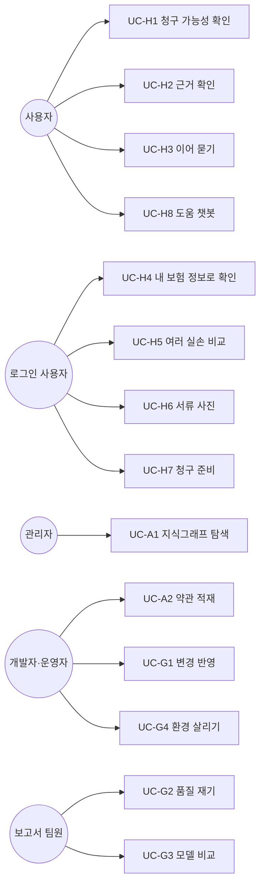

# 유스케이스 — 보험길잡이 (Cockburn)

> 1. 사용자 목표 수준 유스케이스 14개와, 여러 곳에서 불리는 하위기능 수준 유스케이스 9개로 나눴다.
> 2. 사용자가 청구 가능성을 확인하는 흐름([[#UC-H1]])이 중심이고, 근거 확인·이어 묻기·청구 준비가 그 뒤에 이어 붙는다.
> 3. PRD 요구 35개와 시나리오 14개가 모두 유스케이스 하나 이상에 걸린다.

## 0. 이 문서의 형식

- Cockburn 형식이다. 사용자가 한 번 앉아 끝내는 목표는 사용자 목표 수준, 그 안에서 여러 번 불리는 단계는 하위기능 수준으로 둔다
- 항목 ID의 접두는 주 액터의 종류다

| 접두 | 뜻 |
|---|---|
| `UC-H` | 사람 사용자 — 청구 가능성을 알고 싶은 사람 |
| `UC-A` | 관리자·운영자 — 약관 데이터를 점검하고 적재하는 사람 |
| `UC-G` | 개발과 품질 게이트 — 바꾸고, 재고, 인계하는 사람 |
| `UC-S` | 시스템 하위기능 — 위 유스케이스가 포함하는 단계 |

- 확장 번호 `3a`는 기본 흐름 3단계에서 갈라지는 경우다. `3a1`부터 그 경우의 흐름이다
- 포함은 이 유스케이스가 반드시 부르는 하위기능이다. 확장점은 이 유스케이스 뒤에 사용자가 이어 갈 수 있는 유스케이스다
- 요구는 [[INS-PRD-002]], 시나리오는 [[INS-SCN-002]]의 항목을 가리킨다

## 1. 액터

| 액터 | 종류 | 설명 | 페르소나 |
|---|---|---|---|
| 사용자 | 주 | 청구 가능성을 알고 싶은 사람. 로그인 여부와 무관하다 | [[INS-SCN-002#P1]] · [[INS-SCN-002#P2]] · [[INS-SCN-002#P3]] |
| 로그인 사용자 | 주 (사용자의 특수화) | 본인확인을 거쳐 가입 보험을 불러온 사용자. 진료내역은 상담 중에 따로 불러온다 | [[INS-SCN-002#P4]] · [[INS-SCN-002#P5]] |
| 관리자 | 주 | 적재된 약관의 구조와 연결을 점검한다 | [[INS-SCN-002#P6]] |
| 보고서 팀원 | 주 | 품질을 다시 재고 보고서를 쓴다 | [[INS-SCN-002#P7]] |
| 개발자·운영자 | 주 | 코드를 바꾸고, 약관을 적재하고, 저장소를 이어받는다 | [[INS-SCN-002#P8]] |
| Upstage | 보조 | Solar 추론, 임베딩, 문서 파싱, OCR, 정보 추출(IE) | — |
| 마이데이터 API | 보조 | 가입 보험. 승인 전에는 같은 형식의 더미 | — |
| 건강보험 API | 보조 | 진료내역. 승인 전에는 같은 형식의 더미 | — |
| GitHub Actions | 보조 | CI 게이트와 라이브 배포 | — |
| LG EXAONE | 보조 | 모델 비교의 대상. 제품 경로에는 없다 | — |
| AWS Bedrock | 보조 | 오프라인 평가의 진단 채점에만 쓴다. 제품 경로에는 없다 | — |

## 2. 사용자 목표 수준 유스케이스

### 2.1 사용자

#### UC-H1 청구 가능성 확인하기

| 항목 | 내용 |
|---|---|
| 범위 | 보험길잡이 웹 서비스 |
| 수준 | 사용자 목표 |
| 주 액터 | 사용자 |
| 이해관계자와 관심사 | 사용자: 짧게 물어도 쓸 만한 답과 그 이유 · 요청자: 단정하지 않고 약관 원문을 근거로 대는 답 · 심사: 근거를 설명할 수 있는 판정 |
| 사전조건 | 약관이 적재돼 있다 |
| 최소 보장 | 단정 표현을 내보내지 않는다. 적재되지 않은 조항을 인용하지 않는다. 대화를 영구 저장하지 않는다 |
| 성공 보장 | 사용자가 가능성 등급·이유·근거 조항 원문·다음 행동·준비도 점수를 받는다 |
| 트리거 | 사용자가 상황 입력에서 청구 상황을 보낸다 |
| 패키지 | 판정 |
| 포함(include) | [[#UC-S9]] · [[#UC-S1]] · [[#UC-S2]] · [[#UC-S3]] · [[#UC-S4]] · [[#UC-S5]] · [[#UC-S6]] |
| 확장점(extension point) | 판정 뒤 — [[#UC-H2]] 근거 확인 · [[#UC-H3]] 이어 묻기 · [[#UC-H7]] 청구 준비 |
| 일반화 | — |

**기본 흐름**
1. 사용자가 청구 상황을 쓴다
2. 시스템이 요청을 확인하고 세션을 연다([[#UC-S9]])
3. 시스템이 분석 중 화면에 지금 단계를 바꿔 가며 보여 준다
4. 시스템이 대화에서 사실과 의도를 뽑는다([[#UC-S1]])
5. 시스템이 약관 조항을 찾는다([[#UC-S2]])
6. 시스템이 보장·면책·조건부를 판정한다([[#UC-S3]])
7. 시스템이 답을 만들어 흘려보낸다([[#UC-S4]]). 첫 글자가 오면 대화 화면으로 넘어가고, 결론이 첫 문장에 온다
8. 시스템이 준비도 점수를 함께 보여 준다([[#UC-S5]])
9. 시스템이 인용 조항의 원본 캡처와 하이라이트를 왼쪽 패널에 보여 준다([[#UC-S6]])

**확장**
- **1a. 글자가 작아 읽기 어렵다**
  - 1a1. 사용자가 글자 크기 전환을 누르면 모든 화면의 글자가 커진다
- **2a. 요청 한도를 넘었다**
  - 2a1. 시스템이 요청을 거절하고, 사용자는 잠시 뒤 다시 한다
- **4a. 정보가 모자라 답이 흔들린다**
  - 4a1. 시스템이 판정 전 한 번에 한해 무엇을 어떻게 알려 주면 되는지 한 줄로 묻고, 화면 아래 가운데에 선택지를 띄운다
  - 4a2. 사용자가 답하거나 "모르겠습니다"를 고르면 5로 간다
- **4b. 사용자가 더 묻지 말라고 한다**
  - 4b1. 시스템이 되묻지 않고 5로 간다
- **4c. 이미 한 번 되물었다**
  - 4c1. 시스템이 다시 묻지 않고 지금 정보로 5로 간다
- **4d. 판정 엔진이 이미 면책으로 정했다**
  - 4d1. 시스템이 되묻지 않고 5로 간다
- **5a. 보험사를 모른다**
  - 5a1. 시스템이 실손 표준약관 기준으로 찾고, 답에 표준약관 기준임을 밝힌다
  - 5a2. 내 보험으로 확인하면 더 정확하다고 안내한다
- **5b. 가입 보험사 약관에서 판정 근거를 찾지 못했다**
  - 5b1. 시스템이 판정하지 않고, 가입한 보험사·상품을 다시 알려 달라고 되묻는다
- **7a. 실손과 무관한 요청이거나 지시를 바꾸려는 입력이다**
  - 7a1. 시스템이 범위 밖이라고 알리고 따르지 않는다

**연관**: [[INS-PRD-002#R1]] · [[INS-PRD-002#R5]] · [[INS-PRD-002#R6]] · [[INS-PRD-002#R9]] · [[INS-PRD-002#R10]] · [[INS-PRD-002#R20]] · [[INS-PRD-002#N2]] · [[INS-PRD-002#N3]] · [[INS-SCN-002#S1]] · [[INS-SCN-002#S2]] · [[INS-SCN-002#S3]]

#### UC-H2 판정 근거를 약관 원본에서 확인하기

| 항목 | 내용 |
|---|---|
| 범위 | 보험길잡이 웹 서비스 |
| 수준 | 사용자 목표 |
| 주 액터 | 사용자 |
| 이해관계자와 관심사 | 사용자: 약관 어디에 그렇게 적혀 있는지 직접 보기 · 요청자: 원본을 보여 줘 신뢰를 얻기 |
| 사전조건 | [[#UC-H1]]로 판정을 받았다 |
| 최소 보장 | 원본을 못 그려도 인용 원문 텍스트는 보인다 |
| 성공 보장 | 사용자가 원본에서 근거 부분을 찾아 읽는다 |
| 트리거 | 사용자가 왼쪽 패널의 원본을 보거나 누른다 |
| 패키지 | 판정 |
| 포함(include) | [[#UC-S6]] |
| 확장점(extension point) | — |
| 일반화 | — |

**기본 흐름**
1. 사용자가 왼쪽 패널에서 인용 조항의 원본 캡처와 원문 텍스트를 본다
2. 캡처 위에 인용 부분이 형광펜처럼 이어진 블록으로 표시돼 있다
3. 사용자가 캡처를 누른다
4. 시스템이 지금 보이는 부분을 확대하고, 하이라이트를 그대로 둔다

**확장**
- **1a. 인용이 여러 페이지에 걸친다**
  - 1a1. 시스템이 표시가 가장 많이 겹치는 페이지를 먼저 보여 준다
- **1b. 가로 2단 페이지다**
  - 1b1. 시스템이 인용이 있는 단만 확대해 보여 준다
  - 1b2. 사용자가 왼쪽 단·오른쪽 단·전체를 바꿔 본다
- **1c. 대화 중 보험사가 바뀌었다**
  - 1c1. 시스템이 캡처·원문·보험사 표기를 새 보험사 것으로 바꾼다

**연관**: [[INS-PRD-002#R2]] · [[INS-PRD-002#R3]] · [[INS-PRD-002#R4]] · [[INS-SCN-002#S2]] · [[INS-SCN-002#S4]]

#### UC-H3 판정 뒤 이어 묻고 사실 고치기

| 항목 | 내용 |
|---|---|
| 범위 | 보험길잡이 웹 서비스 |
| 수준 | 사용자 목표 |
| 주 액터 | 사용자 |
| 이해관계자와 관심사 | 사용자: 앞 대화를 기억한 채 이어서 묻기 · 요청자: 멀티턴이 끊기지 않는 대화 |
| 사전조건 | [[#UC-H1]]로 판정을 받았다 |
| 최소 보장 | 처음 인사말로 되돌아가지 않는다 |
| 성공 보장 | 설명 질문에는 앞 판정을 이어받은 답이, 사실 정정에는 새 판정이 나온다 |
| 트리거 | 사용자가 판정 뒤 질문이나 말을 보낸다 |
| 패키지 | 판정 |
| 포함(include) | [[#UC-S1]] · [[#UC-S2]] · [[#UC-S3]] · [[#UC-S4]] |
| 확장점(extension point) | — |
| 일반화 | — |

**기본 흐름**
1. 사용자가 판정 뒤 질문을 보낸다
2. 시스템이 설명 질문인지 사실 정정인지 가린다([[#UC-S1]])
3. 설명 질문이면 시스템이 가입 보험사 약관을 찾아([[#UC-S2]]) 앞 대화를 이어받아 답한다([[#UC-S4]])

**확장**
- **2a. 사실 정정이다**
  - 2a1. 시스템이 바뀐 사실로 다시 판정한다([[#UC-S3]])
  - 2a2. 산재·자동차보험 같은 다른 보험 처리분은 조건부로 판정하고 해당 조항을 인용한다
- **2b. 슬롯에 담기지 않는 사실이다**
  - 2b1. 시스템이 대화 메모에 남겨 다음 판정·비교·질의응답에 쓴다
- **2c. 보험이 없다는 말이다**
  - 2c1. 시스템이 실손 일반 기준으로 이어 답한다
- **3a. 가입 보험사 약관에 결과가 없다**
  - 3a1. 시스템이 표준약관 교차 검색으로 넘어가고 로그를 남긴다
  - 3a2. 교차 검색에도 결과가 없으면 더 구체적으로 물어 달라고 되묻는다
- **3b. 에이전트 경로가 켜져 있다**
  - 3b1. 모델이 약관 검색·질병코드 조회·보장기간 확인 같은 도구를 골라 부르고, 결과를 확인한 뒤 답한다
  - 3b2. 도구가 실패하면 오류를 결과로 받아 이어 간다

**연관**: [[INS-PRD-002#R1]] · [[INS-PRD-002#R7]] · [[INS-PRD-002#R8]] · [[INS-PRD-002#R23]] · [[INS-SCN-002#S3]] · [[INS-SCN-002#S7]]

#### UC-H4 내 보험 정보로 확인하기

| 항목 | 내용 |
|---|---|
| 범위 | 보험길잡이 웹 서비스 |
| 수준 | 사용자 목표 |
| 주 액터 | 로그인 사용자 |
| 이해관계자와 관심사 | 사용자: 적게 입력하고 내 보험 기준으로 정확히 듣기 · 요청자: 승인 뒤 주소만 바꿔 실연동 |
| 사전조건 | 사용자가 본인확인 정보를 안다 |
| 최소 보장 | 불러오지 못해도 상황 입력으로 계속할 수 있다 |
| 성공 보장 | 사용자가 가입 현황을 보고 판정할 실손을 고른다. 고른 실손은 분석을 시작할 때 모델을 거치지 않고 대화 정보에 채워진다 |
| 트리거 | 사용자가 첫 화면에서 "내 보험으로 정확히 확인하기"를 누른다 |
| 패키지 | 내 정보 |
| 포함(include) | [[#UC-S9]] · [[#UC-S7]] |
| 확장점(extension point) | 가입 현황 뒤 — [[#UC-H1]] 한 보험 판정 · [[#UC-H5]] 여러 실손 비교 |
| 일반화 | — |

**기본 흐름**
1. 사용자가 이름·생년월일 8자리·휴대폰 번호를 넣는다
2. 시스템이 형식을 검증한다
3. 사용자가 동의한다
4. 시스템이 가입 보험을 가져온다([[#UC-S7]]). 진료내역은 이 흐름에서 가져오지 않는다
5. 시스템이 가입 현황을 보여 준다. 실손이 아닌 보험은 판정 대상이 아니라고 표시한다
6. 사용자가 판정할 실손을 고르고 상황 입력으로 간다

**확장**
- **1a. 사용자가 돌아가려 한다**
  - 1a1. 사용자가 "메인 화면으로 돌아가기"를 누르면 첫 화면으로 간다
- **2a. 형식이 틀렸다**
  - 2a1. 시스템이 그 칸 아래에 무엇을 어떻게 고칠지 예시와 함께 보여 준다
- **4a. 일치하는 사용자가 없거나 가져오기가 실패했다**
  - 4a1. 화면이 가입 실손이 없을 때와 같은 안내("연동된 가입 실손이 없어요", 표준약관 기준 안내)를 보이고, 상황 입력으로 계속하게 한다
  - 4a2. 사용자를 찾지 못했으면 로그인되지 않은 채로 이어 간다
- **5a. 연동된 실손이 없다**
  - 5a1. 시스템이 표준약관 기준으로 안내한다고 알리고, 상황 입력으로 계속하게 한다
- **5b. 실손이 둘 이상이다**
  - 5b1. 시스템이 비례분담 안내를 보여 준다
  - 5b2. 사용자가 여럿을 고르면 [[#UC-H5]]로 간다
- **6a. 최근 진료내역을 쓰고 싶다**
  - 6a1. 사용자가 상담 중 도움 챗봇의 최근 진료 내역에서 진료를 고른다([[#UC-H8]])

**연관**: [[INS-PRD-002#R13]] · [[INS-PRD-002#R14]] · [[INS-PRD-002#R16]] · [[INS-PRD-002#R19]] · [[INS-SCN-002#S3]] · [[INS-SCN-002#S5]] · [[INS-SCN-002#S6]]

#### UC-H5 여러 실손 비교하기

| 항목 | 내용 |
|---|---|
| 범위 | 보험길잡이 웹 서비스 |
| 수준 | 사용자 목표 |
| 주 액터 | 로그인 사용자 |
| 이해관계자와 관심사 | 사용자: 어디에 청구하는 게 유리한지, 둘 다 받을 수 있는지 · 요청자: 더 받는 법이 아니라 정확한 비례분담 안내 |
| 사전조건 | [[#UC-H4]]로 실손을 둘 이상 골랐다 |
| 최소 보장 | 실제 부담한 의료비보다 많이 받는다고 안내하지 않는다 |
| 성공 보장 | 보험별 판정·세대·자기부담률·준비도가 나란히 보이고, 비례분담 원칙이 안내된다 |
| 트리거 | 사용자가 "2개 보험 비교하기"처럼 비교를 누르고 상황을 보낸다 |
| 패키지 | 판정 |
| 포함(include) | [[#UC-S1]] · [[#UC-S2]] · [[#UC-S3]] · [[#UC-S4]] · [[#UC-S5]] · [[#UC-S6]] |
| 확장점(extension point) | — |
| 일반화 | [[#UC-H1]]의 특수화 — 여러 보험을 한 번에 판정한다 |

**기본 흐름**
1. 사용자가 상황을 쓴다
2. 시스템이 고른 보험마다 따로 판정한다
3. 시스템이 결과를 나란히 보여 주고, 세대·자기부담률 비교와 추천을 붙인다
4. 시스템이 실손은 여러 개여도 실제 부담한 의료비를 넘게 받을 수 없고 보험사끼리 나눠 낸다는 점을 안내한다
5. 사용자가 탭을 바꾸면 시스템이 왼쪽 원본을 그 보험의 약관으로 바꾼다

**확장**
- **1a. 사용자가 급여·비급여 금액을 안다**
  - 1a1. 시스템이 보험사별 예상 분담액을 계산해 보여 준다
- **1b. 금액을 모른다**
  - 1b1. 시스템이 비례분담 원칙만 안내한다

**연관**: [[INS-PRD-002#R2]] · [[INS-PRD-002#R16]] · [[INS-PRD-002#R17]] · [[INS-PRD-002#R25]] · [[INS-SCN-002#S6]]

#### UC-H6 서류 사진으로 정보 채우기

| 항목 | 내용 |
|---|---|
| 범위 | 보험길잡이 웹 서비스 |
| 수준 | 사용자 목표 |
| 주 액터 | 사용자 |
| 이해관계자와 관심사 | 사용자: 타이핑 대신 사진으로 · 요청자: 서류를 읽어 판정 정확도를 올리기 |
| 사전조건 | 사용자에게 진단서·영수증·청구서·사고확인원 사진이 있다 |
| 최소 보장 | 올린 사진은 24시간 뒤 지운다. 읽지 못하면 이유를 알린다 |
| 성공 보장 | 진단명·기간·금액 같은 항목이 대화 정보에 채워진다 |
| 트리거 | 사용자가 서류 사진을 올린다 |
| 패키지 | 내 정보 |
| 포함(include) | [[#UC-S8]] |
| 확장점(extension point) | — |
| 일반화 | — |

**기본 흐름**
1. 사용자가 서류 사진을 올린다
2. 시스템이 항목을 추출한다([[#UC-S8]])
3. 시스템이 뽑은 항목을 대화 정보에 채우고 사용자에게 보여 준다
4. 사용자는 채워진 정보로 판정을 이어 간다

**확장**
- **1a. 이미지가 아닌 파일이다**
  - 1a1. 시스템이 받지 않고 이유를 알린다
- **2a. 사진이 흐리거나 읽기 어렵다**
  - 2a1. 시스템이 다시 찍어 달라고 안내한다

**연관**: [[INS-PRD-002#R12]] · [[INS-PRD-002#N2]] · [[INS-SCN-002#S5]]

#### UC-H7 청구 준비하고 접수하기

| 항목 | 내용 |
|---|---|
| 범위 | 보험길잡이 웹 서비스 |
| 수준 | 사용자 목표 |
| 주 액터 | 로그인 사용자 |
| 이해관계자와 관심사 | 사용자: 무엇을 챙겨 어떻게 청구할지 · 요청자: 목업에 있던 기능을 실제로 동작시키기 |
| 사전조건 | [[#UC-H1]]로 판정을 받았다 |
| 최소 보장 | 실제 보험사로 아무것도 보내지 않는다 |
| 성공 보장 | 사용자가 필요 서류와 청구 준비 요약을 받고, 가정으로 처리된 접수 완료를 본다 |
| 트리거 | 사용자가 판정 뒤 청구 준비 화면을 연다 |
| 패키지 | 청구 준비 |
| 포함(include) | [[#UC-S5]] |
| 확장점(extension point) | 서류 올리기 — [[#UC-H6]] |
| 일반화 | — |

**기본 흐름**
1. 시스템이 필요 서류 체크리스트를 보여 준다. 서류마다 자동 확인·업로드 필요·선택 중 하나다
2. 시스템이 대상 보험·사유·약관 근거·서류를 모은 청구 준비 요약과 준비도를 보여 준다
3. 사용자가 접수를 누른다
4. 시스템이 실제 전송 없이 접수 완료를 보여 주고, 시연용 가정임을 적는다

**확장**
- **1a. 업로드가 필요한 서류가 있다**
  - 1a1. 사용자가 [[#UC-H6]]로 서류를 올린다
- **2a. 판정이 낮음이나 중간이다**
  - 2a1. 시스템이 미충족 항목마다 보완 행동과 근거 조항을 짝지어 보여 준다

**연관**: [[INS-PRD-002#R18]] · [[INS-PRD-002#R25]] · [[INS-PRD-002#R26]] · [[INS-SCN-002#S5]]

#### UC-H8 도움 챗봇에 사용법 묻기

| 항목 | 내용 |
|---|---|
| 범위 | 보험길잡이 웹 서비스 |
| 수준 | 사용자 목표 |
| 주 액터 | 사용자 |
| 이해관계자와 관심사 | 사용자: 막힐 때 쉽게 묻기 · 요청자: 메인 챗봇과 역할을 확실히 나누기 |
| 사전조건 | — |
| 최소 보장 | 등급을 매기는 청구 판정을 하지 않는다 |
| 성공 보장 | 사용자가 사용법이나 실손 일반 질문의 답을 얻고 원래 흐름으로 돌아간다 |
| 트리거 | 사용자가 오른쪽 아래 도움 챗봇을 연다 |
| 패키지 | 도움 |
| 포함(include) | [[#UC-S2]] |
| 확장점(extension point) | — |
| 일반화 | — |

**기본 흐름**
1. 시스템이 자주 묻는 질문을 보여 준다. 상담 화면에서 열었으면 빠른 작업(최근 진료 내역 가져오기, 판정이 있으면 청구 준비 화면 보기)도 보여 준다
2. 사용자가 질문을 보낸다
3. 시스템이 챗봇 전체 화면으로 바꾸고, 질문으로 약관을 보험사 구분 없이 찾는다([[#UC-S2]])
4. 시스템이 답을 만든다. 사용법 질문은 인용 없이, 실손 일반 질문은 근거 조항을 붙여 답한다. 답은 흘러나오듯 보인다
5. 사용자가 뒤로 가기로 자주 묻는 질문에 돌아가거나, 크게 보기로 창을 넓힌다

**확장**
- **1a. 사용자가 빠른 작업을 누른다**
  - 1a1. 시스템이 그 화면이나 기능으로 바로 간다
  - 1a2. 최근 진료 내역은 로그인해야 불러온다([[#UC-S7]]). 로그인하지 않았으면 로그인이 필요하다고 알린다
  - 1a3. 사용자가 진료를 고르면, 그 진료를 설명하는 문장이 메인 대화로 보내진다
- **2a. 본인 사례를 묻는다**
  - 2a1. 시스템이 등급 없이 표준약관 기준으로 가능성을 일반 안내하고, 보험사·세대에 따라 다를 수 있다며 내 보험으로 확인하기를 권한다

**연관**: [[INS-PRD-002#R10]] · [[INS-PRD-002#R11]] · [[INS-PRD-002#R13]] · [[INS-SCN-002#S8]]

### 2.2 관리자·운영자

#### UC-A1 약관 지식그래프 탐색하기

| 항목 | 내용 |
|---|---|
| 범위 | 보험길잡이 관리자 화면 |
| 수준 | 사용자 목표 |
| 주 액터 | 관리자 |
| 이해관계자와 관심사 | 관리자: 조항이 수천 개여도 구조와 연결을 빨리 보기 · 연구팀: 나중에 자기 지식 그래프를 같은 화면에 붙이기 |
| 사전조건 | 관리자 그래프 노출이 켜져 있다. 약관과 그래프가 적재돼 있다 |
| 최소 보장 | 약관 데이터를 바꾸지 않는다. 사용자 대화나 개인정보를 보이지 않는다 |
| 성공 보장 | 관리자가 고른 노드의 연결 그래프와 원문 상세를 본다 |
| 트리거 | 관리자가 첫 화면의 관리자 그래프 버튼을 누른다 |
| 패키지 | 약관 데이터 |
| 포함(include) | — |
| 확장점(extension point) | — |
| 일반화 | — |

**기본 흐름**
1. 시스템이 TDD 트리(전체 → 보험사 → 문서 → 구간 → 조 → 하위 조항)를 보여 준다
2. 관리자가 트리를 내려가 노드를 고른다
3. 시스템이 연결 그래프와 원문 상세를 함께 보여 준다
4. 관리자가 "메인 화면으로"로 돌아간다

**확장**
- **1a. 노출이 꺼져 있다**
  - 1a1. 관리자 경로가 404를 돌려준다
- **1b. 연구팀 지식 그래프를 데이터원으로 쓴다**
  - 1b1. 데이터원 어댑터만 바꿔 같은 화면으로 보인다
- **2a. 이름으로 찾는다**
  - 2a1. 관리자가 조 번호나 제목으로 검색해 노드를 고른다
- **2b. 범위를 좁힌다**
  - 2b1. 관리자가 문서 단위로 범위를 좁히면 시스템이 그 문서의 그래프만 그린다
- **3a. 노드를 끈다**
  - 3a1. 이웃 노드가 따라 움직인다
- **3b. 두 노드 사이 경로를 본다**
  - 3b1. 관리자가 두 노드를 고르면 시스템이 최단 경로를 보여 준다
  - 3b2. 경로가 없으면 없다고 알린다

**연관**: [[INS-PRD-002#R19]] · [[INS-PRD-002#R24]] · [[INS-PRD-002#N5]] · [[INS-SCN-002#S10]]

#### UC-A2 약관을 적재하고 검증하기

| 항목 | 내용 |
|---|---|
| 범위 | 보험길잡이 적재 명령과 저장소(pgvector·그래프) |
| 수준 | 사용자 목표 |
| 주 액터 | 개발자·운영자 |
| 이해관계자와 관심사 | 운영자: 새 약관을 안전하게 넣기 · 사용자: 최신 약관 기준의 답 · 요청자: 검색 품질이 떨어지지 않기 |
| 사전조건 | 약관 PDF가 있다. Upstage 키가 설정돼 있다 |
| 최소 보장 | 실패하면 조용히 넘어가지 않고 로그를 남기며 실패로 알린다 |
| 성공 보장 | 새 약관이 검색·인용·원본 캡처·관리자 그래프에 모두 나타나고, 검색 지표가 회귀선 위에 있다 |
| 트리거 | 운영자가 적재 명령에 약관 PDF를 넘긴다 |
| 패키지 | 약관 데이터 |
| 포함(include) | [[#UC-G2]] |
| 확장점(extension point) | — |
| 일반화 | — |

**기본 흐름**
1. 시스템이 약관 PDF를 Upstage 문서 파싱으로 구조화한다
2. 시스템이 조·항·별표 경계로 청크를 나누고, 머리말·꼬리말을 뺀다
3. 시스템이 청크마다 보험사·상품·문서 유형·조 번호·페이지를 붙인다
4. 시스템이 청크를 임베딩해 pgvector에 넣고, 그래프 저장소에 조항과 참조 관계를 넣는다
5. 운영자가 검증 명령으로 문서 수·청크 수·임베딩 차원·빈 텍스트를 확인한다
6. 운영자가 적재 전후로 검색 골든셋을 재서 성능 기록에 남긴다([[#UC-G2]])

**확장**
- **1a. 파싱 요청이 너무 크다**
  - 1a1. 시스템이 페이지 묶음으로 나눠 보낸다
- **1b. 호출 한도에 걸린다**
  - 1b1. 시스템이 기다렸다가 다시 시도한다
- **3a. 조 번호가 구간마다 다시 시작한다**
  - 3a1. 시스템이 어느 구간(본문·특약)의 조인지 구분해 붙인다
- **4a. 그래프 동기화가 실패한다**
  - 4a1. 시스템이 로그를 남기고 적재를 실패로 알린다
- **6a. 검색 지표가 회귀선 아래로 떨어졌다**
  - 6a1. 운영자가 반영하지 않고 원인을 찾는다

**연관**: [[INS-PRD-002#R21]] · [[INS-PRD-002#R22]] · [[INS-PRD-002#R24]] · [[INS-PRD-002#N4]] · [[INS-PRD-002#N6]] · [[INS-PRD-002#N7]] · [[INS-SCN-002#S13]] · [[INS-SCN-002#S14]]

### 2.3 개발과 품질 게이트

#### UC-G1 변경을 재서 반영하기

| 항목 | 내용 |
|---|---|
| 범위 | 보험길잡이 저장소와 배포 파이프라인 |
| 수준 | 사용자 목표 |
| 주 액터 | 개발자·운영자 |
| 이해관계자와 관심사 | 개발자: 안전하게 올리기 · 요청자: 임시방편 없는 운영 수준 · 사용자: 라이브가 깨지지 않기 |
| 사전조건 | 저장소를 받았고 첫 안내 문서를 읽었다 |
| 최소 보장 | 게이트를 통과하지 못한 변경은 배포되지 않는다. 커밋에 AI 도구 표시가 없다 |
| 성공 보장 | 변경이 같은 기준으로 재져 기록되고, 게이트를 통과해 라이브에 배포된다 |
| 트리거 | 개발자가 코드를 바꾼다 |
| 패키지 | 운영·품질 |
| 포함(include) | [[#UC-G2]] |
| 확장점(extension point) | — |
| 일반화 | — |

**기본 흐름**
1. 개발자가 코드를 바꾸고 로컬에서 테스트와 평가를 돌린다([[#UC-G2]])
2. 성능에 영향이 있으면 개발자가 성능 기록에 이전 방식·변경·실측과 재현 명령을 남긴다. 같거나 나빠져도 남긴다
3. 개발자가 커밋한다. 작성자·공동 작성자·메시지에 AI 도구 표시가 없다
4. 개발자가 main에 올린다
5. CI가 백엔드 린트·테스트와 프론트 타입 검사·빌드를 돌린다
   - 테스트에는 사용자 데이터 테스트지의 조인 무결성 검사가 들어 있다
6. 게이트를 통과하면 이미지를 만들어 라이브에 배포한다

**확장**
- **1a. 사용자 의도 판단이 필요하다**
  - 1a1. 개발자가 코드에 단어 목록을 넣지 않고 `prompts/v1/`의 프롬프트를 고친다
- **1b. 외부 연동을 바꾼다**
  - 1b1. 개발자가 포트 뒤 어댑터만 바꾼다
- **1c. 폴백이 필요하다**
  - 1c1. 개발자가 폴백이 일어나면 로그가 남게 한다. 동작하지 않는 기능을 완료로 표시하지 않는다
- **5a. 게이트가 실패한다**
  - 5a1. 배포되지 않는다
  - 5a2. 개발자가 원인 계층에서 고쳐 다시 올린다

**연관**: [[INS-PRD-002#R15]] · [[INS-PRD-002#R22]] · [[INS-PRD-002#N4]] · [[INS-PRD-002#N5]] · [[INS-PRD-002#N6]] · [[INS-PRD-002#N7]] · [[INS-PRD-002#N8]] · [[INS-SCN-002#S12]]

#### UC-G2 품질 지표를 다시 재기

| 항목 | 내용 |
|---|---|
| 범위 | 보험길잡이 평가 하네스 |
| 수준 | 사용자 목표 |
| 주 액터 | 보고서 팀원 |
| 이해관계자와 관심사 | 팀원: 보고서에 쓸 수치 · 요청자: 정답률 90% 이상과 성장 과정 · 개발자: 회귀를 막는 선 |
| 사전조건 | 약관과 평가셋이 적재돼 있다 |
| 최소 보장 | 수치를 맞추려고 제품 코드에 임시방편을 넣지 않는다. 해외 모델은 채점에만 쓴다 |
| 성공 보장 | E2E·검색·서류 추출 지표가 나오고, PRD 성공지표와 비교돼 성능 기록에 남는다 |
| 트리거 | 팀원이나 개발자가 수치가 필요해진다 |
| 패키지 | 운영·품질 |
| 포함(include) | — |
| 확장점(extension point) | — |
| 일반화 | — |

**기본 흐름**
1. 액터가 E2E 평가셋을 돌린다. 판정·응답 유형·인용·금지 표현을 결정론으로 채점한다
2. 액터가 검색 골든셋을 돌린다
3. 액터가 서류 추출 벤치를 돌린다
4. 시스템이 지표를 내고, 액터가 PRD 성공지표와 비교한다
5. 액터가 결과를 성능 기록과 성능 비교 엑셀에 남긴다

**확장**
- **1a. 원인 진단이 필요하다**
  - 1a1. 액터가 Bedrock 모델 채점을 켜서 사실·인용 적합·톤을 진단한다
- **1b. 등급이 흔들리는지 봐야 한다**
  - 1b1. 액터가 같은 질문을 여러 번 돌려 등급 역전이 없는지 본다
- **4a. 목표에 못 미친다**
  - 4a1. 액터가 개선 백로그로 남긴다. 점수를 맞추려는 단어 목록·하드코딩은 넣지 않는다

**연관**: [[INS-PRD-002#N1]] · [[INS-PRD-002#N6]] · [[INS-PRD-002#N7]] · [[INS-SCN-002#S11]] · [[INS-SCN-002#S12]]

#### UC-G3 모델을 같은 조건으로 비교하기

| 항목 | 내용 |
|---|---|
| 범위 | 보험길잡이 평가 하네스 |
| 수준 | 사용자 목표 |
| 주 액터 | 보고서 팀원 |
| 이해관계자와 관심사 | 팀원: 보고서에 쓸 모델 선택 근거 · 요청자: 각자 가장 좋은 모델로 공정하게 비교 · 심사: 기획 대비 변경의 이유 |
| 사전조건 | 비교할 모델의 접속 정보가 `.env`에 있다 |
| 최소 보장 | 앞 단계는 제품 모델로 고정돼, 마지막 단계의 차이만 비교된다 |
| 성공 보장 | 모델·추론 모드별 정확도와 지연 비교표, 채택·미채택 이유 문서가 나온다 |
| 트리거 | 팀원이 기획 대비 모델 변경의 근거가 필요해진다 |
| 패키지 | 운영·품질 |
| 포함(include) | — |
| 확장점(extension point) | — |
| 일반화 | — |

**기본 흐름**
1. 액터가 비교할 모델과 추론 모드를 고른다
2. 시스템이 의도·사실 추출·검색은 제품 모델(Upstage)로 고정하고, 마지막 생성 단계만 바꿔 같은 평가셋을 돌린다
3. 시스템이 모델·모드별 정확도와 지연을 낸다
4. 액터가 비교표와 채택·미채택 이유(사진 서류를 못 읽는 텍스트 전용 모델 등)를 문서로 남긴다

**확장**
- **2a. 비교 모델의 엔드포인트가 불안정해 일부 문항이 시간 초과된다**
  - 2a1. 시스템이 오류 문항만 다시 돌려 합치고, 첫 실행의 오류 수를 안정성 지표로 남긴다
- **2b. 여러 모드를 한꺼번에 돌려 오래 걸린다**
  - 2b1. 액터가 병렬 수를 늘려 돌린다. 앞 단계가 비교 모델로 새지 않게 모델 교체는 생성 단계에만 적용된다

**연관**: [[INS-PRD-002#R27]] · [[INS-PRD-002#N1]] · [[INS-SCN-002#S11]]

#### UC-G4 저장소와 인계 패키지로 환경 살리기

| 항목 | 내용 |
|---|---|
| 범위 | 보험길잡이 저장소와 인계 패키지 |
| 수준 | 사용자 목표 |
| 주 액터 | 개발자·운영자 |
| 이해관계자와 관심사 | 이어받는 사람: 문서만 보고 바로 시작 · 팀: 공개 저장소에 데이터·비밀값을 남기지 않기 |
| 사전조건 | 공개 저장소와, 팀에서 받은 인계 패키지가 있다 |
| 최소 보장 | 비밀값은 `.env`에만 둔다 |
| 성공 보장 | 저장소와 인계 패키지만으로 같은 데이터와 같은 동작이 재현된다 |
| 트리거 | 새 사람이나 새 AI 세션이 작업을 이어받는다 |
| 패키지 | 운영·품질 |
| 포함(include) | — |
| 확장점(extension point) | 원본부터 다시 적재 — [[#UC-A2]] |
| 일반화 | — |

**기본 흐름**
1. 개발자가 첫 안내 문서로 무엇을·어디까지·무엇부터 할지 확인한다
2. 개발자가 인계 패키지의 체크섬을 확인한다
3. 개발자가 복원 절차대로 약관 청크와 그래프를 적재한다
4. 개발자가 비밀값을 `.env`에 넣고 로컬에서 띄운다
5. 개발자가 적재 검증 명령과 테스트로 같은 동작인지 확인한다

**확장**
- **2a. 체크섬이 다르다**
  - 2a1. 개발자가 패키지를 다시 받는다
- **3a. 원본부터 다시 적재한다**
  - 3a1. 개발자가 [[#UC-A2]]를 따른다
- **4a. 그래프 저장소 포트가 다른 서비스와 겹친다**
  - 4a1. 개발자가 다른 포트로 띄우고 설정을 맞춘다

**연관**: [[INS-PRD-002#R21]] · [[INS-PRD-002#N8]] · [[INS-SCN-002#S13]]

## 3. 하위기능 수준 유스케이스

#### UC-S1 대화에서 사실과 의도 뽑기

| 항목 | 내용 |
|---|---|
| 범위 | 보험길잡이 백엔드 |
| 수준 | 하위기능 |
| 주 액터 | 상위 유스케이스의 사용자 · 보조: Upstage(Solar) |
| 이해관계자와 관심사 | 사용자: 이미 말한 것을 다시 묻지 않기 · 요청자: 의도를 단어 목록이 아니라 문맥으로 판단 |
| 사전조건 | 세션이 열려 있다 |
| 최소 보장 | 스키마에 맞지 않는 결과는 대화 정보에 넣지 않는다 |
| 성공 보장 | 사실이 대화 정보에 합쳐지고, 의도(새 판정·설명 질문·사실 정정·더 묻지 말라는 뜻)가 정해진다 |
| 트리거 | 상위 유스케이스가 사용자 발화를 넘긴다 |
| 패키지 | 판정 |
| 포함(include) | — |
| 확장점(extension point) | — |
| 일반화 | — |

**기본 흐름**
1. 시스템이 사용자 발화와 직전 대화를 모델에 보낸다
2. 모델이 정해진 스키마로 사실(보험사·상품·사고일·치료 유형·입원일수·치료 목적 등)을 뽑는다
3. 모델이 의도를 가린다
4. 시스템이 사실을 대화 정보에 합치고, 슬롯에 없는 사실은 대화 메모에 남긴다

**확장**
- **1a. 영역·고른 가입 보험처럼 화면이 이미 가진 구조화된 값이 있다**
  - 1a1. 시스템이 모델을 거치지 않고 그 값을 대화 정보에 미리 채운다. 서류에서 뽑은 항목도 이렇게 넣는다([[#UC-H6]])
- **1b. 진료내역에서 고른 진료다**
  - 1b1. 화면이 그 진료를 설명하는 문장으로 보내고, 모델이 다른 발화처럼 사실을 뽑는다
- **2a. 스키마에 맞지 않는 출력이다**
  - 2a1. 시스템이 다시 요청하지 않고 바로 오류로 알린다
- **2b. 연결 오류·호출 한도·시간 초과·서버 오류다**
  - 2b1. 시스템이 3번까지 다시 시도하고, 그래도 실패하면 오류로 알린다
- **3a. 의도가 애매하다**
  - 3a1. 모델이 문맥으로 판단한다. 코드의 단어 목록으로 가르지 않는다

**연관**: [[INS-PRD-002#R5]] · [[INS-PRD-002#R7]] · [[INS-PRD-002#R8]] · [[INS-PRD-002#N4]] · [[INS-SCN-002#S1]] · [[INS-SCN-002#S3]] · [[INS-SCN-002#S7]]

#### UC-S2 약관 조항 찾기

| 항목 | 내용 |
|---|---|
| 범위 | 보험길잡이 백엔드 |
| 수준 | 하위기능 |
| 주 액터 | 상위 유스케이스의 사용자 · 보조: Upstage(임베딩) |
| 이해관계자와 관심사 | 사용자: 내 보험의 맞는 조항 · 요청자: 타 보험사 조항을 내 것처럼 인용하지 않기 |
| 사전조건 | 약관이 pgvector와 그래프 저장소에 적재돼 있다 |
| 최소 보장 | 그래프 저장소가 멈춰도 벡터 검색 결과는 돌려준다 |
| 성공 보장 | 질의에 맞는 상위 약관 청크가 보험사 범위에 맞게 돌아온다 |
| 트리거 | 상위 유스케이스가 질의와 사실을 넘긴다 |
| 패키지 | 약관 데이터 |
| 포함(include) | — |
| 확장점(extension point) | — |
| 일반화 | — |

**기본 흐름**
1. 시스템이 질의와 사실로 검색어를 만들고 임베딩한다
2. 시스템이 벡터 검색(pgvector)과 그래프 검색(Memgraph, 모델 호출 없는 결정론 Cypher)을 함께 돌린다
3. 시스템이 두 결과를 가중 RRF로 합친다
4. 시스템이 1위 점수보다 크게 낮은 청크를 잘라 내고 상위 청크를 돌려준다

**확장**
- **1a. 가입 보험사가 정해져 있다**
  - 1a1. 시스템이 그 보험사 약관 안에서만 찾는다
- **1b. 보험사를 모른다**
  - 1b1. 시스템이 보험사 필터 없이 교차 검색하고, 결과를 표준약관 기준으로 표시한다
- **2a. 그래프 저장소가 멈췄다**
  - 2a1. 시스템이 벡터 결과만으로 3을 건너뛰고 4로 간다
- **2b. 검색이 실패한다**
  - 2b1. 시스템이 로그를 남기고 빈 결과를 돌려준다. 연속 5번 실패하면 60초 동안 검색을 부르지 않는다(차단기)
- **4a. 가입 보험사 약관에 결과가 없다**
  - 4a1. 설명 답을 위한 검색이면 시스템이 표준약관 교차 검색으로 넘어가고 로그를 남긴다
  - 4a2. 판정을 위한 검색이면 빈 결과를 돌려주고, 상위 유스케이스가 보험사·상품을 다시 묻는다

**연관**: [[INS-PRD-002#R21]] · [[INS-PRD-002#R22]] · [[INS-PRD-002#N3]] · [[INS-SCN-002#S7]] · [[INS-SCN-002#S9]] · [[INS-SCN-002#S14]]

#### UC-S3 보장·면책 판정하기

| 항목 | 내용 |
|---|---|
| 범위 | 보험길잡이 백엔드 |
| 수준 | 하위기능 |
| 주 액터 | 상위 유스케이스의 사용자 |
| 이해관계자와 관심사 | 사용자: 같은 사실에 같은 결론 · 요청자: 뉴로심볼릭 판정의 결정론 |
| 사전조건 | 사실이 뽑혀 있고 약관 조항이 찾아져 있다 |
| 최소 보장 | 근거 조항 없는 규칙 결과를 내지 않는다 |
| 성공 보장 | 보장·면책·조건부 결과가 근거 조항과 함께 답 생성에 넘어간다 |
| 트리거 | 상위 유스케이스가 사실과 검색 결과를 넘긴다 |
| 패키지 | 판정 |
| 포함(include) | — |
| 확장점(extension point) | — |
| 일반화 | — |

**기본 흐름**
1. 시스템이 뽑은 사실을 판정 입력(치료 목적·국외 치료·한방·치과·다른 보험 처리 등)으로 바꾼다
2. 시스템이 약관 조항에 근거한 규칙을 적용한다
3. 시스템이 보장·면책·조건부 결과와 근거 조항을 정한다
4. 결과가 가능성 등급의 근거로 답 생성에 넘어간다. 등급 자체는 모델이 지시에 따라 쓰고, 코드가 확인하지 않는다

**확장**
- **3a. 면책 사유(미용·예방·임신출산·자해·범죄)다**
  - 3a1. 결과를 면책으로 정하고 해당 조항을 붙인다. 되묻기를 건너뛰게 하고, 답 생성에 낮음으로 쓰라고 지시한다
- **3b. 조건부 사유(한방·국외 치료·치과·다른 보험 처리분)다**
  - 3b1. 결과를 조건부로 정하고 해당 조항을 붙인다. 답 생성에 중간으로 쓰라고 지시한다
- **3c. 자기부담·비례분담 계산에 급여·비급여 금액이 없다**
  - 3c1. 금액이 없다는 사유를 결과에 담고, 원칙만 넘긴다
- **3d. 계약 시작·만료일이 없다**
  - 3d1. 보장기간 규칙을 적용하지 않고, 날짜가 있으면 더 정확하다는 사유를 결과에 담는다

**연관**: [[INS-PRD-002#R1]] · [[INS-PRD-002#R17]] · [[INS-SCN-002#S6]] · [[INS-SCN-002#S7]]

#### UC-S4 답을 만들어 흘려보내기

| 항목 | 내용 |
|---|---|
| 범위 | 보험길잡이 백엔드와 대화 화면 |
| 수준 | 하위기능 |
| 주 액터 | 상위 유스케이스의 사용자 · 보조: Upstage(Solar) |
| 이해관계자와 관심사 | 사용자: 기다리지 않고 읽히는 답 · 요청자: 환각 인용 차단과 단정 금지 |
| 사전조건 | 사실·검색 결과·판정 결과가 있다 |
| 최소 보장 | 적재되지 않은 조항 인용과 내부 식별자가 사용자에게 가지 않는다 |
| 성공 보장 | 결론이 먼저 오는 답이 SSE로 흘러나오고, 인용·다음 행동·면책 문구가 붙는다 |
| 트리거 | 상위 유스케이스가 생성에 필요한 입력을 넘긴다 |
| 패키지 | 판정 |
| 포함(include) | — |
| 확장점(extension point) | — |
| 일반화 | — |

**기본 흐름**
1. 시스템이 정해진 스키마로 답을 모델에 요청한다
2. 시스템이 만들어지는 대로 SSE로 흘려보낸다
3. 시스템이 적재되지 않은 조항을 가리키는 인용을 걸러낸다
4. 시스템이 인용의 보험사 표기를 실제 조항의 보험사로 덮어쓴다
5. 시스템이 본문에서 내부 식별자와 인용 번호를 지운다
6. 시스템이 면책 문구를 붙인다

**확장**
- **1a. 판정이 낮음이나 중간이다**
  - 1a1. 시스템이 미충족 항목마다 보완 행동과 근거 조항을 짝지은 재청구 구조를 함께 만든다. 근거는 이번에 인용한 조항만 쓴다
- **1b. 정보가 모자라다**
  - 1b1. 시스템이 결론을 먼저 쓰고, 무엇을 어떻게 알려 주면 되는지 한 줄을 끝에 붙인다
- **1c. 형식이 어긋나거나, 인용이 넘겨준 청크를 하나도 가리키지 않는다**
  - 1c1. 시스템이 한 번 더 요청한다. 두 번째는 흘려보내지 않고 한 번에 받는다
  - 1c2. 두 번째도 실패하면 오류로 알린다
- **2a. 생성이 시간 안에 끝나지 않는다**
  - 2a1. 시스템이 오류를 알리고, 사용자가 다시 보낼 수 있게 한다

**연관**: [[INS-PRD-002#R1]] · [[INS-PRD-002#R9]] · [[INS-PRD-002#R10]] · [[INS-PRD-002#R26]] · [[INS-PRD-002#N1]] · [[INS-SCN-002#S1]] · [[INS-SCN-002#S4]] · [[INS-SCN-002#S5]]

#### UC-S5 준비도 점수 매기기

| 항목 | 내용 |
|---|---|
| 범위 | 보험길잡이 백엔드 |
| 수준 | 하위기능 |
| 주 액터 | 상위 유스케이스의 사용자 |
| 이해관계자와 관심사 | 사용자: 한눈에 보는 준비 정도 · 요청자: 기획에 적은 0~100점 게이지 |
| 사전조건 | 판정 결과가 있다 |
| 최소 보장 | 점수를 지급 확률로 오해하게 두지 않는다 |
| 성공 보장 | 0~100점, 신호등 단계, 항목별 배점, "보험금 지급 확률이 아닙니다" 안내가 함께 돌아간다 |
| 트리거 | 상위 유스케이스가 판정 결과를 넘긴다 |
| 패키지 | 판정 |
| 포함(include) | — |
| 확장점(extension point) | — |
| 일반화 | — |

**기본 흐름**
1. 시스템이 판정 등급·요건 충족·정보 완성도를 받는다
2. 시스템이 정해진 배점으로 모델 없이 0~100점과 신호등 단계를 계산한다
3. 시스템이 항목별 배점과 안내 문구를 함께 돌려준다

**확장**
- **1a. 여러 보험을 비교 중이다**
  - 1a1. 시스템이 보험마다 따로 계산한다

**연관**: [[INS-PRD-002#R25]] · [[INS-SCN-002#S5]] · [[INS-SCN-002#S6]]

#### UC-S6 원본 캡처와 하이라이트 만들기

| 항목 | 내용 |
|---|---|
| 범위 | 보험길잡이 백엔드와 대화 화면 |
| 수준 | 하위기능 |
| 주 액터 | 상위 유스케이스의 사용자 |
| 이해관계자와 관심사 | 사용자: 근거 부분이 정확히 칠해진 원본 · 요청자: 표 안의 표에서도 맞는 표시 |
| 사전조건 | 인용 청크와 원본 PDF가 있다 |
| 최소 보장 | 표시를 못 만들어도 원본 캡처와 원문 텍스트는 돌려준다 |
| 성공 보장 | 원본 이미지, 하이라이트 상자, 원문 텍스트가 함께 돌아간다 |
| 트리거 | 상위 유스케이스가 인용 청크를 넘긴다 |
| 패키지 | 판정 |
| 포함(include) | — |
| 확장점(extension point) | — |
| 일반화 | — |

**기본 흐름**
1. 시스템이 인용 청크의 PDF 페이지를 이미지로 만든다
2. 시스템이 인용 원문과 페이지 글자를 맞춰 이어진 블록의 하이라이트 상자를 계산한다
3. 시스템이 이미지·하이라이트·원문 텍스트를 함께 돌려준다

**확장**
- **1a. 청크가 여러 페이지에 걸친다**
  - 1a1. 시스템이 최대 4쪽을 살펴 하이라이트 면적이 가장 큰 페이지를 고른다
- **2a. 인용이 표 안의 셀에 있다**
  - 2a1. 시스템이 셀 경계를 넘지 않게 셀 단위로 표시한다
- **2b. 가로 2단 페이지다**
  - 2b1. 시스템이 인용이 있는 단을 알려, 화면이 그 단만 확대하게 한다

**연관**: [[INS-PRD-002#R2]] · [[INS-PRD-002#R3]] · [[INS-PRD-002#R4]] · [[INS-SCN-002#S4]]

#### UC-S7 가입 보험·진료내역 가져오기

| 항목 | 내용 |
|---|---|
| 범위 | 보험길잡이 백엔드의 외부 연동 어댑터 |
| 수준 | 하위기능 |
| 주 액터 | 로그인 사용자 · 보조: 마이데이터 API, 건강보험 API |
| 이해관계자와 관심사 | 사용자: 적게 입력하기 · 요청자: 표준을 따라, 승인 뒤 주소만 바꿔 실연동 |
| 사전조건 | 본인확인과 동의가 끝났다 |
| 최소 보장 | 불러오지 못해도 상황 입력은 계속할 수 있다 |
| 성공 보장 | 가입 보험(실손 세대 포함)이 내부 형식으로 돌아와 가입 현황에 보인다. 진료내역은 도움 챗봇에 목록으로 보인다 |
| 트리거 | 가입 보험은 [[#UC-H4]]가, 진료내역은 도움 챗봇의 빠른 작업([[#UC-H8]])이 부른다 |
| 패키지 | 내 정보 |
| 포함(include) | — |
| 확장점(extension point) | — |
| 일반화 | — |

**기본 흐름**
1. 시스템이 본인확인된 사용자로 어댑터를 부른다
2. 어댑터가 표준 규격 형식의 응답을 받는다. 승인 전에는 같은 형식의 더미다
3. 실연동이면 시스템이 응답을 내부 형식으로 정규화하고, 실손 세대를 가입일로 정한다. 더미는 내부 형식으로 준비된 값을 그대로 돌려준다
4. 사용자가 고른 가입 보험은 분석을 시작할 때 모델을 거치지 않고 대화 정보에 채워진다([[#UC-S1]]). 진료내역은 사용자가 고른 진료를 설명하는 문장으로 대화에 보내진다

**확장**
- **2a. 실연동으로 바꾼다**
  - 2a1. 운영자가 어댑터 설정의 주소와 토큰만 바꾼다
- **2b. 가져오기가 실패한다**
  - 2b1. 차단기 없이 그 요청만 실패한다. 가입 보험이면 화면이 가입 없음과 같은 안내를 보이고, 진료내역이면 오류 안내를 띄운다
- **3a. 실손이 아닌 보험이다**
  - 3a1. 시스템이 목록에 남기되 판정 대상이 아님을 표시한다

**연관**: [[INS-PRD-002#R13]] · [[INS-PRD-002#R16]] · [[INS-PRD-002#N3]] · [[INS-PRD-002#N5]] · [[INS-SCN-002#S5]] · [[INS-SCN-002#S6]]

#### UC-S8 서류 항목 추출하기

| 항목 | 내용 |
|---|---|
| 범위 | 보험길잡이 백엔드 |
| 수준 | 하위기능 |
| 주 액터 | 상위 유스케이스의 사용자 · 보조: Upstage(OCR·정보 추출·Solar) |
| 이해관계자와 관심사 | 사용자: 사진만 올리면 채워지기 · 요청자: 표 필드까지 정확한 추출 |
| 사전조건 | 이미지 파일이 올라왔다 |
| 최소 보장 | 올린 파일은 24시간 뒤 지운다 |
| 성공 보장 | 진단명·기간·금액·증권번호 같은 항목이 대화 정보 형식으로 돌아간다 |
| 트리거 | [[#UC-H6]]이 추출을 부른다 |
| 패키지 | 내 정보 |
| 포함(include) | — |
| 확장점(extension point) | — |
| 일반화 | — |

**기본 흐름**
1. 시스템이 올린 이미지를 임시로 보관한다
2. 시스템이 OCR로 글자를 읽고 개인정보를 가린다
3. 모델이 가린 글을 읽고 서류 종류를 정한다
4. 시스템이 서류 종류에 맞는 스키마로 Upstage 정보 추출(IE)을 부른다
5. 시스템이 뽑은 항목을 대화 정보 형식으로 바꿔 돌려준다

**확장**
- **2a. 인식 신뢰도가 낮다(0.6 미만)**
  - 2a1. 시스템이 결과에 낮은 신뢰도 표시를 단다. 화면이 내용을 확인하고 더 선명한 사진으로 다시 올려 달라고 안내한다
- **4a. 정보 추출이 실패하거나 빈 결과다**
  - 4a1. 모델이 가린 OCR 글에서 항목을 다시 뽑는다

**연관**: [[INS-PRD-002#R12]] · [[INS-PRD-002#N2]] · [[INS-SCN-002#S5]]

#### UC-S9 요청·세션·외부 호출 지키기

| 항목 | 내용 |
|---|---|
| 범위 | 보험길잡이 백엔드 |
| 수준 | 하위기능 |
| 주 액터 | 상위 유스케이스의 사용자 |
| 이해관계자와 관심사 | 사용자: 개인정보가 남지 않기 · 요청자: 전 국민 규모에서 버티기 · 심사: 보안 지적이 없는 운영 |
| 사전조건 | — |
| 최소 보장 | 대화를 영구 저장하지 않는다. 로그와 감사 기록에는 개인정보가 가려져 있다 |
| 성공 보장 | 한도 안의 요청은 세션에서 처리되고, 판정 요청과 결과가 감사 기록으로 남는다 |
| 트리거 | 사용자 요청이 들어온다 |
| 패키지 | 운영·품질 |
| 포함(include) | — |
| 확장점(extension point) | — |
| 일반화 | — |

**기본 흐름**
1. 시스템이 IP당 분당 10회, 세션당 분당 30회 한도를 확인한다
2. 시스템이 세션을 열거나 이어 쓴다. 대화는 메모리에만 두고 영구 저장하지 않는다
3. 시스템이 판정 요청과 결과(등급·인용 조항)를 개인정보를 가린 감사 기록으로 남긴다
4. 30분 동안 쓰지 않은 세션은 사라진다

**확장**
- **1a. 한도를 넘었다**
  - 1a1. 시스템이 요청을 거절한다
- **2a. 첫 화면에서 새 흐름을 시작했다**
  - 2a1. 시스템이 직전 세션을 버린다
- **2b. 운영 모드다**
  - 2b1. 데모 로그인·데모 데이터 자동 생성·공용 비밀번호가 꺼져 있고, 로그인 쿠키에 secure가 걸린다
- **3a. 약관 검색이나 심평원 조회가 연속 5번 실패한다**
  - 3a1. 시스템이 60초 동안 그 호출을 멈춘다. 검색이 멈춘 동안 판정은 오류 대신 되묻기로 답한다

**연관**: [[INS-PRD-002#N2]] · [[INS-PRD-002#N3]] · [[INS-SCN-002#S2]] · [[INS-SCN-002#S9]]

## 4. 대응표

유스케이스마다 걸린 요구와 시나리오다. PRD 요구 35개와 시나리오 14개가 모두 한 번 이상 걸린다.

| 유스케이스 | 요구 | 시나리오 |
|---|---|---|
| [[#UC-H1]] 청구 가능성 확인하기 | [[INS-PRD-002#R1]] · [[INS-PRD-002#R5]] · [[INS-PRD-002#R6]] · [[INS-PRD-002#R9]] · [[INS-PRD-002#R10]] · [[INS-PRD-002#R20]] · [[INS-PRD-002#N2]] · [[INS-PRD-002#N3]] | [[INS-SCN-002#S1]] · [[INS-SCN-002#S2]] · [[INS-SCN-002#S3]] |
| [[#UC-H2]] 판정 근거를 약관 원본에서 확인하기 | [[INS-PRD-002#R2]] · [[INS-PRD-002#R3]] · [[INS-PRD-002#R4]] | [[INS-SCN-002#S2]] · [[INS-SCN-002#S4]] |
| [[#UC-H3]] 판정 뒤 이어 묻고 사실 고치기 | [[INS-PRD-002#R1]] · [[INS-PRD-002#R7]] · [[INS-PRD-002#R8]] · [[INS-PRD-002#R23]] | [[INS-SCN-002#S3]] · [[INS-SCN-002#S7]] |
| [[#UC-H4]] 내 보험 정보로 확인하기 | [[INS-PRD-002#R13]] · [[INS-PRD-002#R14]] · [[INS-PRD-002#R16]] · [[INS-PRD-002#R19]] | [[INS-SCN-002#S3]] · [[INS-SCN-002#S5]] · [[INS-SCN-002#S6]] |
| [[#UC-H5]] 여러 실손 비교하기 | [[INS-PRD-002#R2]] · [[INS-PRD-002#R16]] · [[INS-PRD-002#R17]] · [[INS-PRD-002#R25]] | [[INS-SCN-002#S6]] |
| [[#UC-H6]] 서류 사진으로 정보 채우기 | [[INS-PRD-002#R12]] · [[INS-PRD-002#N2]] | [[INS-SCN-002#S5]] |
| [[#UC-H7]] 청구 준비하고 접수하기 | [[INS-PRD-002#R18]] · [[INS-PRD-002#R25]] · [[INS-PRD-002#R26]] | [[INS-SCN-002#S5]] |
| [[#UC-H8]] 도움 챗봇에 사용법 묻기 | [[INS-PRD-002#R10]] · [[INS-PRD-002#R11]] · [[INS-PRD-002#R13]] | [[INS-SCN-002#S8]] |
| [[#UC-A1]] 약관 지식그래프 탐색하기 | [[INS-PRD-002#R19]] · [[INS-PRD-002#R24]] · [[INS-PRD-002#N5]] | [[INS-SCN-002#S10]] |
| [[#UC-A2]] 약관을 적재하고 검증하기 | [[INS-PRD-002#R21]] · [[INS-PRD-002#R22]] · [[INS-PRD-002#R24]] · [[INS-PRD-002#N4]] · [[INS-PRD-002#N6]] · [[INS-PRD-002#N7]] | [[INS-SCN-002#S13]] · [[INS-SCN-002#S14]] |
| [[#UC-G1]] 변경을 재서 반영하기 | [[INS-PRD-002#R15]] · [[INS-PRD-002#R22]] · [[INS-PRD-002#N4]] · [[INS-PRD-002#N5]] · [[INS-PRD-002#N6]] · [[INS-PRD-002#N7]] · [[INS-PRD-002#N8]] | [[INS-SCN-002#S12]] |
| [[#UC-G2]] 품질 지표를 다시 재기 | [[INS-PRD-002#N1]] · [[INS-PRD-002#N6]] · [[INS-PRD-002#N7]] | [[INS-SCN-002#S11]] · [[INS-SCN-002#S12]] |
| [[#UC-G3]] 모델을 같은 조건으로 비교하기 | [[INS-PRD-002#R27]] · [[INS-PRD-002#N1]] | [[INS-SCN-002#S11]] |
| [[#UC-G4]] 저장소와 인계 패키지로 환경 살리기 | [[INS-PRD-002#R21]] · [[INS-PRD-002#N8]] | [[INS-SCN-002#S13]] |
| [[#UC-S1]] 대화에서 사실과 의도 뽑기 | [[INS-PRD-002#R5]] · [[INS-PRD-002#R7]] · [[INS-PRD-002#R8]] · [[INS-PRD-002#N4]] | [[INS-SCN-002#S1]] · [[INS-SCN-002#S3]] · [[INS-SCN-002#S7]] |
| [[#UC-S2]] 약관 조항 찾기 | [[INS-PRD-002#R21]] · [[INS-PRD-002#R22]] · [[INS-PRD-002#N3]] | [[INS-SCN-002#S7]] · [[INS-SCN-002#S9]] · [[INS-SCN-002#S14]] |
| [[#UC-S3]] 보장·면책 판정하기 | [[INS-PRD-002#R1]] · [[INS-PRD-002#R17]] | [[INS-SCN-002#S6]] · [[INS-SCN-002#S7]] |
| [[#UC-S4]] 답을 만들어 흘려보내기 | [[INS-PRD-002#R1]] · [[INS-PRD-002#R9]] · [[INS-PRD-002#R10]] · [[INS-PRD-002#R26]] · [[INS-PRD-002#N1]] | [[INS-SCN-002#S1]] · [[INS-SCN-002#S4]] · [[INS-SCN-002#S5]] |
| [[#UC-S5]] 준비도 점수 매기기 | [[INS-PRD-002#R25]] | [[INS-SCN-002#S5]] · [[INS-SCN-002#S6]] |
| [[#UC-S6]] 원본 캡처와 하이라이트 만들기 | [[INS-PRD-002#R2]] · [[INS-PRD-002#R3]] · [[INS-PRD-002#R4]] | [[INS-SCN-002#S4]] |
| [[#UC-S7]] 가입 보험·진료내역 가져오기 | [[INS-PRD-002#R13]] · [[INS-PRD-002#R16]] · [[INS-PRD-002#N3]] · [[INS-PRD-002#N5]] | [[INS-SCN-002#S5]] · [[INS-SCN-002#S6]] |
| [[#UC-S8]] 서류 항목 추출하기 | [[INS-PRD-002#R12]] · [[INS-PRD-002#N2]] | [[INS-SCN-002#S5]] |
| [[#UC-S9]] 요청·세션·외부 호출 지키기 | [[INS-PRD-002#N2]] · [[INS-PRD-002#N3]] | [[INS-SCN-002#S2]] · [[INS-SCN-002#S9]] |

## 5. 미결사항

- [ ] **등급을 코드로 고정할지** — 면책은 낮음, 조건부는 중간이라는 등급은 답 생성 지시로만 건다. 모델이 다른 등급을 내면 코드가 덮어쓸지 ([[#UC-S3]])
- [ ] **판정의 빈 검색** — 가입 보험사 약관에서 판정 근거를 못 찾으면 교차 검색 대신 보험사·상품을 되묻는다. 설명 답처럼 표준약관 교차 검색으로 넘어갈지 ([[#UC-S2]] · [[#UC-H1]])
- [ ] **가입 현황의 세 경우** — 사용자를 찾지 못함·가져오기 실패·가입 없음이 같은 안내로 보인다. 나눠 알릴지 ([[#UC-H4]] · [[#UC-S7]])
