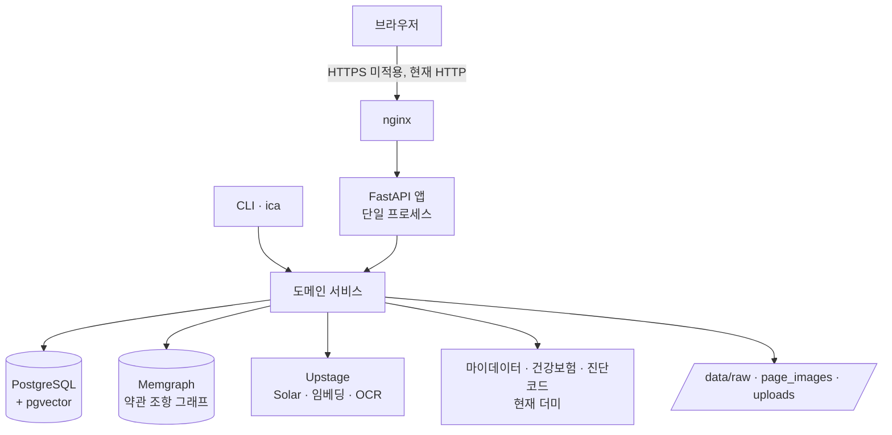

# 인프라와 제약: 보험청구심사 어시스턴트

## 1. 제약

#### C1 국내 모델만 쓴다

추론·임베딩·OCR 전 영역이 국내 LLM이어야 한다. 대회 심사 요건이고 타협 대상이 아니다. 근거: [[INS-PRD-001#N4]]

헤드라인은 **Upstage Solar**다. EXAONE을 검토했으나 **멀티모달이 안 돼** 영수증·진단서 이미지를 못 다룬다. 외산 모델은 오프라인 평가 대조군으로만 쓴다.

#### C2 세션은 서버에 영구 저장하지 않는다

대화 내용은 프로세스 메모리에만 있고 TTL이 지나면 사라진다. 개인정보를 쌓지 않기 위한 선택이다. 근거: [[INS-PRD-001#N3]]

**대가**: 프로세스가 재시작하면 진행 중이던 상담이 전부 사라진다. 그리고 **백엔드를 여러 개로 늘릴 수 없다** — 턴마다 다른 프로세스로 가면 세션을 못 찾는다.

#### C3 실손 전용이다

자동차·화재는 폐기했다. 실손은 금감원 표준약관 기반이라 손보 5개사의 핵심 조항이 거의 같아 코퍼스를 재사용할 수 있다. 근거: [[INS-PRD-001]] 2장

#### C4 데모 범위에서는 인증을 걸지 않는다

시연을 막지 않는 것이 우선이라 상담 경로 전체를 무인증으로 연다. **의도된 결정이다.** 다만 운영 전환 조건을 5장에 적어 둔다.

#### C5 외부 데이터는 승인 전이라 더미로 간다

마이데이터·건강보험·진단코드 API는 신청 후 심사 기간이 있다. 응답 형태를 분석해 더미 어댑터를 먼저 만들고, 승인되면 주소·토큰만 바꿔 끼운다. 근거: [[INS-RFQ-001#Q7]]

#### C6 약관 PDF는 공개 문서다

인용 페이지 이미지와 원본 PDF를 인증 없이 서빙한다. 약관은 공시 의무가 있는 공개 문서이므로 가릴 이유가 없다. **업로드한 사용자 서류는 다르다** — 그쪽은 서빙하지 않는다.

## 2. 구성도

## 3. 기술 스택

| 층 | 고른 것 | 이유 |
|---|---|---|
| 언어·프레임워크 | Python · FastAPI · Typer(CLI) | 웹과 배치가 **같은 서비스 코드를 공유**한다. CLI가 HTTP를 타지 않는다 |
| 추론 | Upstage Solar | 구조화 출력(JSON Schema)이 깔끔하고 OpenAI 호환이라 코드 변경이 적다. 근거: [[#C1]] |
| 임베딩 | Upstage solar-embedding (질의/문서 분리, 4096차원) | 근거: [[#C1]] |
| OCR | Upstage Document OCR · Document Parse · Information Extract | 근거: [[#C1]] · [[INS-PRD-001#R11]] |
| 벡터 | PostgreSQL + pgvector | 근거: [[INS-RFQ-001#Q14]]. **4096차원은 pgvector ANN 한계를 넘어 정확 순차 스캔**이다 |
| 그래프 | Memgraph (Bolt) | 근거: [[INS-RFQ-001#Q12]]. Bolt 호환이라 드라이버를 안 바꾸고 옮겼다 |
| 관계형 | PostgreSQL | 보험사·상품·버전·문서·청크·감사·사용자 |
| 배포 | 컨테이너 + 단일 VM | 근거: [[#C2]] — 늘릴 수 없으므로 |

## 4. 데이터가 사는 곳

| 데이터 | 어디 | 잃으면 | 진실의 원천 |
|---|---|---|---|
| 보험사·상품·버전·문서·청크 | PostgreSQL | 약관 PDF에서 재적재 가능 | **✅ 여기** |
| 청크 임베딩 | pgvector (같은 표의 컬럼) | 재임베딩 (비용 발생) | 파생 |
| 약관 조항 그래프 | Memgraph | 관계형에서 결정론으로 재생성 | 파생 |
| 감사 로그 | PostgreSQL | **복구 불가** | ✅ 여기 |
| 사용자 | PostgreSQL | 다시 로그인 | ✅ 여기 |
| **대화 세션·슬롯** | **프로세스 메모리** | **사라진다. 의도된 것** | ✅ 여기 |
| 약관 PDF 원본 | 파일 시스템 `data/raw` | 재수집 | ✅ 여기 |
| 인용 페이지 이미지 | 파일 시스템 `data/page_images` | PDF에서 재생성 | 파생·캐시 |
| 업로드 서류 | 파일 시스템 `data/uploads` | **24시간 뒤 자동 삭제** | 일시 |

**세 저장소가 같은 수를 말해야 한다** — 관계형 청크 수 = 벡터 수 = 그래프 조항 수. 어긋나면 재색인한다.

## 5. 인증과 접근

| 무엇 | 지금 | 운영 전환 조건 |
|---|---|---|
| 상담 전 경로 | **무인증** — 세션 ID만 알면 조회·수정·삭제 가능 | 세션에 소유자를 두고 본인 것만 보게 한다 |
| 로그인 | 데모 페르소나(이름+휴대폰) → JWT 쿠키 | 실 인증 수단으로 교체 |
| 관리자 | **롤이 없다.** 토글 하나로 열고 닫는다 | 사용자에 관리자 표시를 두고 그것으로 판정 |
| 쿠키 | `httponly`, `samesite=lax`, **`secure`는 꺼져 있다** | TLS 적용 후 켠다 |
| 요청 제한 | **설정값만 있고 적용되지 않는다** | 엔드포인트마다 붙인다 |
| 감사 로그 | 켜짐. 마스킹된 입력만 기록 | 그대로 |
| 개인정보 마스킹 | 로그·감사에만. **LLM 입력은 원문** | 진단명 마스킹은 정확도 문제로 보류 |

**`APP_ENV=production` 게이트가 있으나 켤 수 없는 상태다.** 켜면 데모 로그인과 HTTP 쿠키가 함께 막혀 시연이 안 된다. 그래서 그 게이트에 매달린 하드닝(관리자 인증·보안 쿠키·데모 차단)이 **전부 비활성**이다. 근거: [[#C4]]

## 6. 미결사항

- [ ] **TLS·도메인** — 현재 HTTP로 노출. 이것이 풀려야 `secure` 쿠키와 `APP_ENV` 게이트를 켤 수 있다
- [ ] **요청 제한 적용** — 무인증 LLM 호출구가 열려 있다. 근거: [[INS-PRD-001#R21]]
- [ ] **앱 지표** — 프로세스 기본 지표만 나간다. LLM 호출 수·응답시간 히스토그램이 없다. 근거: [[INS-PRD-001#R22]]
- [ ] 마이데이터 사업자 승인 — 코드는 완료
- [ ] 건강보험·진단코드 API 키
- [ ] 진단명 마스킹 — 정규식으로는 부정확해 보류
- [ ] 면책 문구 법무 사인오프
- [ ] 세션을 외부 저장소로 옮길지 — 지금 구조로는 백엔드를 늘릴 수 없다. 근거: [[#C2]]
