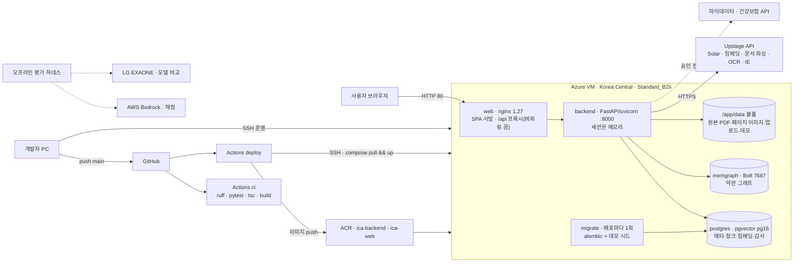

# 인프라 아키텍처 — 보험길잡이

> 1. 라이브는 Azure Korea Central의 VM 한 대에 웹(nginx)·백엔드(FastAPI)·PostgreSQL(pgvector)·Memgraph를 컨테이너로 올린 구성이다. 무거운 AI는 전부 Upstage API가 맡는다.
> 2. main에 푸시하면 GitHub Actions가 이미지를 만들어 VM에 배포한다. CI 게이트는 따로 돌고, 아직 배포를 막지 않는다.
> 3. 대화는 영구 저장하지 않고, 약관 데이터와 비밀값은 공개 저장소 밖에 둔다.

## 0. 이 문서가 다루는 것

- 실제로 배포돼 도는 구성을 적는다. 기준은 `docker-compose.prod.yml`, `Dockerfile`, `Dockerfile.web`, `nginx/default.conf`, `.github/workflows/`, `infra/azure/`, 백엔드 설정(`app/infrastructure/core/config.py`)이다
- 2026-06-24 설계 문서(`docs/infra/azure-deploy.md`)와 다른 점은 해당 절에 적는다
- 대회가 준 GPU 서버와 SKT A.X K1은 쓰지 않는다. EXAONE과 AWS Bedrock은 오프라인 평가에만 쓴다
- 비밀값은 이름만 적고 값은 적지 않는다

## 1. 제약

설계를 묶는 조건이다. 제약마다 출처를 단다.

#### C1 제품 경로의 모델은 국내 LLM만 쓴다

출처: [[INS-PRD-002#N1]]

추론·임베딩·문서 파싱·OCR·정보 추출을 모두 Upstage API로 한다. 그래서 서버에는 GPU가 필요 없고, 백엔드는 외부 호출을 기다리는 가벼운 오케스트레이터가 된다. EXAONE은 모델 비교에만, Bedrock은 오프라인 평가 채점에만 쓴다.

#### C2 서비스는 국내 리전에 둔다

출처: [[INS-PRD-002#N1]] · [[INS-PRD-002#N2]]

Azure Korea Central에 둔다. 데이터를 국내에 두고, Upstage 호출 지연을 줄이기 위해서다.

#### C3 대화는 영구 저장하지 않는다

출처: [[INS-PRD-002#N2]]

세션은 백엔드 프로세스 메모리에만 두고, 30분 동안 쓰지 않으면 사라진다. 첨부 서류는 24시간 뒤 지운다. 세션이 프로세스 메모리에 있어서 백엔드는 한 개로 돌린다.

#### C4 전 국민 규모의 방어를 둔다

출처: [[INS-PRD-002#N3]]

요청 제한(IP당 분당 10회, 세션당 분당 30회), 약관 검색과 심평원 조회의 차단기(연속 5번 실패하면 60초 멈춤), 그래프 장애 때 벡터 검색만으로 동작, 운영 모드 게이트를 둔다. 지금 요청 제한은 설정값과 제한기만 있고 어떤 엔드포인트에도 한도가 걸려 있지 않아, 이 제약을 다 지키지 못한다(9장).

#### C5 운영 저장소는 PostgreSQL·pgvector와 Memgraph다

출처: [[INS-PRD-002#R21]] · [[INS-PRD-002#R22]]

관계형 메타·청크·임베딩·감사 기록은 PostgreSQL 한 곳에, 약관 그래프는 Memgraph에 둔다. SQLite와 Chroma는 로컬 개발과 테스트용으로만 남긴다([[INS-RFQ-002#Q24]]).

#### C6 임베딩이 4096차원이라 벡터 인덱스 없이 정확 탐색한다

출처: [[INS-PRD-002#R21]]

pgvector의 HNSW 인덱스는 2,000차원까지만 받는다. 4096차원으로 바꾸면서(Sprint 16 마이그레이션) 인덱스를 없앴다. 청크가 약 2,500개라 정확 탐색으로 충분하지만, 청크가 크게 늘면 다시 봐야 한다.

#### C7 배포는 비용을 줄인 VM 한 대 구성이다

출처: `docker-compose.prod.yml` 머리 주석 — "1환경, 비용 최소"

Standard_B2s(2 vCPU·4GB) VM 한 대에 모든 컨테이너를 올린다. 설계 문서의 관리형 PostgreSQL·Blob 저장소·Key Vault·백엔드 3개는 쓰지 않았다.

#### C8 HTTPS와 도메인은 이번 범위가 아니다

출처: [[INS-RFQ-002#Q39]]

라이브는 HTTP(80)로만 연다. 그래서 secure 쿠키를 거는 운영 모드를 라이브에 켜지 못하고, 관리자 그래프 노출은 별도 토글로 정한다.

#### C9 공개 저장소에 비밀값과 데이터를 두지 않는다

출처: [[INS-PRD-002#N8]]

비밀값은 `.env`와 GitHub 시크릿에만 둔다. 약관 청크·그래프·원본 PDF는 VM 볼륨과 팀 인계 패키지에 둔다. 커밋에 AI 도구 표시를 남기지 않는다.

#### C10 게이트를 통과한 변경만 배포한다

출처: [[INS-PRD-002#N6]]

린트·테스트·타입 검사·빌드를 통과해야 라이브에 올라간다. 지금은 CI와 배포 워크플로가 따로 돌아 이 제약을 지키지 못한다(9장).

#### C11 외부 연동은 설정으로 갈아 끼운다

출처: [[INS-PRD-002#N5]] · [[INS-PRD-002#R13]]

마이데이터·건강보험은 설정(`MYDATA_BACKEND`·`HEALTH_DATA_BACKEND`)으로 더미와 실연동을 고른다. 마이데이터는 실연동으로 바꿀 때 주소·토큰 설정만 바꾼다. 건강보험 실연동 어댑터는 아직 비어 있어 부르면 설정 오류를 낸다. OCR 설정(`OCR_BACKEND`)은 값이 `upstage` 하나다.

## 2. 구성도

## 3. 기술 스택

| 층 | 기술 | 비고 |
|---|---|---|
| 화면 | React 18 · TypeScript 5 · Vite 5 · react-router 6 · react-markdown | SPA. 빌드 결과를 nginx가 서빙 |
| 관리자 그래프 | Sigma.js 3 · graphology · ForceAtlas2 · d3-hierarchy | TDD 트리와 연결 그래프 |
| 웹 서버 | nginx 1.27 | SPA, `/api`·`/static`·`/health` 프록시. 스트리밍을 위해 버퍼링을 끈다 |
| 백엔드 | Python 3.12 · FastAPI · uvicorn · Pydantic 2 | 이미지 기준. CI는 3.11로 검사한다 |
| 데이터 접근 | SQLAlchemy 2 · Alembic · psycopg 3 | 배포마다 마이그레이션 |
| 벡터 | PostgreSQL 16 + pgvector | `vector(4096)`, 인덱스 없음 |
| 그래프 | Memgraph (neo4j 드라이버, Bolt) | 이미지 태그 `latest` |
| 모델 호출 | OpenAI 호환 SDK로 Upstage 호출 | 기본 모델 solar-pro2 |
| 임베딩 | Upstage embedding-query · embedding-passage | 4096차원 |
| 문서 AI | Upstage Document Parse · OCR · Information Extract | 약관은 파싱, 사용자 서류는 IE |
| PDF | PyMuPDF | 페이지 이미지와 하이라이트 |
| 에이전트 | LangGraph · LangChain | ReAct 경로. 기본 꺼짐 |
| 운영 | slowapi · pybreaker · prometheus-client · python-jose | 요청 제한기(엔드포인트 한도는 아직 없다) · 차단기(약관 검색·심평원) · `/metrics` · JWT |
| CLI | typer (`ica`) | 적재·검증·재적재·그래프 생성·검색 평가·데모 시드 등 12개 명령 |
| 로컬·테스트 | SQLite · Chroma | 운영에서는 쓰지 않는다 |
| 배포 | Docker · docker compose · GitHub Actions · Azure VM · ACR | 이미지 두 개(`ica-backend`·`ica-web`) |
| 평가 | 결정론 채점 하네스 · 검색 골든셋 · IE 벤치 | 모델 채점은 Bedrock(오프라인) |

## 4. 내부 구조

저장소 루트에 백엔드(`app/`)와 화면(`frontend/`)을 둔다.

| 자리 | 하는 일 |
|---|---|
| `app/domains/` | 도메인 12개 — admin · attachments · auth · chunks · claims · coverage · documents · ingestion · rag · search · sessions · users. 기본형은 도메인마다 router·schemas·service·crud·models이고, 서비스나 crud가 없는 도메인도 있다(9장) |
| `app/domains/admin/ports.py` | 관리자 그래프의 데이터원 포트. 지금 구현은 Memgraph 어댑터 |
| `app/infrastructure/` | core(설정·DB) · embeddings · external(마이데이터·건강보험·HIRA·OCR 어댑터) · llm(Upstage 클라이언트·프롬프트 로더) · pdfimage(페이지 이미지·하이라이트) |
| `app/shared/` | audit(감사 기록) · security(개인정보 마스킹) · tools(에이전트 도구) · insurers |
| `app/interfaces/cli/` | `ica` 명령. 적재·검증 같은 운영 작업용이라 웹과 쓰기 경로가 겹치지 않는다. 그래서 라우터는 도메인 안에 둔다 |
| `prompts/v1/` | 프롬프트 6개 — agent · assessment · explanation · help · intent · next_question |
| `eval/` | E2E 하네스 · 검색 골든셋 · IE 벤치 · 모델 비교 |
| `tests/` | 도메인·모듈 이름별 한 단계 폴더로 둔 테스트. `app/`의 폴더 구조를 그대로 따르지는 않는다 |
| `nginx/`, `Dockerfile`, `Dockerfile.web`, `docker-compose.prod.yml` | 배치 |
| `infra/azure/` | VM·ACR 프로비저닝과 GitHub 시크릿 등록 스크립트 |

syncdoc 코드 구조 기본형과 다른 점이 넷 있다. 백엔드가 `backend/` 아래가 아니라 루트 `app/`에 있다. 외부 연동 어댑터가 도메인 안이 아니라 `app/infrastructure/external/`에 모여 있다. 서비스나 crud가 없는 도메인이 있다. 테스트 폴더가 `app/`의 거울이 아니다. 모두 9장에서 정한다.

## 5. 인증과 접근

| 대상 | 방식 |
|---|---|
| 사용자 | 로그인 없이 판정·질의응답을 모두 쓴다. 로그인은 이름과 휴대폰 번호로 데모 계정에 맞춘다 |
| 로그인 세션 | JWT(HS256, 60분)를 httponly·samesite=lax 쿠키로 준다. secure는 운영 모드에서만 건다 |
| 운영 모드 (`APP_ENV=production`) | 데모 로그인·페르소나 목록이 404가 되고, 데모 시드가 꺼지고, 쿠키에 secure가 걸린다. 라이브는 HTTP라 켜지 못한다([[#C8]]) |
| 관리자 그래프 | `ADMIN_GRAPH_ENABLED`가 거짓이면 404. 운영 모드에서는 로그인 사용자만 연다. 라이브는 비운영 모드라 누구나 연다. 약관은 공개 문서라 개인정보는 없다(사용자 결정 2026-07-29) |
| 요청 제한 | IP당 분당 10회, 세션당 분당 30회로 설정돼 있지만, 어떤 엔드포인트에도 한도가 걸려 있지 않다([[#C4]]) |
| 교차 출처 | `CORS_ALLOW_ORIGINS`에 적은 출처만 받는다 |
| Upstage | API 키(`UPSTAGE_API_KEY`) |
| VM | SSH 키(`azureuser`). 키 파일은 저장소 밖 로컬(`infra/azure/.deploy_key`, gitignore)과 GitHub 시크릿에만 있다 |
| Azure 계정 | 최초 구축 때 브라우저 로그인으로 한 번 썼다. 운영은 SSH와 배포 워크플로만으로 한다 |
| GitHub 시크릿 | ACR 로그인 · VM 접속 · DB 비밀번호 · Upstage 키 · JWT 키 · 공개 출처. 이름만 알고 값은 저장소에 없다 |

## 6. 데이터가 사는 곳

| 데이터 | 저장소 | 수명 | 비고 |
|---|---|---|---|
| 약관 메타(보험사·상품·버전·문서) | PostgreSQL `insurers`·`products`·`product_versions`·`documents` | 영구 | 다시 적재할 수 있다 |
| 약관 청크와 임베딩 | PostgreSQL `clause_chunks` (`vector(4096)`) | 영구 | 5개사 약 2,500청크 |
| 약관 그래프 | Memgraph 볼륨 | 영구 | 청크에서 다시 만든다(`ica graph-build`) |
| 원본 약관 PDF | VM `/opt/ica/data/raw` | 영구 | 저장소 밖. 인계 패키지로 넘긴다 |
| 페이지 이미지 | `data/page_images` | 캐시 | PDF에서 다시 만든다 |
| 데모 사용자 계정 | PostgreSQL `users` | 영구 | 합성 데이터. 배포마다 시드 |
| 데모 페르소나·가입 보험·진료내역 | `data/demo/*.json` | 저장소 | 합성 데이터 |
| 대화 세션 | 백엔드 프로세스 메모리 | 30분 | 영구 저장하지 않는다 |
| 첨부 서류 | `data/uploads` | 24시간 | |
| 감사 기록 | PostgreSQL `audit_log` | 정하지 않음 | 개인정보를 가려 남긴다. 기록 실패는 응답을 막지 않고 경고와 지표로 남는다 |
| 로그 | 컨테이너 표준 출력 | Docker 기본 | 개인정보를 가린다 |
| 지표 | 백엔드 `/metrics` | 프로세스 수명 | 긁어 가는 수집기가 없다 |
| 프롬프트·평가셋 | 저장소 `prompts/v1/`·`eval/` | 저장소 | |
| 비밀값 | 로컬 `.env` · VM `/opt/ica/.env` · GitHub 시크릿 | | 저장소 밖 |
| Upstage로 나가는 것 | 사용자 발화 · 약관 청크 · 서류 이미지 | 호출 단위 | 대화 모델 입력은 원문이다. 서류는 이미지 원본이 OCR·정보 추출로 가고, 서류 분류와 다시 뽑기에는 개인정보를 가린 OCR 글이 간다. 그 밖의 마스킹은 로그와 감사 기록에 건다 |
| 로컬 개발 데이터 | `app.db`(SQLite) · `chroma_db` | 로컬 | gitignore |

## 7. 외부 변경 감지

| 바뀌는 것 | 지금 알아채는 방법 |
|---|---|
| 보험사 약관 개정 | 자동 감지 없음. 공시실 수집이 막힌 곳이 있어 사람이 PDF를 받아 다시 적재한다([[INS-UC-002#UC-A2]]) |
| Upstage 새 모델 | 모델 이름을 설정(`SOLAR_MODEL`)에 고정해 조용히 바뀌지 않는다. 새 모델이 나오면 같은 조건으로 비교한다([[INS-UC-002#UC-G3]]) |
| 마이데이터 표준 규격 | 표준 응답 형식의 왕복 테스트가 어댑터 변경을 잡는다 |
| Memgraph 이미지 | 태그가 `latest`라 pull 때마다 바뀔 수 있다. 감지 수단이 없다 |
| Bedrock 토큰 | 2026-07-31에 만료됐다. 모델 채점은 새 토큰 없이는 못 돌린다 |

## 8. 배치와 운영

- **배포**: main에 푸시하면 `deploy` 워크플로가 백엔드·웹 이미지를 만들어 ACR에 올리고, compose 파일과 데모 데이터를 VM에 복사한 뒤, SSH로 `compose pull`과 `up`을 돌린다. 이때 migrate 컨테이너가 Alembic 마이그레이션과 데모 시드를 한 번 돌린다
- **CI**: 같은 푸시와 PR에 `ci` 워크플로가 ruff·pytest(외부 의존 테스트 제외)와 tsc·build를 돌린다. 배포와 연결돼 있지 않다
- **첫 적재**: 원본 PDF를 VM `/opt/ica/data/raw`에 두고 migrate 이미지로 `ica ingest`를 한 번 돌린다. Upstage 비용이 든다
- **운영 명령**: 개발자가 VM에 SSH로 들어가 compose로 상태 확인·중지·재가동·로그를 본다. `down -v`는 볼륨을 지우므로 쓰지 않는다
- **상태 확인**: `/health`가 200을 돌려주면 정상이다
- **비용**: 가동 중 월 약 35달러, VM을 할당 해제하면 약 2달러다
- **현재 상태**: 2026-08-05부터 사용자 결정으로 컨테이너를 멈춰 두었다. main에 푸시하면 배포가 서비스를 다시 띄운다

## 9. 미결사항

- [ ] **CI와 배포 연결** — 배포 워크플로가 CI 결과를 기다리지 않는다 ([[#C10]])
- [ ] **요청 제한 걸기** — 설정값과 제한기는 있지만 엔드포인트에 한도가 없다 ([[#C4]])
- [ ] **CI와 이미지의 런타임 버전** — CI는 Python 3.11·Node 20, 이미지는 Python 3.12·Node 22다
- [ ] **세션 저장소** — 백엔드를 여러 개로 늘리려면, 휘발 원칙을 지키는 공유 세션 저장소가 필요하다 ([[#C3]])
- [ ] **백업** — PostgreSQL·Memgraph 볼륨의 자동 백업이 없다. 약관은 다시 적재할 수 있지만 Upstage 비용이 든다
- [ ] **감사 기록 보존 기간** — 보험 분쟁 시효 기준 7년 안이 있으나 법무 확인 전이다
- [ ] **설정 예시 정리** — `.env.example`에 OpenAI 키·모델 이름과, 코드에서 사라진 `RAG_MODE`·`RAG_BACKEND`가 남아 있다 ([[#C1]])
- [ ] **Memgraph 이미지 버전 고정** — `latest`를 특정 버전으로 고정할지
- [ ] **저장소 구조** — 백엔드를 `backend/`로 옮기고, 외부 연동 어댑터를 도메인 안으로 옮기고, 빠진 서비스·crud 계층을 채우고, 테스트 폴더를 `app/`의 거울로 맞출지. 아니면 지금 구조를 이유와 함께 확정할지
- [ ] **지표 수집** — `/metrics`를 긁는 수집기를 둘지
- [ ] **라이브의 운영 모드** — HTTPS가 없어 운영 모드를 못 켜고, 관리자 그래프가 누구에게나 열려 있다 ([[#C8]])
- [ ] **운영 문서의 자리** — Azure 접속·운영 런북(`docs/infra/azure-access.md`)과 데이터 인계 문서(`docs/infra/data-handoff.md`)가 커밋되지 않은 채 로컬에만 있다. 재인덱싱 런북(`docs/ops/reindex-runbook.md`)은 저장소에 있다. 공개 저장소이므로 비밀값이 없는지 본 뒤 올릴지 정한다
- [ ] **비밀값 교체** — 대화에 노출된 키를 대회 뒤 바꾼다
- [ ] **설계 문서 정리** — 2026-06-24 설계 문서가 관리형 DB·Blob·Key Vault·HTTPS·백엔드 3개를 적고 있다. 실제 구성에 맞출지
