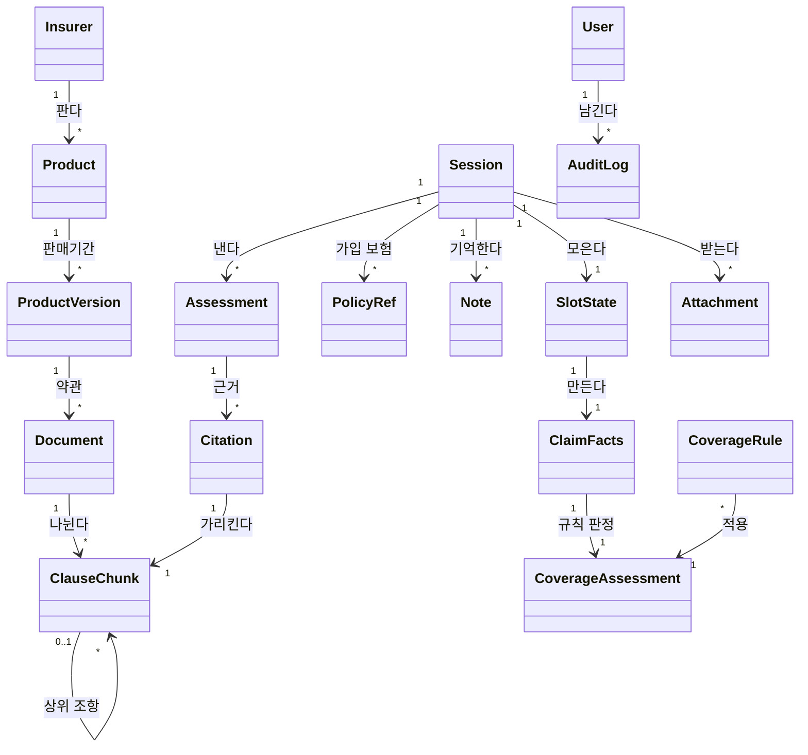

# 도메인 모델: 보험청구심사 어시스턴트

## 1. 개념 식별

유스케이스 본문에서 명사를 뽑아 남긴 것이다. "화면"·"페이지"는 표현이지 개념이 아니라 뺐다.

#### Insurer 보험사

약관을 내는 주체. 현재 손보 5개사. 근거: [[INS-UC-001#UC-A12]]

#### Product 상품

보험사가 파는 실손 상품. 영역(현재 실손 하나)으로 분류한다.

#### ProductVersion 상품 판매기간

같은 상품도 판매 시기에 따라 약관이 다르다. **세대**가 여기서 갈린다.

#### Document 약관 문서

PDF 하나. 어느 판매기간의 것인지가 붙는다.

#### ClauseChunk 조항 청크

약관을 조항·항·표 단위로 나눈 것. **검색과 인용의 최소 단위**다. 자기 자신을 부모로 가져 계층을 이룬다. 근거: [[INS-UC-001#UC-A12]] · [[INS-UC-001#UC-S2]]

#### Session 상담 세션

한 사람의 한 상담. 대화 이력·슬롯·메모를 담는다. **DB에 없다** — 메모리에만 산다. 근거: [[INS-INFRA-001#C2]]

#### SlotState 슬롯

판정에 필요한 사실들의 모음 — 영역·진단명·진단코드·입원일수·통원횟수·청구금액·해외치료 여부 따위. **비어 있음과 모름이 다르다.** 근거: [[INS-UC-001#UC-S1]]

#### PolicyRef 가입 보험 참조

한 사람이 여러 보험에 들 수 있다. 슬롯을 복수로 만드는 대신 이 개념을 따로 둔다. 근거: [[INS-UC-001#UC-H6]]

#### Note 세션 메모

슬롯에 안 담기는 대화 사실. "지난주에 퇴원했다" 같은 것. 최근 것만 유지한다.

#### Assessment 판정

가능성 등급·요약·충족·미충족·인용·다음 행동. **뉴럴 판정**이다. 근거: [[INS-UC-001#UC-S3]]

#### ClaimFacts 청구 사실

규칙 판정의 입력. 슬롯에서 만든다. 근거: [[INS-UC-001#UC-S4]]

#### CoverageRule 보장 규칙

면책·보장기간·부분보상·성립 요건을 선언으로 적은 것. **LLM 없이** 판정한다.

#### CoverageAssessment 규칙 판정

규칙 엔진의 결과. 뉴럴 판정에 함께 넘긴다.

#### Citation 인용

어느 청크를, 어느 PDF 어느 페이지에서, 어디에 상자를 쳐서 보여줄지. 근거: [[INS-UC-001#UC-S6]]

#### Attachment 업로드 서류

사용자가 올린 진단서·영수증 따위. **24시간 뒤 사라진다.**

#### AuditLog 감사 기록

한 턴에 무엇을 보고 어떻게 답했는지. 근거: [[INS-UC-001#UC-A11]]

#### User 사용자

로그인한 사람. 마이데이터 식별자를 가진다.

## 2. 개념 모델

## 3. 개념별 정리

| 개념 | 생기는 때 | 사라지는 때 | 불변 규칙 |
|---|---|---|---|
| Insurer·Product·Version·Document | 약관 적재 | 재적재로 갈아치움 | 같은 PDF는 해시로 중복 판정 |
| ClauseChunk | 문서 파싱 | 재적재 | **검색·인용의 유일한 단위.** 임베딩 한도 안에 들어야 한다 |
| Session | 첫 요청 | TTL 만료·명시적 폐기·**프로세스 재시작** | 소유자 개념이 없다([[INS-INFRA-001#C4]]) |
| SlotState | 세션과 함께 | 세션과 함께 | 빈 값 ≠ 모름 ≠ 0. 셋을 구분한다 |
| Assessment | 판정 생성 | 세션과 함께 | **인용이 0이면 만들지 않는다** |
| ClaimFacts | 판정 직전 | 그 턴 안에서 | 슬롯에서만 만든다 |
| Attachment | 업로드 | **24시간 뒤 자동** | 감사에는 해시만 남는다 |
| AuditLog | 턴 시작 | 지우지 않는다 | 마스킹된 입력만 |

## 4. 경계

- **약관 묶음**(Insurer·Product·Version·Document·ClauseChunk)은 **읽기 전용 세계**다. 상담이 이걸 바꾸지 않는다. 적재만이 바꾼다
- **상담 묶음**(Session·SlotState·Note·Assessment·Citation)은 휘발성이다. 약관을 **id로만** 가리킨다
- **규칙 묶음**(ClaimFacts·CoverageRule·CoverageAssessment)은 LLM과 무관하고 순수 함수다. 같은 사실이면 같은 결과가 나온다
- **감사 묶음**은 아무도 안 부른다. 위 셋이 남길 뿐이다

## 5. 미결사항

- [ ] **세션에 소유자를 둘지** — 지금은 없다. 운영 전환의 전제다. 근거: [[INS-INFRA-001#C4]]
- [ ] **ClaimFacts가 슬롯에서 못 받는 사실이 있다** — 보장기간(가입일·만기일)과 급여/비급여 분리 금액. 규칙은 그걸 전제로 쓰였는데 대화가 묻지 않는다. 근거: [[INS-PRD-001#R10]]
- [ ] 사용자에 관리자 표시를 둘지
