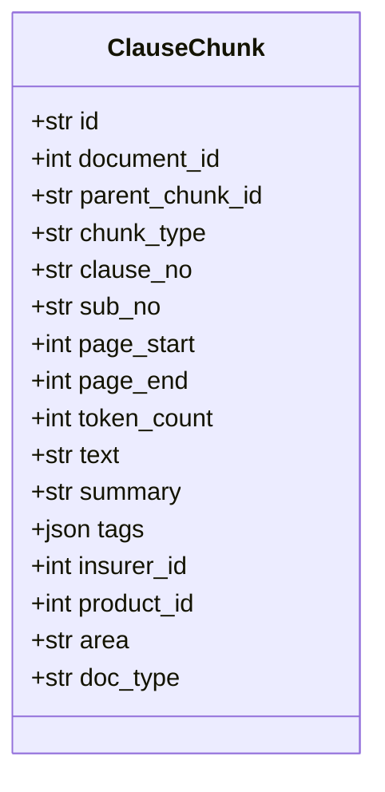
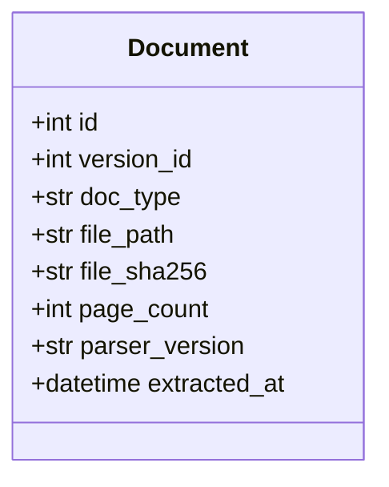
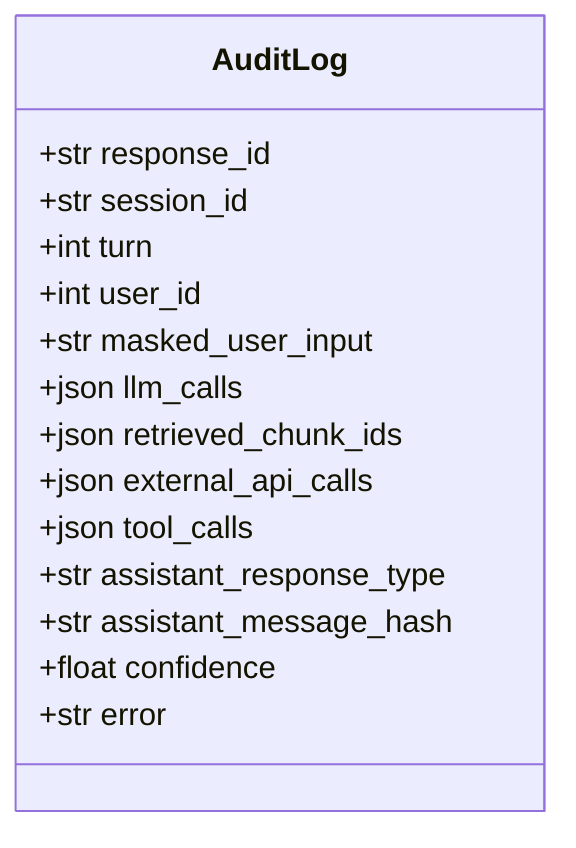
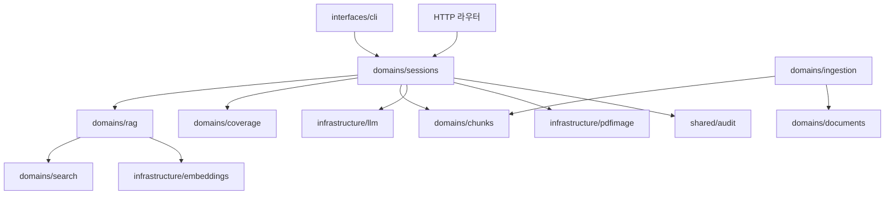

# 클래스 명세: 보험청구심사 어시스턴트

## 1. 폴더 구조

```
app/
├── domains/          도메인 12개
│   ├── sessions/     대화 오케스트레이션 — 시스템의 심장
│   ├── rag/          검색 — 뉴로심볼릭 융합
│   ├── coverage/     규칙 판정 엔진 (LLM 0회)
│   ├── chunks/       약관 청크
│   ├── documents/    보험사·상품·버전·문서
│   ├── ingestion/    적재 파이프라인
│   ├── claims/       체크리스트·요약·접수
│   ├── attachments/  업로드 + TTL
│   ├── auth/         JWT + 데모 페르소나
│   ├── users/        사용자
│   ├── admin/        약관 그래프 탐색 API
│   └── search/       벡터 저장소 어댑터
├── infrastructure/
│   ├── core/         설정·DB·예외·로깅
│   ├── llm/          Solar 클라이언트 · 프롬프트 버전
│   ├── embeddings/   임베딩
│   ├── external/     OCR · 마이데이터 · 건강보험 · 진단코드
│   └── pdfimage/     PDF 페이지 렌더 · 하이라이트
├── shared/           감사 · 개인정보 마스킹 · 도구 · 보험사 매핑
└── interfaces/cli/   CLI
```

**의도는 4계층이다** — `interfaces` → `domains` → `shared` → `infrastructure`. 아래를 향해서만 의존한다.

## 2. 엔티티

#### ClauseChunk 조항 청크



`id`가 벡터 저장소의 키와 같다 — 두 저장소를 잇는 유일한 끈이다. 뒤쪽 넷(`insurer_id`·`product_id`·`area`·`doc_type`)은 **의도적 비정규화**다. 검색 필터가 매번 조인을 타지 않게 하려는 것. 근거: [[INS-DOM-001#ClauseChunk]]

#### Document 약관 문서



`file_sha256`으로 같은 PDF 재적재를 판별한다. `parser_version`이 있어 파서를 바꾼 뒤 무엇을 다시 읽어야 하는지 안다.

#### AuditLog 감사 기록



**응답 본문을 저장하지 않고 해시만 남긴다.** 개인정보를 쌓지 않으면서 "그때 그 답이 맞나"를 검증하기 위한 절충이다. 근거: [[INS-UC-001#UC-S5]]

## 3. 의존 관계



**지켜지지 않는 곳이 넷 있다 (아래 5장 미결).**

## 4. 설계 클래스

#### SessionService 대화 오케스트레이션

한 턴의 전 과정을 결정한다 — 잡담 가드 → 의도 분류 → 슬롯 추출 → 부족 판정 → 규칙 판정 → 되묻기/비교/검색 분기 → 판정 생성 → 감사 마감. 근거: [[INS-UC-001#UC-H4]]

**이 클래스 하나가 사실상 제품의 명세다.** 분기가 여기 다 모여 있다.

#### SessionStore 세션 보관

메모리 사전. TTL은 읽을 때 판정한다. 락이 없다 — 단일 프로세스를 전제한다. 근거: [[INS-INFRA-001#C2]]

#### NeuroSymbolicRetriever 융합 검색

뉴럴 채널과 심볼릭 채널을 함께 돌려 가중 RRF로 합친다. 심볼릭이 죽으면 뉴럴 단독. 근거: [[INS-UC-001#UC-S2]]

#### SymbolicGraphChannel 그래프 채널

조항 제목 토큰으로 후보를 찾고, 참조 관계와 형제 조항으로 넓힌다. **Cypher가 고정 문자열이다 — LLM이 만들지 않는다.** 근거: [[INS-PRD-001#R2]]

#### VectorStore 벡터 저장소 어댑터

검색·적재를 같은 인터페이스로 감싼다. 설정으로 구현을 고른다. 근거: [[INS-PRD-001#R3]]

#### CoverageEngine 규칙 판정 엔진

선언된 규칙들을 사실에 적용해 판정한다. **순수 함수다.** 근거: [[INS-UC-001#UC-S4]]

#### LlmGateway 모델 호출

슬롯 추출·의도 분류·후속 질문·판정 생성·문서 분류·정보 추출을 구조화 출력으로 부른다. 스키마 위반과 없는 청크 인용을 걸러낸다. 근거: [[INS-UC-001#UC-S3]]

#### IngestionPipeline 적재

폴더 스캔 → 파싱 → 청킹 → 관계형 저장 → 임베딩 → 그래프. 근거: [[INS-UC-001#UC-A12]]

#### CitationHydrator 인용 채우기

청크 id로 PDF 경로를 찾아 페이지를 고르고, 하이라이트 상자를 계산해 이미지를 만든다. **모델이 준 URL을 믿지 않는다.** 근거: [[INS-UC-001#UC-S6]]

#### AuditContext 감사 생애주기

턴 시작에 열고 끝에 닫는다. 근거: [[INS-UC-001#UC-S5]]

#### OcrAdapter 서류 인식

텍스트 추출과 구조화 정보 추출 두 가지를 제공한다. 근거: [[INS-UC-001#UC-H7]]

## 5. 미결사항

- [ ] **계층이 네 곳에서 뒤집혀 있다.** 의도는 `domains` → `infrastructure` 한 방향인데 실제로는
  - `infrastructure`가 `domains`를 부른다 — 외부 데이터 어댑터 쪽에 **HTTP 라우터가 들어가 있고** 그것이 인증·사용자 모델을 가져온다
  - `shared`가 `domains`를 부른다 — 도구 디스패처가 검색 도메인을 직접 가져온다
  - `rag`와 `sessions`가 서로를 부른다 — 슬롯 타입이 `sessions`에 있어서다. 순환은 지연 import로 피하고 있다
  - `coverage`와 `sessions`도 같은 모양이다
  **고치려면 슬롯·필터 타입을 공용 계층으로 내리는 게 먼저다.**
- [ ] **`search` 도메인의 정체** — 이름은 검색인데 실제로는 벡터 저장소 드라이버다. 진짜 검색은 `rag`가 한다. 라우터는 등록돼 있으나 엔드포인트가 0개다. **`infrastructure`로 내리거나 `rag`에 흡수해야 한다**
- [ ] **`SessionService`가 너무 크다** — 한 턴의 모든 분기가 한 함수에 있다. 잡담·의도분류·게이팅·비교·검색·판정을 쪼갤 수 있다
- [ ] **도구 디스패처가 검색기를 따로 만든다** — 본 경로와 다른 인스턴스라 설정 변경·캐시 초기화가 한쪽에만 먹는다. 서킷 브레이커도 우회한다
- [ ] **빈 라우터 둘이 등록돼 있다** — `chunks`·`search`. 엔드포인트가 없다
- [ ] **영역 코드가 두 곳에서 다르다** — 관계형 제약은 자동차·화재를 여전히 허용하는데 슬롯 타입은 실손 하나만 받는다. 근거: [[INS-INFRA-001#C3]]
