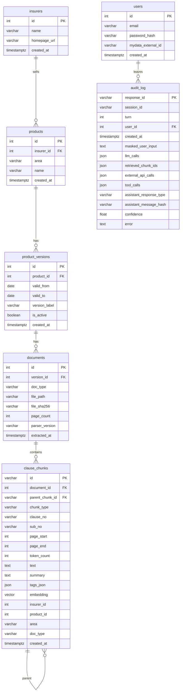

# ERD·DD: 보험청구심사 어시스턴트

## 1. ERD

**세션·슬롯·판정은 여기 없다.** 메모리에만 산다. 근거: [[INS-INFRA-001#C2]]

## 2. DD

### clause_chunks 조항 청크

| 컬럼 | 타입 | 제약 | 뜻 |
|---|---|---|---|
| id | varchar(36) | PK | UUID. **벡터 저장소의 키와 같은 값**이다 |
| document_id | int | FK documents NOT NULL | |
| parent_chunk_id | varchar(36) | FK clause_chunks null 허용 | 상위 조항. null이면 최상위 |
| chunk_type | varchar | NOT NULL | 조항·항·표·별표 |
| clause_no · sub_no | varchar | null 허용 | "제5조" · "②". 파싱이 못 읽으면 null |
| page_start · page_end | int | NOT NULL | 인용 페이지 렌더의 입력. 근거: [[INS-UC-001#UC-S6]] |
| token_count | int | NOT NULL | **임베딩 한도(3800) 초과 판정에 쓴다** |
| text | text | NOT NULL | 인용에 그대로 나가는 원문 |
| summary | text | null 허용 | |
| tags_json | json | null 허용 | |
| embedding | vector(4096) | null 허용 | **4096차원은 근사 인덱스 한계를 넘어 정확 순차 스캔**이다. 근거: [[INS-INFRA-001]] 3장 |
| insurer_id · product_id · area · doc_type | | null 허용 | **의도적 비정규화.** 검색 필터가 조인을 안 타게 |

### documents 약관 문서

| 컬럼 | 타입 | 제약 | 뜻 |
|---|---|---|---|
| file_sha256 | varchar(64) | NOT NULL | 같은 PDF 재적재 판별 |
| parser_version | varchar | NOT NULL | 파서를 바꾼 뒤 무엇을 다시 읽을지 안다 |
| page_count | int | NOT NULL | |

### product_versions 판매기간

| 컬럼 | 타입 | 제약 | 뜻 |
|---|---|---|---|
| valid_from · valid_to | date | valid_to는 null 허용 | **세대가 여기서 갈린다.** 자기부담률이 세대별로 다르다 |
| is_active | boolean | NOT NULL | |

### audit_log 감사 기록

| 컬럼 | 타입 | 제약 | 뜻 |
|---|---|---|---|
| response_id | varchar | PK | 한 응답 = 한 행 |
| masked_user_input | text | NOT NULL | **마스킹된 것만.** 원문은 안 남긴다 |
| retrieved_chunk_ids | json | null 허용 | "무엇을 보고 답했나". 근거: [[INS-UC-001#UC-A11]] |
| assistant_message_hash | varchar | null 허용 | **본문 대신 해시.** 개인정보를 안 쌓으면서 검증한다 |
| user_id | int | FK users null 허용 | 익명 상담이면 null |

### users 사용자

| 컬럼 | 타입 | 제약 | 뜻 |
|---|---|---|---|
| email | varchar | UNIQUE NOT NULL | |
| password_hash | varchar | NOT NULL | |
| mydata_external_id | varchar | null 허용 | 마이데이터 조회 키 |

**관리자 표시 컬럼이 없다.** 근거: [[INS-DOM-001]] 5장

## 3. 인덱스

| 표 | 인덱스 | 이유 |
|---|---|---|
| clause_chunks | `(insurer_id, area)` | 검색 필터. 비정규 컬럼을 쓰는 이유 |
| clause_chunks | `(document_id)` | 문서 단위 재적재 |
| clause_chunks | embedding 근사 인덱스 | **없다.** 4096차원이 한계를 넘어 만들 수 없다 |
| audit_log | `(session_id, turn)` | 한 상담 되짚기 |
| documents | `(file_sha256)` | 중복 적재 판별 |
| product_versions | `(product_id, valid_from)` | 세대 판정 |

## 4. 미결사항

- [ ] **4096차원 벡터에 근사 인덱스를 못 건다** — 청크가 2,500건 수준이라 순차 스캔이 버티지만, 보험사를 늘리면 여기가 먼저 막힌다. 차원을 줄이거나 half 정밀도로 가는 선택이 필요하다
- [ ] **영역 제약이 폐기된 값을 허용한다** — 자동차·화재가 제약에 남아 있다. 근거: [[INS-DOM-002]] 5장
- [ ] **세션을 표로 둘지** — 지금은 메모리. 소유권을 넣으려면 여기부터다. 근거: [[INS-DOM-001]] 5장
- [ ] 감사 로그 보존 기간 — 지우는 절차가 없다
