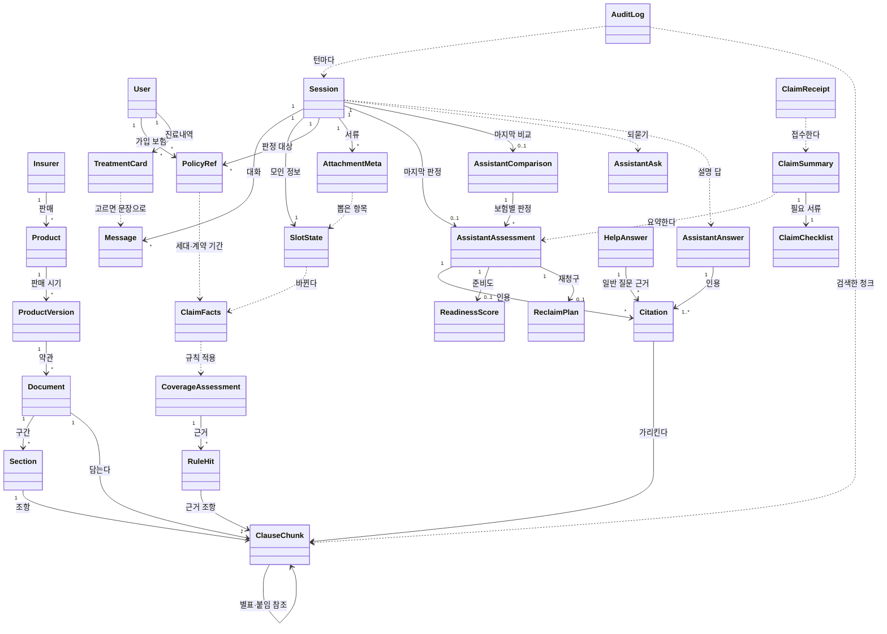

# 도메인 모델 — 보험길잡이

> 1. 개념은 다섯 묶음이다. 약관 데이터, 사람과 대화, 판정, 청구 준비, 운영 기록이다.
> 2. 약관은 보험사 → 상품 → 상품 버전 → 약관 문서 → 약관 청크로 내려간다. 판정은 대화 정보 → 청구 사실 → 보장 판정 → 판정 답으로 흐른다.
> 3. 개념 이름은 코드의 클래스 이름과 같다. 뒤에 올 클래스 명세와 ERD도 같은 이름을 쓴다.

## 0. 이 문서가 다루는 것

- 청구 가능성 안내에 필요한 개념과 그 관계를 적는다. 요구는 [[INS-PRD-002]], 유스케이스는 [[INS-UC-002]], 데이터가 사는 곳은 [[INS-INFRA-002]]를 따른다
- 개념 이름은 지금 코드의 클래스 이름을 그대로 쓴다. 그래야 클래스 명세·ERD·코드가 한 이름으로 이어진다
- 속성은 판정과 흐름에 쓰이는 것만 적는다. 형식과 제약은 클래스 명세와 ERD에서 정한다

## 1. 개념 식별

유스케이스와 요구에서 명사를 모아 추렸다. 따로 수명이나 관계가 있는 것은 개념으로 남기고, 다른 개념에 딸려 움직이는 것은 속성으로 내렸다.

| 후보 명사 | 결정 | 이유 |
|---|---|---|
| 보험사, 상품, 판매 시기, 약관 PDF | 개념 — [[#Insurer]] · [[#Product]] · [[#ProductVersion]] · [[#Document]] | 적재 단위이고, 세대와 인용 범위를 정한다 |
| 조항, 항, 별표, 표 | 개념 하나 — [[#ClauseChunk]] | 검색·인용·하이라이트의 단위가 같다. 종류는 속성으로 둔다 |
| 본문·특약 구간 | 개념 — [[#Section]] | 같은 조 번호가 구간마다 다시 시작해, 구간 없이는 조항을 가리킬 수 없다 |
| 그래프의 조·하위 조항 노드 | 속성 수준 — [[#ClauseChunk]]의 투영 | 같은 청크를 그래프 저장소에 옮긴 것이라 따로 두지 않는다 |
| 사용자, 로그인, 시연 계정 | 개념 — [[#User]] | 가입 보험·진료내역을 불러오는 기준이다 |
| 대화, 메시지, 모인 정보, 대화 메모 | 개념 — [[#Session]] · [[#Message]] · [[#SlotState]] | 세션은 수명(30분)이 있고, 정보는 턴마다 쌓인다. 대화 메모는 세션의 속성이다 |
| 가입 보험, 판정 대상 보험, 세대, 계약 기간 | 개념 — [[#PolicyRef]]. 세대·계약 기간은 속성 | 여러 보험 비교의 단위다 |
| 진료내역 | 개념 — [[#TreatmentCard]] | 외부에서 오고, 고른 진료가 문장으로 대화에 들어간다 |
| 서류 사진 | 개념 — [[#AttachmentMeta]] | 수명(24시간)이 따로 있다 |
| 청구 사실, 규칙, 보장 판정, 자기부담 | 개념 — [[#ClaimFacts]] · [[#RuleHit]] · [[#CoverageAssessment]]. 자기부담은 속성 | 결정론 판정의 입력·근거·결과다 |
| 가능성 등급, 충족·미충족, 다음 행동 | 속성 — [[#AssistantAssessment]] | 판정 답에 딸려 움직인다 |
| 인용, 하이라이트 | 개념 — [[#Citation]]. 하이라이트 상자는 속성 | 조항 원문과 원본 캡처를 잇는다 |
| 준비도, 재청구 논리 | 개념 — [[#ReadinessScore]] · [[#ReclaimPlan]] | 따로 계산되고 따로 보인다 |
| 되묻기, 선택지 | 개념 — [[#AssistantAsk]]. 선택지는 속성 | 판정 대신 나가는 응답이다 |
| 판정 뒤 질문의 답 | 개념 — [[#AssistantAnswer]] | 판정 답과 달리 등급이 없고, 인용이 하나 이상 있어야 한다 |
| 여러 보험 비교, 추천 | 개념 — [[#AssistantComparison]] | 보험별 판정을 묶는다 |
| 도움 챗봇 답 | 개념 — [[#HelpAnswer]] | 판정 답과 역할이 다르다 |
| 필요 서류, 청구 준비 요약, 접수 | 개념 — [[#ClaimChecklist]] · [[#ClaimSummary]] · [[#ClaimReceipt]] | 청구 준비 화면의 단위다 |
| 감사 기록 | 개념 — [[#AuditLog]] | 대화와 달리 남는 유일한 기록이다 |
| 평가 문항, 골든셋, 비교 결과 | 모델 밖 | 제품이 아니라 평가 도구의 것이다(4장) |

## 2. 개념 모델

실선은 개념이 다른 개념을 갖거나 가리키는 관계다. 점선은 한 개념이 다른 개념을 만들거나 쓰는 관계다.

## 3. 개념별 정리

### 3.1 약관 데이터

#### Insurer 보험사

실손 약관을 파는 손해보험사다. 적재된 곳은 삼성화재·현대해상·메리츠화재·한화손해보험·롯데손해보험 다섯이다.

- **속성**: 코드(`id`, 예: samsung) · 이름 · 별칭(약칭·띄어쓰기 변형) · 홈페이지
- **관계**: [[#Product]]를 판다. 그래프에서는 판매(SELLS) 관계로 상품을 잇는다
- **판정 근거**: 가입 보험사 범위 검색과 인용 표기의 기준이다([[INS-PRD-002#R22]] · [[INS-PRD-002#R2]])
- **사는 곳**: PostgreSQL. 코드 쪽 보험사 목록(별칭 매핑)이 따로 있다(5장)

#### Product 상품

보험사의 실손의료보험 상품이다.

- **속성**: 이름 · 영역(`area`, 실손)
- **관계**: [[#Insurer]]에 속하고 [[#ProductVersion]]을 여럿 갖는다
- **판정 근거**: 판정 대상 보험([[#PolicyRef]])과 약관을 잇는다([[INS-PRD-002#R13]])
- **사는 곳**: PostgreSQL

#### ProductVersion 상품 버전

상품의 판매 시기별 버전이다. 실손은 판매 시기로 세대가 갈린다.

- **속성**: 적용 시작일·종료일 · 버전 이름 · 현재 판매 여부
- **관계**: [[#Product]]에 속하고 [[#Document]]를 여럿 갖는다. 그래프 노드 이름은 Version이다
- **판정 근거**: 세대별 자기부담률의 근거가 되는 판매 시기를 담는다([[INS-PRD-002#R17]])
- **사는 곳**: PostgreSQL

#### Document 약관 문서

적재한 약관 PDF 한 벌이다.

- **속성**: 문서 유형(`doc_type`: 요약서·사업방법서·약관) · 파일 경로 · 해시 · 쪽수 · 파서 버전 · 추출 시각
- **관계**: [[#ProductVersion]]에 속하고, [[#Section]]과 [[#ClauseChunk]]를 담는다
- **판정 근거**: 원본 캡처와 하이라이트는 이 문서의 페이지에서 나온다([[INS-PRD-002#R2]] · [[INS-PRD-002#R21]])
- **사는 곳**: PostgreSQL(메타) · VM 디스크(원본 PDF)

#### Section 구간

약관 안에서 조 번호가 다시 시작하는 단위다. 본문과 특약이 여기에 해당한다.

- **속성**: 문서 안 순서 · 이름(예: 본문 제1조~제45조, 부속 N)
- **관계**: [[#Document]]에 속하고 [[#ClauseChunk]]를 묶는다
- **판정 근거**: 같은 "제3조"가 구간마다 있어, 구간 없이는 인용과 검색이 조항을 헷갈린다([[INS-PRD-002#R21]] · [[INS-PRD-002#R24]])
- **사는 곳**: 지금은 저장하지 않는다. 관리자 그래프가 청크의 읽는 순서로 복원해 보여 줄 뿐이다(5장)

#### ClauseChunk 약관 청크

검색·인용·하이라이트의 단위가 되는 약관 조각이다. 조, 항, 호, 표, 별표를 모두 이 개념으로 다룬다.

- **속성**: 종류(`chunk_type`: 조·항·호·표·별표·기타) · 조 번호 · 하위 번호 · 시작·끝 페이지 · 원문 · 토큰 수 · 보험사·상품·문서 유형(검색 필터용 복사본) · 임베딩(4096차원)
- **관계**: [[#Document]]에 속한다. 상위 청크(조 → 항)를 가질 수 있고, 이 관계는 조 번호로 잇는다. 별표·붙임을 가리키는 청크는 그 별표 청크를 참조한다(REFERS_TO)
- **판정 근거**: 인용([[#Citation]])과 규칙 근거([[#RuleHit]])가 모두 이것을 가리킨다([[INS-PRD-002#R1]] · [[INS-PRD-002#R22]])
- **사는 곳**: PostgreSQL(원문·메타·임베딩) · Memgraph(조는 Clause, 나머지는 SubClause 노드로 투영)

### 3.2 사람과 대화

#### User 사용자

로그인한 사용자다. 로그인하지 않은 사람은 이 개념 없이 대화한다.

- **속성**: 식별자 · 이메일 · 비밀번호 해시 · 외부 데이터 연결 키(`mydata_external_id`) · 만든 시각
- **관계**: 외부 데이터에서 가입 보험([[#PolicyRef]])과 진료내역([[#TreatmentCard]])을 가진다. 시연 계정은 이름·휴대폰 번호로 찾는다
- **판정 근거**: 내 보험 정보로 확인하기의 기준이다([[INS-UC-002#UC-H4]] · [[INS-PRD-002#R13]])
- **사는 곳**: PostgreSQL. 시연 계정은 합성 데이터에서 시드한다

#### Session 대화 세션

한 사용자의 한 번의 상담이다. 서버 메모리에만 있다.

- **속성**: 식별자 · 상태(정보 수집·분석 중·답변 완료·종료) · 만든 시각·마지막 활동 시각 · 대화 메모(`notes`)
- **관계**: [[#Message]]·[[#SlotState]]·[[#PolicyRef]]·[[#AttachmentMeta]]를 갖고, 마지막 판정([[#AssistantAssessment]])과 마지막 비교([[#AssistantComparison]])를 기억한다
- **판정 근거**: 대화 맥락을 이어받는 단위다([[INS-PRD-002#R7]]). 30분 동안 쓰지 않으면 사라진다([[INS-PRD-002#N2]])
- **사는 곳**: 백엔드 프로세스 메모리. 사용자를 저장하지 않는다

#### Message 메시지

대화의 한 턴이다.

- **속성**: 누가(사용자·어시스턴트) · 내용 · 응답 종류(되묻기·판정·답변·비교) · 시각
- **관계**: [[#Session]]에 속한다
- **판정 근거**: 앞 대화를 이어받는 질의응답의 입력이다([[INS-PRD-002#R7]] · [[INS-PRD-002#R8]])
- **사는 곳**: 세션과 함께 메모리

#### SlotState 대화 정보

대화에서 모인, 판정에 쓰는 사실이다.

- **속성**: 보험사·상품·세대·증권번호 · 계약 시작·만료일 · 사고일·장소 · 진단명·질병코드 · 입원일수·통원 횟수·치료 기간 · 병원 · 청구 금액·급여 금액·비급여 금액 · 치료 목적 · 국외 치료·한방·치과·다른 보험 처리 여부 · 모른다고 한 항목(`unknown_slots`) · 서류에서 뽑은 값
- **관계**: [[#Session]]에 속한다. 네 곳에서 채워진다 — ① 사용자 발화에서 모델이 뽑은 사실. "급여 30만원"·"3일 입원"처럼 이름이 붙은 금액·입원일수·통원 횟수는 모델이 놓쳐도 문장에서 그대로 읽어 보태고, 모른다고 한 항목은 사용자가 모른다고 말했을 때만 받는다 ② 분석을 시작할 때 화면이 넘기는 영역과 고른 가입 보험([[#PolicyRef]])의 보험사·세대·계약 기간 ③ 고른 진료([[#TreatmentCard]])를 설명하는 문장(발화처럼 뽑힌다) ④ 올린 서류([[#AttachmentMeta]])에서 뽑은 항목. 판정 때 [[#ClaimFacts]]로 바뀐다
- **판정 근거**: 되묻기 여부와 판정 입력이 모두 여기서 나온다([[INS-PRD-002#R5]] · [[INS-PRD-002#R6]])
- **사는 곳**: 세션과 함께 메모리

#### PolicyRef 판정 대상 보험

사용자가 가진, 또는 판정하려고 고른 실손 한 건이다.

- **속성**: 보험사 코드·이름 · 상품 · 증권번호 · 세대(1~4, 가입일로 정함) · 계약 시작·만료일(만료일이 없으면 무기한)
- **관계**: [[#Session]]이 여럿 가질 수 있고, [[#Product]]를 가리킨다. 첫 건의 보험사·세대·계약 기간이 [[#SlotState]]에 들어간다. 여러 건이면 보험마다 자기 세대·계약 기간을 얹은 [[#ClaimFacts]]로 따로 판정해 [[#AssistantComparison]]의 단위가 된다
- **판정 근거**: 가입 현황과 다중 비교의 단위다([[INS-PRD-002#R16]] · [[INS-PRD-002#R17]]). 계약 기간은 보장기간 규칙의 입력이다
- **사는 곳**: 세션 메모리. 원본은 마이데이터 응답이다(계약 기간은 마이데이터의 계약일·만기일)

#### TreatmentCard 진료 기록

건강보험 API에서 온 진료 한 건이다.

- **속성**: 진료 식별자 · 진료일 · 병원 · 진료과 · 진단 요약 · 입원 여부·입원일수·통원 횟수 · 총 진료비·청구 금액 · 대화 정보로 옮길 값(지금은 쓰이지 않는다)
- **관계**: [[#User]]의 것이다. 사용자가 상담 중 도움 챗봇에서 고르면, 그 진료를 설명하는 문장이 [[#Message]]로 보내지고 모델이 뽑은 사실이 [[#SlotState]]에 들어간다
- **판정 근거**: 사용자가 입력할 사실을 줄인다([[INS-PRD-002#R13]])
- **사는 곳**: 외부 API 응답. 지금은 같은 형식의 합성 데이터다

#### AttachmentMeta 첨부 서류

사용자가 올린 서류 사진 한 장이다.

- **속성**: 식별자 · 세션 · 해시 · 크기 · 형식 · 파일 이름 · 만든 시각 · 지울 시각
- **관계**: [[#Session]]에 속하고, 추출 결과가 올리는 즉시 [[#SlotState]]를 채운다. 영수증에서는 급여·비급여 합계까지, 청구서에서는 보험기간까지 뽑는다. 사진이 흐려 인식 신뢰도가 0.6 미만이면 채우지 않고 응답으로만 돌려준다
- **판정 근거**: 서류 사진 추출의 입력이다([[INS-PRD-002#R12]]). 24시간 뒤 지운다([[INS-PRD-002#N2]])
- **사는 곳**: VM 디스크 `data/uploads`

### 3.3 판정

#### ClaimFacts 청구 사실

결정론 판정에 넣는 사실이다. 대화 정보에서 판정에 필요한 것만 뽑아 정규화한 것이다.

- **속성**: 보험사 · 세대 · 치료 유형(입원·통원·수술·처방) · 급여 구분 · 진단 · 치료 목적(치료·미용·예방·임신출산·자해·범죄) · 청구액·급여액·비급여액 · 사고일 · 보험 시작·종료일 · 입원일수·통원 횟수 · 국외·한방·치과·다른 보험 처리 여부
- **관계**: [[#SlotState]]에서 만들어지고, [[#CoverageAssessment]]의 입력이 된다. 다중 비교에서는 [[#PolicyRef]]마다 그 보험의 세대·계약 기간을 얹어 따로 만든다
- **판정 근거**: 같은 사실에 같은 결론을 내는 심볼릭 판정의 입력이다([[INS-PRD-002#R1]])
- **사는 곳**: 판정할 때만 만든다

#### RuleHit 규칙 적중

판정에서 걸린 약관 규칙 하나다.

- **속성**: 규칙 식별자 · 종류(보장기간·면책·부분 보상·보장 근거·자기부담·한도) · 제목 · 근거 조항 · 사유
- **관계**: [[#CoverageAssessment]]에 속하고, 근거 조항([[#ClauseChunk]])을 가리킨다
- **판정 근거**: 면책·조건부 판정을 조항으로 설명한다([[INS-PRD-002#R1]])
- **사는 곳**: 판정할 때만 만든다. 규칙은 코드에 있다

#### CoverageAssessment 보장 판정

규칙을 적용한 결과다.

- **속성**: 결과(보장·면책·조건부·정보 부족) · 적중 규칙들 · 자기부담 계산(청구액·자기부담·예상 지급액·계산식) · 사유 · 모자란 정보 · 세대가 필요한지
- **관계**: [[#ClaimFacts]]에서 나오고 [[#RuleHit]]를 갖는다. 결과가 [[#AssistantAssessment]]의 등급 근거가 된다
- **판정 근거**: 뉴로심볼릭 판정의 심볼릭 쪽이다([[INS-PRD-002#R1]] · [[INS-PRD-002#R17]]). 사고일이 계약 기간 밖이면 면책이다. 만료일이 없는 무기한 계약도 시작일 전 사고는 잡는다. 자기부담 계산은 급여·비급여 금액 가운데 하나라도 있을 때만 나온다
- **사는 곳**: 판정할 때만 만든다

#### AssistantAssessment 판정 답

사용자에게 가는 판정이다.

- **속성**: 가능성 등급(높음·중간·낮음) · 요약 · 충족·미충족 항목 · 다음 행동 · 확신도 · 면책 문구
- **관계**: [[#Citation]]을 여럿 갖고, [[#ReadinessScore]]와 [[#ReclaimPlan]]을 가질 수 있다. [[#Session]]이 마지막 것을 기억한다
- **판정 근거**: 청구 가능성 확인의 결과물이다([[INS-UC-002#UC-H1]] · [[INS-PRD-002#R1]] · [[INS-PRD-002#R9]])
- **사는 곳**: 세션 메모리

#### AssistantAsk 되묻기

판정 대신 나가는 질문이다.

- **속성**: 메시지 · 기대하는 정보 · 선택지("모르겠습니다" 포함)
- **관계**: [[#Session]]에서 나오고 [[#SlotState]]의 빈칸을 가리킨다
- **판정 근거**: 되묻기는 판정 전 한 번까지다([[INS-PRD-002#R5]] · [[INS-PRD-002#R6]])
- **사는 곳**: 응답으로만 나간다

#### AssistantAnswer 설명 답

판정 뒤 설명을 묻는 질문에, 조항을 인용해 답한 것이다.

- **속성**: 메시지 · 인용(하나 이상) · 이어서 물어볼 질문(4개까지) · 내 보험 확인이 필요한지 · 면책 문구
- **관계**: [[#Session]]에서 나오고 [[#Citation]]을 하나 이상 갖는다. 등급이 없어 [[#AssistantAssessment]]와 다르고, 인용이 반드시 있어야 해서 [[#HelpAnswer]]와 다르다
- **판정 근거**: 판정 뒤 이어 묻는 질문에 앞 대화를 이어받아 약관을 근거로 답한다([[INS-UC-002#UC-H3]] · [[INS-PRD-002#R8]])
- **사는 곳**: 응답으로 나가고, 메시지는 세션의 대화 기록에 남는다

#### Citation 인용

답이 근거로 드는 조항 하나다.

- **속성**: 청크 식별자 · 보험사·상품·버전·문서 유형 · 조 번호·하위 번호 · 원문 · 페이지 · 페이지 이미지 주소 · PDF 주소 · 하이라이트 상자(x·y·너비·높이)
- **관계**: [[#AssistantAssessment]]·[[#AssistantAnswer]]·[[#HelpAnswer]]에 속하고 [[#ClauseChunk]]를 가리킨다
- **판정 근거**: 원본 캡처와 하이라이트로 근거를 보여 준다([[INS-PRD-002#R2]] · [[INS-PRD-002#R3]])
- **사는 곳**: 답과 함께 메모리. 보험사 표기는 가리키는 청크에서 덮어쓴다

#### ReadinessScore 준비도

청구 준비 정도를 0~100점으로 나타낸 것이다.

- **속성**: 점수 · 단계(높음·중간·낮음) · 배점 항목들(이름·점수·만점) · 안내 문구("보험금 지급 확률이 아닙니다")
- **관계**: [[#AssistantAssessment]]에 딸린다
- **판정 근거**: 기획에 적은 준비도 게이지다([[INS-PRD-002#R25]])
- **사는 곳**: 판정 답과 함께

#### ReclaimPlan 재청구 계획

무엇을 보완하면 다시 확인할 수 있는지다.

- **속성**: 해당 여부 · 항목들(미충족·보완 행동·근거 조항) · 덧붙임
- **관계**: [[#AssistantAssessment]]에 딸린다. 근거 조항은 그 답의 [[#Citation]] 가운데서만 고른다
- **판정 근거**: 구조화된 재청구 논리다([[INS-PRD-002#R26]])
- **사는 곳**: 판정 답과 함께

#### AssistantComparison 다중 비교

여러 실손을 한꺼번에 판정한 결과다.

- **속성**: 보험별 결과(보험 · 판정 · 자기부담 보기: 세대·급여·비급여 비율·최소 공제·예상 지급액·비례 분담액) · 요약 · 추천 증권번호 · 면책 문구. 예상 지급액은 급여·비급여 금액이 있고 보장으로 판정된 보험에만, 비례 분담액은 그런 보험이 둘 이상일 때만 채워진다
- **관계**: [[#PolicyRef]]마다 [[#AssistantAssessment]]를 하나씩 묶는다
- **판정 근거**: 어디에 청구하는 게 유리한지와 비례분담을 안내한다([[INS-PRD-002#R17]])
- **사는 곳**: 세션 메모리

#### HelpAnswer 도움 답

도움 챗봇의 답이다. 사용법 안내와 실손 일반 질의응답을 한다.

- **속성**: 메시지 · 인용(실손 일반 질문이면 보험사 구분 없이 찾은 약관 조항, 사용법 질문이면 없음) · 이어서 물어볼 질문(4개까지) · 내 보험 확인이 필요한지
- **관계**: 세션 없이 질문 하나에 답 하나로 나간다. 인용은 [[#Citation]] 형식으로 [[#ClauseChunk]]를 가리킨다. 판정 답([[#AssistantAssessment]])과 섞이지 않고, 설명 답([[#AssistantAnswer]])과 달리 인용이 없어도 된다
- **판정 근거**: 등급을 매기는 정식 판정은 메인 챗봇만 한다([[INS-PRD-002#R11]]). 도움 챗봇은 본인 사례를 물으면 표준약관 기준의 일반 안내만 하고, 내 보험으로 확인하기를 권한다
- **사는 곳**: 응답으로만 나간다

### 3.4 청구 준비

#### ClaimChecklist 필요 서류 목록

청구에 필요한 서류 목록이다.

- **속성**: 영역 · 항목들(식별자·이름·필수 여부·이유)
- **관계**: [[#ClaimSummary]]에 딸린다
- **판정 근거**: 청구 준비 화면의 필요 서류다([[INS-PRD-002#R18]])
- **사는 곳**: 요청할 때 만든다

#### ClaimSummary 청구 준비 요약

청구에 필요한 것을 모은 요약이다.

- **속성**: 보험사 · 상품 · 영역 · 가능성 등급 · 요약 · 충족·미충족 항목 · 다음 행동
- **관계**: [[#AssistantAssessment]]를 요약하고 [[#ClaimChecklist]]를 갖는다
- **판정 근거**: 목업에 있던 청구 준비 기능이다([[INS-PRD-002#R18]] · [[INS-UC-002#UC-H7]])
- **사는 곳**: 요청할 때 만든다

#### ClaimReceipt 접수 확인

가정으로 처리한 접수 결과다.

- **속성**: 접수 번호 · 접수 시각 · 상태 · 보험사 · 예상 처리 일수 · 안내 문구
- **관계**: [[#ClaimSummary]]를 접수한 결과다
- **판정 근거**: 실제 전송 없이 접수 완료까지 보여 준다([[INS-PRD-002#R18]])
- **사는 곳**: 응답으로만 나간다. 보험사로 아무것도 보내지 않는다

### 3.5 운영 기록

#### AuditLog 감사 기록

판정 요청과 결과를 남기는 기록이다. 대화에서 유일하게 영구히 남는다.

- **속성**: 응답 식별자 · 세션 식별자 · 턴 · 가린 사용자 입력 · 모델 호출 기록 · 검색한 청크 식별자 · 외부 API·도구 호출 기록 · 응답 종류 · 응답 해시 · 확신도 · 오류 · 사용자 식별자 · 시각
- **관계**: [[#Session]]의 턴마다 남고, 검색한 [[#ClauseChunk]]를 가리킨다
- **판정 근거**: 분쟁 때 어떤 근거로 답했는지 되짚는다([[INS-PRD-002#N3]]). 개인정보는 가린다([[INS-PRD-002#N2]])
- **사는 곳**: PostgreSQL

## 4. 경계

| 다루지 않는 것 | 이유 |
|---|---|
| 보험사의 실제 청구 접수·심사·지급 | 비목표다. 접수는 가정으로만 다룬다 |
| 자동차·화재 등 실손 밖 보험 | 비목표다. 실손 전용으로 좁혔다 |
| 대화 원문의 영구 기록 | 휘발 원칙이다. 남는 것은 가린 감사 기록뿐이다 |
| 그래프의 Clause·SubClause·Version 노드 | 새 개념이 아니라 [[#ClauseChunk]]·[[#ProductVersion]]의 투영이다 |
| 평가 문항·골든셋·모델 비교 결과 | 제품이 아니라 평가 도구의 데이터다 |
| 관리자 계정과 권한 | 관리자 그래프는 설정 토글로 노출을 정하고, 계정 개념을 두지 않았다 |
| 연구팀 지식 그래프(JSON) | 아직 받지 않았다. 받을 때 관리자 그래프의 데이터원으로 붙인다 |

## 5. 미결사항

- [ ] **구간 저장** — [[#Section]]을 청크에 저장할지. 지금은 청크에 구간이 없어 구간마다 다시 시작하는 조 번호가 겹친다 ([[INS-PRD-002#R21]])
- [ ] **필요 서류 상태** — PRD는 자동 확인·업로드 필요·선택 세 상태를 요구하는데, [[#ClaimChecklist]] 항목에는 필수 여부 하나만 있어 화면이 필수·선택 둘로만 보인다 ([[INS-PRD-002#R18]])
- [x] ~~서류 항목~~ — 10/1 구현(E1, 아직 커밋 전). 업로드가 뽑은 항목을 바로 [[#SlotState]]에 채운다. 인식 신뢰도 0.6 미만이면 채우지 않는다 ([[INS-PRD-002#R12]])
- [x] ~~급여·비급여 금액~~ — 10/2 구현(E2, 아직 커밋 전). 발화·영수증의 급여·비급여 금액과 마이데이터의 계약 기간이 [[#ClaimFacts]]까지 이어진다. 금액을 말하면 자기부담과 비례 분담액이 나온다 ([[INS-PRD-002#R17]])
- [ ] **실손이 아닌 보험** — 가입 현황에 보여 주려면 [[#PolicyRef]]가 실손이 아닌 보험도 담아야 한다. 지금은 어댑터가 버린다 ([[INS-PRD-002#R16]])
- [ ] **사용자와 시연 데이터** — [[#User]]에 시연용 연결 키가 들어가 있다. 실연동 때 떼어낼지
- [ ] **보험사 목록 두 벌** — [[#Insurer]]가 DB 테이블과 코드의 보험사 목록(별칭 매핑)에 따로 있다. 한 곳으로 모을지
- [ ] **세션과 사용자** — [[#Session]]은 사용자를 저장하지 않고, [[#AuditLog]]만 사용자 식별자를 가진다. 이대로 둘지
- [ ] **감사 기록 보존 기간** — 정하지 않았다
