# 클래스 명세 — 보험길잡이

> 1. 서버는 도메인 12개(`app/domains/*`), 설정과 외부 연동(`app/infrastructure`), 공용(`app/shared`), 운영 명령(`app/interfaces/cli`)으로 나뉜다. 서비스는 클래스가 아니라 모듈 함수다. 그래서 이 문서는 모듈 하나를 설계 클래스 하나로 그렸다.
> 2. 테이블이 있는 엔티티는 7개다(보험사·상품·상품 버전·약관 문서·약관 청크·사용자·감사 기록). 대화 세션은 테이블 없이 서버 메모리에만 있다.
> 3. 코드를 대조하다 찾은 것은 미결사항에 적었다. 서류 사진에서 뽑은 항목이 대화 정보에 들어가지 않는다. 판정 입력 중 계약 기간·급여/비급여 금액은 채우는 곳이 없어, 보장기간 규칙과 자기부담 계산이 대화에서는 돌지 않는다. 판정·설명 답의 LLM 호출은 재시도 장식자가 엉뚱한 함수에 붙어 SDK 재시도만 받는다. 서비스 없는 라우터와 crud 없는 도메인도 있다.

## 0. 이 문서가 다루는 것

- 기준은 저장소 코드다. 서버는 `app/`, 화면은 `frontend/src/`다
- 서비스는 파이썬 모듈 함수다. 모듈 하나(또는 한 역할을 나눠 가진 파일 몇 개)를 설계 클래스 하나로 그리고, 헤딩 바로 아래에 실제 파일을 적는다. 예를 들어 [[#SessionService]]는 `app/domains/sessions/service.py`다
- 엔티티(2장)는 테이블이 있는 ORM 클래스 7개와, 도메인 모델([[INS-DOM-004]])의 개념을 옮긴 응답·메모리 클래스 20개다. 테이블 이름은 이 문서 다음에 쓸 ERD의 항목과 링크로 잇는다
- 메서드 표의 "부르는 곳"은 API 항목([[INS-API-002]]), 다른 설계 클래스, CLI 명령(`ica …`) 가운데 하나다. "던지는 에러"는 파이썬 예외 → 라우터가 바꾼 에러 코드 순으로 적는다

## 1. 폴더 구조

```
Insurance-Helper/
├── app/                        서버(FastAPI). 기본형의 backend/ 자리 — 1.1
│   ├── main.py                 앱 조립: 라우터 등록, 정적 경로 둘, /health·/metrics, 전역 예외 처리, 첨부 청소 스케줄러
│   ├── __main__.py             python -m app → CLI
│   ├── domains/                도메인 12개 — 1.2
│   ├── infrastructure/         설정·DB·로그(core) + LLM·임베딩·외부 연동·원본 캡처 — 1.3
│   ├── shared/                 감사 기록·보험사 목록·개인정보 가림·도구 — 1.3
│   └── interfaces/cli/         운영 명령 ica — 1.4
├── alembic/ · alembic.ini      DB 마이그레이션
├── prompts/v1/                 LLM 프롬프트 원문 6개. 버전 폴더로 나눈다
├── frontend/                   화면(React + Vite) — 1.5
├── nginx/default.conf          화면 서빙, /api·/static·/health를 백엔드로 넘김
├── tests/                      pytest — 1.6
├── eval/                       품질 측정: 검색 골든셋·E2E·서류 추출·맥락·시나리오
├── data/demo/                  시연 페르소나·마이데이터·진료내역 더미(JSON)
├── data/raw/ · page_images/ · uploads/    약관 원본·페이지 이미지·첨부. 커밋하지 않는 실행 산출물
├── scripts/                    로컬 기동·점검 스크립트 + 발표 자료 스크립트 — 1.6
├── infra/azure/                VM·ACR 준비 스크립트
├── docs/                       기획·설계·운영 문서
├── .github/workflows/          ci.yml(테스트) · deploy.yml(main 푸시 → 배포)
├── Dockerfile · Dockerfile.web                서버 이미지 · 화면 빌드 + nginx 이미지
├── docker-compose.yml · docker-compose.prod.yml          로컬(postgres·migrate·backend·web) · 운영(+ memgraph)
├── docker-compose.postgres.yml · docker-compose.memgraph.yml · docker-compose.neo4j.yml   저장소만 따로 띄우기
├── pyproject.toml · uv.lock    서버 의존성
└── .env.example · .gitignore · .dockerignore · .gitattributes · README.md
```

### 1.1 서버가 루트의 app/에 있다

규약의 기본형은 `backend/app/`이다. 이 저장소는 규약보다 먼저 만들어져 서버가 루트 `app/`에 있다. 화면은 `frontend/`로 나뉘어 있어 의존성 파일이 서로 덮지는 않는다(`pyproject.toml`은 루트, `package.json`은 `frontend/`). 서버만 설정하는 `alembic.ini`·`pyproject.toml`도 같은 이유로 루트에 있다. 옮기면 Dockerfile·CI·`ica` 진입점·테스트 경로가 함께 바뀐다. 옮길지는 5장에 남긴다.

### 1.2 도메인 폴더

기본형은 `router`·`schemas`·`service`·`crud`·`models`(와 조건부 `ports`·`adapters/`)다. 실제 파일과 다른 점은 이렇다.

| 도메인 | 파일 | 기본형과 다른 점 |
|---|---|---|
| sessions | router · schemas · service · store · llm · readiness · _smalltalk | crud 대신 `store`(메모리 세션 저장소)가 있다. `llm`은 LLM 호출이라 기본형으로는 `adapters/` 자리다. 라우터 파일에 응답 모델 넷이 있다(3.2) |
| coverage | schemas · engine · rules · facts · proration | 라우터가 없다. 세션 서비스가 부른다. service 대신 판정 엔진·규칙표·사실 변환·안분을 파일로 나눴다 |
| rag | service · neurosymbolic · vector · graph · vectorstore · indexer · langgraph_agent · agent · protocols · _slots | 라우터가 없다. 검색 채널과 저장소 어댑터를 파일로 나눴다 |
| chunks | router(빈 것) · schemas · service · crud · models · parser · structure · chunker | 적재 단계(파싱·구조 인식·자르기)를 파일로 나눴다 |
| documents | router · schemas · service · crud · models | 기본형 그대로다 |
| users | schemas · service · models | 라우터는 auth에 있다. crud 없이 service가 쿼리를 쓴다 |
| auth | router · schemas · deps · jwt · personas | service가 없다. 라우터가 사용자 서비스·시연 계정·마이데이터 어댑터를 직접 부른다 |
| attachments | router · schemas · service · ie_schemas | 업로드 라우터가 문자 인식·분류·추출을 직접 조율한다 |
| claims | schemas · service | 라우터는 세션 하위 경로라 sessions 라우터에 있다 |
| admin | router · service · ports | 포트 하나에 구현 하나(`MemgraphGraphSource`)가 service 파일 안에 있다 |
| ingestion | schemas · service | CLI만 부른다 |
| search | router(빈 것) · schemas · service | Chroma 저장소 함수다. rag의 `ChromaAdapter`가 감싼다 |

### 1.3 외부 연동과 공용

`app/infrastructure/`는 기본형의 `core/`와 `infra/`를 한 폴더에 담는다. `core/`(설정·DB 세션·예외·로그), `llm/`(Solar 클라이언트·프롬프트 읽기), `embeddings/`, `pdfimage/`(원본 캡처·하이라이트), `external/`(마이데이터·건강보험·OCR/IE·심평원)다.

- OCR/IE 어댑터는 첨부(attachments)와 약관 적재(chunks) 두 도메인이 써서 여기가 맞다
- 마이데이터·건강보험·심평원 어댑터는 쓰는 곳이 하나씩이다. 규약대로면 쓰는 도메인 안 `adapters/`가 자리다. 외부 연동을 한곳에 모은 초기 구조가 남은 것이다(5장)
- 진료내역 라우터가 `external/health_data/router.py`에 있다. 라우터가 도메인 밖 인프라 폴더에 있는 유일한 곳이다(5장)

`app/shared/`는 여러 곳이 쓰는 것이다. `insurers.py`(보험사 코드·이름·별칭 목록), `security/pii.py`(개인정보 가림), `tools/`(ReAct 도구 정의·실행)는 규약의 "순수 유틸"에 맞다. `audit/`은 테이블을 가진 서비스라 순수 유틸이 아니다. 부르는 곳도 세션 서비스 하나뿐이다(5장).

### 1.4 입구 — 웹과 CLI

입구는 둘이다. 웹 REST와 CLI `ica`(`app/interfaces/cli/app.py`)다.

| 명령 | 하는 일 | 부르는 것 |
|---|---|---|
| `ingest` · `rebuild` | 약관 적재 · 강제 재적재 | [[#IngestionService]] |
| `reindex` | 청크를 다시 임베딩해 벡터 저장소에 넣기(`--reset`이면 먼저 비움) | [[#EmbeddingService]] · [[#VectorStoreAdapter]] |
| `graph-build` | 그래프 저장소를 PostgreSQL에서 다시 만들기 | [[#GraphIndexer]] |
| `verify` · `list` · `inspect` | 문서·청크·벡터 수·임베딩 차원·그래프 수 확인, 청크 들여다보기 | [[#DocumentsService]] · [[#ChunksService]] · [[#VectorStoreAdapter]] · [[#GraphIndexer]] |
| `eval-retrieval` | 검색 골든셋 채점 | [[#RagService]] |
| `search` | 검색 시험 | search 도메인의 Chroma 검색 함수. 운영 저장소(pgvector)를 보지 않는다(5장) |
| `chat` | 터미널 상담 | [[#SessionService]] |
| `seed-demo` | 시연 계정 넣기 | [[#DemoPersonaRegistry]] |
| `agent-graph` | ReAct 에이전트 그래프를 mermaid로 출력 | `langgraph_agent` |

규약은 입구 둘이 같은 쓰기 경로를 타면 라우터를 도메인 밖에 입구별로 두라고 한다. 여기서 겹치는 쓰기 경로는 상담(`chat`과 메시지 API가 둘 다 `post_message`)과 시연 계정 시드 둘이다. 둘 다 CLI와 웹이 같은 서비스 함수를 부르므로 공통 절차는 서비스에 있다. 그래서 웹 라우터는 도메인 안에 두었다. 대신 절차가 라우터에 있는 곳(서류 업로드·시연 로그인)은 CLI가 같은 절차를 쓸 수 없다(3.2).

### 1.5 화면

```
frontend/
├── index.html · vite.config.ts · package.json · tsconfig*.json
├── public/
└── src/
    ├── main.tsx · App.tsx      진입 · 라우팅(/app/*, /legal/*, /admin/graph, /showcase)
    ├── pages/app/              사용자 흐름. AppFlow가 /app 한 경로 안에서 단계를 바꾼다
    ├── pages/admin/            관리자 그래프 탐색기
    ├── pages/legal/            안내 문서 넷 + 공통 틀
    ├── pages/ShowcasePage.tsx  디자인 견본(/showcase). 화면 명세에 없다
    ├── components/             두 화면 이상이 쓰는 조각 + 도움 챗봇
    ├── design-system/          Carbon 기반 공용 컴포넌트·대화 패턴·훅
    ├── hooks/                  useSession(세션·스트리밍·첨부) · useFontSize
    ├── api/client.ts           서버 호출 전부 — 4.8 ApiClient
    ├── types/api.ts            응답 타입
    ├── lib/                    시각 표기
    └── styles/                 tokens.css(UI 명세 토큰) · base.css · utilities.css
```

빌드 결과 `dist/`는 `Dockerfile.web`이 nginx 이미지의 `/usr/share/nginx/html`로 복사한다.

| 화면 | 파일 |
|---|---|
| [[INS-UI-003#UI-1]] | `pages/app/WelcomePage.tsx` |
| [[INS-UI-003#UI-2]] | `pages/app/IdentityPage.tsx` |
| [[INS-UI-003#UI-3]] | `pages/app/InsuranceStatusPage.tsx` |
| [[INS-UI-003#UI-4]] | `pages/app/SituationPage.tsx` |
| [[INS-UI-003#UI-5]] | `pages/app/LoadingPage.tsx` |
| [[INS-UI-003#UI-6]] | `pages/app/ChatPage.tsx` |
| [[INS-UI-003#UI-7]] | `pages/app/ReviewPage.tsx` |
| [[INS-UI-003#UI-8]] | `components/HelpLauncher.tsx` — 화면이 아니라 모든 화면 위에 뜨는 조각이다 |
| [[INS-UI-003#UI-9]] | `pages/admin/AdminGraphPage.tsx` · `TddTreeCanvas.tsx` |
| [[INS-UI-003#UI-10]] | `pages/legal/*Page.tsx` 넷 · `DocShell.tsx` |

기본형과 다른 점은 셋이다. 스타일이 `styles.css` 하나가 아니라 토큰·기본·유틸 세 파일이다. 두 화면 이상이 쓰는 조각이 `components/`와 `design-system/` 둘로 나뉜다. 관리자 화면이 `api/`를 거치지 않고 `fetch`를 직접 쓴다(3.2).

### 1.6 테스트·평가·스크립트

- `tests/`는 `app/`의 거울이 아니라 한 단계로 펼친 모양이다(`tests/sessions`, `tests/external`, `tests/security` …). 도메인 이름은 같다
- `eval/`은 제품 코드가 아니다. 검색 골든셋(`golden`)·E2E 판정(`e2e_judge`)·서류 추출(`ie_bench`)을 잰다. 검색 채점은 제품과 같은 [[#RagService]]를 부른다
- `scripts/`에는 기동·점검 스크립트 5개와 발표 자료·제안서 스크립트 10개가 섞여 있다. 그중 둘은 다른 과제(VODA 데이터 카탈로그)의 장표다(5장)

## 2. 엔티티

테이블이 있는 클래스는 7개다. 나머지 20개는 테이블이 없다. 세션과 대화 정보는 서버 메모리에 있고, 판정·청구 준비 클래스는 응답으로만 나간다. 도메인 개념 [[INS-DOM-004#Section]](구간)에는 클래스가 없다. 청크에 구간을 저장하지 않고, 관리자 그래프가 그때그때 복원한다(5장).

타입 표기는 파이썬 타입을 줄였다. `str`·`int`·`date`처럼 적고, 비어도 되는지는 표에 적는다. `list~X~`는 X의 목록이다.

### 2.1 약관 데이터

#### Insurer 보험사

테이블: [[INS-DOM-006#insurers]] · 도메인: [[INS-DOM-004#Insurer]]

`app/domains/documents/models.py`. 실손 약관을 파는 손해보험사다. 적재된 곳은 다섯이다.

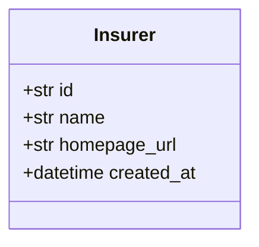

| 속성 | 무엇이고 왜 있나 |
|---|---|
| `id` | 보험사 코드(예: `samsung`). 기본 키. 약관 폴더 이름(`data/raw/<코드>`)과 같고, 검색 필터와 인용 표기에 쓴다 |
| `name` | 이름(예: 삼성화재) |
| `homepage_url` | 홈페이지. 비어도 된다 |
| `created_at` | 적재 시각 |

`products`로 [[#Product]]를 여럿 갖는다. 약칭·띄어쓰기 변형 같은 별칭은 테이블이 아니라 코드 목록 `app/shared/insurers.py`에 있다.

#### Product 상품

테이블: [[INS-DOM-006#products]] · 도메인: [[INS-DOM-004#Product]]

`app/domains/documents/models.py`. 보험사의 실손의료보험 상품이다.

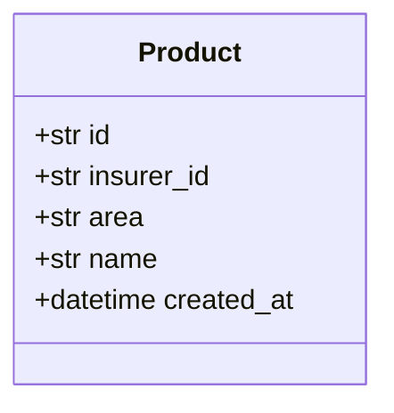

| 속성 | 무엇이고 왜 있나 |
|---|---|
| `id` | 상품 코드. 기본 키. 약관 폴더 경로의 셋째 칸에서 온다 |
| `insurer_id` | 보험사 코드. 외래 키 → `insurers` |
| `area` | 영역. 허용값은 `auto`·`accident_disease`·`fire`지만 적재된 것은 실손(`accident_disease`)뿐이다 |
| `name` | 상품 이름. 지금 행은 `실손의료보험`이다. 새 상품을 적재하면 적재가 이름 자리에 상품 코드를 넣는다 |
| `created_at` | 적재 시각 |

[[#Insurer]]에 속하고, `versions`로 [[#ProductVersion]]을 여럿 갖는다.

#### ProductVersion 상품 버전

테이블: [[INS-DOM-006#product_versions]] · 도메인: [[INS-DOM-004#ProductVersion]]

`app/domains/documents/models.py`. 상품의 판매 시기별 버전이다. 실손은 판매 시기로 세대가 갈린다.

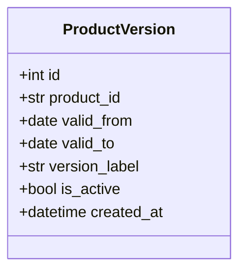

| 속성 | 무엇이고 왜 있나 |
|---|---|
| `id` | 일련번호. 기본 키 |
| `product_id` | 상품 코드. 외래 키 → `products` |
| `valid_from` | 적용 시작일. 판매 시기를 나타낸다. 실손 세대는 이 값이 아니라 계약의 가입일로 정한다 |
| `valid_to` | 적용 종료일. 판매 중이면 비어 있다 |
| `version_label` | 버전 이름. 인용의 `version`으로 그대로 나간다 |
| `is_active` | 현재 판매 여부 |
| `created_at` | 적재 시각 |

[[#Product]]에 속하고, `documents`로 [[#Document]]를 여럿 갖는다.

#### Document 약관 문서

테이블: [[INS-DOM-006#documents]] · 도메인: [[INS-DOM-004#Document]]

`app/domains/documents/models.py`. 적재한 약관 PDF 한 벌이다.

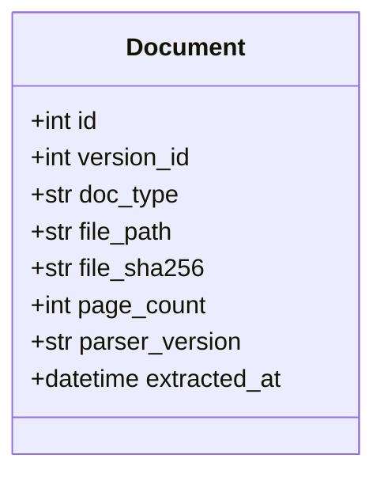

| 속성 | 무엇이고 왜 있나 |
|---|---|
| `id` | 일련번호. 기본 키 |
| `version_id` | 상품 버전. 외래 키 → `product_versions` |
| `doc_type` | 문서 유형: `summary`(요약서)·`business`(사업방법서)·`terms`(약관) |
| `file_path` | 원본 PDF 경로. 원본 캡처와 PDF 링크가 여기서 나온다 |
| `file_sha256` | 파일 해시. 같은 파일을 다시 적재하지 않게 한다 |
| `page_count` | 쪽수 |
| `parser_version` | 추출한 파서 버전. 적재 때 기록만 한다 |
| `extracted_at` | 추출 시각 |

[[#ProductVersion]]에 속하고, `chunks`로 [[#ClauseChunk]]를 여럿 갖는다.

#### ClauseChunk 약관 청크

테이블: [[INS-DOM-006#clause_chunks]] · 도메인: [[INS-DOM-004#ClauseChunk]]

`app/domains/chunks/models.py`. 검색·인용·하이라이트의 단위가 되는 약관 조각이다.

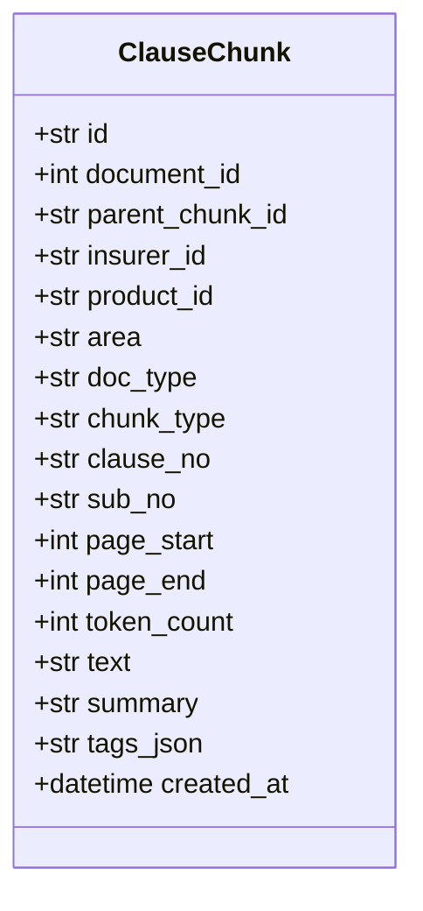

| 속성 | 무엇이고 왜 있나 |
|---|---|
| `id` | 청크 id. 기본 키. 인용과 그래프 노드가 이 값으로 가리킨다 |
| `document_id` | 약관 문서. 외래 키 → `documents` |
| `parent_chunk_id` | 상위 청크(조 → 항)를 가리키는 외래 키 → `clause_chunks`. 지금은 모든 행이 비어 있고, 상하 관계는 `clause_no`로 잇는다 |
| `insurer_id` | 보험사 코드 복사본. 조인 없이 벡터 검색을 거르려고 둔다 |
| `product_id` | 상품 코드 복사본. 검색 필터용 |
| `area` | 영역 복사본. 검색 필터용 |
| `doc_type` | 문서 유형 복사본. 검색 필터용 |
| `chunk_type` | 종류: `article`(조)·`paragraph`(항)·`item`(호)·`table`(표)·`annex`(별표)·`other` |
| `clause_no` | 조 번호. 인용 표기에 쓴다 |
| `sub_no` | 하위 번호(항·호). 비어도 된다 |
| `page_start` | 시작 페이지. 원본 캡처할 페이지를 정한다 |
| `page_end` | 끝 페이지 |
| `token_count` | 토큰 수 |
| `text` | 원문. 인용은 이 원문을 그대로 싣는다 |
| `summary` | 요약. 비어도 된다 |
| `tags_json` | 태그. 이름과 달리 JSON이 아니라 쉼표로 이은 문자열이다(5장) |
| `created_at` | 적재 시각 |

임베딩 열 `embedding vector(4096)`은 ORM 밖에 있다. 마이그레이션이 만들고 [[#VectorStoreAdapter]]의 pgvector 구현이 SQL로 읽고 쓴다. 도메인 개념 [[INS-DOM-004#Section]](구간)은 클래스도 열도 없다(5장).

### 2.2 사용자와 기록

#### User 사용자

테이블: [[INS-DOM-006#users]] · 도메인: [[INS-DOM-004#User]]

`app/domains/users/models.py`. 로그인한 사용자다. 로그인하지 않은 사람은 이 클래스 없이 대화한다.

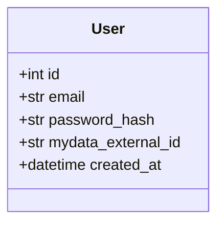

| 속성 | 무엇이고 왜 있나 |
|---|---|
| `id` | 일련번호. 기본 키. JWT의 주체(`sub`)다 |
| `email` | 이메일. 유일하다. 시연 계정은 합성 이메일을 쓴다 |
| `password_hash` | 비밀번호 해시 |
| `mydata_external_id` | 외부 데이터 연결 키. 마이데이터·진료내역 어댑터에 넘긴다. 시연 계정만 채워져 있다 |
| `created_at` | 가입 시각 |

#### AuditLog 감사 기록

테이블: [[INS-DOM-006#audit_log]] · 도메인: [[INS-DOM-004#AuditLog]]

`app/shared/audit/models.py`. 판정 요청 한 번의 기록이다. 대화와 달리 남는 유일한 기록이다.

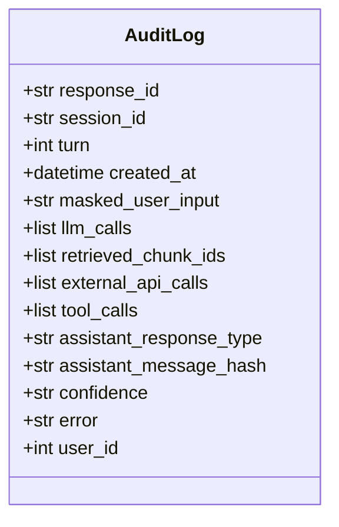

| 속성 | 무엇이고 왜 있나 |
|---|---|
| `response_id` | 응답 id. 기본 키 |
| `session_id` | 세션 id. 세션이 사라진 뒤에도 남는다 |
| `turn` | 몇 번째 사용자 턴인지 |
| `created_at` | 기록 시각 |
| `masked_user_input` | 개인정보를 가린 사용자 입력 |
| `llm_calls` | LLM 호출별 모델·토큰·지연(JSON). ReAct를 켤 때만 찬다 |
| `retrieved_chunk_ids` | 판정·설명 답이 인용한 청크 id(JSON) |
| `external_api_calls` | 외부 API 호출(JSON). ReAct를 켤 때만 찬다 |
| `tool_calls` | 도구 호출(JSON). ReAct를 켤 때만 찬다 |
| `assistant_response_type` | 응답 종류(`ask`·`assessment`·`answer`·`comparison`) |
| `assistant_message_hash` | 응답 본문의 해시. 본문은 남기지 않는다 |
| `confidence` | 판정 확신(`partial`·`full`) |
| `error` | 실패 사유(개인정보를 가린 것) |
| `user_id` | 로그인 사용자. 외래 키 → `users`. 비로그인이면 비어 있다 |

### 2.3 대화

#### Session 대화 세션

`app/domains/sessions/schemas.py`. 한 번의 상담이다. 테이블이 없고 백엔드 프로세스 메모리([[#SessionStore]])에만 있다. 도메인 개념은 [[INS-DOM-004#Session]]이다.

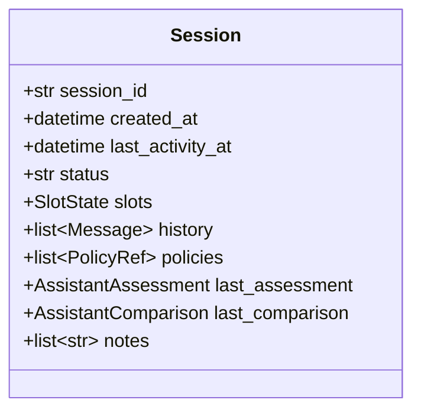

| 속성 | 무엇이고 왜 있나 |
|---|---|
| `session_id` | 세션 id. 화면이 이 값으로 세션을 가리킨다 |
| `created_at` | 만든 시각 |
| `last_activity_at` | 마지막 활동 시각. 30분이 지나면 만료다 |
| `status` | 상태: `gathering`(정보 수집)·`analyzing`(분석 중)·`answered`(답변 완료)·`closed` |
| `slots` | 모인 대화 정보([[#SlotState]]) |
| `history` | 대화 턴([[#Message]]) |
| `policies` | 판정 대상 보험([[#PolicyRef]]). 둘 이상이면 비교한다 |
| `last_assessment` | 마지막 판정 답. 청구 준비 요약이 읽는다 |
| `last_comparison` | 마지막 비교 답 |
| `notes` | 대화 메모. 추출 LLM이 남긴 맥락을 다음 턴에 넘긴다 |

사용자를 담지 않는다. 세션 id를 아는 요청은 누구나 이 세션을 읽고 쓴다([[INS-API-002]] 5장). 첨부 서류는 세션이 들고 있지 않고 [[#AttachmentMeta]]가 `session_id`로 가리킨다.

#### Message 메시지

`app/domains/sessions/schemas.py`. 대화의 한 턴이다. 도메인 개념은 [[INS-DOM-004#Message]]이다.

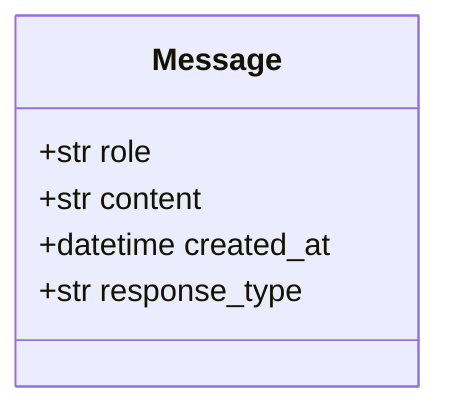

어시스턴트 턴은 응답 전체가 아니라 요약 문장만 `content`에 담는다. `response_type`(`ask`·`assessment`·`answer`·`comparison`)으로 되묻기 횟수를 센다.

#### SlotState 대화 정보

`app/domains/sessions/schemas.py`. 대화에서 모은 청구 사실이다. 비어 있는 칸(`None`)이 곧 되물을 거리다. 모르는 필드를 받지 않는다(`extra=forbid`). 도메인 개념은 [[INS-DOM-004#SlotState]]이다.

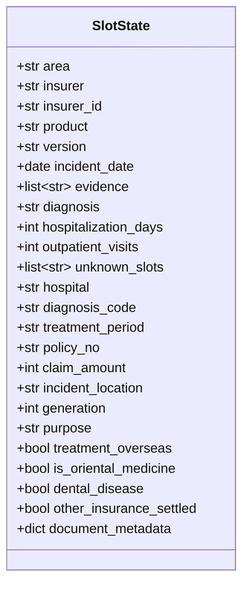

| 속성 | 무엇이고 왜 있나 |
|---|---|
| `area` | 영역. 실손(`accident_disease`)만 받는다 |
| `insurer` | 보험사 이름(사용자가 말한 그대로) |
| `insurer_id` | 보험사 코드. 마이데이터가 채우면 검색이 이름 → 코드 변환 없이 이 값으로 거른다 |
| `product` | 상품 이름 |
| `version` | 약관 버전 |
| `incident_date` | 사고·발병일. 모호한 상대 표현은 비워 두고 되묻는다 |
| `evidence` | 증빙 서류 이름(예: 진단서) |
| `diagnosis` | 진단명 |
| `hospitalization_days` | 입원 일수(0 이상) |
| `outpatient_visits` | 통원 횟수(0 이상) |
| `unknown_slots` | 사용자가 모른다고 한 칸. 되물을 거리에서 뺀다 |
| `hospital` | 의료기관 이름 |
| `diagnosis_code` | 진단 코드(예: S82.5) |
| `treatment_period` | 치료 기간 |
| `policy_no` | 증권 번호 |
| `claim_amount` | 청구 금액(원) |
| `incident_location` | 사고 장소 |
| `generation` | 실손 세대(1~4). 마이데이터 미리 채우기가 넣는다 |
| `purpose` | 청구 목적(치료·미용·예방·임신·자해·범죄/전쟁). 면책 판정의 핵심이다. 비면 치료로 본다 |
| `treatment_overseas` | 해외 의료기관 치료 |
| `is_oriental_medicine` | 한방 치료 |
| `dental_disease` | 치과 질병(상해 아님) |
| `other_insurance_settled` | 자동차보험·산재보험으로 처리된 부분이 있음 |
| `document_metadata` | 판정에 안 쓰는 서류 메타(발급일 등). 화면 확인 카드에만 보인다 |

#### PolicyRef 판정 대상 보험

`app/domains/sessions/schemas.py`. 가입 보험 중 판정할 실손 하나다. 마이데이터에서 와서 대화 정보 미리 채우기로 들어온다. 도메인 개념은 [[INS-DOM-004#PolicyRef]]이다.

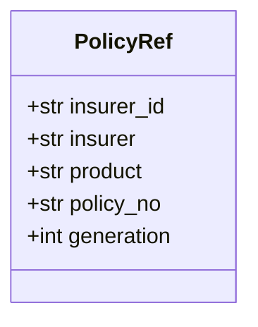

`generation`은 가입일로 정한 실손 세대(1~4)다. 비면 4세대로 본다. 비교 결과의 추천은 `policy_no`로 가리킨다.

#### TreatmentCard 진료 기록

`app/infrastructure/external/health_data/mapper.py`. 건강보험 진료내역 한 건을 화면 카드 모양으로 옮긴 것이다(TypedDict). 도메인 개념은 [[INS-DOM-004#TreatmentCard]]이다.

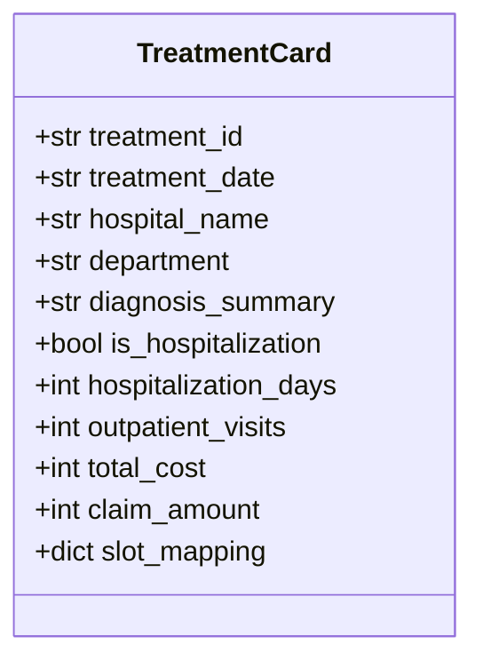

`claim_amount`는 본인 부담 금액이다. `slot_mapping`은 이 진료를 고르면 대화 정보에 채울 값으로 만들었지만 지금은 쓰이지 않는다. 고른 진료는 화면이 설명 문장으로 바꿔 대화에 보낸다.

#### AttachmentMeta 첨부 서류

`app/domains/attachments/schemas.py`. 올린 서류 사진의 메타다. 파일은 디스크(`data/uploads/<세션 id>/`)에 두고 24시간 뒤 지운다. 도메인 개념은 [[INS-DOM-004#AttachmentMeta]]이다.

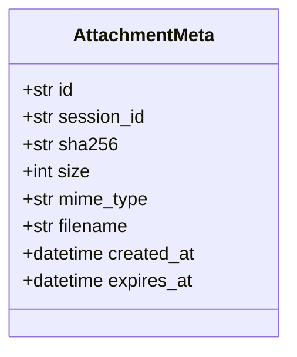

`mime_type`은 JPEG·PNG·WebP만, `size`는 10MB까지 받는다. `expires_at`(올린 뒤 24시간)이 지나면 청소 작업이 파일을 지운다.

### 2.4 판정

#### ClaimFacts 청구 사실

`app/domains/coverage/schemas.py`. 결정론 판정의 입력이다. 대화 정보에서 만든다([[#CoverageEngine]]). 도메인 개념은 [[INS-DOM-004#ClaimFacts]]이다.

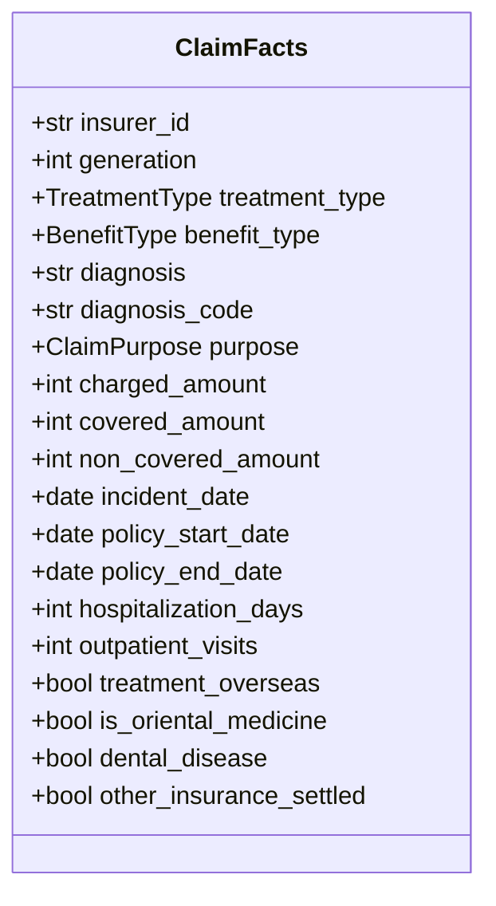

| 속성 | 무엇이고 왜 있나 |
|---|---|
| `insurer_id` | 보험사 코드 |
| `generation` | 실손 세대. 비면 4세대로 보고 `needs_generation`을 켠다 |
| `treatment_type` | 입원·통원·수술·처방. 지금은 입원 일수·통원 횟수로 입원·통원만 추론한다 |
| `benefit_type` | 급여·비급여. 지금은 채우는 곳이 없다(5장) |
| `diagnosis` | 진단명 |
| `diagnosis_code` | 진단 코드 |
| `purpose` | 청구 목적. 기본은 치료 |
| `charged_amount` | 총 본인 부담 의료비. 대화 정보의 청구 금액에서 온다 |
| `covered_amount` | 급여 부분 금액. 지금은 채우는 곳이 없다(5장) |
| `non_covered_amount` | 비급여 부분 금액. 지금은 채우는 곳이 없다(5장) |
| `incident_date` | 사고·발병일 |
| `policy_start_date` | 계약 시작일. 지금은 채우는 곳이 없다(5장) |
| `policy_end_date` | 계약 만료일. 지금은 채우는 곳이 없다(5장) |
| `hospitalization_days` | 입원 일수 |
| `outpatient_visits` | 통원 횟수 |
| `treatment_overseas` | 해외 치료 |
| `is_oriental_medicine` | 한방 치료 |
| `dental_disease` | 치과 질병 |
| `other_insurance_settled` | 자동차·산재보험 처리분 |

#### RuleHit 규칙 적중

`app/domains/coverage/schemas.py`. 판정 규칙 하나가 맞은 기록이다. 판정 답의 근거가 된다. 도메인 개념은 [[INS-DOM-004#RuleHit]]이다.

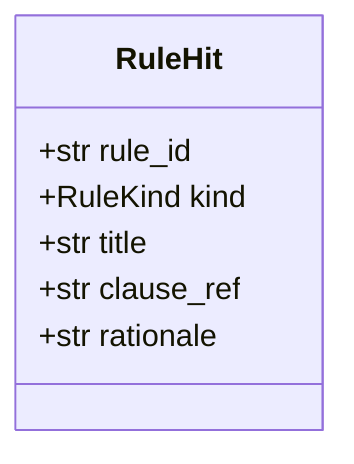

`kind`는 보장기간·면책·부분 보상·보장 근거·자기부담·한도 가운데 하나다. `clause_ref`가 근거 조항 표기, `rationale`이 맞은 이유다.

#### CoverageAssessment 보장 판정

`app/domains/coverage/schemas.py`. 결정론 판정의 결과다. LLM은 이 결과를 설명만 한다. 도메인 개념은 [[INS-DOM-004#CoverageAssessment]]이다.

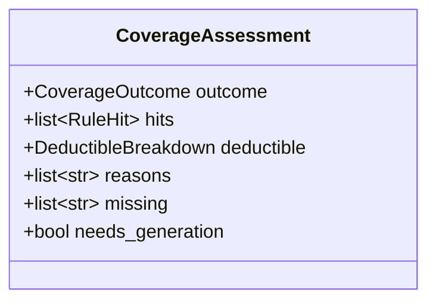

| 속성 | 무엇이고 왜 있나 |
|---|---|
| `outcome` | `covered`(보장)·`excluded`(면책)·`conditional`(조건부)·`insufficient_info`(정보 부족) |
| `hits` | 맞은 규칙([[#RuleHit]]) |
| `deductible` | 자기부담 계산(청구액·공제액·지급 추정·식). 급여·비급여 금액이 없으면 비어 있다 |
| `reasons` | 판정 이유 문장 |
| `missing` | 판정을 바꿀 수 있는 빠진 사실 |
| `needs_generation` | 세대를 몰라 4세대로 가정했는지 |

#### AssistantAssessment 판정 답

`app/domains/sessions/schemas.py`. 청구 가능성 판정 응답이다. 도메인 개념은 [[INS-DOM-004#AssistantAssessment]]이다.

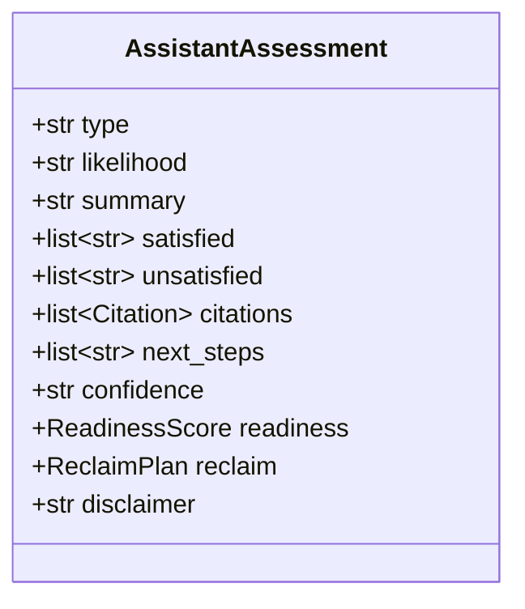

| 속성 | 무엇이고 왜 있나 |
|---|---|
| `type` | `assessment` |
| `likelihood` | 가능성: 높음·중간·낮음 |
| `summary` | 요약. 스트리밍으로 흘려보내는 본문이다 |
| `satisfied` | 충족한 요건 |
| `unsatisfied` | 미충족 요건 |
| `citations` | 근거 조항([[#Citation]]). 검색한 청크에 없는 id는 버리고, 하나도 안 남으면 스키마 위반이다 |
| `next_steps` | 다음 행동 |
| `confidence` | `full`(정보 충분) 또는 `partial`(일부 추정) |
| `readiness` | 준비도([[#ReadinessScore]]) |
| `reclaim` | 재청구 계획([[#ReclaimPlan]]). LLM이 해당 없음으로 내면 비어 있다 |
| `disclaimer` | 면책 문구 |

#### AssistantAsk 되묻기

`app/domains/sessions/schemas.py`. 판정 대신 나가는 질문이다. 도메인 개념은 [[INS-DOM-004#AssistantAsk]]이다.

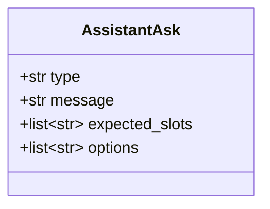

`expected_slots`는 이 질문으로 채우려는 칸이다. `options`는 빠른 답 선택지이고, 비면 화면이 숨긴다.

#### AssistantAnswer 설명 답

`app/domains/sessions/schemas.py`. 판정 뒤 자유 질문에 조항을 인용해 답한 것이다. 도메인 모델의 [[INS-DOM-004#AssistantAnswer]]다.

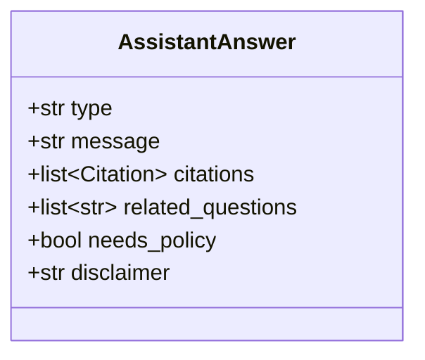

판정 답과 달리 등급이 없다. `message`를 스트리밍으로 흘려보낸다. `needs_policy`는 가입 보험을 알아야 답이 정확해지는지다.

#### Citation 인용

`app/domains/sessions/schemas.py`. 근거 조항 하나다. 원문과 원본 캡처를 함께 싣는다. 도메인 개념은 [[INS-DOM-004#Citation]]이다.

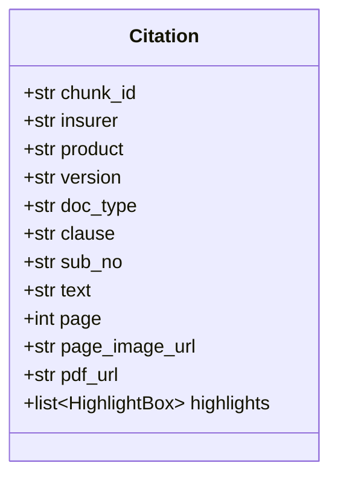

| 속성 | 무엇이고 왜 있나 |
|---|---|
| `chunk_id` | 청크 id([[#ClauseChunk]]) |
| `insurer` | 보험사 이름 |
| `product` | 상품 이름 |
| `version` | 약관 버전 |
| `doc_type` | `summary`·`business`·`terms` |
| `clause` | 조항 표기(예: 제3조) |
| `sub_no` | 하위 번호 |
| `text` | 원문 |
| `page` | 페이지 |
| `page_image_url` | 페이지 이미지 주소(`/static/page_images/…`) |
| `pdf_url` | 원본 PDF 주소(`/static/raw/…`) |
| `highlights` | 하이라이트 상자(x·y·w·h, 페이지 비율) |

#### ReadinessScore 준비도

`app/domains/sessions/schemas.py`. 청구 진행 준비 정도(0~100)다. 지급 확률이 아니다. LLM 없이 계산한다([[#ReadinessCalculator]]). 도메인 개념은 [[INS-DOM-004#ReadinessScore]]이다.

```mermaid
classDiagram
  class ReadinessScore {
    +int score
    +str level
    +list~ReadinessFactor~ factors
    +str caption
  }
```

`level`은 70 이상 `high`, 40 이상 `medium`, 나머지 `low`다. `factors`는 항목별 점수(이름·점수·만점)다. `caption`이 지급 확률이 아니라고 알린다.

#### ReclaimPlan 재청구 계획

`app/domains/sessions/schemas.py`. 가능성이 낮을 때 보완해 다시 청구하는 길이다. 도메인 개념은 [[INS-DOM-004#ReclaimPlan]]이다.

```mermaid
classDiagram
  class ReclaimPlan {
    +bool applicable
    +list~ReclaimItem~ items
    +str note
  }
```

`items`는 부족한 점·할 일·근거로 된 보완 항목이다. LLM이 해당 없음으로 내면 판정 답의 `reclaim`이 비어 있다.

#### AssistantComparison 다중 비교

`app/domains/sessions/schemas.py`. 판정 대상 보험이 둘 이상일 때 보험별 판정을 묶은 응답이다. 도메인 개념은 [[INS-DOM-004#AssistantComparison]]이다.

```mermaid
classDiagram
  class AssistantComparison {
    +str type
    +list~PolicyAssessment~ policies
    +str summary
    +str recommended_policy_no
    +str disclaimer
  }
```

`policies`는 보험별 판정과 자기부담 보기(세대·급여/비급여 비율·통원 최소 공제·지급 추정·안분액)다. `recommended_policy_no`는 보장되는 계약 가운데 비급여 자기부담률이 가장 낮은 계약이다. 보장되는 계약이 없으면 비어 있다.

#### HelpAnswer 도움 답

`app/domains/sessions/schemas.py`. 도움 챗봇의 답이다. 세션과 판정 없이, 보험사를 거르지 않고 약관 전체를 교차 검색해 근거를 단다. 도메인 개념은 [[INS-DOM-004#HelpAnswer]]이다.

```mermaid
classDiagram
  class HelpAnswer {
    +str type
    +str message
    +list~Citation~ citations
    +list~str~ related_questions
    +bool needs_policy
  }
```

사용법 질문이면 `citations`가 비어 있다. `needs_policy`는 가입 보험을 알아야 하는지다.

### 2.5 청구 준비

#### ClaimChecklist 필요 서류 목록

`app/domains/claims/schemas.py`. 영역과 대화 정보로 정하는 필요 서류다. LLM을 부르지 않는다. 도메인 개념은 [[INS-DOM-004#ClaimChecklist]]이다.

```mermaid
classDiagram
  class ClaimChecklist {
    +str area
    +list~ChecklistItem~ items
  }
```

`items`는 서류(id·이름·필수 여부·이유)다. 상태는 필수와 선택 둘뿐이다.

#### ClaimSummary 청구 준비 요약

`app/domains/claims/schemas.py`. 마지막 판정 답과 필요 서류를 한데 모은 것이다. 도메인 개념은 [[INS-DOM-004#ClaimSummary]]이다.

```mermaid
classDiagram
  class ClaimSummary {
    +str insurer
    +str product
    +str area
    +str likelihood
    +str summary
    +list~str~ satisfied
    +list~str~ unsatisfied
    +list~str~ next_steps
    +list~ChecklistItem~ checklist
  }
```

마지막 판정 답의 가능성·요약·충족/미충족·다음 행동에 필요 서류를 더한 것이다. 판정 전이면 가능성과 요약이 비어 있다.

#### ClaimReceipt 접수 확인

`app/domains/claims/schemas.py`. 가정 접수의 결과다. 실제로는 아무 데도 보내지 않는다. 도메인 개념은 [[INS-DOM-004#ClaimReceipt]]이다.

```mermaid
classDiagram
  class ClaimReceipt {
    +str receipt_no
    +str submitted_at
    +str status
    +str insurer
    +int estimated_days
    +str message
  }
```

`receipt_no`는 `CLM-<날짜>-<세션 id 앞 6자>`다. `status`는 `접수완료`, `estimated_days`는 5다. `submitted_at`은 ISO 문자열(`str`)이다.

## 3. 의존 관계

### 3.1 호출 방향

규칙은 `router → service → crud` 한 방향이다. 실선은 규칙에 맞는 호출, 점선은 규칙에서 벗어난 호출이다(3.2).

```mermaid
flowchart LR
    WEB["웹 라우터"]
    CLI["CLI ica"]
    WEB --> SS[SessionService]
    WEB --> CL[ClaimsService]
    WEB --> DS[DocumentsService]
    WEB --> US[UsersService]
    WEB --> AT[AttachmentsService]
    WEB --> AG[AdminGraphService]
    WEB --> TK[TokenService]
    CLI --> SS
    CLI --> IN[IngestionService]
    CLI --> GI[GraphIndexer]
    SS --> ST[SessionStore]
    SS --> SL[SessionLlm]
    SS --> CE[CoverageEngine]
    SS --> PR[ProrationCalculator]
    SS --> RS[RagService]
    SS --> AU[AuditService]
    SL --> RC[ReadinessCalculator]
    SL --> PI[PdfImageService]
    SL --> DS
    RS --> NS[NeuroSymbolicRetriever]
    NS --> VR[VectorRetriever]
    NS --> SG[SymbolicGraphChannel]
    VR --> VS[VectorStoreAdapter]
    IN --> DS
    IN --> CH[ChunksService]
    IN --> EM[EmbeddingService]
    IN --> VS
    IN --> GI
    CH --> OC[OcrAdapter]
    DS --> DCRUD["documents.crud"]
    CH --> CCRUD["chunks.crud"]
    ST --> MEM[("세션 메모리")]
    DCRUD --> PG[("PostgreSQL")]
    CCRUD --> PG
    VS --> PG
    AU --> PG
    SG --> MG[("Memgraph")]
    GI --> MG
    SL --> UP["Upstage"]
    EM --> UP
    OC --> UP
    AT --> DISK[("디스크")]
    PI --> DISK
    WEB -.-> ST
    WEB -.-> SL
    WEB -.-> OC
    WEB -.-> MY[MydataAdapter]
    WEB -.-> HD[HealthDataAdapter]
    WEB -.-> DP[DemoPersonaRegistry]
    US -.-> PG
    DP -.-> PG
    AG -.-> PG
    AG -.-> MG
    NS -.-> PG
    GI -.-> PG
```

- 도메인 사이 호출은 서비스끼리만 한다. 예를 들어 [[#SessionLlm]]은 원본 경로를 [[#DocumentsService]]에서 받고, [[#IngestionService]]는 documents·chunks의 crud 대신 두 서비스를 부른다
- 서비스는 HTTP를 모른다. 파이썬 예외를 던지고, 라우터가 에러 코드로 바꾼다
- LLM·임베딩·문서 파싱은 모두 Upstage다. 추론 클라이언트는 OpenAI SDK에 Upstage 주소를 넣은 것이다(`app/infrastructure/llm/client.py`). 해외 모델을 부르는 경로는 없다

### 3.2 규칙에서 벗어난 호출

| 호출 | 파일 | 무엇이 다른가 |
|---|---|---|
| 서류 업로드 라우터 → [[#SessionStore]] · [[#OcrAdapter]] · [[#SessionLlm]] · 개인정보 가림 | `app/domains/attachments/router.py` | 저장 → 문자 인식 → 가림 → 분류 → 항목 추출 절차가 서비스가 아니라 라우터에 있다. 세션 서비스를 건너뛰고 저장소를 직접 연다 |
| 인증 라우터 → `session_scope` · [[#DemoPersonaRegistry]] · [[#MydataAdapter]] | `app/domains/auth/router.py` | 서비스가 없다. 트랜잭션 경계(`session_scope`)가 라우터에 있다 |
| 진료내역 라우터 → [[#HealthDataAdapter]] | `app/infrastructure/external/health_data/router.py` | 라우터가 도메인 밖에 있고 어댑터를 직접 부른다 |
| [[#UsersService]] · [[#DemoPersonaRegistry]] → DB | `app/domains/users/service.py` · `app/domains/auth/personas.py` | crud 없이 서비스가 쿼리를 쓴다 |
| [[#AdminGraphService]] → PostgreSQL · Memgraph | `app/domains/admin/service.py` | crud 없이 SQL 문자열과 그래프 드라이버를 서비스가 직접 쓴다 |
| [[#NeuroSymbolicRetriever]] · [[#GraphIndexer]] → documents·chunks 테이블 | `app/domains/rag/neurosymbolic.py` · `indexer.py` | 다른 도메인의 테이블을 그 도메인의 서비스를 거치지 않고 읽는다 |
| 세션 라우터의 응답 모델 | `app/domains/sessions/router.py` | `SessionCreateResponse`·`SessionStateResponse`·`HelpRequest`·`HelpResponse`가 `schemas.py`가 아니라 라우터 파일에 있다 |
| 관리자 화면 → `fetch` | `frontend/src/pages/admin/AdminGraphPage.tsx` | `pages → api` 규칙을 건너뛴다. 관리자 API 호출 넷이 화면 파일에 있다 |

## 4. 설계 클래스

모듈 함수 묶음은 `<<module>>`, 포트는 `<<interface>>`로 표시했다. 표시가 없는 것은 실제 파이썬 클래스다. 아래 그림은 테이블이 있는 엔티티(속성은 2장과 같다)와 그것을 읽고 쓰는 설계 클래스다. 대화·판정 쪽 호출 방향은 3.1에 있다. 클래스마다 그림에는 메서드 이름만 두고, 시그니처는 표에 적는다.

```mermaid
classDiagram
  class Insurer {
    +str id
    +str name
    +str homepage_url
    +datetime created_at
  }
  class Product {
    +str id
    +str insurer_id
    +str area
    +str name
    +datetime created_at
  }
  class ProductVersion {
    +int id
    +str product_id
    +date valid_from
    +date valid_to
    +str version_label
    +bool is_active
    +datetime created_at
  }
  class Document {
    +int id
    +int version_id
    +str doc_type
    +str file_path
    +str file_sha256
    +int page_count
    +str parser_version
    +datetime extracted_at
  }
  class ClauseChunk {
    +str id
    +int document_id
    +str parent_chunk_id
    +str insurer_id
    +str product_id
    +str area
    +str doc_type
    +str chunk_type
    +str clause_no
    +str sub_no
    +int page_start
    +int page_end
    +int token_count
    +str text
    +str summary
    +str tags_json
    +datetime created_at
  }
  class User {
    +int id
    +str email
    +str password_hash
    +str mydata_external_id
    +datetime created_at
  }
  class AuditLog {
    +str response_id
    +str session_id
    +int turn
    +datetime created_at
    +str masked_user_input
    +list llm_calls
    +list retrieved_chunk_ids
    +list external_api_calls
    +list tool_calls
    +str assistant_response_type
    +str assistant_message_hash
    +str confidence
    +str error
    +int user_id
  }
  class IngestionService
  class DocumentsService
  class ChunksService
  class VectorStoreAdapter
  class GraphIndexer
  class UsersService
  class AuditService
  IngestionService --> DocumentsService
  IngestionService --> ChunksService
  IngestionService --> VectorStoreAdapter
  IngestionService --> GraphIndexer
  DocumentsService --> Insurer
  DocumentsService --> Product
  DocumentsService --> ProductVersion
  DocumentsService --> Document
  ChunksService --> ClauseChunk
  VectorStoreAdapter --> ClauseChunk : embedding 열
  GraphIndexer ..> ClauseChunk : Memgraph로 옮김
  UsersService --> User
  AuditService --> AuditLog
  Insurer "1" --> "*" Product
  Product "1" --> "*" ProductVersion
  ProductVersion "1" --> "*" Document
  Document "1" --> "*" ClauseChunk
  User "0..1" <-- "*" AuditLog : user_id
```

### 4.1 대화와 판정

#### SessionService 세션 서비스

`app/domains/sessions/service.py`

```mermaid
classDiagram
  class SessionService {
    <<module>>
    +create_session()
    +post_message()
    +seed_slots()
    +get_session()
    +close_session()
    +answer_help()
  }
```

| 메서드 | 부르는 곳 | 유스케이스 | 던지는 에러 |
|---|---|---|---|
| `create_session(initial_message, user_id) -> tuple[Session, Optional[SessionResponse]]` | [[INS-API-002#POST/api/v1/sessions]] · `ica chat` | [[INS-UC-002#UC-H1]] | `LLMError`·`SchemaViolationError` → `LLM_UNAVAILABLE` |
| `post_message(session_id, text, user_id, on_delta) -> SessionResponse` | [[INS-API-002#POST/api/v1/sessions/{session_id}/messages/stream]] · [[INS-API-002#POST/api/v1/sessions/{session_id}/messages]] · `ica chat` | [[INS-UC-002#UC-H1]] · [[INS-UC-002#UC-H3]] · [[INS-UC-002#UC-H5]] · [[INS-UC-002#UC-S1]] | `SessionNotFoundError` → `SESSION_NOT_FOUND` · `LLMError`·`SchemaViolationError` → `LLM_UNAVAILABLE` · 그 밖의 예외 → `INTERNAL`(스트림만) |
| `seed_slots(session_id, updates) -> SlotSeedResponse` | [[INS-API-002#POST/api/v1/sessions/{session_id}/slots]] | [[INS-UC-002#UC-H4]] · [[INS-UC-002#UC-S7]] | `SessionNotFoundError` → `SESSION_NOT_FOUND` |
| `get_session(session_id) -> Session` | [[INS-API-002#GET/api/v1/sessions/{session_id}]] · [[INS-API-002#GET/api/v1/sessions/{session_id}/summary]] · [[INS-API-002#GET/api/v1/sessions/{session_id}/checklist]] · [[INS-API-002#POST/api/v1/sessions/{session_id}/submit]] | [[INS-UC-002#UC-H7]] | `SessionNotFoundError` → `SESSION_NOT_FOUND` |
| `close_session(session_id) -> bool` | [[INS-API-002#DELETE/api/v1/sessions/{session_id}]] | [[INS-UC-002#UC-S9]] | 없음. 없는 세션도 204다 |
| `answer_help(text) -> HelpAnswer` | [[INS-API-002#POST/api/v1/sessions/help]] | [[INS-UC-002#UC-H8]] | `LLMError` → `LLM_UNAVAILABLE`. 검색 실패는 삼키고 근거 없이 답한다 |

규칙

- `post_message`는 한 턴을 이 순서로 처리한다. ① 감사 기록 시작 ② 사용자 메시지 기록 ③ 인사·잡담이고 모인 정보가 없으면 LLM 없이 환영 ④ 의도 분류 — 일반 질문이면 조항을 인용한 설명 답([[#AssistantAnswer]]), 범위 밖이면 안내 되묻기 ⑤ 사실 추출·병합 ⑥ [[#CoverageEngine]] 판정 ⑦ 빠진 사실이 있으면 되묻기 ⑧ 판정 대상 보험이 둘 이상이면 보험별로 판정해 비교 ⑨ 조항 검색 — 없으면 되묻기 ⑩ 판정 답 생성
- 되묻기는 한 번까지다. 이미 한 번 되물었거나, 모른다고 한 칸이 둘 이상이거나, 지금 답해 달라고 하거나, ⑥의 판정이 면책·조건부면 빠진 사실이 있어도 부분 판정(`confidence=partial`)으로 간다
- 모든 분기가 응답을 돌려주기 전에 감사 기록을 마친다([[#AuditService]]). 예외가 나면 실패로 남기고 다시 던진다
- `RAG_REACT`를 켜면 ⑨를 LangGraph 에이전트가 맡는다(기본 꺼짐). 에이전트가 실패하면 단순 검색으로 돌아간다
- `seed_slots`는 LLM을 거치지 않는다. 가입 현황에서 고른 보험(`policies`·보험사 코드·증권 번호 등)을 대화 정보에 그대로 합친다

#### SessionStore 세션 저장소

`app/domains/sessions/store.py`

```mermaid
classDiagram
  class SessionStore {
    +create()
    +get()
    +touch()
    +delete()
    +count()
    +purge_expired()
  }
```

| 메서드 | 부르는 곳 | 유스케이스 | 던지는 에러 |
|---|---|---|---|
| `create() -> Session` | [[#SessionService]] | [[INS-UC-002#UC-S9]] | 없음 |
| `get(session_id) -> Optional[Session]` | [[#SessionService]] · 서류 업로드 라우터([[INS-API-002#POST/api/v1/sessions/{session_id}/documents]]) | [[INS-UC-002#UC-S9]] | 없음. 없거나 만료면 `None` |
| `touch(session, status) -> None` | [[#SessionService]] | [[INS-UC-002#UC-S9]] | 없음 |
| `delete(session_id) -> bool` | [[#SessionService]] | [[INS-UC-002#UC-S9]] | 없음 |
| `count() -> int` · `purge_expired() -> int` | 부르는 곳 없음(테스트만) | — | 없음 |

규칙

- 프로세스 메모리의 사전 하나다. 기본형의 crud 자리다
- 만료는 읽을 때 따진다. `get`이 마지막 활동에서 30분(`SESSION_TTL_SECONDS`)이 지난 세션을 지우고 `None`을 준다. 따로 도는 청소는 없다
- 잠금이 없다. uvicorn 워커 하나를 전제한다. 워커나 컨테이너를 늘리면 세션이 워커마다 갈린다

#### SessionLlm 대화 LLM

`app/domains/sessions/llm.py`

```mermaid
classDiagram
  class SessionLlm {
    <<module>>
    +classify_intent()
    +extract_slots()
    +next_question()
    +generate_assessment()
    +generate_explanation()
    +generate_help_answer()
    +classify_document()
    +extract_slots_from_document()
  }
```

| 메서드 | 부르는 곳 | 유스케이스 | 던지는 에러 |
|---|---|---|---|
| `classify_intent(text, slots, answered, last_assistant) -> str` | [[#SessionService]] | [[INS-UC-002#UC-S1]] | 없음. 실패하면 판정 흐름(`claim_diagnosis`)으로 둔다 |
| `extract_slots(history, user_msg, current_slots) -> dict` | [[#SessionService]] | [[INS-UC-002#UC-S1]] | `LLMError` · `SchemaViolationError` |
| `next_question(slots, missing) -> AssistantAsk` | [[#SessionService]] | [[INS-UC-002#UC-H1]] | `LLMError` · `SchemaViolationError` |
| `generate_assessment(slots, chunks, coverage, notes, on_delta) -> AssistantAssessment` | [[#SessionService]] | [[INS-UC-002#UC-S4]] · [[INS-UC-002#UC-S6]] | `LLMError`(청크 없음·호출 실패) · `SchemaViolationError`(인용이 모두 환각·형식 위반) |
| `generate_explanation(question, chunks, history, notes, on_delta) -> AssistantAnswer` | [[#SessionService]] | [[INS-UC-002#UC-H3]] · [[INS-UC-002#UC-S4]] | `LLMError` · `SchemaViolationError` |
| `generate_help_answer(question, chunks) -> HelpAnswer` | [[#SessionService]] | [[INS-UC-002#UC-H8]] | `LLMError`(폴백 호출까지 실패) |
| `classify_document(text) -> dict` | 서류 업로드 라우터 | [[INS-UC-002#UC-S8]] | `LLMError` — 라우터가 삼키고 빈 결과로 둔다. 연결 오류는 감싸지 않아 500이 된다 |
| `extract_slots_from_document(text, doc_type) -> dict` | 서류 업로드 라우터 | [[INS-UC-002#UC-S8]] | `LLMError` — 라우터가 삼키고 빈 결과로 둔다. 연결 오류는 감싸지 않아 500이 된다 |

규칙

- 프롬프트는 `prompts/v1/*.md`, 모델은 Solar다. 응답은 JSON 스키마로 검증하고, 틀리면 `SchemaViolationError`다(라우터는 이것도 `LLM_UNAVAILABLE`로 바꾼다)
- 형식이 틀렸을 때: 판정 답과 설명 답은 재시도 지시를 붙여 한 번 더 부르고(스트리밍 없이), 그래도 틀리면 `SchemaViolationError`를 던진다. 도움 답은 인용 없는 답으로 한 번 더 부른다. 사실 추출·되묻기·분류는 다시 요청하지 않는다
- 연결·한도·시간 초과·서버 오류일 때: SDK가 두 번까지 다시 보낸다(`LLM_MAX_RETRIES`). 도구 호출로 부르는 다섯(사실 추출·되묻기·의도 분류·서류 분류·서류 항목 추출)은 그 위에서 호출을 세 번까지 되풀이한다. 판정·설명·도움 답의 구조화 호출에는 이 되풀이가 없다(5장)
- 판정 답은 [[#CoverageEngine]]의 결과를 받아 설명한다. 인용은 이번 턴에 검색한 청크 안에서만 고른다. 밖의 id는 버린다
- 인용을 만들 때 원본 경로를 [[#DocumentsService]]에서 받아 페이지 이미지와 하이라이트를 만든다([[#PdfImageService]])
- 판정 답을 만든 뒤 준비도를 계산해 붙인다([[#ReadinessCalculator]])
- `on_delta`를 주면 본문(판정 요약·설명 답)을 만드는 대로 흘려보낸다. 스트리밍 API가 이것을 SSE `delta`로 바꾼다

#### ReadinessCalculator 준비도 계산

`app/domains/sessions/readiness.py`

```mermaid
classDiagram
  class ReadinessCalculator {
    <<module>>
    +compute_readiness()
  }
```

| 메서드 | 부르는 곳 | 유스케이스 | 던지는 에러 |
|---|---|---|---|
| `compute_readiness(likelihood, satisfied, unsatisfied, confidence) -> ReadinessScore` | [[#SessionLlm]] `generate_assessment` | [[INS-UC-002#UC-S5]] | 없음 |

규칙

- 점수 = 등급(높음 55·중간 35·낮음 15) + 요건 충족 비율(최대 30, 충족·미충족 목록이 비면 15) + 정보 완성도(`full` 15·`partial` 5). 70 이상이 high, 40 이상이 medium이다
- LLM을 부르지 않는다. 같은 입력이면 같은 점수다

#### CoverageEngine 보장 판정 엔진

`app/domains/coverage/engine.py` · `rules.py` · `facts.py`

```mermaid
classDiagram
  class CoverageEngine {
    <<module>>
    +build_facts_from_slots()
    +evaluate()
    +rules_for()
    +compute_deductible()
  }
```

| 메서드 | 부르는 곳 | 유스케이스 | 던지는 에러 |
|---|---|---|---|
| `build_facts_from_slots(slots, generation, purpose) -> ClaimFacts` | [[#SessionService]] | [[INS-UC-002#UC-S3]] | 없음 |
| `evaluate(facts) -> CoverageAssessment` | [[#SessionService]](단일 판정·보험별 비교) | [[INS-UC-002#UC-S3]] · [[INS-UC-002#UC-H5]] | 없음 |
| `rules_for(facts) -> list[CoverageRule]` | `evaluate` | [[INS-UC-002#UC-S3]] | 없음 |
| `compute_deductible(facts) -> Optional[DeductibleBreakdown]` | `evaluate` | [[INS-UC-002#UC-S3]] | 없음 |

규칙

- 결정론이다. LLM도 DB도 부르지 않는다. 같은 사실이면 같은 판정이다
- 규칙은 11개다. 보장기간 1(보장기간 밖 사고), 면책 5(미용·예방·임신·자해·범죄/전쟁), 부분 보상 4(한방·해외·치과 질병·자동차/산재 처리분), 보장 근거 1(치료 목적)이다
- 보는 순서: 보장기간이 맞으면 면책(`excluded`) → 면책 규칙이 맞으면 `excluded` → 부분 보상이 맞으면 `conditional` → 보장 근거가 맞으면 `covered` → 판정에 필요한 사실이 없으면 `insufficient_info` → 나머지는 `conditional`
- 규칙마다 적용 범위(영역·세대·보험사·적용 기간)와 근거 조항 표기를 가진다(`CoverageRule`·`RuleScope`). `rules_for`가 범위로 먼저 거른다
- 자기부담률은 세대별 표(`DEDUCTIBLE_PARAMS`)다. 1세대 급여 0%·비급여 0%·통원 최소 5,000원, 2·3세대 10%·20%·10,000원, 4세대 20%·30%·30,000원. 급여·비급여 금액이 둘 다 없으면 계산하지 않는다
- [[#ClaimFacts]]의 계약 시작·만료일과 급여·비급여 금액을 채우는 곳이 없다. 그래서 대화 흐름에서는 보장기간 규칙이 맞을 수 없고 자기부담도 계산되지 않는다(5장)

#### ProrationCalculator 비례 안분

`app/domains/coverage/proration.py`

```mermaid
classDiagram
  class ProrationCalculator {
    <<module>>
    +compute()
  }
```

| 메서드 | 부르는 곳 | 유스케이스 | 던지는 에러 |
|---|---|---|---|
| `compute(items) -> ProrationResult` | [[#SessionService]](판정 대상 보험이 둘 이상일 때) | [[INS-UC-002#UC-H5]] | 없음 |

규칙

- 보험별 판정 가운데 보장(`covered`)이고 지급 추정액이 있는 계약만 안분한다. 그런 계약이 둘 이상이면 실제 지급 총액을 가장 큰 추정액으로 보고, 계약마다 자기 추정액 비율로 나눈다
- 세대를 모르면 4세대로 본다
- 추천(먼저 청구할 보험)은 안분과 따로 정한다. 보장되는 계약 가운데 비급여 자기부담률이 가장 낮은 계약이다. 금액이 없어도 나온다. 요약 문장과 함께 [[#AssistantComparison]]으로 나간다
- 지금은 지급 추정액이 늘 비어 있어 안분액이 나오지 않는다. [[#CoverageEngine]]이 자기부담을 계산하지 못하기 때문이다(5장)

#### PdfImageService 원본 캡처

`app/infrastructure/pdfimage/service.py` · `highlight.py`

```mermaid
classDiagram
  class PdfImageService {
    <<module>>
    +render_page()
    +page_image_url()
    +pdf_url()
    +find_highlights()
  }
```

| 메서드 | 부르는 곳 | 유스케이스 | 던지는 에러 |
|---|---|---|---|
| `render_page(document_id, page_no, file_path, scale) -> Path` | [[#SessionLlm]](인용 만들 때) | [[INS-UC-002#UC-S6]] | `FileNotFoundError`·`ValueError`(원본 없음·페이지 범위 밖) — 부르는 쪽이 삼키고 이미지 없이 인용한다 |
| `page_image_url(document_id, page_no) -> str` | [[#SessionLlm]] | [[INS-UC-002#UC-H2]] | 없음 |
| `pdf_url(file_path) -> Optional[str]` | [[#SessionLlm]] | [[INS-UC-002#UC-H2]] | 없음 |
| `find_highlights(pdf_path, page_no, text, clause_no) -> list` | [[#SessionLlm]] | [[INS-UC-002#UC-S6]] | 없음. 못 찾으면 빈 목록 |

규칙

- 페이지 이미지는 `data/page_images/`에 한 번 그리고 다시 쓴다. 화면은 정적 경로로 받는다: 이미지 [[INS-API-002#GET/static/page_images/{file}]], 원본 PDF [[INS-API-002#GET/static/raw/{path}]]
- 하이라이트는 인용 원문과 페이지 글자를 맞춰 이어진 블록의 상자를 계산한다. 상자 좌표는 페이지 크기에 대한 비율(0~1)이다

### 4.2 조항 검색

#### RagService 검색 서비스

`app/domains/rag/service.py`

```mermaid
classDiagram
  class RagService {
    <<module>>
    +retrieve()
    +retrieve_freeform()
    +run_agent()
    +clear_caches()
  }
```

| 메서드 | 부르는 곳 | 유스케이스 | 던지는 에러 |
|---|---|---|---|
| `retrieve(slots, top_k) -> list[dict]` | [[#SessionService]] · `ica eval-retrieval` | [[INS-UC-002#UC-S2]] · [[INS-UC-002#UC-G2]] | 없음. 실패하면 빈 목록 |
| `retrieve_freeform(text, top_k, insurer_id) -> list[dict]` | [[#SessionService]](설명 답·도움 답) | [[INS-UC-002#UC-S2]] · [[INS-UC-002#UC-H8]] | 없음. 실패하면 빈 목록 |
| `run_agent(slots, user_message) -> AgentResult` | [[#SessionService]](`RAG_REACT`를 켤 때만) | [[INS-UC-002#UC-S2]] | 예외를 그대로 던진다. 세션 서비스가 받아 단순 검색으로 돌아간다 |
| `clear_caches() -> None` | 테스트 | — | 없음 |

규칙

- 검색기 [[#NeuroSymbolicRetriever]]를 프로세스에 하나만 만든다
- 서킷 브레이커로 감싼다. 실패하면 빈 목록을 준다. 그러면 세션 서비스가 판정 대신 되묻기를 보낸다
- `RAG_RERANK`를 켜면 Solar로 순위를 다시 매긴다(기본 꺼짐)
- `retrieve_freeform`에 보험사를 주면 그 보험사 약관만 찾는다. 안 주면(익명·도움 챗봇) 다섯 보험사를 교차 검색한다

#### NeuroSymbolicRetriever 뉴로심볼릭 검색기

`app/domains/rag/neurosymbolic.py`

```mermaid
classDiagram
  class NeuroSymbolicRetriever {
    +retrieve()
    +retrieve_freeform()
    +retrieve_fused()
    +health()
  }
```

| 메서드 | 부르는 곳 | 유스케이스 | 던지는 에러 |
|---|---|---|---|
| `retrieve(slots, top_k) -> list[RetrievalResult]` | [[#RagService]] | [[INS-UC-002#UC-S2]] | 없음 |
| `retrieve_freeform(text, top_k, insurer_id) -> list[RetrievalResult]` | [[#RagService]] | [[INS-UC-002#UC-S2]] | 없음 |
| `retrieve_fused(query, insurer_id, filters, top_k) -> list[RetrievalResult]` | 위 둘 | [[INS-UC-002#UC-S2]] | 없음. 심볼릭 채널이 실패하면 뉴럴 결과만 쓴다 |
| `health() -> bool` | 부르는 곳 없음(테스트만) | — | 없음 |

규칙

- `retrieve`는 대화 정보에서 질의 문장과 필터(보험사·영역)를 만들어 `retrieve_fused`로 넘긴다(`_slots.py`)
- 뉴럴([[#VectorRetriever]])과 심볼릭([[#SymbolicGraphChannel]])의 순위를 가중 RRF(k=60)로 합친다. 뉴럴 가중은 1.0, 심볼릭 가중은 `RAG_SYMBOLIC_WEIGHT`(기본 0.02)다
- 뉴럴은 저장소에서 top_k의 두 배를 가져와 1등 점수에 `RAG_SCORE_RATIO`(기본 0.55)를 곱한 값보다 낮은 것을 버린다. 심볼릭은 조항 제목 후보와 뉴럴 결과의 구조 이웃을 더한다
- 심볼릭 후보는 벡터 점수가 없어서 본문과 메타를 PostgreSQL에서 다시 읽는다

#### VectorRetriever 뉴럴 채널

`app/domains/rag/vector.py`

```mermaid
classDiagram
  class VectorRetriever {
    +adapter VectorStoreAdapter
    +retrieve()
    +health()
  }
```

| 메서드 | 부르는 곳 | 유스케이스 | 던지는 에러 |
|---|---|---|---|
| `adapter -> VectorStoreAdapter`(속성) | [[#NeuroSymbolicRetriever]] | [[INS-UC-002#UC-S2]] | 없음 |
| `retrieve(slots, top_k) -> list[RetrievalResult]` | 부르는 곳 없음(테스트만) | — | `StorageError` |
| `health() -> bool` | [[#NeuroSymbolicRetriever]] | — | 없음 |

규칙

- 저장소는 [[#VectorStoreAdapter]]다. 주입하지 않으면 설정으로 고른다
- 뉴로심볼릭 검색기는 이 클래스의 `retrieve`를 부르지 않는다. `adapter`를 꺼내 `query`를 직접 부른다. 지금은 저장소를 골라 들고 있는 자리만 한다(5장)

#### SymbolicGraphChannel 심볼릭 채널

`app/domains/rag/graph.py`

```mermaid
classDiagram
  class SymbolicGraphChannel {
    +clause_candidates()
    +expand()
    +health()
  }
```

| 메서드 | 부르는 곳 | 유스케이스 | 던지는 에러 |
|---|---|---|---|
| `clause_candidates(query, insurer_id, limit) -> list[dict]` | [[#NeuroSymbolicRetriever]] | [[INS-UC-002#UC-S2]] | 드라이버 예외 — 검색기가 받아 뉴럴만 쓴다 |
| `expand(chunk_ids, limit) -> list[dict]` | [[#NeuroSymbolicRetriever]] | [[INS-UC-002#UC-S2]] | 드라이버 예외 — 같음 |
| `health() -> bool` | 부르는 곳 없음(테스트만) | — | 없음 |

규칙

- Memgraph에 결정론 Cypher만 보낸다. 신경망을 쓰지 않는다
- `clause_candidates`는 질의 낱말이 조항 제목에 몇 개 나오는지로 후보를 고른다
- `expand`는 뉴럴 결과에서 구조 이웃을 따라간다. 본문이 가리키는 별표·붙임(`REFERS_TO`)과, 같은 조의 다른 청크(형제)다. 형제는 `HAS_SUBCLAUSE` 관계를 따라가지 않고 같은 문서·같은 조 번호 속성으로 찾는다

#### VectorStoreAdapter 벡터 저장소 포트

`app/domains/rag/vectorstore.py`

```mermaid
classDiagram
  class VectorStoreAdapter {
    <<interface>>
    +upsert()
    +query()
    +delete_by_document()
    +count()
    +sample_dim()
    +health()
    +reset()
  }
```

| 메서드 | 부르는 곳 | 유스케이스 | 던지는 에러 |
|---|---|---|---|
| `upsert(chunks, embeddings, document_meta) -> None` | [[#IngestionService]] · `ica reindex` | [[INS-UC-002#UC-A2]] | `StorageError` |
| `query(query_text, top_k, filters) -> list[dict]` | [[#VectorRetriever]] | [[INS-UC-002#UC-S2]] | `StorageError` · `EmbeddingError`(질의 임베딩) |
| `delete_by_document(document_id) -> int` | `ica reindex` | [[INS-UC-002#UC-A2]] | `StorageError` |
| `count()` · `sample_dim()` | `ica verify` · `ica list` | [[INS-UC-002#UC-A2]] | 없음 |
| `health() -> bool` | [[#VectorRetriever]] | — | 없음 |
| `reset() -> None` | `ica reindex --reset` | [[INS-UC-002#UC-A2]] | `StorageError` |

규칙

- 구현은 둘이다. `PgVectorAdapter`(운영)는 `clause_chunks.embedding` 열을 SQL로 읽고 쓴다. 인덱스 없이 코사인 거리로 전수 비교한다. `ChromaAdapter`(로컬 폴백)는 search 도메인 함수를 감싼다
- `DATABASE_URL`이 PostgreSQL이면 pgvector를, 아니면 Chroma를 고른다. `VECTOR_STORE`로 강제할 수 있다
- 질의는 `embedding-query`, 문서는 `embedding-passage` 모델로 임베딩한다([[#EmbeddingService]])

#### GraphIndexer 그래프 적재

`app/domains/rag/indexer.py`

```mermaid
classDiagram
  class GraphIndexer {
    <<module>>
    +build_graph()
    +sync_document()
    +graph_counts()
  }
```

| 메서드 | 부르는 곳 | 유스케이스 | 던지는 에러 |
|---|---|---|---|
| `build_graph(rebuild) -> dict` | `ica graph-build` | [[INS-UC-002#UC-A2]] | 드라이버 예외 그대로 |
| `sync_document(document_id) -> dict` | [[#IngestionService]] | [[INS-UC-002#UC-A2]] | 드라이버 예외 — 적재 서비스가 받아 경고만 남긴다 |
| `graph_counts() -> dict` | `ica verify` | [[INS-UC-002#UC-A2]] | 드라이버 예외 |

규칙

- PostgreSQL의 보험사·상품·버전·문서·청크를 Memgraph 노드(`Insurer`·`Product`·`Version`·`Document`·`Clause`·`SubClause`)와 관계(`SELLS`·`HAS_VERSION`·`HAS_DOCUMENT`·`CONTAINS`·`HAS_SUBCLAUSE`·`REFERS_TO`)로 옮긴다
- 멱등이다. `rebuild`면 그래프를 비우고 다시 넣는다
- 그래프 동기화가 실패해도 적재는 성공으로 끝난다. 어긋남은 `ica verify`의 그래프 수 비교로 드러난다

### 4.3 청구 준비

#### ClaimsService 청구 준비 서비스

`app/domains/claims/service.py`

```mermaid
classDiagram
  class ClaimsService {
    <<module>>
    +build_checklist()
    +build_summary()
    +submit_claim()
  }
```

| 메서드 | 부르는 곳 | 유스케이스 | 던지는 에러 |
|---|---|---|---|
| `build_checklist(slots) -> ClaimChecklist` | [[INS-API-002#GET/api/v1/sessions/{session_id}/checklist]] · `build_summary` | [[INS-UC-002#UC-H7]] | 없음 |
| `build_summary(session) -> ClaimSummary` | [[INS-API-002#GET/api/v1/sessions/{session_id}/summary]] | [[INS-UC-002#UC-H7]] | 없음 |
| `submit_claim(session) -> ClaimReceipt` | [[INS-API-002#POST/api/v1/sessions/{session_id}/submit]] | [[INS-UC-002#UC-H7]] | 없음 |

규칙

- LLM도 DB도 부르지 않는다. 영역과 대화 정보에서 결정론으로 만든다
- 세션은 라우터가 [[#SessionService]]의 `get_session`으로 먼저 찾아 넘긴다. 세션이 없으면 거기서 `SESSION_NOT_FOUND`다
- 요약은 세션의 마지막 판정 답을 읽는다. 판정 전이면 가능성·요약이 빈 채로 나간다
- 접수는 가정이다. 아무 데도 보내지 않고 접수 번호를 만들어 돌려준다. 같은 세션을 같은 날 다시 접수하면 같은 번호가 나온다

### 4.4 약관 적재와 데이터

#### IngestionService 적재 서비스

`app/domains/ingestion/service.py`

```mermaid
classDiagram
  class IngestionService {
    <<module>>
    +scan_raw_folder()
    +parse_pdf_path()
    +run_ingest()
  }
```

| 메서드 | 부르는 곳 | 유스케이스 | 던지는 에러 |
|---|---|---|---|
| `scan_raw_folder(raw_root, insurer, area) -> list[PathInfo]` | `ica ingest` · `ica rebuild` | [[INS-UC-002#UC-A2]] | `IngestionError`(경로 규칙 위반) |
| `parse_pdf_path(pdf_path, raw_root) -> PathInfo` | `scan_raw_folder` | [[INS-UC-002#UC-A2]] | `IngestionError` |
| `run_ingest(items, dry_run, force) -> IngestStats` | `ica ingest` · `ica rebuild`(`force`) | [[INS-UC-002#UC-A2]] | 없음. 문서별 실패는 `failed`로 센다 |

규칙

- 약관 경로는 `data/raw/<보험사>/<영역>/<상품>/<버전>/<파일>`이다. 경로에서 보험사·영역·상품·버전을, 파일 이름에서 문서 유형을 읽는다
- 문서 하나를 이 순서로 넣는다. 해시로 이미 있는지 확인(있으면 건너뛰고 `force`면 다시) → [[#ChunksService]] `process_pdf` → [[#DocumentsService]] `register_document` → 청크 교체 → 임베딩([[#EmbeddingService]]) → [[#VectorStoreAdapter]] `upsert` → [[#GraphIndexer]] `sync_document`
- documents·chunks의 crud를 부르지 않고 두 서비스만 부른다

#### DocumentsService 약관 문서 서비스

`app/domains/documents/service.py` · `crud.py`

```mermaid
classDiagram
  class DocumentsService {
    <<module>>
    +list_insurers()
    +list_products()
    +list_versions()
    +count_documents()
    +register_document()
    +find_document_id_by_sha()
    +find_file_path_by_id()
  }
```

| 메서드 | 부르는 곳 | 유스케이스 | 던지는 에러 |
|---|---|---|---|
| `list_insurers(session) -> list[InsurerRead]` | [[INS-API-002#GET/api/v1/documents/insurers]] · `ica list` | [[INS-UC-002#UC-A2]](화면은 안 부른다) | 없음 |
| `list_products(session, insurer_id, area) -> list[ProductRead]` | [[INS-API-002#GET/api/v1/documents/products]] · `ica list` | [[INS-UC-002#UC-A2]](화면은 안 부른다) | 없음 |
| `list_versions(session, product_id) -> list[ProductVersionRead]` | `ica list` | [[INS-UC-002#UC-A2]] | 없음 |
| `count_documents(session) -> int` | `ica list` · `ica verify` | [[INS-UC-002#UC-A2]] | 없음 |
| `register_document(session, insurer_id, …, parser_version) -> (document_id, version_id, changed)` | [[#IngestionService]] | [[INS-UC-002#UC-A2]] | 없음 |
| `find_document_id_by_sha(session, file_sha256) -> Optional[int]` | [[#IngestionService]] | [[INS-UC-002#UC-A2]] | 없음 |
| `find_file_path_by_id(session, document_id) -> Optional[str]` | [[#SessionLlm]](인용 원본 경로) | [[INS-UC-002#UC-S6]] | 없음 |

규칙

- DB 세션을 호출자가 넘긴다. 웹은 `get_db_session` 주입, 적재는 `session_scope`다. 그래서 트랜잭션 경계가 서비스가 아니라 호출자에 있다
- `register_document`는 보험사·상품·버전을 없으면 만들고(get-or-create) 문서를 해시로 넣거나 고친다

#### ChunksService 약관 청크 서비스

`app/domains/chunks/service.py` · `parser.py` · `structure.py` · `chunker.py` · `crud.py`

```mermaid
classDiagram
  class ChunksService {
    <<module>>
    +process_pdf()
    +replace_chunks_for_document()
    +get_chunk_with_relations()
    +count_chunks()
    +chunk_quality_stats()
    +list_chunks()
    +get_chunk()
  }
```

| 메서드 | 부르는 곳 | 유스케이스 | 던지는 에러 |
|---|---|---|---|
| `process_pdf(pdf_path, max_tokens=1000) -> ProcessedPdf` | [[#IngestionService]] | [[INS-UC-002#UC-A2]] | `OcrNotConfiguredError` · `LLMError`(문서 파싱 재시도 소진) |
| `replace_chunks_for_document(session, document_id, chunks) -> (deleted, inserted)` | [[#IngestionService]] | [[INS-UC-002#UC-A2]] | 없음 |
| `get_chunk_with_relations(session, chunk_id, include_parent, include_siblings) -> Optional[ChunkInspection]` | `ica inspect` | [[INS-UC-002#UC-A2]] | 없음 |
| `count_chunks(session) -> int` | `ica list` · `ica verify` | [[INS-UC-002#UC-A2]] | 없음 |
| `chunk_quality_stats(session) -> ChunkQuality` | `ica verify` | [[INS-UC-002#UC-A2]] | 없음 |
| `list_chunks(…)` · `get_chunk(…)` | 부르는 곳 없음(`list_chunks`는 테스트만) | — | 없음 |

규칙

- `process_pdf`는 파싱(`parser`) → 구조 인식(`structure`, 조·항·호·별표 경계) → 자르기(`chunker`, 1,000토큰을 넘으면 항 단위로 나누고, 임베딩 입력 상한 3,500토큰을 넘지 않게 한다) 순서다. 머리말·꼬리말은 파싱 때 뺀다
- 파서는 `TERMS_PARSER`로 고른다. 기본은 Upstage Document Parse(`upstage`)이고 PyMuPDF(`pymupdf`)는 폴백이다
- 청크 교체는 문서 단위로 지우고 다시 넣는다

#### EmbeddingService 임베딩

`app/infrastructure/embeddings/service.py`

```mermaid
classDiagram
  class EmbeddingService {
    <<module>>
    +embed_texts()
  }
```

| 메서드 | 부르는 곳 | 유스케이스 | 던지는 에러 |
|---|---|---|---|
| `embed_texts(texts, role='passage') -> list[list[float]]` | [[#IngestionService]] · [[#VectorStoreAdapter]](질의) · `ica reindex` | [[INS-UC-002#UC-A2]] · [[INS-UC-002#UC-S2]] | `EmbeddingError` |

규칙

- Upstage solar-embedding, 4096차원이다. `role`로 문서(`passage`)와 질의(`query`) 모델을 고른다

### 4.5 사용자·인증·외부 데이터

#### UsersService 사용자 서비스

`app/domains/users/service.py`

```mermaid
classDiagram
  class UsersService {
    <<module>>
    +hash_password()
    +verify_password()
    +create_user()
    +get_by_email()
    +get_by_id()
    +authenticate()
  }
```

| 메서드 | 부르는 곳 | 유스케이스 | 던지는 에러 |
|---|---|---|---|
| `create_user(session, payload) -> User` | [[INS-API-002#POST/api/v1/auth/signup]] | —(화면 없음) | `DomainError` → `EMAIL_ALREADY_REGISTERED` |
| `authenticate(session, email, password) -> Optional[User]` | [[INS-API-002#POST/api/v1/auth/login]] | —(화면 없음) | 없음. `None` → `INVALID_CREDENTIALS` |
| `get_by_id(session, user_id) -> Optional[User]` | [[#TokenService]] `get_current_user_optional` | [[INS-UC-002#UC-H4]] | 없음 |
| `get_by_email(session, email) -> Optional[User]` | `create_user` · `authenticate` · [[#DemoPersonaRegistry]] | [[INS-UC-002#UC-H4]] | 없음 |
| `hash_password(password)` · `verify_password(plain, hashed)` | 위 메서드 · [[#DemoPersonaRegistry]] | — | 없음 |

규칙

- 비밀번호는 bcrypt(12라운드)로 해시한다

#### TokenService 로그인 토큰

`app/domains/auth/jwt.py` · `deps.py`

```mermaid
classDiagram
  class TokenService {
    <<module>>
    +create_access_token()
    +decode_access_token()
    +get_current_user_optional()
  }
```

| 메서드 | 부르는 곳 | 유스케이스 | 던지는 에러 |
|---|---|---|---|
| `create_access_token(user_id, expires_minutes) -> str` | [[INS-API-002#POST/api/v1/auth/login]] · [[INS-API-002#POST/api/v1/auth/demo-login]] | [[INS-UC-002#UC-H4]] | 없음 |
| `decode_access_token(token) -> Optional[int]` | `get_current_user_optional` | [[INS-UC-002#UC-H4]] | 없음. 틀리거나 만료면 `None` |
| `get_current_user_optional(…) -> Optional[User]` | 세션·서류·인증·진료내역·관리자 라우터(의존성 주입) | [[INS-UC-002#UC-H4]] | 없음 |

규칙

- HS256, 60분이다. 토큰은 httponly 쿠키 `access_token` 또는 `Authorization: Bearer`로 받는다
- 토큰이 틀려도 에러가 아니라 비로그인으로 본다. 로그인이 필요한 곳은 라우터가 `AUTH_REQUIRED`·`UNAUTHORIZED`로 막는다
- 세션 경로는 로그인 사용자를 감사 기록의 `user_id`에만 쓴다. 세션을 사용자에 묶지 않는다

#### DemoPersonaRegistry 시연 계정

`app/domains/auth/personas.py`

```mermaid
classDiagram
  class DemoPersonaRegistry {
    <<module>>
    +list_personas()
    +find_demo_user()
    +seed_demo_users()
  }
```

| 메서드 | 부르는 곳 | 유스케이스 | 던지는 에러 |
|---|---|---|---|
| `list_personas() -> list[dict]` | [[INS-API-002#GET/api/v1/auth/demo-personas]] · `ica seed-demo` | [[INS-UC-002#UC-H4]] | 없음 |
| `find_demo_user(session, name, phone) -> Optional[User]` | [[INS-API-002#POST/api/v1/auth/demo-login]] | [[INS-UC-002#UC-H4]] | 없음. `None` → `DEMO_PERSONA_NOT_FOUND` |
| `seed_demo_users(session) -> int` | 앱 시작(lifespan) · `ica seed-demo` | [[INS-UC-002#UC-G4]] | 없음. 멱등이다 |

규칙

- 페르소나는 `data/demo/personas.json`의 합성 인물 16명이다. 이름과 휴대폰 번호로 찾는다
- 운영 모드(`APP_ENV=production`)에서는 시드하지 않고, 두 경로도 404다

#### MydataAdapter 마이데이터 어댑터

`app/infrastructure/external/mydata/adapter.py`

```mermaid
classDiagram
  class MydataAdapter {
    <<interface>>
    +fetch_insurances()
  }
```

| 메서드 | 부르는 곳 | 유스케이스 | 던지는 에러 |
|---|---|---|---|
| `fetch_insurances(user_external_id) -> list[InsuranceDict]` | [[INS-API-002#GET/api/v1/auth/me/insurances]] | [[INS-UC-002#UC-S7]] · [[INS-UC-002#UC-H4]] | `MydataNotConfiguredError`(실연동 구현) — 라우터가 받지 않아 500이 된다 |

규칙

- 구현은 둘이다. `DummyAdapter`(기본)는 `data/demo/mydata.json`에 내부 모양으로 준비된 값(세대 포함, 실손만)을 그대로 돌려준다. `RealAdapter`는 표준 API(`/v2/insu/insurances`·`/basic`)를 부르고, 주소와 토큰이 없을 때만 `MydataNotConfiguredError`를 낸다
- 실연동은 표준 모양을 내부 모양으로 바꾸고(`normalize_standard_insurance`), 가입일로 실손 세대를 정한다(`derive_generation`)
- 실연동은 상품명으로 실손이 아니거나 정상 계약이 아니면 뺀다. 더미에는 처음부터 실손만 있다. 그래서 가입 현황에 실손이 아닌 보험을 보여 줄 수 없다([[INS-API-002]] 5장)

#### HealthDataAdapter 진료내역 어댑터

`app/infrastructure/external/health_data/adapter.py` · `mapper.py`

```mermaid
classDiagram
  class HealthDataAdapter {
    <<interface>>
    +fetch_treatments()
    +treatment_to_card()
  }
```

| 메서드 | 부르는 곳 | 유스케이스 | 던지는 에러 |
|---|---|---|---|
| `fetch_treatments(user_external_id) -> list[TreatmentDict]` | [[INS-API-002#GET/api/v1/me/health/history]] | [[INS-UC-002#UC-S7]] | `HealthDataNotConfiguredError` → `HEALTH_DATA_NOT_CONFIGURED` |
| `treatment_to_card(treatment) -> TreatmentCard` | 같은 라우터 | [[INS-UC-002#UC-S7]] | 없음 |

규칙

- 구현은 둘이다. `DummyAdapter`(기본)는 `data/demo/health.json`을 읽는다. `RealAdapter`는 뼈대다

### 4.6 서류

#### AttachmentsService 첨부 서비스

`app/domains/attachments/service.py` · `ie_schemas.py`

```mermaid
classDiagram
  class AttachmentsService {
    <<module>>
    +save_bytes()
    +cleanup_expired()
    +ie_result_to_slots()
    +read_bytes()
    +delete_attachment()
  }
```

| 메서드 | 부르는 곳 | 유스케이스 | 던지는 에러 |
|---|---|---|---|
| `save_bytes(session_id, filename, mime_type, content) -> AttachmentMeta` | [[INS-API-002#POST/api/v1/sessions/{session_id}/documents]] | [[INS-UC-002#UC-H6]] | `DomainError` → `INVALID_FILE` · `StorageError` → `STORAGE_ERROR` |
| `cleanup_expired() -> int` | 스케줄러(1시간마다, 앱 시작 때 등록) | [[INS-UC-002#UC-S9]] | 없음. 못 지운 파일은 로그만 |
| `ie_result_to_slots(doc_type, result) -> dict` | 서류 업로드 라우터 · `eval/ie_bench` | [[INS-UC-002#UC-S8]] | 없음 |
| `read_bytes(…)` · `delete_attachment(…)` | 화면 경로 없음(평가·테스트만) | — | `StorageError` |

규칙

- JPEG·PNG·WebP, 10MB까지 받는다. PDF는 받지 않는데 화면은 PDF를 보낸다([[INS-UI-003#UI-6]], 5장)
- 업로드 절차(라우터에 있다): 문자 인식 → 개인정보 가림 → 서류 분류 → 항목 추출. 항목 추출은 IE를 먼저 쓰고, 실패하면 LLM 추출로 넘어간다
- 분류·추출이 모델 오류(`LLMError`)로 실패하면 빈 항목으로 성공을 돌려준다. 연결 오류는 감싸지 않아 500이 되고, 그때 파일은 이미 저장돼 있다(5장)
- 뽑은 항목은 응답으로만 돌려준다. 서버의 대화 정보에도 대화 기록에도 넣지 않는다. 화면은 항목을 어시스턴트 메시지로 보여 주고 확인을 받지만, 그 메시지는 화면에만 있어 다음 턴의 사실 추출이 보지 못한다. 그래서 [[INS-UC-002#UC-H6]] 3단계(대화 정보에 채운다)가 지금은 일어나지 않는다(5장)

#### OcrAdapter 서류 인식 어댑터

`app/infrastructure/external/ocr/adapter.py`

```mermaid
classDiagram
  class OcrAdapter {
    <<interface>>
    +extract_text()
  }
```

| 메서드 | 부르는 곳 | 유스케이스 | 던지는 에러 |
|---|---|---|---|
| `extract_text(image_bytes, mime_type) -> OcrResult` | 서류 업로드 라우터 | [[INS-UC-002#UC-H6]] · [[INS-UC-002#UC-S8]] | `OcrNotConfiguredError` → `OCR_NOT_CONFIGURED` · `LLMError` → `OCR_FAILED` |
| `extract_information(file_bytes, mime_type, schema, schema_name) -> dict` (구현에만) | 서류 업로드 라우터 | [[INS-UC-002#UC-S8]] | `LLMError` — 라우터가 받아 LLM 추출로 넘어간다 |
| `parse_document(file_bytes, mime_type) -> ParsedDocument` (구현에만) | [[#ChunksService]](약관 파싱) | [[INS-UC-002#UC-A2]] | `OcrNotConfiguredError` · `LLMError`(재시도 소진) |

규칙

- 구현은 `UpstageAdapter` 하나다. OCR·Information Extract·Document Parse를 모두 부른다
- 포트에는 `extract_text`만 있다. 나머지 둘은 구현에만 있어서, 라우터는 타입 검사를 끄고 부른다(5장)

### 4.7 관리자와 운영

#### GraphSourcePort 그래프 원천 포트

`app/domains/admin/ports.py`

```mermaid
classDiagram
  class GraphSourcePort {
    <<interface>>
    +fetch_graph()
    +list_scopes()
    +shortest_path()
    +node_content()
    +document_tree()
  }
```

| 메서드 | 부르는 곳 | 유스케이스 | 던지는 에러 |
|---|---|---|---|
| `fetch_graph(insurer_id, scope) -> dict` | [[INS-API-002#GET/api/v1/admin/graph]] · [[INS-API-002#GET/api/v1/admin/graph/path]] | [[INS-UC-002#UC-A1]] | `RuntimeError` → `GRAPH_UNAVAILABLE` |
| `list_scopes() -> list[dict]` | [[INS-API-002#GET/api/v1/admin/graph/scopes]] | [[INS-UC-002#UC-A1]] | `RuntimeError` → `GRAPH_UNAVAILABLE` |
| `document_tree() -> dict` | [[INS-API-002#GET/api/v1/admin/graph/tree]] | [[INS-UC-002#UC-A1]] | DB 예외 → `INTERNAL_ERROR`(500). 라우터는 `RuntimeError`만 `GRAPH_UNAVAILABLE`로 바꾼다 |
| `node_content(node_id) -> Optional[dict]` | [[INS-API-002#GET/api/v1/admin/graph/node]] | [[INS-UC-002#UC-A1]] | `RuntimeError` → `GRAPH_UNAVAILABLE` · `None` → `NODE_NOT_FOUND` |
| `shortest_path(graph, source, target) -> Optional[dict]` | [[INS-API-002#GET/api/v1/admin/graph/path]] | [[INS-UC-002#UC-A1]] | `None` → `PATH_NOT_FOUND` |

규칙

- 관리자 라우터는 이 포트만 본다. 구현은 [[#AdminGraphService]]의 `MemgraphGraphSource` 하나다
- 연구팀 TDD 트리 JSON을 두 번째 구현으로 받으려고 먼저 만든 포트다. 계약 테스트가 `isinstance`로 구현을 확인한다(5장)
- `ADMIN_GRAPH_ENABLED`가 거짓이면 라우터가 404(`NOT_FOUND`)를 준다. 운영 모드에서는 로그인 사용자만 쓴다

#### AdminGraphService 관리자 그래프 서비스

`app/domains/admin/service.py`

```mermaid
classDiagram
  class AdminGraphService {
    <<module>>
    +get_graph_source()
    +fetch_graph()
    +list_scopes()
    +shortest_path()
    +document_tree()
    +node_content()
  }
```

| 메서드 | 부르는 곳 | 유스케이스 | 던지는 에러 |
|---|---|---|---|
| `get_graph_source() -> MemgraphGraphSource` | 관리자 라우터 다섯 경로 | [[INS-UC-002#UC-A1]] | 없음 |
| `fetch_graph` · `list_scopes` · `node_content` · `document_tree` · `shortest_path` | `MemgraphGraphSource`가 같은 이름으로 위임한다 | [[INS-UC-002#UC-A1]] | [[#GraphSourcePort]] 표와 같다 |

규칙

- 그래프는 Memgraph에서 통째로 읽고, 범위(보험사·문서) 거르기와 최단 경로는 메모리에서 BFS로 한다
- 문서 트리와 노드 본문은 PostgreSQL에서 읽는다
- 구간(본문·부속)은 저장돼 있지 않아 청크의 읽는 순서와 조 번호로 그때그때 복원한다

#### AuditService 감사 기록 서비스

`app/shared/audit/service.py`

```mermaid
classDiagram
  class AuditService {
    <<module>>
    +begin()
    +complete()
    +fail()
  }
```

| 메서드 | 부르는 곳 | 유스케이스 | 던지는 에러 |
|---|---|---|---|
| `begin(session_id, turn, raw_user_input, user_id) -> AuditContext` | [[#SessionService]] | [[INS-UC-002#UC-S9]] | 없음 |
| `complete(ctx, assistant_response_type, assistant_message, confidence) -> None` | [[#SessionService]] | [[INS-UC-002#UC-S9]] | 없음. DB 실패는 경고만 남기고 응답을 막지 않는다 |
| `fail(ctx, error) -> None` | [[#SessionService]] | [[INS-UC-002#UC-S9]] | 없음. 같음 |

규칙

- `begin`이 사용자 입력을 가려 둔다([[#PiiMasker]]). 호출 기록(LLM·검색 청크·외부 API·도구)은 컨텍스트에 모았다가 `complete`·`fail`에서 [[#AuditLog]] 한 행으로 넣는다
- 응답 본문은 남기지 않고 SHA-256 해시만 남긴다. 도구·외부 호출 기록도 문자열마다 가린다
- 부르는 곳은 세션 서비스 하나다. 도움 챗봇과 서류 업로드는 감사 기록을 남기지 않는다

#### PiiMasker 개인정보 가림

`app/shared/security/pii.py`

```mermaid
classDiagram
  class PiiMasker {
    <<module>>
    +mask_pii()
    +PiiMaskingFilter()
  }
```

| 메서드 | 부르는 곳 | 유스케이스 | 던지는 에러 |
|---|---|---|---|
| `mask_pii(text) -> str` | [[#AuditService]] · [[#SessionService]] · 서류 업로드 라우터 · [[#OcrAdapter]] · ReAct 도구 실행 | [[INS-UC-002#UC-S9]] · [[INS-UC-002#UC-S8]] | 없음 |
| `PiiMaskingFilter` | 로그 설정(`core/logging.py`) — 모든 로그 줄 | [[INS-UC-002#UC-S9]] | 없음 |

규칙

- 정규식으로 주민등록번호·휴대폰·전화·계좌·이메일을 가린다
- 진단명은 가리지 않는다. 의료 자유 텍스트라 정규식으로 잡기 어렵다. 정식 도구를 들이기 전까지 [[INS-PRD-002#N2]]의 빈칸이다(PRD 미결)

### 4.8 화면 API 클라이언트

#### ApiClient 화면 API 클라이언트

`frontend/src/api/client.ts`

```mermaid
classDiagram
  class ApiClient {
    <<module>>
    +createSession()
    +streamMessage()
    +seedSlots()
    +getSessionState()
    +closeSession()
    +uploadDocument()
    +helpAsk()
    +fetchClaimSummary()
    +submitClaim()
    +demoLogin()
    +fetchInsurances()
    +fetchHealthHistory()
    +postMessage()
    +listInsurers()
    +listProducts()
    +fetchDemoPersonas()
  }
```

| 메서드 | 부르는 곳 | 유스케이스 | 던지는 에러 |
|---|---|---|---|
| `createSession` · `streamMessage` · `seedSlots` · `getSessionState` · `closeSession` · `uploadDocument` | `useSession` — [[INS-UI-003#UI-4]] · [[INS-UI-003#UI-5]] · [[INS-UI-003#UI-6]] | [[INS-UC-002#UC-H1]] · [[INS-UC-002#UC-H3]] · [[INS-UC-002#UC-H4]] · [[INS-UC-002#UC-H6]] | `IcaApiError`. 스트림은 `error` 이벤트를 `onError`로 넘긴다. 업로드는 자체 파서로 `detail.code`를 읽는다 |
| `helpAsk` | `HelpLauncher` — [[INS-UI-003#UI-8]] | [[INS-UC-002#UC-H8]] | `IcaApiError` |
| `fetchClaimSummary` · `submitClaim` | [[INS-UI-003#UI-7]] | [[INS-UC-002#UC-H7]] | `IcaApiError` |
| `demoLogin` · `fetchInsurances` · `fetchHealthHistory` | [[INS-UI-003#UI-3]](시연 로그인·가입 보험) · [[INS-UI-003#UI-7]](가입 보험) · [[INS-UI-003#UI-8]]의 진료내역 패널 | [[INS-UC-002#UC-H4]] · [[INS-UC-002#UC-S7]] | `IcaApiError`. 서버 에러 모양이 달라 코드가 `UNKNOWN`이 된다 |
| `postMessage` · `listInsurers` · `listProducts` · `fetchDemoPersonas` | 부르는 곳 없음 | — | — |

규칙

- 함수 하나가 `/api/v1` 아래 엔드포인트 하나를 맡는다. 예를 들어 `createSession`은 `POST /sessions`, `streamMessage`는 `POST /sessions/{id}/messages/stream`이다
- 공통 요청 함수 `api()`는 `{"detail": {"error": {…}}}`와 `{"error": {…}}` 두 모양을 읽는다. 인증·진료내역 라우터의 `{"detail": {code, message}}` 모양은 읽지 못해 `UNKNOWN`이 된다. 서류 업로드만 이 모양을 읽는 자체 파서를 쓴다
- 세션 id는 `useSession`이 `sessionStorage`에 두고, 새로 고침 뒤 `getSessionState`로 복원한다
- 서류 업로드 응답의 뽑은 항목은 화면에 메시지로만 보이고 서버로 다시 보내지 않는다([[#AttachmentsService]], 5장)

## 5. 미결사항

- [ ] **서류 항목이 대화 정보에 안 들어간다** — 서류 업로드가 뽑은 항목을 응답으로만 돌려주고, 화면도 메시지로 보여 주기만 한다. 서버의 대화 정보와 대화 기록에 들어가지 않아 판정에 쓰이지 않는다([[#AttachmentsService]]). [[INS-UC-002#UC-H6]]과 [[INS-UI-003#UI-6]]은 채워지는 것을 목표로 두고, 지금 동작을 미결로 적었다. 화면이 `seedSlots`로 넣게 할지, 업로드 라우터가 세션에 합치게 할지 정한다
- [ ] **`ica search`가 Chroma를 본다** — 이 명령은 설정과 상관없이 search 도메인의 Chroma 함수를 부른다. 운영 저장소가 pgvector라 결과가 비거나 낡는다. [[#RagService]]로 바꿀지
- [ ] **서버 폴더 위치** — 기본형은 `backend/app/`인데 루트 `app/`이다(1.1). 옮기면 Dockerfile·CI·`ica` 진입점·테스트 경로가 함께 바뀐다. 옮길지
- [ ] **서비스 없는 라우터** — 서류 업로드·인증·진료내역 라우터가 저장소·어댑터·DB를 직접 부른다(3.2). 서류 업로드 절차를 `AttachmentsService`로, 시연 로그인·가입 보험을 auth 서비스로 옮길지
- [ ] **crud 없는 도메인** — users·시연 계정·관리자 그래프가 서비스에서 쿼리를 쓰고, 검색기와 그래프 적재가 documents·chunks 테이블을 직접 읽는다(3.2). crud로 모을지
- [ ] **라우터 파일 안의 응답 모델** — `sessions/router.py`의 응답 모델 넷을 `schemas.py`로 옮길지
- [ ] **외부 어댑터 위치** — 마이데이터·건강보험·심평원 어댑터는 쓰는 곳이 하나씩인데 `infrastructure/external/`에 있다. 진료내역 라우터도 거기 있다(1.3). 쓰는 도메인으로 옮길지
- [ ] **감사 기록 위치** — `app/shared/audit/`은 테이블을 가진 서비스라 공용 유틸이 아니다. 부르는 곳도 세션 서비스 하나다(1.3). 도메인으로 옮길지
- [ ] **판정 입력의 빈칸** — 대화 정보에서 청구 사실로 옮길 때 계약 시작·만료일과 급여·비급여 금액을 채우는 곳이 없다. 그래서 보장기간 규칙이 맞을 수 없고, 자기부담과 비례 안분액이 계산되지 않는다([[#CoverageEngine]] · [[#ProrationCalculator]]). 마이데이터 계약일과 서류(영수증)의 급여·비급여 칸을 연결할지
- [ ] **`SessionLlm` 크기** — `sessions/llm.py` 한 파일(1,649줄)에 LLM 호출·스키마 검증·인용 조립(원본 경로·페이지 이미지·하이라이트)이 섞여 있다. 인용 조립을 나눌지
- [ ] **포트에 없는 메서드** — [[#OcrAdapter]] 포트에는 `extract_text`만 있어, 라우터가 IE 호출에 타입 검사를 끄고 쓴다. 포트에 올릴지
- [ ] **구현이 하나뿐인 포트** — [[#GraphSourcePort]]는 두 번째 구현(연구팀 JSON)을 기다리며 먼저 만들었다. 규약은 두 번째 구현이 생길 때 만들라고 한다. 연구팀 JSON이 안 오면 걷어낼지
- [ ] **LLM 호출의 재시도와 감싸기** — 재시도 장식자가 `_call_structured`가 아니라 그 위에 끼어든 `_partial_json_string`에 붙어 있어, 판정·설명·도움 답은 SDK 재시도만 받는다. 서류 분류·항목 추출은 SDK 예외를 `LLMError`로 감싸지 않아 연결 오류가 500이 된다([[#SessionLlm]] · [[#AttachmentsService]]). 장식자를 옮기고 예외를 감쌀지
- [ ] **마이데이터 실연동 에러** — `RealAdapter`의 `MydataNotConfiguredError`를 라우터가 받지 않아 500이 된다. 진료내역처럼 503 코드로 바꿀지
- [ ] **세션과 워커 수** — [[#SessionStore]]는 잠금 없는 프로세스 메모리다. 백엔드를 여러 개로 늘리면 세션이 갈린다. 늘리기 전에 저장소를 정해야 한다
- [ ] **쓰이지 않는 것** — chunks·search 빈 라우터, `get_chunk`(부르는 곳 없음), `list_chunks`·`delete_attachment`·`SessionStore.count`·`purge_expired`·`VectorRetriever.retrieve`·`NeuroSymbolicRetriever.health`·`SymbolicGraphChannel.health`(테스트만), 화면이 안 부르는 클라이언트 함수 넷, `data/static/fault_ratio/`(자동차 과실비율 잔재), `docker-compose.neo4j.yml`(Memgraph로 바꾼 뒤 잔재), 영역 허용값 `auto`·`fire`, 화면 타입의 `fault_ratio`. 정리할지
- [ ] **발표 자료 스크립트** — `scripts/`에 제품과 무관한 발표·제안서 스크립트 10개가 있고, 그중 둘은 다른 과제(VODA 데이터 카탈로그) 장표다. 공개 저장소에서 뺄지
- [ ] **`tags_json` 이름** — JSON이 아니라 쉼표로 이은 문자열이 들어간다. 이름이나 내용을 맞출지
- [ ] **Section 클래스** — 도메인 개념 [[INS-DOM-004#Section]]에 해당하는 클래스와 열이 없다. 같은 조 번호가 본문·부속에 되풀이되므로, 청크에 구간을 저장할지
- [ ] **ShowcasePage** — `/showcase` 디자인 견본 화면이 화면 명세([[INS-UI-003]])에 없다. 남길지
- [ ] **테스트 폴더 모양** — `tests/`가 `app/`의 거울이 아니라 한 단계로 펼쳐져 있다(1.6). 거울로 맞출지
