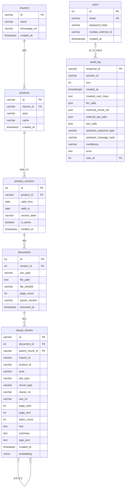

# ERD·DD — 보험길잡이

> 1. 테이블은 7개다. 약관 데이터 다섯(보험사 → 상품 → 상품 버전 → 약관 문서 → 약관 청크)과 사용자·감사 기록이다. 운영 DB는 PostgreSQL 16 + pgvector다.
> 2. 약관 청크는 PostgreSQL에 원문·메타·임베딩(4096차원)을 두고, Memgraph에 조항 그래프로 한 번 더 옮긴다(4장). 대화 세션은 테이블이 없다.
> 3. 마이그레이션·ORM·적재본(청크 2,505개)을 대조했다. 모든 행이 비어 있는 컬럼 넷, 원본보다 짧은 복사 컬럼, 두 번 걸린 유일성을 미결사항에 적었다.

## 0. 이 문서가 다루는 것

- 기준은 마이그레이션(`alembic/versions/`, 머리 `a1b2c3d4e5f6`)이 만든 PostgreSQL 스키마다. ORM(`models.py`)과 다른 곳은 따로 적었다
- 타입은 PostgreSQL 기준이다. 로컬 개발용 SQLite에는 `embedding` 열이 없고, 벡터 검색은 Chroma가 맡는다
- 예시와 건수는 운영과 같은 적재본(보험사 5곳의 실손 약관 5벌, 청크 2,505개)을 담은 로컬 개발 DB에서 셌다. 사용자·감사 기록은 개발 중에 쌓인 행이라 건수를 적지 않았다
- 테이블마다 클래스 명세([[INS-DOM-005]])의 엔티티를 가리킨다
- 다루지 않는 것: Alembic 관리 테이블 `alembic_version`, 서버 메모리의 대화 세션([[INS-DOM-005#Session]]), 디스크의 원본 PDF·페이지 이미지·첨부, 로컬 Chroma 컬렉션. 도메인 개념 [[INS-DOM-004#Section]](구간)은 테이블도 컬럼도 없다

## 1. ERD

- `clause_chunks`의 `insurer_id`·`product_id`·`area`·`doc_type`은 복사본이라 외래 키가 아니다(3.2)
- `audit_log.session_id`는 외래 키가 아니다. 세션은 테이블이 없다

## 2. DD (데이터 사전)

제약 표기: `PK` 기본 키 · `FK →` 외래 키 · `NN` NOT NULL · `UQ` 유일 · `IX` 인덱스 · `DEF` 기본값 · `CK` CHECK.

#### insurers

클래스: [[INS-DOM-005#Insurer]]

| 컬럼 | 타입 | 제약 | 의미 | 예시 |
|---|---|---|---|---|
| id | varchar(64) | PK | 보험사 코드. 약관 폴더 첫째 칸과 같다 | `samsung` |
| name | varchar(120) | NN | 보험사 이름 | `삼성화재` |
| homepage_url | varchar(255) | | 홈페이지. 다섯 행 모두 비어 있다 | — |
| created_at | timestamp | NN · DEF 현재 시각 | 적재 시각 | `2026-06-24 00:29:50` |

5행이다: `hanwha`·`hyundai`·`meritz`·`samsung`·`lotte`. 적재 코드는 새 행의 이름 자리에 코드를 넣는다. 지금 행의 한글 이름은 적재 밖에서 채웠고, 이미 있는 행은 적재가 이름을 고치지 않는다(5장).

#### products

클래스: [[INS-DOM-005#Product]]

| 컬럼 | 타입 | 제약 | 의미 | 예시 |
|---|---|---|---|---|
| id | varchar(120) | PK | 상품 코드. 약관 폴더 셋째 칸 | `samsung_silson` |
| insurer_id | varchar(64) | NN · FK → insurers.id · IX | 파는 보험사 | `samsung` |
| area | varchar(32) | NN · CK `auto`·`accident_disease`·`fire` · IX | 영역 | `accident_disease` |
| name | varchar(255) | NN | 상품 이름 | `실손의료보험` |
| created_at | timestamp | NN · DEF 현재 시각 | 적재 시각 | |

보험사마다 한 행, 모두 5행이다. 영역은 모두 `accident_disease`다.

#### product_versions

클래스: [[INS-DOM-005#ProductVersion]]

| 컬럼 | 타입 | 제약 | 의미 | 예시 |
|---|---|---|---|---|
| id | integer | PK · 자동 증가 | 일련번호 | `7` |
| product_id | varchar(120) | NN · FK → products.id · IX | 상품 | `samsung_silson` |
| valid_from | date | NN | 적용 시작일. 버전 이름 앞쪽에서 읽는다 | `2024-01-01` |
| valid_to | date | | 적용 종료일. 버전 이름 뒤쪽이 `present`면 비운다 | — |
| version_label | varchar(64) | NN | 버전 이름. 약관 폴더 넷째 칸 | `2024-01-01_present` |
| is_active | boolean | NN · DEF true · IX | 현재 판매 여부 | `true` |
| created_at | timestamp | NN · DEF 현재 시각 | 적재 시각 | |

유일 제약 `uq_versions_product_valid_from`(product_id, valid_from) — 한 상품에 시작일이 같은 버전은 하나다. 5행 모두 `2024-01-01_present`다. 버전 이름을 읽지 못하면 시작일이 `1900-01-01`로 들어간다.

#### documents

클래스: [[INS-DOM-005#Document]]

| 컬럼 | 타입 | 제약 | 의미 | 예시 |
|---|---|---|---|---|
| id | integer | PK · 자동 증가 | 일련번호 | `9` |
| version_id | integer | NN · FK → product_versions.id · IX | 상품 버전 | `7` |
| doc_type | varchar(16) | NN · CK `summary`·`business`·`terms` | 문서 유형. 파일 이름에서 읽는다 | `terms` |
| file_path | text | NN | 원본 PDF 경로(저장소 기준) | `data/raw/samsung/accident_disease/samsung_silson/2024-01-01_present/terms.pdf` |
| file_sha256 | varchar(64) | NN | 파일 SHA-256. 같은 파일이면 적재를 건너뛴다 | `428a3473e442…` |
| page_count | integer | NN | 쪽수 | `117` |
| parser_version | varchar(32) | NN | 파서 버전 | `upstage-docparse-0.4.0` |
| extracted_at | timestamp | NN · DEF 현재 시각 | 추출 시각 | |

유일 제약 `uq_documents_version_doc_type`(version_id, doc_type) — 버전마다 유형별 문서는 하나다. 5행 모두 약관(`terms`)이고 쪽수는 117~198이다.

#### clause_chunks

클래스: [[INS-DOM-005#ClauseChunk]]

| 컬럼 | 타입 | 제약 | 의미 | 예시 |
|---|---|---|---|---|
| id | varchar(64) | PK | 청크 id. UUID 문자열(36자) | `a0902136-e6e1-4526-87d1-b1cedb9efce8` |
| document_id | integer | NN · FK → documents.id · IX | 약관 문서 | `6` |
| parent_chunk_id | varchar(64) | FK → clause_chunks.id · IX | 상위 청크. 모든 행이 비어 있다(3.2) | — |
| insurer_id | varchar(32) | IX | 보험사 코드 복사본 | `samsung` |
| product_id | varchar(64) | | 상품 코드 복사본 | `samsung_silson` |
| area | varchar(32) | IX | 영역 복사본 | `accident_disease` |
| doc_type | varchar(32) | | 문서 유형 복사본 | `terms` |
| chunk_type | varchar(16) | NN · CK `article`·`paragraph`·`item`·`table`·`annex`·`other` | 종류 | `paragraph` |
| clause_no | varchar(64) | IX(document_id와 함께) | 조 번호 또는 별표 이름 | `제3조` · `별표 2` |
| sub_no | varchar(32) | | 조 안의 자리. 항·호 번호와, 길어서 나눈 조각의 순번(`#part-n`) | `④` · `(1)#part-2` |
| page_start | integer | NN | 시작 페이지 | `54` |
| page_end | integer | NN | 끝 페이지 | `54` |
| token_count | integer | NN | 토큰 수. 30~3,500 | `761` |
| text | text | NN | 원문. 가장 긴 것이 4,119자 | |
| summary | text | | 요약. 모든 행이 비어 있다 | — |
| tags_json | text | | 태그. 모든 행이 비어 있다. 채우면 쉼표로 이은 문자열이다 | — |
| created_at | timestamp | NN · DEF 현재 시각 | 적재 시각 | |
| embedding | vector(4096) | | solar-embedding 문서 임베딩. PostgreSQL에만 있고 ORM 밖이다 | |

2,505행이다. 종류는 항 1,078 · 조 983 · 표 396 · 별표 48이고, `item`·`other`는 없다. 보험사별로는 samsung 604 · hyundai 599 · lotte 479 · meritz 463 · hanwha 360이다. 표 135개는 조 번호가 없다. 토큰이 1,000을 넘으면 항 단위로 나누고, 3,500(임베딩 입력 한도 3,800에서 여유를 뺀 값)에서 강제로 자른다. 1,000을 넘는 청크는 557개다.

#### users

클래스: [[INS-DOM-005#User]]

| 컬럼 | 타입 | 제약 | 의미 | 예시 |
|---|---|---|---|---|
| id | integer | PK · 자동 증가 | 일련번호. JWT의 `sub` | `3` |
| email | varchar(255) | NN · UQ `uq_users_email` · 유일 IX `ix_users_email` | 이메일. 시연 계정은 합성 주소다 | `demo-p01@example.com` |
| password_hash | varchar(255) | NN | bcrypt 해시 | `$2b$12$…` |
| mydata_external_id | varchar(64) | | 외부 데이터 연결 키. 시연 계정만 있다 | `p01` |
| created_at | timestamptz | NN · DEF 현재 시각 | 가입 시각. ORM 정의에는 시간대가 없다(5장) | |

시연 계정 16명(`p01`~`p16`)은 앱이 시작할 때 시드한다. 운영 모드에서는 시드하지 않는다.

#### audit_log

클래스: [[INS-DOM-005#AuditLog]]

| 컬럼 | 타입 | 제약 | 의미 | 예시 |
|---|---|---|---|---|
| response_id | varchar(36) | PK | 응답 id. uuid4를 16진수 32자로 쓴다 | `3f2a…`(32자) |
| session_id | varchar(64) | IX | 세션 id(UUID 36자). 외래 키가 아니다 | |
| turn | integer | | 사용자 턴 번호 | `2` |
| created_at | timestamptz | NN · DEF 현재 시각 · IX | 기록 시각 | |
| masked_user_input | text | | 개인정보를 가린 사용자 입력 | `연락처는 [PHONE]이에요` |
| llm_calls | json | | LLM 호출 기록 | `null` |
| retrieved_chunk_ids | json | | 인용한 청크 id 배열 | `["a0902136-…"]` |
| external_api_calls | json | | 외부 API 호출 기록 | `null` |
| tool_calls | json | | 도구 호출 기록 | `null` |
| assistant_response_type | varchar(16) | | 응답 종류. 실패하면 비어 있다 | `assessment` |
| assistant_message_hash | varchar(64) | | 응답 본문의 SHA-256. 본문은 남기지 않는다 | |
| confidence | varchar(8) | | `full`·`partial`. 판정 답이 아니면 비어 있다 | `partial` |
| error | text | | 실패 사유(개인정보를 가린 것) | |
| user_id | integer | FK → users.id · IX | 로그인 사용자 | |

가린 자리는 `[RRN]`·`[PHONE]`·`[TEL]`·`[ACCOUNT]`·`[EMAIL]`로 바뀐다. `llm_calls`·`external_api_calls`·`tool_calls`는 ReAct를 켤 때만 찬다. 빈 JSON 칸에는 SQL NULL이 아니라 JSON `null`이 들어간다(5장).

## 3. 인덱스와 정규화

### 3.1 인덱스

| 테이블 | 인덱스 | 컬럼 | 빠르게 하려는 것 |
|---|---|---|---|
| products | `ix_products_insurer_id` | insurer_id | 보험사별 상품 목록 |
| products | `ix_products_area` | area | 영역 필터 |
| product_versions | `ix_product_versions_product_id` | product_id | 상품별 버전 |
| product_versions | `ix_product_versions_is_active` | is_active | 판매 중인 버전 |
| documents | `ix_documents_version_id` | version_id | 버전별 문서 |
| clause_chunks | `idx_chunks_document` | document_id | 문서 단위 청크 교체와 그래프 적재 |
| clause_chunks | `idx_chunks_clause` | document_id, clause_no | 문서 안에서 조 번호로 찾기 |
| clause_chunks | `idx_chunks_parent` | parent_chunk_id | 하위 청크 찾기. 지금은 값이 없다 |
| clause_chunks | `idx_chunks_insurer` | insurer_id | 가입 보험사로 검색 거르기 |
| clause_chunks | `idx_chunks_area` | area | 영역으로 검색 거르기 |
| users | `ix_users_email`(유일) | email | 로그인과 가입 중복 확인 |
| audit_log | `ix_audit_log_session_id` | session_id | 세션별 기록 |
| audit_log | `ix_audit_log_created_at` | created_at | 기간별 기록 |
| audit_log | `ix_audit_log_user_id` | user_id | 사용자별 기록 |

- `clause_chunks.embedding`에는 인덱스가 없다. pgvector의 근사 인덱스가 4096차원을 받지 않아 Sprint 16에 HNSW를 걷어냈다. 검색은 거른 행 전부를 코사인 거리로 비교한다(많아야 2,505행)
- `documents.file_sha256`에는 인덱스가 없다. 적재 때 해시로 찾지만 5행이라 필요 없다
- 유일 제약은 `uq_versions_product_valid_from`·`uq_documents_version_doc_type`·`uq_users_email` 셋이다. `users.email`은 유일 제약과 유일 인덱스가 겹친다(5장)

### 3.2 정규화를 깬 곳

- `clause_chunks`의 `insurer_id`·`product_id`·`area`·`doc_type`은 documents → product_versions → products를 따라가면 나오는 값의 복사본이다. 벡터 검색에서 조인 없이 거르려고 Sprint 32에 넣었다. 새 행은 적재가 채우고, 기존 행은 마이그레이션이 채웠다. 외래 키가 없어 어긋나도 막지 못하고, 길이도 원본보다 짧다(5장)
- 그래프 저장소(4장)는 같은 데이터를 한 번 더 옮긴 것이다. 원천은 PostgreSQL이다. 적재 때 문서 단위로 맞추고, `ica graph-build`로 통째로 다시 만든다
- 청크의 상하 관계는 `parent_chunk_id`가 아니라 같은 문서의 같은 `clause_no`로 잇는다. 그래서 `parent_chunk_id`가 비어 있어도 그래프의 `HAS_SUBCLAUSE`가 만들어진다
- `audit_log.session_id`는 외래 키가 아니다. 세션은 메모리에만 있어 가리킬 테이블이 없다

## 4. 그래프 저장소

Memgraph에 PostgreSQL의 약관 데이터를 노드와 관계로 옮긴다. 옮기는 곳은 [[INS-DOM-005#GraphIndexer]]이고, 검색의 심볼릭 채널([[INS-DOM-005#SymbolicGraphChannel]])과 관리자 그래프([[INS-DOM-005#GraphSourcePort]])가 읽는다. 개수는 적재본 기준이다.

| 노드 | 원천 | 키(유일) | 속성 | 개수 |
|---|---|---|---|---|
| Insurer | insurers | id | name, homepage_url | 5 |
| Product | products | id | name, area | 5 |
| Version | product_versions | id | version_label, is_active, valid_from, valid_to | 5 |
| Document | documents | id | doc_type, file_path, page_count | 5 |
| Clause | clause_chunks 가운데 `article` | chunk_id | document_id, insurer_id, clause_no, chunk_type, page_start, page_end, title | 983 |
| SubClause | clause_chunks 가운데 나머지 | chunk_id | document_id, insurer_id, clause_no, sub_no, chunk_type, page_start | 1,522 |

| 관계 | 방향 | 만드는 규칙 | 개수 |
|---|---|---|---|
| SELLS | Insurer → Product | products.insurer_id | 5 |
| HAS_VERSION | Product → Version | product_versions.product_id | 5 |
| HAS_DOCUMENT | Version → Document | documents.version_id | 5 |
| CONTAINS | Document → Clause·SubClause | clause_chunks.document_id | 2,505 |
| HAS_SUBCLAUSE | Clause → SubClause | 같은 문서·같은 clause_no | 15,725 |
| REFERS_TO | Clause·SubClause → 별표 청크 | 본문의 "별표·붙임·별첨 N"이 같은 문서의 그 별표 청크를 가리킨다 | 1,511 |

- `title`은 조 본문의 첫 줄 80자다. 심볼릭 채널이 질의 낱말과 맞춰 본다
- 인덱스는 Clause·SubClause의 document_id·insurer_id·clause_no에 있다
- 한 조가 여러 조각으로 나뉘면 조각마다 Clause가 되고, 각 조각이 같은 조 번호의 SubClause 모두와 이어진다. `HAS_SUBCLAUSE`가 청크 수보다 많은 까닭이다

## 5. 미결사항

- [ ] **모든 행이 비어 있는 컬럼** — `clause_chunks.parent_chunk_id`·`summary`·`tags_json`과 `insurers.homepage_url`은 모든 행이 비어 있다. 쓸 계획이 없으면 걷어낼지
- [ ] **원본보다 짧은 복사 컬럼** — `clause_chunks.insurer_id`는 varchar(32)인데 원본 `insurers.id`는 varchar(64)다. `product_id`는 varchar(64)인데 원본은 varchar(120)다. PostgreSQL은 넘치는 값을 잘라 넣지 않고 오류를 낸다. 지금 가장 긴 상품 코드가 14자라 문제는 없다. 원본 길이에 맞출지
- [ ] **두 번 걸린 유일성** — `users.email`에 유일 제약(`uq_users_email`)과 유일 인덱스(`ix_users_email`)가 둘 다 있다. ORM은 유일 인덱스만 안다. 하나를 걷어낼지
- [ ] **섞인 시각 타입** — `users.created_at`·`audit_log.created_at`만 timestamptz이고 나머지는 시간대 없는 timestamp다. `users.created_at`은 ORM 정의에 시간대가 없어 마이그레이션과도 다르다. 하나로 맞출지
- [ ] **영역 허용값** — `products.area`의 CHECK가 `auto`·`fire`를 아직 받는다. 실손 전용이 된 뒤 남은 값이다([[INS-DOM-005]] 5장과 같은 항목)
- [ ] **삭제 규칙** — 외래 키에 ON DELETE가 없다. 문서를 지우려면 청크부터 지워야 한다. 적재는 청크를 문서 단위로 지우고 다시 넣어 이 문제를 피한다. 벡터·그래프와의 어긋남은 `ica verify`로만 드러난다
- [ ] **감사 기록 보관 기간** — `audit_log`를 지우는 곳이 없어 가린 입력이 계속 쌓인다. 보관 기한을 정할지([[INS-PRD-002#N2]])
- [ ] **빈 JSON 값** — 비어 있는 JSON 칸에 SQL NULL이 아니라 JSON `null`이 들어간다(SQLAlchemy JSON 타입의 기본). `IS NULL`로는 찾지 못한다. `none_as_null`로 바꿀지
- [ ] **이름 자리의 코드** — 적재 코드는 새 보험사·상품의 이름 자리에 코드를 넣는다. 지금 행의 한글 이름은 적재 밖에서 채웠다. 새 보험사나 상품을 적재하면 이름에 코드가 들어간다. 코드 → 이름 목록(`app/shared/insurers.py`)을 적재에 쓸지
- [ ] **운영 DB로 확인** — 예시와 건수는 로컬 개발 DB에서 셌다. 운영 DB와 같은 적재본인지는 청크 수(2,505)와 그래프 노드 수로만 맞췄다. 라이브를 다시 띄우면 운영 DB에서 한 번 더 센다
