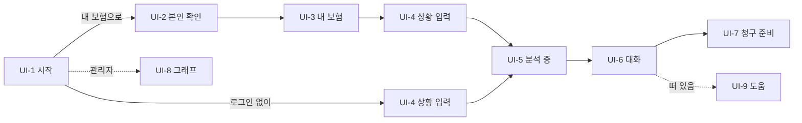

# 화면 설계: 보험청구심사 어시스턴트

## 1. 유스케이스 대응

| 유스케이스 | 화면 |
|---|---|
| [[INS-UC-001#UC-H1]] 상담을 시작한다 | [[#UI-1]] · [[#UI-4]] |
| [[INS-UC-001#UC-H2]] 본인 확인 | [[#UI-2]] |
| [[INS-UC-001#UC-H3]] 내 가입 보험 | [[#UI-3]] |
| [[INS-UC-001#UC-H4]] 판정을 받는다 | [[#UI-5]] · [[#UI-6]] |
| [[INS-UC-001#UC-H5]] 일반 기준으로 묻는다 | [[#UI-4]] · [[#UI-6]] |
| [[INS-UC-001#UC-H6]] 여러 보험 비교 | [[#UI-3]] · [[#UI-6]] |
| [[INS-UC-001#UC-H7]] 서류 올리기 | [[#UI-6]] |
| [[INS-UC-001#UC-H9]] 청구 준비 확인 | [[#UI-7]] |
| [[INS-UC-001#UC-A10]] 약관 그래프 탐색 | [[#UI-8]] |

## 2. 화면 목록

#### UI-1 시작

두 갈래 진입 — **"내 보험으로 정확히 확인하기"**와 **"로그인 없이 그냥 물어볼게요"**. 이전 상담이 있으면 폐기하고 시작한다.
근거: [[INS-UC-001#UC-H1]] · [[INS-SCN-001#S3]]

#### UI-2 본인 확인

이름·생년월일·휴대폰. 마이데이터·개인정보 동의 두 건. **확인되지 않았으면 확인되었다고 말하지 않는다.**
근거: [[INS-UC-001#UC-H2]] · [[INS-PRD-001#R14]]

#### UI-3 내 보험 확인

가입 실손 목록. 두 건 이상이면 **비례 분담 안내 배너**와 비교 선택. 0건이어도 막지 않고 다음으로 갈 수 있다.
근거: [[INS-UC-001#UC-H3]] · [[INS-UC-001#UC-H6]]

#### UI-4 상황 입력

자유 문장 한 칸. 다섯 글자 이상.
근거: [[INS-UC-001#UC-H1]]

#### UI-5 분석 중

무엇을 하는 중인지 단계로 보여준다. **첫 글자가 도착하면 바로 대화 화면으로 넘어간다** — 완성을 기다리지 않는다.
근거: [[INS-PRD-001#R18]] · [[INS-PRD-001#N1]]

#### UI-6 대화

멀티턴 대화. 네 가지 응답을 그린다 — 되묻기·판정·일반 답변·비교.

- **되묻기**: 선택지 버튼. 닫힌 질문에만 주고 **"모르겠습니다"**가 늘 있다
- **판정**: 가능성 배지 · 요약 · 충족/미충족 · 인용 목록 · 다음 행동 · 준비도
- **비교**: 보험별 표와 탭
- 왼쪽에 **인용한 약관 PDF 페이지**가 뜨고 해당 부분에 상자가 쳐진다. 가로 약관은 반으로 잘라 보여준다
- 파일 첨부로 서류를 올린다

근거: [[INS-UC-001#UC-H4]] · [[INS-UC-001#UC-H7]] · [[INS-PRD-001#R15]] · [[INS-PRD-001#R16]]

#### UI-7 청구 준비

요약 · 충족/미충족 · 필요 서류 · 다음 단계. 접수 버튼.
**접수는 지금 실제 전송이 아니다** — 화면 문구가 그 사실과 어긋나지 않아야 한다.
근거: [[INS-UC-001#UC-H9]] · [[INS-PRD-001]] 2장

#### UI-8 약관 그래프 탐색

조항 트리와 연결 그래프. 노드를 누르면 약관 원문, 두 노드 사이 경로를 본다.
근거: [[INS-UC-001#UC-A10]]

#### UI-9 도움 챗봇

어느 화면에서든 떠 있는 작은 창. 용어나 절차를 묻는다. 상담 세션과 별개다.

#### UI-10 법적 고지

면책 · 개인정보 처리방침 · 데이터 출처 · 접근성. 각각 별도 페이지.
근거: [[INS-PRD-001#R17]]

## 3. 공통 틀

- **글씨 최소 16px, 버튼 높이 44px 이상.** 노인 사용자가 주 대상 중 하나다. 근거: [[INS-SCN-001#P2]]
- WCAG AA. 키보드만으로 전 경로 조작 가능
- **면책 문구가 판정마다 보인다.** 스크롤 위로 밀려나지 않는다
- 모바일 한 단, PC 가운데 정렬
- 출처 표시는 색으로 구분한다 — 약관 인용과 일반 안내가 눈으로 갈린다

## 4. 화면 흐름

## 5. 미결사항

- [ ] **상담 전 구간이 주소 하나다** — 화면은 일곱인데 URL이 안 바뀐다. 새로고침·뒤로가기·링크 공유가 전부 처음으로 돌아간다. 화면마다 주소를 주어야 한다
- [ ] **본인 확인 화면이 확인하지 않은 것을 확인했다고 말한다.** 근거: [[INS-PRD-001#R14]]
- [ ] **접수 완료 문구가 실제와 다르다** — 접수번호와 예상 심사 기간을 확정형으로 보여주는데 전송은 없다
- [ ] 진행 표시줄의 뒷 단계 둘이 영원히 대기 상태로 고정돼 있다
- [ ] 동작하지 않는 버튼 둘 — "상담 내용 저장", 동의 "전문 보기"
- [ ] 관리자 화면에 화면 쪽 접근 제한이 없다. 시작 화면이 그 링크를 그대로 노출한다. 근거: [[INS-INFRA-001#C4]]
