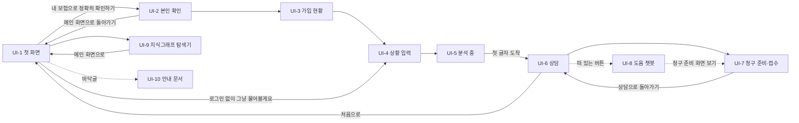

# 화면 설계·와이어프레임 — 보험길잡이

> 1. 화면은 10개다. 사용자 흐름 7개(첫 화면 → 본인 확인 → 가입 현황 → 상황 입력 → 분석 중 → 상담 → 청구 준비), 떠 있는 도움 챗봇, 관리자 그래프, 안내 문서다.
> 2. 중심은 상담 화면이다. 왼쪽에 인용 약관 원본, 오른쪽에 대화가 있고, 판정 카드에 등급·준비도·근거·재청구 안내가 붙는다.
> 3. 배치는 지금 코드의 화면 구성과 문구를 따라 그렸다. 코드와 다른 목표 동작은 그렇다고 표시했다.

## 0. 이 문서가 다루는 것

- 사용자가 보는 웹 화면의 구성·요소·규칙을 적는다. 문구는 지금 화면의 실제 문구다
- 사용자 흐름은 주소 하나(`/app`) 안에서 단계가 바뀐다. 그래서 UI-1부터 UI-7까지 경로가 같다
- 디자인 토큰은 IBM Carbon 체계를 따른다(`frontend/src/styles/tokens.css`). 3장 공통 틀에 옮겼다
- 디자인 견본 화면(`/showcase`)은 개발용이라 다루지 않는다. CLI와 CI만 쓰는 유스케이스(적재·배포·평가·인계)는 화면이 없다

## 1. 유스케이스 대응

| 유스케이스 | 화면 |
|---|---|
| [[INS-UC-002#UC-H1]] 청구 가능성 확인하기 | [[#UI-1]] · [[#UI-4]] · [[#UI-5]] · [[#UI-6]] |
| [[INS-UC-002#UC-H2]] 판정 근거를 약관 원본에서 확인하기 | [[#UI-6]] |
| [[INS-UC-002#UC-H3]] 판정 뒤 이어 묻고 사실 고치기 | [[#UI-6]] |
| [[INS-UC-002#UC-H4]] 내 보험 정보로 확인하기 | [[#UI-2]] · [[#UI-3]] |
| [[INS-UC-002#UC-H5]] 여러 실손 비교하기 | [[#UI-3]] · [[#UI-6]] |
| [[INS-UC-002#UC-H6]] 서류 사진으로 정보 채우기 | [[#UI-6]] |
| [[INS-UC-002#UC-H7]] 청구 준비하고 접수하기 | [[#UI-7]] |
| [[INS-UC-002#UC-H8]] 도움 챗봇에 사용법 묻기 | [[#UI-8]] |
| [[INS-UC-002#UC-A1]] 약관 지식그래프 탐색하기 | [[#UI-9]] |
| 면책·개인정보·출처·접근성 안내 ([[INS-PRD-002#R1]] · [[INS-PRD-002#N2]]) | [[#UI-10]] |

## 2. 화면 목록

| 화면 | 경로 | 한 줄 목적 |
|---|---|---|
| UI-1 첫 화면 | `/app` | 내 보험으로 확인할지, 로그인 없이 물을지 고른다 |
| UI-2 본인 확인·마이데이터 동의 | `/app` | 이름·생년월일·휴대폰 번호를 검증하고 조회 동의를 받는다 |
| UI-3 가입 현황 | `/app` | 불러온 실손을 보여 주고 판정할 보험을 고르게 한다 |
| UI-4 상황 입력 | `/app` | 청구 상황을 평소 말투로 쓰게 한다 |
| UI-5 분석 중 | `/app` | 기다리는 동안 지금 단계를 보여 준다 |
| UI-6 상담 | `/app` | 판정·근거 원본·이어 묻기·서류 첨부를 한 화면에서 한다 |
| UI-7 청구 준비·접수 | `/app` | 필요 서류와 요약을 보고 가정으로 접수한다 |
| UI-8 도움 챗봇 | 모든 화면 위 | 사용법과 실손 일반 질문을 따로 묻는다 |
| UI-9 약관 지식그래프 탐색기 | `/admin/graph` | 관리자가 약관 구조와 연결을 훑는다 |
| UI-10 안내 문서 | `/legal/*` | 면책·개인정보·데이터 출처·접근성을 읽는다 |

## UI-1 첫 화면

| 항목 | 내용 |
|---|---|
| 경로 | `/app` (첫 화면 단계) |
| 주 유스케이스 | [[INS-UC-002#UC-H1]] |
| 진입 / 이탈 | 주소 접속·처음으로 / [[#UI-2]] · [[#UI-4]] · [[#UI-9]] · [[#UI-10]] |

### 배치
```html
<style>
  .w-hero{padding:56px 64px 24px}
  .w-hero h1{font-size:40px;line-height:1.25;font-weight:300;margin:0 0 12px}
  .w-hero h1 b{font-weight:600;color:var(--blue-60)}
  .w-cta{display:flex;gap:12px;margin:24px 0 8px}
  .w-tiles{display:grid;grid-template-columns:repeat(3,1fr);gap:16px;padding:0 64px}
  .w-admin{position:absolute;left:64px;bottom:52px;font-size:13px;color:var(--blue-60)}
</style>
<div class="board" data-el="1">
  <div class="hdr"><span class="logo" data-el="1.1">보험길잡이</span><span class="fs" data-el="1.2"><span>가</span><span>가</span><span>가</span></span></div>
  <div class="w-hero">
    <div class="muted">01 시작 화면</div>
    <h1 data-el="2">내 보험, 어디까지 받을 수 있는지<br><b>쉽게 확인</b>하세요</h1>
    <p class="muted">가입한 보험과 약관을 바탕으로 보험금 청구 가능성과 필요한 서류를 단계별로 안내해드립니다.</p>
    <div class="w-cta">
      <span class="btn" data-el="3">내 보험으로 정확히 확인하기</span>
      <span class="btn sec" data-el="4">로그인 없이 그냥 물어볼게요</span>
    </div>
    <p class="muted">복잡한 보험 용어를 몰라도 괜찮습니다. 가입 정보 없이도 일반 실손 표준약관 기준으로 먼저 안내해 드려요.</p>
  </div>
  <div class="w-tiles" data-el="5">
    <div class="card"><b>본인 인증으로 시작</b><p class="muted">휴대폰 본인 인증과 마이데이터 동의로 가입 보험을 안전하게 확인합니다.</p></div>
    <div class="card"><b>현재 상황만 입력</b><p class="muted">보험 용어 없이도 됩니다. 겪고 있는 상황을 그대로 적어주세요.</p></div>
    <div class="card"><b>단계별 안내</b><p class="muted">청구 가능성, 필요 서류, 작성 방법까지 보험길잡이가 순서대로 도와드립니다.</p></div>
  </div>
  <span class="w-admin" data-el="6">약관 지식그래프 탐색기 (관리자)</span>
  <span class="fab" data-el="7">도움이 필요하세요?</span>
  <div class="footer" data-el="8"><span>면책 및 이용약관</span><span>개인정보 처리방침</span><span>데이터 출처</span><span>접근성 안내</span></div>
</div>
```

### 요소
| # | 이름 | 종류 | 보여주는 것 | 누르면 |
|---|---|---|---|---|
| 1.2 | 글자 크기 전환 | 버튼 셋 | 가(작게)·가(보통)·가(크게) | 모든 화면의 글자 크기가 바뀐다 |
| 3 | 내 보험으로 확인 | 주 버튼 | — | [[#UI-2]] |
| 4 | 로그인 없이 묻기 | 보조 버튼 | — | 직전 세션을 버리고 [[#UI-4]] |
| 6 | 관리자 그래프 링크 | 링크 | — | [[#UI-9]] |
| 7 | 도움 챗봇 | 떠 있는 버튼 | — | [[#UI-8]] |
| 8 | 안내 문서 링크 | 바닥글 | 문서 넷 | [[#UI-10]] |

### 규칙
- 새 흐름을 시작하면 직전 세션을 버린다. 앞 사람의 로그인 정보가 이어지지 않는다
- 로그인 없이 들어온 사람도 판정까지 막힘 없이 간다

## UI-2 본인 확인·마이데이터 동의

| 항목 | 내용 |
|---|---|
| 경로 | `/app` (본인 확인 단계) |
| 주 유스케이스 | [[INS-UC-002#UC-H4]] |
| 진입 / 이탈 | [[#UI-1]] / [[#UI-3]] · [[#UI-1]] |

### 배치
```html
<style>
  .i-wrap{padding:24px 64px;max-width:640px}
  .i-row{margin:12px 0}
  .i-row label{display:block;font-size:12px;color:var(--gray-70);margin-bottom:4px}
  .i-help{font-size:12px;color:var(--gray-70);margin-top:4px}
  .i-err{font-size:12px;color:var(--red-60);margin-top:4px}
  .i-cons{border:1px solid var(--gray-20);padding:12px;margin:8px 0;display:flex;justify-content:space-between;font-size:14px}
</style>
<div class="board" data-el="1">
  <div class="hdr"><span class="logo">보험길잡이</span><span class="fs"><span>가</span><span>가</span><span>가</span></span></div>
  <div class="i-wrap">
    <span class="btn ghost" data-el="2">← 메인 화면으로 돌아가기</span>
    <div class="muted">02 본인 확인 · 마이데이터 동의</div>
    <h2>본인 확인이 필요합니다</h2>
    <p class="muted">가입한 보험을 안전하게 확인하기 위해 기본 정보와 동의를 받습니다.</p>
    <div class="i-row" data-el="3"><label>이름</label><div class="field">홍길동</div></div>
    <div class="i-row" data-el="4"><label>생년월일</label><div class="field">예) 19850412</div><div class="i-help">점(.) 없이 숫자 8자리로 입력해 주세요.</div></div>
    <div class="i-row" data-el="5"><label>휴대폰 번호</label><div class="field">010-1234-5678</div> <span class="btn sec" style="margin-top:8px">본인 인증</span></div>
    <div class="i-cons" data-el="6"><span>☐ 마이데이터 보험 조회 동의 <span class="tag">필수</span></span><span class="muted">전문 보기</span></div>
    <div class="i-cons" data-el="7"><span>☐ 개인정보 수집 및 이용 동의 <span class="tag">필수</span></span><span class="muted">전문 보기</span></div>
    <span class="btn" data-el="8">내 보험 조회하기</span>
    <p class="muted">안심하셔도 됩니다. 입력하신 정보는 청구 안내 외 용도로 사용되지 않습니다.</p>
  </div>
</div>

<div class="var">형식 오류 — 칸 아래에 고칠 방법과 예시가 뜬다</div>
<div class="board" style="min-height:200px">
  <div class="i-wrap">
    <div class="i-row"><label>이름</label><div class="field">ㅁㄴㄹ</div><div class="i-err">이름을 한글 또는 영문으로 정확히 입력해 주세요.</div></div>
    <div class="i-row"><label>생년월일</label><div class="field">1985.04.12</div><div class="i-err">생년월일 8자리를 정확히 입력해 주세요. (예: 19850412)</div></div>
  </div>
</div>
```

### 규칙
- 이름은 한글·영문 두 글자 이상, 생년월일은 실제 날짜인 8자리, 휴대폰 번호는 01로 시작하는 10~11자리다. 하이픈은 자동으로 넣는다([[INS-PRD-002#R14]])
- 형식이 맞고, 본인 인증을 마치고, 동의 두 개를 모두 체크해야 조회 버튼이 켜진다. 인증을 마치면 입력칸이 잠긴다
- 시연 계정은 다음 단계인 [[#UI-3]]에서 이름과 휴대폰 번호로 찾는다. 이 화면은 형식과 동의만 확인한다

## UI-3 가입 현황

| 항목 | 내용 |
|---|---|
| 경로 | `/app` (보험 확인 단계) |
| 주 유스케이스 | [[INS-UC-002#UC-H4]] · [[INS-UC-002#UC-H5]] |
| 진입 / 이탈 | [[#UI-2]] / [[#UI-4]] |

### 배치
```html
<style>
  .c-wrap{padding:24px 64px;max-width:760px}
  .c-banner{background:var(--blue-10);border-left:3px solid var(--blue-60);padding:12px 16px;font-size:13px;margin:12px 0}
  .c-pol{display:flex;justify-content:space-between;align-items:center;border:1px solid var(--gray-20);padding:14px 16px;margin:8px 0}
  .c-pol.off{color:var(--gray-50);background:var(--gray-10)}
</style>
<div class="board" data-el="1">
  <div class="hdr"><span class="logo">보험길잡이</span><span class="fs"><span>가</span><span>가</span><span>가</span></span></div>
  <div class="c-wrap">
    <div class="muted">02 보험 확인</div>
    <h2>지금 가입하신 <b>실손보험</b>이에요</h2>
    <p class="muted">마이데이터로 확인한 가입 현황입니다. 비교할 보험을 골라 주세요(여러 개 선택 가능).</p>
    <div class="c-banner" data-el="2">실손은 여러 개 가입해도 실제 낸 의료비 한도 안에서 비례로 나눠 지급돼요(이중 수령 불가). 대신 가입 세대·자기부담률이 달라 어느 약관이 이 상황에 더 유리한지 비교해 드릴게요.</div>
    <div class="c-pol" data-el="3"><span>☑ 삼성화재 · 실손의료보험</span><span class="tag">4세대</span></div>
    <div class="c-pol" data-el="4"><span>☑ 현대해상 · 실손의료보험</span><span class="tag">3세대</span></div>
    <div class="c-pol off" data-el="5"><span>○○생명 · 종신보험</span><span class="tag">판정 대상 아님</span></div>
    <span class="btn" data-el="6">2개 보험 비교하기</span>
  </div>
</div>

<div class="var">빈 상태 — 연동된 실손이 없을 때 (예: 신하율 계정). 시연 계정을 찾지 못했거나 불러오기에 실패해도 이 상태다</div>
<div class="board" style="min-height:200px">
  <div class="c-wrap">
    <h3>연동된 가입 실손이 없어요</h3>
    <p class="muted">가입 보험 정보 없이도 상황을 입력하면 일반 실손 표준약관 기준으로 안내해 드릴 수 있어요.</p>
    <span class="btn">상황 입력으로 계속</span>
  </div>
</div>

<div class="var">불러오는 중</div>
<div class="board" style="min-height:120px"><div class="c-wrap"><p class="muted">가입 보험을 불러오는 중…</p></div></div>
```

### 요소
| # | 이름 | 종류 | 보여주는 것 | 누르면 |
|---|---|---|---|---|
| 2 | 비례분담 안내 | 안내 띠 | 실손이 둘 이상일 때만 | — |
| 3 | 실손 항목 | 체크 항목 | 보험사·상품·세대 | 판정 대상에 넣고 뺀다 |
| 5 | 실손이 아닌 보험 | 흐린 항목 | 판정 대상 아님 표시 | 고를 수 없다. **목표 동작** — 지금 코드는 이 줄을 보여 주지 않는다 |
| 6 | 진행 버튼 | 주 버튼 | 하나면 "이 보험으로 상황 입력하기", 여럿이면 "N개 보험 비교하기" | [[#UI-4]] |

### 규칙
- 실손을 하나만 골라도, 여럿 골라도 진행한다. 여럿이면 상담 화면이 비교로 답한다([[INS-PRD-002#R17]])
- 시연 계정을 찾지 못하거나 가입 보험을 불러오지 못해도 빈 상태를 보이고 상황 입력으로 계속하게 한다. 세 경우를 나눠 알리지 않는다([[INS-UC-002#UC-H4]]). 계정을 찾지 못했으면 로그인되지 않은 채로 이어 간다

## UI-4 상황 입력

| 항목 | 내용 |
|---|---|
| 경로 | `/app` (상황 입력 단계) |
| 주 유스케이스 | [[INS-UC-002#UC-H1]] |
| 진입 / 이탈 | [[#UI-1]] · [[#UI-3]] / [[#UI-5]] |

### 배치
```html
<style>
  .s-wrap{padding:24px 64px;max-width:760px}
  .s-area{border:1px solid var(--gray-30);background:var(--gray-10);min-height:140px;padding:14px;color:var(--gray-50);font-size:15px}
</style>
<div class="board" data-el="1">
  <div class="hdr"><span class="logo">보험길잡이</span><span class="fs"><span>가</span><span>가</span><span>가</span></span></div>
  <div class="s-wrap">
    <div class="muted">03 상황 입력</div>
    <h2>지금 어떤 <b>상황</b>이신가요?</h2>
    <p class="muted" data-el="2">겪고 계신 상황을 평소 말씀하시는 그대로 적어주세요. 가입 정보 없이 일반 실손 표준약관 기준으로 먼저 안내해 드려요.</p>
    <div class="s-area" data-el="3">예) 지난주 계단에서 넘어져 병원에 다녀왔습니다. 보험금을 청구할 수 있는지 알고 싶어요.</div>
    <p class="muted" data-el="4">정확하지 않아도 괜찮습니다. 필요한 내용은 다음 단계에서 보험길잡이가 다시 질문드립니다.</p>
    <span class="btn" data-el="5">확인 시작하기</span>
  </div>
</div>
```

### 규칙
- 안내 문구(2)는 로그인 여부에 따라 바뀐다. 로그인했으면 "가입한 보험과 약관을 함께 살펴보고 안내해드립니다"다
- 짧게 써도 보낼 수 있다([[INS-PRD-002#R5]])

## UI-5 분석 중

| 항목 | 내용 |
|---|---|
| 경로 | `/app` (분석 중 단계) |
| 주 유스케이스 | [[INS-UC-002#UC-H1]] |
| 진입 / 이탈 | [[#UI-4]] / [[#UI-6]] |

### 배치
```html
<style>
  .l-wrap{padding:64px;max-width:640px}
  .l-step{padding:10px 0;border-bottom:1px solid var(--gray-20);font-size:15px}
  .l-step.done{color:var(--green-50)}
  .l-step.now{font-weight:600}
</style>
<div class="board" data-el="1">
  <div class="l-wrap">
    <div class="muted">04 분석 중</div>
    <h2>보험길잡이가 확인하고 있어요</h2>
    <div data-el="2">
      <div class="l-step done">✓ 가입 보험을 확인하고 있습니다</div>
      <div class="l-step done">✓ 관련 약관을 불러오고 있습니다</div>
      <div class="l-step now">◌ 입력하신 상황과 보장 항목을 비교하고 있습니다</div>
      <div class="l-step">필요한 확인 사항을 정리하고 있습니다</div>
    </div>
    <p class="muted" data-el="3">약관 원문을 한 줄씩 대조하고 있어요</p>
    <p class="muted" data-el="4">보통 30초 이내에 마무리됩니다. 잠시만 기다려 주세요.</p>
  </div>
</div>
```

### 규칙
- 화면이 멈춰 보이지 않게 단계와 안내(3)가 계속 바뀐다. 마지막 단계에서는 스피너가 돈다
- 답의 첫 글자가 오면 기다리지 않고 바로 [[#UI-6]]으로 넘어간다([[INS-PRD-002#R10]])

## UI-6 상담

| 항목 | 내용 |
|---|---|
| 경로 | `/app` (상담 단계) |
| 주 유스케이스 | [[INS-UC-002#UC-H1]] · [[INS-UC-002#UC-H2]] · [[INS-UC-002#UC-H3]] · [[INS-UC-002#UC-H5]] · [[INS-UC-002#UC-H6]] |
| 진입 / 이탈 | [[#UI-5]] / [[#UI-7]] · [[#UI-1]](처음으로) |

### 배치
```html
<style>
  .ch{display:grid;grid-template-columns:220px 400px 1fr;height:720px}
  .ch-side{background:var(--gray-10);padding:16px;border-right:1px solid var(--gray-20);font-size:13px}
  .ch-rail li{margin:6px 0}
  .ch-doc{border-right:1px solid var(--gray-20);padding:12px;background:#fff}
  .ch-page{height:420px;background:var(--gray-10);border:1px solid var(--gray-20);position:relative;margin:8px 0}
  .hl{position:absolute;background:rgba(241,194,27,.45)}
  .ch-main{display:flex;flex-direction:column}
  .ch-head{display:flex;justify-content:space-between;align-items:center;padding:10px 16px;border-bottom:1px solid var(--gray-20)}
  .ch-stream{flex:1;padding:16px;overflow:hidden}
  .me{margin-left:auto;max-width:60%;background:var(--blue-60);color:#fff;padding:10px 12px;margin-bottom:12px;font-size:14px}
  .bot{max-width:92%;border:1px solid var(--gray-20);padding:12px;font-size:14px}
  .grade{display:inline-block;background:var(--yellow-30);padding:2px 10px;font-weight:600}
  .gauge{height:8px;background:var(--gray-20);margin:6px 0}.gauge i{display:block;height:8px;width:72%;background:var(--yellow-30)}
  .reclaim{border:1px dashed var(--blue-60);padding:8px;margin-top:8px;font-size:13px}
  .chips span{display:inline-block;border:1px solid var(--gray-30);padding:4px 10px;margin:6px 6px 0 0;font-size:12px}
  .comp{display:flex;gap:8px;align-items:center;border-top:1px solid var(--gray-20);padding:10px 16px}
</style>
<div class="board" data-el="1">
  <div class="ch">
    <div class="ch-side" data-el="2">
      <b>보험길잡이</b>
      <p><span class="muted">현재 진행 단계</span><br><b>약관 검토 중</b><br><span class="muted">약관과 비교하고 있어요</span></p>
      <ol class="ch-rail"><li>✓ 상황 입력</li><li>✓ 정보 확인</li><li><b>● 청구 가능성 검토</b></li><li>결과 안내</li><li>필요 서류 안내</li><li>보험사 제출 안내</li></ol>
      <p data-el="2.1"><b>홍길동 고객님</b><br><span class="muted">인증 완료 · 마이데이터 연동됨</span></p>
    </div>
    <div class="ch-doc" data-el="3">
      <b>인용 약관 원문</b> <span class="muted">삼성화재 · 실손의료보험 · 제3조 · 약관 40페이지</span>
      <div class="ch-page" data-el="3.1"><div class="hl" style="left:24px;top:120px;width:340px;height:64px"></div><div class="hl" style="left:24px;top:196px;width:300px;height:28px"></div></div>
      <div class="chips" data-el="3.2"><span>약관 단 보기: 왼쪽 단</span><span>오른쪽 단</span><span>전체</span></div>
      <p class="muted" data-el="3.3">현재 약관 페이지 크게 보기 · 원본 PDF</p>
    </div>
    <div class="ch-main">
      <div class="ch-head" data-el="4"><span><b>청구 가능성 확인</b> <span class="muted">약관을 근거로 청구 가능성을 함께 살펴봐요</span></span><span class="muted">상담 내용 저장 · 처음으로</span></div>
      <div class="ch-stream">
        <div class="me">지난주 계단에서 넘어져 발목이 부러졌어요. 3일 입원했어요.</div>
        <div class="bot" data-el="5">
          <span class="muted">청구 가능성</span> <span class="grade">중간</span>
          <div data-el="5.1"><span class="muted">청구 준비도 72점 · 보험금 지급 확률이 아닙니다</span><div class="gauge"><i></i></div></div>
          <p>발목 골절 입원은 실손에서 보상되는 경우가 많아요. 근거로 표시된 제3조는 상해로 입원했을 때 본인이 부담한 의료비를 보상한다고 정하고 있어요. 치료 유형(급여·비급여)을 알려 주시면 더 정확해요.</p>
          <p class="muted" data-el="5.2">자세한 판단 근거 보기 ▾ (충족 항목 · 미충족·확인 필요 항목 · 다음 단계)</p>
          <div class="reclaim" data-el="5.3"><b>이렇게 보완하면 다시 확인할 수 있어요</b><br>진료비 세부내역서로 비급여 항목 확인 — 근거 제3조</div>
          <div class="chips" data-el="5.4"><span>이어서 물어보기: 통원도 되나요?</span><span>필요 서류는요?</span></div>
          <p class="muted" style="font-size:11px">본 안내는 약관 기반 참고용이며 보험사의 최종 판단을 대체하지 않습니다.</p>
        </div>
      </div>
      <div class="comp" data-el="6"><span>📎</span><span class="field" style="flex:1">청구 상황을 자유롭게 알려주세요.</span><span class="btn">보내기</span></div>
    </div>
  </div>
  <span class="fab" data-el="7">도움이 필요하세요?</span>
</div>

<div class="var">되묻기(8) — 판정 전 한 번, 선택지가 화면 아래 가운데에 뜬다</div>
<div class="board" style="min-height:160px">
  <div data-el="8" style="margin:24px auto;width:560px;border:1px solid var(--gray-30);padding:16px;background:#fff">
    <b>입원하셨나요, 통원하셨나요?</b>
    <div class="chips"><span>입원</span><span>통원</span><span>둘 다</span><span>모르겠습니다</span></div>
  </div>
</div>

<div class="var">여러 실손 비교(9) — 보험별 판정을 나란히</div>
<div class="board" style="min-height:220px">
  <div data-el="9" style="padding:16px">
    <b>보험사별 비교</b>
    <table style="width:100%;border-collapse:collapse;font-size:13px;margin-top:8px">
      <tr style="background:var(--gray-10)"><td>보험</td><td>등급</td><td>세대</td><td>급여 자기부담</td><td>비급여 자기부담</td><td>예상 분담액</td><td></td></tr>
      <tr><td>삼성화재 실손</td><td>높음</td><td>4세대</td><td>20%</td><td>30%</td><td>금액 입력 시</td><td><span class="tag">추천</span></td></tr>
      <tr><td>현대해상 실손</td><td>높음</td><td>3세대</td><td>10%</td><td>20%</td><td>금액 입력 시</td><td></td></tr>
    </table>
    <p class="muted">탭을 바꾸면 왼쪽 원본이 그 보험의 약관으로 바뀐다.</p>
  </div>
</div>

<div class="var">원본 크게 보기(10) — 캡처를 눌렀을 때</div>
<div class="board" style="position:relative;min-height:260px">
  <div style="position:absolute;inset:0;background:rgba(23,24,28,.42);display:flex;align-items:center;justify-content:center">
    <div data-el="10" style="width:640px;height:220px;background:#fff;position:relative"><div class="hl" style="left:40px;top:60px;width:520px;height:60px"></div><span class="muted" style="position:absolute;right:8px;top:6px">닫기</span></div>
  </div>
</div>

<div class="var">오류(11) — 응답이 실패했을 때</div>
<div class="board" style="min-height:100px"><div data-el="11" style="padding:16px" class="card">일시적인 문제가 발생했어요 <span class="btn sec">다시 시도</span></div></div>
```

### 요소
| # | 이름 | 종류 | 보여주는 것 | 누르면 |
|---|---|---|---|---|
| 2 | 진행 사이드바 | 영역 | 세션 상태(정보 확인 중·약관 검토 중·검토 완료·대화 종료)와 여섯 단계 | — |
| 2.1 | 사용자 표시 | 알약 | 로그인이면 "인증 완료 · 마이데이터 연동됨", 아니면 "비로그인 · 표준약관 기준" | — |
| 3 | 인용 원본 패널 | 영역 | 인용 조항의 원본 캡처·원문·페이지 | — |
| 3.1 | 원본 캡처 | 이미지 | 형광펜처럼 이어진 하이라이트 블록 | 확대 보기(10) |
| 3.2 | 단 보기 전환 | 버튼 셋 | 가로 약관일 때만 | 왼쪽 단·오른쪽 단·전체 |
| 4 | 상담 머리 | 머리글 | 제목과 동작 둘 | 처음으로 → [[#UI-1]] |
| 5 | 판정 카드 | 말풍선 | 등급·준비도·요약·근거·재청구·후속 질문·면책 문구 | 근거 펼치기 |
| 5.1 | 준비도 게이지 | 게이지 | 점수·신호등 색과 글자·배점 | — |
| 5.3 | 재청구 안내 | 카드 | 미충족마다 보완 행동과 근거 조항 | — |
| 6 | 입력창 | 입력 | 첨부 버튼과 글 입력 | 첨부 → 서류 사진 선택, 보내기 |
| 8 | 선택지 | 떠 있는 패널 | 선택지와 "모르겠습니다" | 답으로 보낸다 |
| 9 | 비교표 | 표 | 보험별 등급·세대·자기부담·예상 분담액·추천 | 탭 전환 |

### 규칙
- 사람의 말은 오른쪽, 챗봇은 왼쪽이다. 답은 SSE로 흘러나오고, 타이핑하듯 일정한 속도로 보인다
- 인용 번호·내부 식별자는 본문에 보이지 않는다. 마크다운은 서식으로 보인다
- 보험사가 바뀌면 원본 패널과 보험사 표기가 함께 바뀐다
- 첨부로 올린 서류에서 뽑은 항목은 대화 정보에 채워진다. 도움 챗봇에서 진료내역을 고르면 그 진료를 설명하는 문장("○○병원에서 ○일 입원 진료받았어요…")이 사용자 메시지로 바로 보내진다

### 시나리오
**S-1 짧게 묻고 근거를 확인한다** — [[INS-UC-002#UC-H1]] · [[INS-UC-002#UC-H2]]
1. 사용자가 짧게 묻고, 판정 카드와 왼쪽 원본을 받는다
2. 원본을 눌러 확대하고, 가로 약관이면 단을 바꿔 본다

## UI-7 청구 준비·접수

| 항목 | 내용 |
|---|---|
| 경로 | `/app` (청구 준비 단계) |
| 주 유스케이스 | [[INS-UC-002#UC-H7]] |
| 진입 / 이탈 | [[#UI-6]]·[[#UI-8]]의 청구 준비 화면 보기 / [[#UI-6]] |

### 배치
```html
<style>
  .r-wrap{padding:24px 64px;max-width:820px}
  .r-sec{border:1px solid var(--gray-20);padding:14px 16px;margin:10px 0}
  .r-doc{display:flex;justify-content:space-between;padding:6px 0;border-bottom:1px solid var(--gray-10);font-size:14px}
  .r-note{background:var(--gray-10);padding:12px 16px;font-size:13px;margin:10px 0}
</style>
<div class="board" data-el="1">
  <div class="hdr"><span class="logo">보험길잡이</span><span class="fs"><span>가</span><span>가</span><span>가</span></span></div>
  <div class="r-wrap">
    <div class="muted">07 청구 준비 화면</div>
    <h2>청구 전 마지막 확인</h2>
    <p class="muted">지금까지 정리된 내용을 함께 살펴봐 주세요. 아래 내용으로 청구를 진행할 수 있어요.</p>
    <div class="r-sec" data-el="2"><b>청구 대상 보험</b><p>삼성화재 · 실손의료보험 (4세대)</p></div>
    <div class="r-sec" data-el="3"><b>청구 가능성 검토 결과</b> <span class="tag">중간</span><p class="muted">검토 요약 · 충족 항목 · 확인 필요 항목</p></div>
    <div class="r-sec" data-el="4"><b>필요 서류 — 준비할 서류</b>
      <div class="r-doc"><span>진단서</span><span class="tag">필수</span></div>
      <div class="r-doc"><span>진료비 영수증</span><span class="tag">필수</span></div>
      <div class="r-doc"><span>진료비 세부내역서</span><span class="tag">선택</span></div>
    </div>
    <div class="r-sec" data-el="5"><b>다음 단계 — 이렇게 진행하세요</b><p class="muted">1. 서류를 준비합니다 2. 보험사 앱이나 창구로 제출합니다</p></div>
    <div class="r-note" data-el="6"><b>접수 전 확인해 주세요.</b><br>본 접수는 데모 환경의 가정 처리이며 실제 보험사로 전송되지 않습니다.<br>예상 결과는 약관 기반 추정이며 실제 지급 여부는 보험사 심사에 따릅니다.</div>
    <span class="btn" data-el="7">청구 접수하기</span>
  </div>
</div>

<div class="var">접수 완료(8) — 접수하기를 눌렀을 때</div>
<div class="board" style="min-height:260px">
  <div class="r-wrap" data-el="8">
    <div class="muted">08 접수 완료</div>
    <h2>청구가 접수되었어요</h2>
    <div class="r-sec"><b>접수 정보</b><p>접수번호 · 예상 심사 기간 영업일 약 5일 · 상태</p></div>
    <span class="btn sec">상담으로 돌아가기</span>
  </div>
</div>
```

### 규칙
- 판정 전에 들어오면 "아직 평가가 완료되지 않았어요"를 보여 준다
- 필요 서류는 지금 필수·선택 둘로만 표시된다. PRD가 요구한 세 상태(자동 확인·업로드 필요·선택)는 5장 미결사항이다
- 접수는 실제로 보내지 않는다. 가정 처리임을 접수 버튼 바로 위에 적는다([[INS-PRD-002#R18]])

## UI-8 도움 챗봇

| 항목 | 내용 |
|---|---|
| 경로 | 모든 화면 위 (오른쪽 아래) |
| 주 유스케이스 | [[INS-UC-002#UC-H8]] |
| 진입 / 이탈 | 떠 있는 버튼 / 닫기 |

### 배치
```html
<style>
  .h-panel{position:absolute;right:24px;bottom:24px;width:380px;border:1px solid var(--gray-30);background:#fff;box-shadow:0 4px 12px rgba(0,0,0,.25)}
  .h-head{display:flex;justify-content:space-between;padding:12px 14px;border-bottom:1px solid var(--gray-20)}
  .h-sec{padding:10px 14px;font-size:13px}
  .h-sec p{margin:6px 0}
  .h-item{border:1px solid var(--gray-20);padding:8px 10px;margin:6px 0;font-size:13px}
  .h-full{position:absolute;inset:40px 24px 24px auto;width:520px;border:1px solid var(--gray-30);background:#fff}
</style>
<div class="board" style="min-height:560px;background:var(--gray-10)" data-el="1">
  <div class="h-panel" data-el="2">
    <div class="h-head"><b>도움 챗봇 · 무엇이든 물어보세요</b><span class="muted">닫기</span></div>
    <div class="h-sec" data-el="3"><b>자주 묻는 질문</b>
      <div class="h-item">실손보험이 뭔가요?</div><div class="h-item">비급여·자기부담금이 뭔가요?</div>
      <div class="h-item">실손으로 보상 안 되는 치료도 있나요?</div><div class="h-item">청구하려면 어떤 서류가 필요한가요?</div>
    </div>
    <div class="h-sec" data-el="4"><b>빠른 작업</b> <span class="muted">(상담 화면에서)</span>
      <div class="h-item">최근 진료 내역 가져오기</div><div class="h-item">청구 준비 화면 보기 <span class="muted">(판정 뒤)</span></div>
    </div>
    <div class="h-sec"><div class="field" data-el="5">여기에 물어보세요</div></div>
  </div>
</div>

<div class="var">대화 중(6) — 질문을 보내면 챗봇 전체 화면이 된다</div>
<div class="board" style="min-height:420px;background:var(--gray-10)">
  <div class="h-full" data-el="6">
    <div class="h-head"><span class="muted">← 뒤로</span><b>도움 챗봇</b><span class="muted">크게 보기 · 닫기</span></div>
    <div class="h-sec">
      <p style="text-align:right">비급여가 뭔가요?</p>
      <p class="card">건강보험이 적용되지 않아 본인이 전액 내는 진료비예요. 실손에서는 세대에 따라 일부를 자기부담으로 빼고 보상해요. <span class="tag">현대해상 · 실손의료보험 · 제3조</span></p>
      <p class="muted">이어서: 도수치료도 비급여인가요?</p>
    </div>
  </div>
</div>
```

### 규칙
- 사용법 질문은 인용 없이 답한다. 실손 일반 질문은 보험사 구분 없이 약관을 검색해 근거 조항을 붙여 답한다. 근거 조항은 그 조항의 보험사·상품·조 번호로 표시된다
- 등급을 매기는 정식 판정은 하지 않는다. 본인 사례를 물으면 표준약관 기준 일반 안내를 하고, 내 보험으로 확인하기를 권한다
- 빠른 작업은 상담 화면에서 열었을 때만 보인다. 청구 준비 화면 보기는 판정이 있을 때만 보인다. 최근 진료 내역은 로그인해야 불러오고, 로그인하지 않았으면 "로그인이 필요한 기능입니다" 안내가 뜬다
- 첫 화면을 포함해 모든 화면에서 연다

## UI-9 약관 지식그래프 탐색기

| 항목 | 내용 |
|---|---|
| 경로 | `/admin/graph` |
| 주 유스케이스 | [[INS-UC-002#UC-A1]] |
| 진입 / 이탈 | [[#UI-1]]의 관리자 링크 / 메인 화면으로 |

### 배치
```html
<style>
  .g{display:grid;grid-template-columns:300px 1fr 340px;height:640px}
  .g-bar{display:flex;gap:10px;align-items:center;padding:10px 16px;border-bottom:1px solid var(--gray-20)}
  .g-tree{border-right:1px solid var(--gray-20);padding:12px;font-size:13px;background:#172d4d;color:#fff}
  .g-tree div{padding:3px 0}
  .g-graph{position:relative;background:#fff}
  .n{position:absolute;width:14px;height:14px;border-radius:50%;background:var(--blue-60)}
  .g-ins{border-left:1px solid var(--gray-20);padding:12px;font-size:13px}
</style>
<div class="board" data-el="1">
  <div class="g-bar" data-el="2"><b>약관 지식그래프 탐색기</b><span class="field">전체 문서 ▾</span><span class="field" style="flex:1">조항·엔티티 검색</span><span class="muted">노드 클릭 = 경로 시작 · 드래그 = 이동</span><span class="btn sec">메인 화면으로</span></div>
  <div class="g">
    <div class="g-tree" data-el="3">
      <div>전체 문서</div><div style="padding-left:12px">삼성화재</div><div style="padding-left:24px">실손의료보험 약관</div>
      <div style="padding-left:36px">본문 제1조~제45조</div><div style="padding-left:48px">제3조 보장종목별 보상내용</div><div style="padding-left:60px">제3조 ① …</div>
    </div>
    <div class="g-graph" data-el="4"><span class="n" style="left:40%;top:40%"></span><span class="n" style="left:55%;top:30%"></span><span class="n" style="left:60%;top:55%"></span><span class="n" style="left:30%;top:60%"></span><span class="muted" style="position:absolute;left:12px;bottom:10px">연결 그래프</span></div>
    <div class="g-ins" data-el="5"><b>노드 상세</b> · <span class="muted">최단 경로</span>
      <p>조항 제3조 · 페이지 40 · 토큰 812</p><p class="muted">약관 원문 …</p><span class="btn ghost">이 노드로 스코프 좁히기</span>
    </div>
  </div>
</div>

<div class="var">아무것도 고르지 않았을 때 — 상세 칸 안내</div>
<div class="board" style="min-height:90px"><p class="muted" style="padding:16px">TDD 트리 또는 그래프에서 노드를 선택하면 상세와 약관 원문이 표시됩니다.</p></div>

<div class="var">경로 — 시작 노드를 누른 뒤 도착 노드를 눌렀을 때</div>
<div class="board" style="min-height:90px"><p style="padding:16px">3홉 경로 · <span class="muted">경로가 없으면 "두 노드를 잇는 경로가 없습니다. 다른 도착 노드를 클릭해 보세요."</span> · 경로 해제</p></div>
```

### 규칙
- 트리는 전체 → 보험사 → 문서 → 구간 → 조 → 하위 조항 여섯 단계다. 깊이마다 색이 짙은 남색에서 옅은 하늘색으로 바뀐다
- 노드 이름은 조 번호와 제목(없으면 원문 앞부분)을 함께 쓰고, 이름으로 검색된다
- 적록색약 대응은 하지 않는다([[INS-RFQ-002#Q23]])
- 노출이 꺼져 있으면 이 경로는 404다

## UI-10 안내 문서

| 항목 | 내용 |
|---|---|
| 경로 | `/legal/disclaimer` · `/legal/privacy` · `/legal/sources` · `/legal/accessibility` |
| 주 유스케이스 | — (요구: [[INS-PRD-002#R1]] 면책 문구 · [[INS-PRD-002#N2]] 개인정보) |
| 진입 / 이탈 | 모든 화면의 바닥글 / 메인 화면으로 돌아가기 |

### 배치
```html
<style>
  .d{display:grid;grid-template-columns:220px 1fr;gap:24px;padding:24px 64px}
  .d-toc div{font-size:13px;padding:4px 0;color:var(--gray-70)}
</style>
<div class="board" data-el="1">
  <div class="hdr"><span class="logo">보험길잡이</span><span class="fs"><span>가</span><span>가</span><span>가</span></span></div>
  <div style="padding:12px 64px 0" class="muted" data-el="2">메인 › 면책 및 이용약관</div>
  <div class="d">
    <div class="d-toc" data-el="3"><b>이 문서의 목차</b><div>1. 서비스의 성격</div><div>2. 책임의 한계</div><div>3. …</div></div>
    <div data-el="4"><h2>면책 및 이용약관</h2><p class="muted">최종 갱신: 문서마다 날짜</p><p>본 서비스는 약관을 근거로 청구 가능성을 안내하는 참고용 도구이며, 보험사의 최종 판단을 대체하지 않습니다.</p>
      <p data-el="5"><b>관련 문서</b> · 개인정보 처리방침 · 데이터 출처 · 접근성 안내</p><span class="btn ghost">메인 화면으로 돌아가기</span></div>
  </div>
</div>
```

### 규칙
- 네 문서가 같은 틀(경로 표시·목차·본문·관련 문서)을 쓴다
- 면책 문구의 본문은 법무 확정 전 잠정안이다

## 3. 공통 틀

모든 화면 배치 앞에 함께 들어가는 공통 스타일이다. 색과 글꼴은 `frontend/src/styles/tokens.css`의 값을 옮겼다.

```html
<link rel="stylesheet" href="https://cdn.jsdelivr.net/gh/orioncactus/pretendard/dist/web/variable/pretendardvariable.css">
<style>
  :root{--blue-60:#0f62fe;--blue-10:#edf5ff;--gray-10:#f4f4f4;--gray-20:#e0e0e0;--gray-30:#c6c6c6;--gray-50:#8d8d8d;--gray-70:#525252;--gray-100:#161616;--green-50:#24a148;--yellow-30:#f1c21b;--red-60:#da1e28;--font-sans:'Pretendard Variable',Pretendard,system-ui,sans-serif}
  body{margin:0;font-family:var(--font-sans);color:var(--gray-100);background:#fff}
  .board{width:1200px;min-height:640px;border:1px solid var(--gray-20);background:#fff;position:relative;overflow:hidden;margin-bottom:16px}
  .var{font-size:12px;color:var(--gray-50);margin:10px 0 4px}
  .hdr{display:flex;align-items:center;justify-content:space-between;height:48px;padding:0 24px;border-bottom:1px solid var(--gray-20)}
  .logo{font-weight:700}
  .fs{display:flex;gap:4px}.fs span{border:1px solid var(--gray-30);padding:2px 6px;font-size:12px}
  .btn{display:inline-block;padding:12px 16px;background:var(--blue-60);color:#fff;font-size:14px}
  .btn.sec{background:#fff;color:var(--blue-60);border:1px solid var(--blue-60)}
  .btn.ghost{background:transparent;color:var(--blue-60);padding-left:0}
  .card{border:1px solid var(--gray-20);padding:16px;background:#fff}
  .muted{color:var(--gray-70);font-size:13px}
  .tag{display:inline-block;padding:2px 8px;font-size:12px;border-radius:12px;background:var(--gray-10)}
  .field{border-bottom:1px solid var(--gray-50);background:var(--gray-10);padding:10px 12px;font-size:14px;color:var(--gray-50)}
  .footer{position:absolute;bottom:0;left:0;right:0;height:36px;border-top:1px solid var(--gray-20);display:flex;gap:16px;align-items:center;padding:0 24px;font-size:12px;color:var(--gray-70)}
  .fab{position:absolute;right:24px;bottom:52px;background:var(--blue-60);color:#fff;padding:12px 16px;border-radius:24px;font-size:14px}
</style>
```

### 3.1 디자인 토큰

| 토큰 | 값 | 쓰는 곳 |
|---|---|---|
| 글꼴 | Pretendard Variable · 코드는 IBM Plex Mono | 모든 글자 |
| 기본색 | `--blue-60` #0f62fe | 주 버튼·링크·초점 |
| 바탕 | 흰색 · `--gray-10` #f4f4f4 | 화면·입력칸·보조 영역 |
| 글자 | `--gray-100` #161616 · 보조 `--gray-70` #525252 | 본문·보조 문구 |
| 상태 | 성공 `--green-50` #24a148 · 주의 `--yellow-30` #f1c21b · 오류 `--red-60` #da1e28 | 신호등·오류 |
| 간격 | 2px부터 160px까지 13단계(`--space-01`~`--space-13`) | 여백 |
| 글자 크기 | 본문 14·16px, 제목 14~42px (Carbon 타입 척도) | 글자 크기 전환이 전체 배율을 바꾼다 |

## 4. 화면 흐름



## 5. 미결사항

- [ ] **첨부 형식** — 상담 화면의 첨부 선택 창은 PDF를 받지만, 서버는 PDF 업로드를 거절한다. 어느 쪽으로 맞출지 ([[#UI-6]])
- [ ] **상담 내용 저장 버튼** — 상담 머리의 이 버튼에 연결된 동작이 없다. 휘발 원칙과 부딪히므로 뺄지, 사용자 기기에만 저장할지 ([[#UI-6]])
- [ ] **실손이 아닌 보험 표시** — 가입 현황의 흐린 줄은 PRD가 정한 목표 동작이다. 지금 코드는 보여 주지 않는다 ([[#UI-3]] · [[INS-PRD-002#R16]])
- [ ] **필요 서류 세 상태** — 화면 부품은 상태 넷을 그릴 수 있지만, 청구 준비 화면은 필수·선택 둘만 쓴다 ([[#UI-7]] · [[INS-PRD-002#R18]])
- [ ] **서류 항목** — [[#UI-6]] 규칙대로라면 서류에서 뽑은 항목이 대화 정보에 채워져야 한다. 지금은 뽑은 항목을 메시지로 보여 주고 "맞아요"로 확인만 받으며, 서버의 대화 정보와 대화 기록에는 들어가지 않는다
- [ ] **단계별 주소** — 사용자 흐름이 주소 하나(`/app`)라 뒤로 가기·공유가 단계를 가리키지 못한다. 단계마다 주소를 둘지
- [ ] **작은 화면** — 휴대폰 너비의 배치를 정하지 않았다
