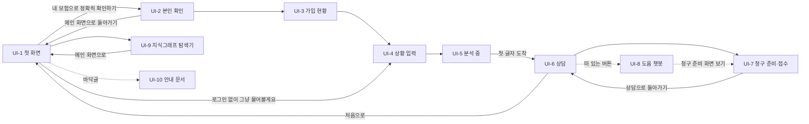

# 화면 설계·와이어프레임 — 보험길잡이

> 1. 화면은 10개다. 사용자 흐름 7개(첫 화면 → 본인 확인 → 가입 현황 → 상황 입력 → 분석 중 → 상담 → 청구 준비), 떠 있는 도움 챗봇, 관리자 그래프, 안내 문서다.
> 2. 중심은 상담 화면이다. 왼쪽에 인용 약관 원본, 오른쪽에 대화가 있고, 판정 카드에 등급·준비도·근거·재청구 안내가 붙는다.
> 3. 배치는 2026년 10월 리디자인 캔버스를 따른다. 흰 바탕·IBM Plex Sans KR·파랑은 주 버튼 하나에만 쓰는 차분한 톤이다. 코드는 아직 이전 화면이라 5장에 적었다.

## 0. 이 문서가 다루는 것

- 사용자가 보는 웹 화면의 구성·요소·규칙을 적는다. 배치와 문구는 리디자인 캔버스(보험길잡이 화면 리디자인, 아트보드 8장)에서 옮겼다. 캔버스가 원본이고 이 문서는 그 기록이다
- 사용자 흐름은 주소 하나(`/app`) 안에서 단계가 바뀐다. 그래서 UI-1부터 UI-7까지 경로가 같다
- 디자인 토큰은 3장에 있다. 색은 IBM Carbon 팔레트에서 골랐고, 글꼴은 IBM Plex Sans KR 하나다. 코드의 `tokens.css`는 아직 이전 값이다(5장)
- 디자인 견본 화면(`/showcase`)은 개발용이라 다루지 않는다. CLI와 CI만 쓰는 유스케이스(적재·배포·평가·인계)는 화면이 없다

## 1. 유스케이스 대응

| 유스케이스 | 화면 |
|---|---|
| [[INS-UC-002#UC-H1]] 청구 가능성 확인하기 | [[#UI-1]] · [[#UI-4]] · [[#UI-5]] · [[#UI-6]] |
| [[INS-UC-002#UC-H2]] 판정 근거를 약관 원본에서 확인하기 | [[#UI-6]] |
| [[INS-UC-002#UC-H3]] 판정 뒤 이어 묻고 사실 고치기 | [[#UI-6]] |
| [[INS-UC-002#UC-H4]] 내 보험 정보로 확인하기 | [[#UI-2]] · [[#UI-3]] |
| [[INS-UC-002#UC-H5]] 여러 실손 비교하기 | [[#UI-3]] · [[#UI-6]] |
| [[INS-UC-002#UC-H6]] 서류 사진으로 정보 채우기 | [[#UI-6]] |
| [[INS-UC-002#UC-H7]] 청구 준비하고 접수하기 | [[#UI-7]] |
| [[INS-UC-002#UC-H8]] 도움 챗봇에 사용법 묻기 | [[#UI-8]] |
| [[INS-UC-002#UC-A1]] 약관 지식그래프 탐색하기 | [[#UI-9]] |
| 면책·개인정보·출처·접근성 안내 ([[INS-PRD-002#R1]] · [[INS-PRD-002#N2]]) | [[#UI-10]] |

## 2. 화면 목록

| 화면 | 경로 | 한 줄 목적 |
|---|---|---|
| UI-1 첫 화면 | `/app` | 내 보험으로 확인할지, 로그인 없이 물을지 고른다 |
| UI-2 본인 확인·마이데이터 동의 | `/app` | 이름·생년월일·휴대폰 번호를 검증하고 조회 동의를 받는다 |
| UI-3 가입 현황 | `/app` | 불러온 실손을 보여 주고 판정할 보험을 고르게 한다 |
| UI-4 상황 입력 | `/app` | 청구 상황을 평소 말투로 쓰게 한다 |
| UI-5 분석 중 | `/app` | 기다리는 동안 지금 단계를 보여 준다 |
| UI-6 상담 | `/app` | 판정·근거 원본·이어 묻기·서류 첨부를 한 화면에서 한다 |
| UI-7 청구 준비·접수 | `/app` | 필요 서류와 요약을 보고 가정으로 접수한다 |
| UI-8 도움 챗봇 | 모든 화면 위 | 사용법과 실손 일반 질문을 따로 묻는다 |
| UI-9 약관 지식그래프 탐색기 | `/admin/graph` | 관리자가 약관 구조와 연결을 훑는다 |
| UI-10 안내 문서 | `/legal/*` | 면책·개인정보·데이터 출처·접근성을 읽는다 |

## UI-1 첫 화면

| 항목 | 내용 |
|---|---|
| 경로 | `/app` (첫 화면 단계) |
| 주 유스케이스 | [[INS-UC-002#UC-H1]] |
| 진입 / 이탈 | 주소 접속·처음으로 / [[#UI-2]] · [[#UI-4]] · [[#UI-9]] · [[#UI-10]] |

### 배치
```html
<div class="board" data-el="1">
  <div class="hdr"><span class="logo" data-el="1.1">보험길잡이</span><span style="display:flex;gap:12px"><span class="fs" data-el="1.2"><span>가</span><span class="on">가</span><span>가</span></span><span class="btn sm" data-el="7">도움</span></span></div>
  <div class="wrap" style="padding-top:72px">
    <div style="grid-column:1/span 7;display:flex;flex-direction:column;gap:24px">
      <span class="eyebrow">실손보험 청구 가능성 안내</span>
      <h1 data-el="2" style="font-size:42px;line-height:1.25">내 보험으로<br>받을 수 있는지,<br>약관을 근거로 알려 드려요</h1>
      <p style="margin:0;font-size:16px;color:var(--muted);max-width:560px">겪으신 상황을 평소 말투로 적어 주시면, 가입하신 약관의 조항을 찾아 청구 가능성과 필요한 서류를 함께 정리해 드립니다.</p>
      <div style="display:flex;gap:12px"><span class="btn" data-el="3">내 보험으로 정확히 확인하기</span><span class="btn sec" data-el="4">로그인 없이 물어볼게요</span></div>
      <p class="muted" style="margin:0">가입 정보 없이도 일반 실손 표준약관 기준으로 먼저 안내해 드려요. 상담 내용은 저장하지 않습니다.</p>
    </div>
    <div style="grid-column:8/span 5;display:flex;flex-direction:column;gap:16px" data-el="5">
      <div class="card"><span class="muted">이렇게 진행돼요</span>
        <ol style="margin:12px 0 0;padding:0;list-style:none;display:flex;flex-direction:column;gap:14px">
          <li><b>1 상황을 말로 적어요</b><div class="muted">보험 용어를 몰라도 괜찮아요</div></li>
          <li><b>2 약관 조항을 찾아요</b><div class="muted">근거 조항의 원문을 함께 보여 드려요</div></li>
          <li><b>3 가능성과 서류를 정리해요</b><div class="muted">높음·중간·낮음과 준비할 서류</div></li>
        </ol></div>
      <div class="card" style="background:var(--gray);border:0;font-size:14px">보험사 5곳의 실손 약관을 바탕으로 안내합니다.<br>보험사의 최종 판단을 대체하지 않아요.</div>
    </div>
  </div>
  <div class="footer" data-el="8"><span>면책 및 이용약관 · 개인정보 처리방침 · 데이터 출처 · 접근성 안내</span><span data-el="6">약관 지식그래프 탐색기 (관리자)</span></div>
</div>
```

### 요소
| # | 이름 | 종류 | 보여주는 것 | 누르면 |
|---|---|---|---|---|
| 1.2 | 글자 크기 전환 | 버튼 셋 | 가(작게)·가(보통)·가(크게), 고른 것은 검정 | 모든 화면의 글자 크기가 바뀐다 |
| 3 | 내 보험으로 확인 | 주 버튼(파랑) | — | [[#UI-2]] |
| 4 | 로그인 없이 묻기 | 보조 버튼(검정 테두리) | — | 직전 세션을 버리고 [[#UI-4]] |
| 5 | 진행 안내 | 카드 둘 | 세 단계 설명 · 데이터 출처와 면책 한 줄 | — |
| 6 | 관리자 그래프 링크 | 바닥글 링크 | — | [[#UI-9]] |
| 7 | 도움 | 머리글 작은 버튼 | — | [[#UI-8]]. 떠 있는 버튼 대신 머리글에 둔다 |
| 8 | 안내 문서 링크 | 바닥글 | 문서 넷 | [[#UI-10]] |

### 규칙
- 새 흐름을 시작하면 직전 세션을 버린다. 앞 사람의 로그인 정보가 이어지지 않는다
- 로그인 없이 들어온 사람도 판정까지 막힘 없이 간다
- 화면에서 파란 것은 주 버튼 하나다. 제목·소제목·번호는 검정이다

## UI-2 본인 확인·마이데이터 동의

| 항목 | 내용 |
|---|---|
| 경로 | `/app` (본인 확인 단계) |
| 주 유스케이스 | [[INS-UC-002#UC-H4]] |
| 진입 / 이탈 | [[#UI-1]] / [[#UI-3]] · [[#UI-1]] |

### 배치
```html
<div class="board" data-el="1">
  <div class="hdr"><span class="logo">보험길잡이</span><span class="steps" data-el="9"><span class="on">1 본인 확인</span><span>2 가입 현황</span><span>3 상황 입력</span><span>4 결과</span></span></div>
  <div class="wrap">
    <div style="grid-column:1/span 7;display:flex;flex-direction:column;gap:24px">
      <span class="muted" data-el="2">← 메인 화면으로 돌아가기</span>
      <h1>본인 확인이 필요합니다</h1>
      <p style="margin:0;color:var(--muted)">가입하신 보험을 안전하게 불러오기 위해 기본 정보와 동의를 받습니다.</p>
      <div class="card" style="display:flex;flex-direction:column;gap:20px;padding:28px">
        <div data-el="3"><div style="font-weight:500;margin-bottom:8px">이름</div><div class="field" style="color:var(--ink)">홍길동</div></div>
        <div data-el="4"><div style="font-weight:500;margin-bottom:8px">생년월일</div><div class="field">예) 19850412</div><div class="muted" style="margin-top:6px">점(.) 없이 숫자 8자리로 입력해 주세요.</div></div>
        <div data-el="5"><div style="font-weight:500;margin-bottom:8px">휴대폰 번호</div><div style="display:flex;gap:10px"><div class="field" style="flex:1;color:var(--ink)">010-1234-5678</div><span class="btn sec" style="height:56px">본인 인증</span></div></div>
        <div class="card" style="padding:14px 16px;display:flex;justify-content:space-between" data-el="6"><span>☑ 마이데이터 보험 조회 동의 <span class="tag">필수</span></span><span class="muted">전문 보기</span></div>
        <div class="card" style="padding:14px 16px;display:flex;justify-content:space-between" data-el="7"><span>☑ 개인정보 수집 및 이용 동의 <span class="tag">필수</span></span><span class="muted">전문 보기</span></div>
        <span class="btn" data-el="8">내 보험 조회하기</span>
      </div>
    </div>
    <div class="col4" style="grid-column:8/span 4;padding-top:112px">
      <div class="card"><b>안심하셔도 됩니다</b><p class="muted" style="margin:8px 0 0">입력하신 정보는 가입 보험을 찾는 데만 쓰고, 상담이 끝나면 지웁니다. 주민등록번호·계좌번호 같은 정보는 받지 않아요.</p></div>
      <div class="card" style="background:var(--amber-bg);border:0;color:var(--amber)"><b>형식이 틀리면</b><div style="margin-top:6px">칸 아래에 고칠 방법과 예시를 바로 보여 드려요. 예) "생년월일 8자리를 입력해 주세요 (19850412)"</div></div>
    </div>
  </div>
</div>

<div class="var">형식 오류 — 칸 아래에 고칠 방법과 예시가 뜬다</div>
<div class="board" style="min-height:180px"><div class="wrap" style="padding:24px 48px"><div style="grid-column:1/span 7"><div style="font-weight:500;margin-bottom:8px">생년월일</div><div class="field" style="border-color:var(--red);color:var(--ink)">1985.04.12</div><div style="margin-top:6px;font-size:14px;color:var(--red)">생년월일 8자리를 정확히 입력해 주세요. (예: 19850412)</div></div></div></div>
```

### 요소
| # | 이름 | 종류 | 보여주는 것 | 누르면 |
|---|---|---|---|---|
| 9 | 진행 단계 | 머리글 알약 넷 | 본인 확인 → 가입 현황 → 상황 입력 → 결과. 지금 단계는 검정, 지난 단계는 회색에 ✓ | — |
| 3·4·5 | 입력칸 | 56px 입력 | 이름·생년월일·휴대폰 번호 | 형식이 틀리면 칸 아래 빨간 안내 |
| 6·7 | 동의 | 체크 카드 | 필수 둘 | 전문 보기 |
| 8 | 조회 버튼 | 주 버튼(파랑) | — | [[#UI-3]] |

### 규칙
- 이름은 한글·영문 두 글자 이상, 생년월일은 실제 날짜인 8자리, 휴대폰 번호는 01로 시작하는 10~11자리다. 하이픈은 자동으로 넣는다([[INS-PRD-002#R14]])
- 형식이 맞고, 본인 인증을 마치고, 동의 두 개를 모두 체크해야 조회 버튼이 켜진다. 인증을 마치면 입력칸이 잠긴다
- 시연 계정은 다음 단계인 [[#UI-3]]에서 이름과 휴대폰 번호로 찾는다. 이 화면은 형식과 동의만 확인한다

## UI-3 가입 현황

| 항목 | 내용 |
|---|---|
| 경로 | `/app` (보험 확인 단계) |
| 주 유스케이스 | [[INS-UC-002#UC-H4]] · [[INS-UC-002#UC-H5]] |
| 진입 / 이탈 | [[#UI-2]] / [[#UI-4]] |

### 배치
```html
<div class="board" data-el="1">
  <div class="hdr"><span class="logo">보험길잡이</span><span class="steps"><span class="done">1 본인 확인 ✓</span><span class="on">2 가입 현황</span><span>3 상황 입력</span><span>4 결과</span></span></div>
  <div class="wrap">
    <div class="col8">
      <span class="eyebrow">홍길동 님 · 마이데이터로 확인</span>
      <h1>지금 가입하신 실손보험이에요</h1>
      <p style="margin:0;color:var(--muted)">판정에 쓸 보험을 골라 주세요. 여러 개를 고르면 어느 약관이 이 상황에 더 유리한지 비교해 드려요.</p>
      <div class="card" style="display:flex;align-items:center;gap:16px;border:1.5px solid var(--ink);border-radius:10px;padding:20px 22px" data-el="3">☑ <span style="flex:1"><b style="font-size:16px">삼성화재 · 실손의료보험</b><div class="muted">증권 S-2024-001 · 2024년 1월 가입</div></span><span class="tag">4세대</span></div>
      <div class="card" style="display:flex;align-items:center;gap:16px;border:1.5px solid var(--ink);border-radius:10px;padding:20px 22px" data-el="4">☑ <span style="flex:1"><b style="font-size:16px">현대해상 · 실손의료보험</b><div class="muted">증권 H-2019-310 · 2019년 6월 가입</div></span><span class="tag">3세대</span></div>
      <div class="card" style="display:flex;align-items:center;gap:16px;background:var(--gray);color:var(--muted);padding:20px 22px" data-el="5">☐ <span style="flex:1"><b style="font-size:16px;font-weight:500">○○생명 · 종신보험</b><div>실손이 아니라 이 서비스에서는 판정하지 않아요</div></span><span class="tag">판정 대상 아님</span></div>
      <div class="card" style="font-size:14px" data-el="2">ⓘ 실손은 여러 개 가입해도 실제 낸 의료비 한도 안에서 보험사끼리 나눠 지급해요(이중 수령 불가). 대신 세대와 자기부담률이 달라 어느 약관이 유리한지는 비교할 수 있어요.</div>
      <span class="btn" style="align-self:flex-start" data-el="6">2개 보험으로 상황 입력하기</span>
    </div>
    <div class="col4" style="padding-top:104px">
      <div class="card"><b>세대란?</b><p class="muted" style="margin:8px 0 0">가입 시기에 따라 자기부담률이 달라요. 4세대는 급여 20%·비급여 30%, 3세대는 10%·20%입니다.</p></div>
      <div class="card"><b>연동된 실손이 없다면</b><p class="muted" style="margin:8px 0 0">가입 정보 없이도 표준약관 기준으로 안내해 드려요. 상황 입력으로 바로 가셔도 됩니다.</p></div>
    </div>
  </div>
</div>

<div class="var">빈 상태 — 연동된 실손이 없을 때. 시연 계정을 찾지 못했거나 불러오기에 실패해도 이 상태다</div>
<div class="board" style="min-height:200px"><div class="wrap"><div class="col8"><h1>연동된 가입 실손이 없어요</h1><p style="margin:0;color:var(--muted)">가입 보험 정보 없이도 상황을 입력하면 일반 실손 표준약관 기준으로 안내해 드릴 수 있어요.</p><span class="btn" style="align-self:flex-start">상황 입력으로 계속</span></div></div></div>
```

### 요소
| # | 이름 | 종류 | 보여주는 것 | 누르면 |
|---|---|---|---|---|
| 2 | 비례분담 안내 | 카드 | 실손이 둘 이상일 때만 | — |
| 3·4 | 실손 항목 | 체크 카드(검정 테두리) | 보험사·상품·증권 번호·가입 시기·세대 | 판정 대상에 넣고 뺀다 |
| 5 | 실손이 아닌 보험 | 회색 카드 | 판정 대상 아님과 그 이유 | 고를 수 없다. **목표 동작** — 지금 코드는 이 줄을 보여 주지 않는다 |
| 6 | 진행 버튼 | 주 버튼(파랑) | 하나면 "이 보험으로 상황 입력하기", 여럿이면 "N개 보험으로 상황 입력하기" | [[#UI-4]] |
| — | 옆 안내 | 카드 둘(4칸 폭) | 세대 설명 · 실손이 없을 때 | — |

### 규칙
- 실손을 하나만 골라도, 여럿 골라도 진행한다. 여럿이면 상담 화면이 비교로 답한다([[INS-PRD-002#R17]])
- 시연 계정을 찾지 못하거나 가입 보험을 불러오지 못해도 빈 상태를 보이고 상황 입력으로 계속하게 한다. 세 경우를 나눠 알리지 않는다([[INS-UC-002#UC-H4]]). 계정을 찾지 못했으면 로그인되지 않은 채로 이어 간다

## UI-4 상황 입력

| 항목 | 내용 |
|---|---|
| 경로 | `/app` (상황 입력 단계) |
| 주 유스케이스 | [[INS-UC-002#UC-H1]] |
| 진입 / 이탈 | [[#UI-1]] · [[#UI-3]] / [[#UI-5]] |

### 배치
```html
<div class="board" data-el="1">
  <div class="hdr"><span class="logo">보험길잡이</span><span class="steps"><span class="done">1 본인 확인 ✓</span><span class="done">2 가입 현황 ✓</span><span class="on">3 상황 입력</span><span>4 결과</span></span></div>
  <div class="wrap">
    <div class="col8">
      <h1>지금 어떤 상황이신가요?</h1>
      <p style="margin:0;color:var(--muted)" data-el="2">겪고 계신 일을 평소 말씀하시는 그대로 적어 주세요. 삼성화재·현대해상 실손 약관과 함께 살펴보고 안내해 드립니다.</p>
      <div style="font-weight:500">상황</div>
      <div class="field" style="height:auto;min-height:180px;align-items:flex-start;padding:18px 20px;border-radius:10px" data-el="3">예) 지난주 계단에서 넘어져 발목이 부러졌어요. 3일 입원했고 수술은 안 했어요. 보험금을 받을 수 있을까요?</div>
      <div data-el="6"><span class="chip">넘어져서 다쳤어요</span><span class="chip">입원했어요</span><span class="chip">통원 치료 중이에요</span><span class="chip">도수치료를 받았어요</span></div>
      <p class="muted" style="margin:0" data-el="4">정확하지 않아도 괜찮습니다. 더 필요한 내용은 한 번만 다시 여쭤볼게요. 서류 사진은 다음 화면에서 올릴 수 있어요.</p>
      <span class="btn" style="align-self:flex-start" data-el="5">확인 시작하기</span>
    </div>
    <div class="col4" style="padding-top:72px">
      <div class="card"><b>이런 것을 적으면 좋아요</b><ul class="muted" style="margin:8px 0 0;padding-left:18px"><li>언제, 어디서 다쳤는지</li><li>진단명이나 증상</li><li>입원 일수 또는 통원 횟수</li><li>낸 병원비(대략)</li></ul></div>
      <div class="card" style="background:var(--gray);border:0">판정에 쓸 보험 2개<br><b>삼성화재 4세대 · 현대해상 3세대</b></div>
    </div>
  </div>
</div>
```

### 요소
| # | 이름 | 종류 | 보여주는 것 | 누르면 |
|---|---|---|---|---|
| 3 | 상황 입력 | 큰 입력칸(180px) | 예시 문장 | — |
| 6 | 자주 쓰는 표현 | 칩 넷 | 넘어짐·입원·통원·도수치료 | 입력칸에 그 문장이 들어간다 |
| 5 | 확인 시작 | 주 버튼(파랑) | — | [[#UI-5]] |
| — | 옆 안내 | 카드 둘 | 적으면 좋은 것 · 판정에 쓸 보험 | — |

### 규칙
- 안내 문구(2)는 로그인 여부에 따라 바뀐다. 로그인했으면 "가입한 보험과 약관을 함께 살펴보고 안내해드립니다"다
- 짧게 써도 보낼 수 있다([[INS-PRD-002#R5]])

## UI-5 분석 중

| 항목 | 내용 |
|---|---|
| 경로 | `/app` (분석 중 단계) |
| 주 유스케이스 | [[INS-UC-002#UC-H1]] |
| 진입 / 이탈 | [[#UI-4]] / [[#UI-6]] |

### 배치
```html
<div class="board" data-el="1">
  <div class="hdr"><span class="logo">보험길잡이</span><span class="steps"><span class="done">1 본인 확인 ✓</span><span class="done">2 가입 현황 ✓</span><span class="done">3 상황 입력 ✓</span><span class="on">4 결과</span></span></div>
  <div style="display:flex;justify-content:center;padding:48px">
    <div class="card" style="width:640px;padding:44px 48px;display:flex;flex-direction:column;gap:28px;border-radius:14px">
      <div><span class="eyebrow">보통 30초 안에 끝나요</span><h1 style="font-size:28px;margin-top:8px">약관과 대조하고 있어요</h1></div>
      <ol style="margin:0;padding:0;list-style:none" data-el="2">
        <li style="padding:14px 0;border-bottom:1px solid var(--gray);color:var(--green)">✓ 가입 보험 2개를 확인했어요</li>
        <li style="padding:14px 0;border-bottom:1px solid var(--gray);color:var(--green)">✓ 관련 약관 조항을 찾았어요</li>
        <li style="padding:14px 0;border-bottom:1px solid var(--gray);font-weight:600">◌ 입력하신 상황과 보장 항목을 비교하고 있어요</li>
        <li style="padding:14px 0;color:var(--muted)">○ 필요한 확인 사항을 정리할게요</li>
      </ol>
      <div class="card" style="background:var(--gray);border:0;font-size:14px" data-el="3"><b>기다리는 동안</b> — 결과가 나오면 왼쪽에 근거 조항의 약관 원문이 그대로 보여요. 판정은 보험사의 최종 결정을 대신하지 않습니다.</div>
    </div>
  </div>
</div>
```

### 규칙
- 네 단계가 차례로 ✓로 바뀌고, 지금 단계는 굵은 글씨에 회전 표시(◌)다. 화면이 멈춰 보이지 않게 단계가 계속 바뀐다
- 답의 첫 글자가 오면 기다리지 않고 바로 [[#UI-6]]으로 넘어간다([[INS-PRD-002#R10]])

## UI-6 상담

| 항목 | 내용 |
|---|---|
| 경로 | `/app` (상담 단계) |
| 주 유스케이스 | [[INS-UC-002#UC-H1]] · [[INS-UC-002#UC-H2]] · [[INS-UC-002#UC-H3]] · [[INS-UC-002#UC-H5]] · [[INS-UC-002#UC-H6]] |
| 진입 / 이탈 | [[#UI-5]] / [[#UI-7]] · [[#UI-1]](처음으로) |

### 배치
```html
<div class="board" style="background:#fff" data-el="1">
  <div class="hdr" style="padding:0 32px"><span style="display:flex;align-items:center;gap:20px"><span class="logo">보험길잡이</span><span class="tag" data-el="2.1">홍길동 님 · 마이데이터 연동 · 실손 2개</span></span><span style="display:flex;gap:10px;align-items:center"><span class="fs"><span>가</span><span class="on">가</span><span>가</span></span><span class="btn" style="height:44px;padding:0 16px;font-size:15px" data-el="4.1">청구 준비하기</span><span class="muted" data-el="4.2">처음으로</span></span></div>
  <div style="display:grid;grid-template-columns:440px 1fr;min-height:760px">
    <div style="padding:24px;border-right:1px solid var(--line);display:flex;flex-direction:column;gap:14px" data-el="3">
      <div><span class="muted">근거 약관 원문</span><div style="font-size:18px;font-weight:600">제3조 보장종목별 보상내용</div><div class="muted">삼성화재 · 실손의료보험 · 약관 40쪽</div></div>
      <div data-el="3.4"><span class="tag" style="background:var(--ink);color:#fff">삼성화재</span> <span class="tag" style="background:#fff;border:1px solid var(--line-strong)">현대해상</span></div>
      <div style="position:relative;height:480px;background:var(--gray);border:1px solid var(--line);border-radius:10px" data-el="3.1"><div class="hl" style="left:20px;top:112px;width:360px;height:64px"></div><div style="position:absolute;left:0;right:0;bottom:0;padding:10px 14px;background:rgba(22,22,22,.78);color:#fff;font-size:13px">노란 부분이 판정 근거로 인용한 문장이에요</div></div>
      <div style="padding:14px 16px;border-left:3px solid var(--ink);background:var(--gray);font-size:15px;border-radius:0 8px 8px 0" data-el="3.3">"회사는 피보험자가 상해로 인하여 병원에 입원하여 치료를 받은 경우 입원의료비를 보상합니다."</div>
      <div style="display:flex;gap:8px" data-el="3.2"><span class="btn sm" style="flex:1">크게 보기</span><span class="btn sm" style="flex:1">원본 PDF 열기</span></div>
    </div>
    <div style="display:flex;flex-direction:column;background:var(--gray)">
      <div style="flex:1;padding:28px 40px;display:flex;flex-direction:column;gap:20px;max-width:820px;width:100%;box-sizing:border-box;margin:0 auto">
        <div class="bubble-me">지난주 계단에서 넘어져 발목이 부러졌어요. 3일 입원했고 수술은 안 했어요.</div>
        <div class="card" style="display:flex;flex-direction:column;gap:18px;padding:24px 26px" data-el="5">
          <div style="display:flex;justify-content:space-between;align-items:center;gap:16px"><span><span class="muted">청구 가능성</span> <span class="grade high"><i></i>높음</span></span><span style="min-width:240px" data-el="5.1"><span class="muted" style="display:flex;justify-content:space-between">청구 준비도 <b style="color:var(--ink)">78점</b></span><span class="gauge"><i></i></span><span class="muted" style="font-size:13px">준비가 얼마나 됐는지예요. 지급 확률이 아닙니다.</span></span></div>
          <p style="margin:0;font-size:16px;line-height:1.7">발목 골절로 입원한 치료는 실손에서 보상되는 경우가 많아요. 근거로 보여 드린 <b>제3조</b>는 상해로 입원했을 때 본인이 부담한 의료비를 보상한다고 정하고 있어요. 급여·비급여 금액을 알려 주시면 자기부담금까지 계산해 드릴 수 있어요.</p>
          <div style="display:grid;grid-template-columns:1fr 1fr;gap:12px;font-size:15px" data-el="5.2"><div style="padding:14px 16px;background:var(--green-bg);border-radius:8px"><b style="color:var(--green)">충족한 요건</b><ul style="margin:8px 0 0;padding-left:18px"><li>상해로 인한 입원 치료</li><li>사고일이 보장 기간 안</li></ul></div><div style="padding:14px 16px;background:var(--amber-bg);border-radius:8px"><b style="color:var(--amber)">확인이 필요한 것</b><ul style="margin:8px 0 0;padding-left:18px"><li>급여·비급여 금액</li><li>자동차·산재보험 처리 여부</li></ul></div></div>
          <div style="border-top:1px solid var(--gray);padding-top:14px;font-weight:500" data-el="5.3">▸ 이렇게 보완하면 더 확실해져요 <span class="muted" style="font-weight:400">— 펼치면 미충족마다 보완 행동과 근거 조항</span></div>
          <div data-el="5.4"><span class="chip">통원 치료도 되나요?</span><span class="chip">필요한 서류는요?</span><span class="chip">현대해상이랑 비교해 주세요</span></div>
          <span class="muted" style="font-size:13px">본 안내는 약관 기반 참고용이며 보험사의 최종 판단을 대체하지 않습니다.</span>
        </div>
        <div class="card" data-el="9"><b>보험 2개 비교</b>
          <table style="width:100%;border-collapse:collapse;font-size:15px;margin-top:10px"><tr class="muted" style="text-align:left"><th style="font-weight:500;padding:8px 6px;border-bottom:1px solid var(--line)">보험</th><th style="font-weight:500;padding:8px 6px;border-bottom:1px solid var(--line)">가능성</th><th style="font-weight:500;padding:8px 6px;border-bottom:1px solid var(--line)">세대</th><th style="font-weight:500;padding:8px 6px;border-bottom:1px solid var(--line)">비급여 자기부담</th><th style="font-weight:500;padding:8px 6px;border-bottom:1px solid var(--line)">예상 분담액</th><th style="border-bottom:1px solid var(--line)"></th></tr>
          <tr><td style="padding:10px 6px">삼성화재 실손</td><td style="padding:10px 6px;color:var(--green);font-weight:600">높음</td><td style="padding:10px 6px">4세대</td><td style="padding:10px 6px">30%</td><td style="padding:10px 6px;color:var(--muted)">금액 입력 시</td><td></td></tr>
          <tr style="background:var(--gray)"><td style="padding:10px 6px">현대해상 실손</td><td style="padding:10px 6px;color:var(--green);font-weight:600">높음</td><td style="padding:10px 6px">3세대</td><td style="padding:10px 6px">20%</td><td style="padding:10px 6px;color:var(--muted)">금액 입력 시</td><td><span class="tag" style="background:var(--blue);color:#fff;font-weight:600">먼저 청구 추천</span></td></tr></table>
        </div>
      </div>
      <div style="display:flex;gap:10px;padding:16px 40px 20px;border-top:1px solid var(--line);background:#fff" data-el="6"><span class="btn sm" style="width:52px;height:52px;padding:0">📎</span><div class="field" style="flex:1;height:52px">궁금한 점이나 더 알려 줄 내용을 적어 주세요</div><span class="btn" style="height:52px;padding:0 22px">보내기</span></div>
    </div>
  </div>
</div>

<div class="var">되묻기(8) — 판정 전 한 번. 어시스턴트 말풍선 아래에 선택지가 붙는다</div>
<div class="board" style="min-height:140px;background:#fff"><div style="padding:24px 40px;max-width:820px" data-el="8"><div class="card" style="padding:18px 22px"><b>입원하셨나요, 통원하셨나요?</b><div style="margin-top:12px"><span class="chip">입원</span><span class="chip">통원</span><span class="chip">둘 다</span><span class="chip">모르겠습니다</span></div></div></div></div>

<div class="var">원본 크게 보기(10) — 캡처를 눌렀을 때 화면 가운데 큰 이미지, 하이라이트 유지</div>
<div class="board" style="position:relative;min-height:260px"><div style="position:absolute;inset:0;background:rgba(22,22,22,.42);display:flex;align-items:center;justify-content:center"><div data-el="10" style="width:640px;height:220px;background:#fff;position:relative;border-radius:10px"><div class="hl" style="left:40px;top:60px;width:520px;height:60px"></div><span class="muted" style="position:absolute;right:12px;top:8px">닫기</span></div></div></div>

<div class="var">오류(11) — 응답이 실패했을 때</div>
<div class="board" style="min-height:100px;background:#fff"><div class="card" data-el="11" style="margin:16px 40px;display:flex;justify-content:space-between;align-items:center">일시적인 문제가 발생했어요 <span class="btn sm">다시 시도</span></div></div>
```

### 요소
| # | 이름 | 종류 | 보여주는 것 | 누르면 |
|---|---|---|---|---|
| 2.1 | 사용자 표시 | 머리글 알약 | 로그인이면 "홍길동 님 · 마이데이터 연동 · 실손 N개", 아니면 "비로그인 · 표준약관 기준" | — |
| 3 | 근거 원본 패널(440px) | 영역 | 조 제목·보험사·쪽 · 보험사 탭(3.4) · 캡처(3.1) · 인용문(3.3) · 크게 보기·원본 PDF(3.2) | — |
| 3.1 | 원본 캡처 | 이미지 | 형광펜처럼 이어진 하이라이트 블록, 아래에 "노란 부분이 판정 근거로 인용한 문장" 설명 띠 | 확대 보기(10) |
| 3.4 | 보험사 탭 | 알약 둘 | 비교 중인 보험사. 고른 것은 검정 | 원본 패널이 그 보험사 약관으로 바뀐다 |
| 4.1 | 청구 준비하기 | 머리글 주 버튼(파랑) | 판정이 있을 때 | [[#UI-7]] |
| 4.2 | 처음으로 | 머리글 글자 링크 | — | [[#UI-1]]. "상담 내용 저장"은 뺐다(5장) |
| 5 | 판정 카드 | 흰 카드 | 등급 알약(색 점 + 글자)·준비도 게이지·요약·충족/확인 필요 두 칸(5.2)·접힌 재청구 안내(5.3)·이어 묻기 칩(5.4)·면책 문구 | 5.3 펼치기 |
| 5.1 | 준비도 게이지 | 게이지 | 점수와 "지급 확률이 아닙니다" | — |
| 6 | 입력창 | 입력 | 첨부 버튼(52px)·글 입력·보내기(파랑) | 첨부 → 서류 사진 선택(JPEG·PNG·WebP), 보내기 |
| 8 | 되묻기 선택지 | 말풍선 안 칩 | 선택지와 "모르겠습니다" | 답으로 보낸다. 떠 있는 패널이 아니라 대화 흐름 안에 둔다 |
| 9 | 비교표 | 카드 안 표 | 보험별 가능성·세대·비급여 자기부담·예상 분담액·"먼저 청구 추천" | 보험사 탭(3.4)과 같이 움직인다 |

### 규칙
- 사람의 말은 오른쪽 검정 말풍선, 챗봇은 왼쪽 흰 카드다. 답은 SSE로 흘러나오고, 타이핑하듯 일정한 속도로 보인다
- 화면에서 파란 것은 머리글의 청구 준비하기, 보내기, 추천 표시 셋뿐이다. 등급은 색 점과 글자로 함께 보여 색만으로 구분하지 않는다
- 인용 번호·내부 식별자는 본문에 보이지 않는다. 마크다운은 서식으로 보인다
- 보험사가 바뀌면 원본 패널과 보험사 표기가 함께 바뀐다
- 첨부로 올린 서류에서 뽑은 항목은 서버가 대화 정보에 바로 채우고, 채운 항목을 어시스턴트 메시지로 보여 준다. 틀린 것은 말로 고친다. 사진이 흐려(인식 신뢰도 0.6 미만) 채우지 못했으면 더 선명한 사진으로 다시 올리거나 직접 알려 달라고 안내한다. 도움 챗봇에서 진료내역을 고르면 그 진료를 설명하는 문장("○○병원에서 ○일 입원 진료받았어요…")이 사용자 메시지로 바로 보내진다

### 시나리오
**S-1 짧게 묻고 근거를 확인한다** — [[INS-UC-002#UC-H1]] · [[INS-UC-002#UC-H2]]
1. 사용자가 짧게 묻고, 판정 카드와 왼쪽 원본을 받는다
2. 원본을 눌러 확대하고, 가로 약관이면 단을 바꿔 본다

## UI-7 청구 준비·접수

| 항목 | 내용 |
|---|---|
| 경로 | `/app` (청구 준비 단계) |
| 주 유스케이스 | [[INS-UC-002#UC-H7]] |
| 진입 / 이탈 | [[#UI-6]]·[[#UI-8]]의 청구 준비 화면 보기 / [[#UI-6]] |

### 배치
```html
<div class="board" data-el="1">
  <div class="hdr"><span class="logo">보험길잡이</span><span class="btn sm">← 상담으로 돌아가기</span></div>
  <div class="wrap">
    <div class="col8">
      <div><span class="eyebrow">청구 준비</span><h1 style="margin-top:8px">청구 전 마지막 확인</h1><p style="margin:8px 0 0;color:var(--muted)">정리된 내용을 함께 살펴봐 주세요. 아래 내용으로 보험사에 청구할 수 있어요.</p></div>
      <div class="card" style="display:grid;grid-template-columns:1fr 1fr;gap:20px" data-el="2"><div><span class="muted">먼저 청구할 보험</span><div style="font-size:16px;font-weight:600">현대해상 · 실손의료보험</div><div class="muted">3세대 · 비급여 자기부담 20%</div></div><div data-el="3"><span class="muted">청구 가능성</span><div><span class="grade high"><i></i>높음</span></div><div class="muted">상해 입원 · 제3조 근거</div></div><div style="grid-column:1/span 2;border-top:1px solid var(--gray);padding-top:16px"><span class="muted" style="display:flex;justify-content:space-between">청구 준비도 <b style="color:var(--ink)">78점 · 서류 2개를 올리면 90점</b></span><span class="gauge"><i></i></span></div></div>
      <div class="card" data-el="4"><div style="display:flex;justify-content:space-between;align-items:baseline"><b style="font-size:16px">준비할 서류</b><span class="muted">자동 확인 2 · 올릴 것 2 · 선택 1</span></div>
        <div style="display:flex;justify-content:space-between;align-items:center;padding:14px 0;border-bottom:1px solid var(--gray)"><span><b>보험금 청구서</b><div class="muted">상담 내용으로 자동 작성돼요</div></span><span class="tag ok">자동 확인</span></div>
        <div style="display:flex;justify-content:space-between;align-items:center;padding:14px 0;border-bottom:1px solid var(--gray)"><span><b>진단서</b><div class="muted">상담 중 올린 사진으로 확인했어요</div></span><span class="tag ok">자동 확인</span></div>
        <div style="display:flex;justify-content:space-between;align-items:center;padding:14px 0;border-bottom:1px solid var(--gray)"><span><b>진료비 영수증</b><div class="muted">급여·비급여 금액이 적힌 것</div></span><span class="btn sm" style="border-color:var(--amber);color:var(--amber);font-weight:600">사진 올리기</span></div>
        <div style="display:flex;justify-content:space-between;align-items:center;padding:14px 0;border-bottom:1px solid var(--gray)"><span><b>입·퇴원 확인서</b><div class="muted">3일 입원이라 필요해요</div></span><span class="btn sm" style="border-color:var(--amber);color:var(--amber);font-weight:600">사진 올리기</span></div>
        <div style="display:flex;justify-content:space-between;align-items:center;padding:14px 0"><span><b style="font-weight:500">진료비 세부내역서</b><div class="muted">비급여 항목을 더 정확히 보려면</div></span><span class="tag">선택</span></div>
      </div>
      <div class="card" data-el="5"><b style="font-size:16px">이렇게 진행하세요</b><ol style="margin:8px 0 0;padding-left:22px"><li>위 서류를 사진으로 준비합니다</li><li>현대해상 앱이나 고객센터에 먼저 청구합니다</li><li>남은 금액은 삼성화재에 이어서 청구합니다 (보험사끼리 나눠 지급)</li></ol></div>
      <div class="card" style="background:var(--amber-bg);border:0;color:var(--amber);font-size:14px" data-el="6"><b>접수 전 확인해 주세요</b><br>이 접수는 시연 환경의 가정 처리이며 실제 보험사로 전송되지 않습니다. 예상 결과는 약관 기반 추정이며 실제 지급 여부는 보험사 심사에 따릅니다.</div>
      <div style="display:flex;gap:12px;align-items:center"><span class="btn" data-el="7">청구 접수하기</span><span class="muted">접수하면 접수번호와 예상 심사 기간(영업일 약 5일)을 보여 드려요.</span></div>
    </div>
    <div class="col4" style="padding-top:120px">
      <div class="card"><b>왜 현대해상이 먼저인가요?</b><p class="muted" style="margin:8px 0 0">두 보험 모두 보장되지만 비급여 자기부담률이 20%로 더 낮아요. 먼저 청구하면 받는 금액이 커집니다.</p></div>
      <div class="card"><b>준비도 점수는</b><p class="muted" style="margin:8px 0 0">가능성 등급·요건 충족·정보 완성도를 더한 값이에요. 서류를 올리면 올라가고, 지급 확률과는 달라요.</p></div>
    </div>
  </div>
</div>

<div class="var">접수 완료(8) — 접수하기를 눌렀을 때</div>
<div class="board" style="min-height:220px"><div class="wrap"><div class="col8" data-el="8"><span class="eyebrow">접수 완료</span><h1>청구가 접수되었어요</h1><div class="card"><b>접수 정보</b><p style="margin:8px 0 0">접수번호 CLM-20261001-A1B2C3 · 예상 심사 기간 영업일 약 5일 · 접수완료</p></div><span class="btn sec" style="align-self:flex-start">상담으로 돌아가기</span></div></div></div>
```

### 요소
| # | 이름 | 종류 | 보여주는 것 | 누르면 |
|---|---|---|---|---|
| 2 | 청구 대상과 결과 | 카드 | 먼저 청구할 보험 · 등급 알약 · 준비도 게이지("서류 N개를 올리면 M점") | — |
| 4 | 필요 서류 | 카드 목록 | 서류마다 이름·이유와 상태 셋 — 자동 확인(녹색 배지) · 올릴 것(호박색 "사진 올리기" 버튼) · 선택(회색 배지). 머리에 상태별 개수 | 사진 올리기 → 서류 사진 선택. **목표 동작** — 지금 코드는 필수·선택 둘뿐이다(5장) |
| 5 | 다음 단계 | 카드 | 보험사 둘일 때 먼저 청구할 곳과 이어서 청구할 곳 | — |
| 6 | 가정 처리 안내 | 호박색 카드 | 접수 버튼 바로 위 | — |
| 7 | 청구 접수하기 | 주 버튼(파랑) | 옆에 접수번호·심사 기간 안내 | 접수 완료(8) |
| — | 옆 안내 | 카드 둘 | 왜 이 보험이 먼저인지 · 준비도가 무엇인지 | — |

### 규칙
- 판정 전에 들어오면 "아직 평가가 완료되지 않았어요"를 보여 준다
- 필요 서류는 자동 확인·올릴 것·선택 세 상태로 보여 준다. 지금 코드는 필수·선택 둘뿐이라 5장 미결사항이다
- 접수는 실제로 보내지 않는다. 가정 처리임을 접수 버튼 바로 위에 적는다([[INS-PRD-002#R18]])

## UI-8 도움 챗봇

| 항목 | 내용 |
|---|---|
| 경로 | 모든 화면 위 (오른쪽 아래) |
| 주 유스케이스 | [[INS-UC-002#UC-H8]] |
| 진입 / 이탈 | 떠 있는 버튼 / 닫기 |

### 배치
```html
<div class="board" style="min-height:800px;display:flex;justify-content:flex-end;align-items:flex-end;padding:24px;box-sizing:border-box" data-el="1">
  <div style="width:440px;height:760px;background:#fff;border:1px solid var(--line);border-radius:14px;display:flex;flex-direction:column;overflow:hidden" data-el="2">
    <div style="display:flex;justify-content:space-between;align-items:center;padding:16px 20px;border-bottom:1px solid var(--line);background:var(--gray)"><span><span class="muted">←</span> <b>도움 챗봇</b></span><span class="muted">크게 보기 · 닫기</span></div>
    <div style="flex:1;padding:20px;display:flex;flex-direction:column;gap:16px">
      <div class="bubble-me" style="max-width:80%;padding:12px 16px">비급여가 뭔가요?</div>
      <div style="max-width:92%;display:flex;flex-direction:column;gap:10px" data-el="6"><div style="background:var(--gray);padding:14px 16px;border-radius:12px 12px 12px 4px">건강보험이 적용되지 않아 본인이 전액 내는 진료비예요. 실손에서는 세대에 따라 일부를 자기부담으로 빼고 보상해요. 예를 들어 4세대는 비급여의 30%를 본인이 부담합니다.</div><div class="card" style="padding:10px 12px;font-size:13px;color:var(--muted)">근거 · 현대해상 실손의료보험 제3조</div><span class="muted" style="font-size:13px">보험사·세대에 따라 다를 수 있어요. 내 보험으로 확인하면 더 정확해요.</span></div>
      <div style="margin-top:auto"><span class="muted" style="font-size:13px">이어서 물어보기</span><div style="margin-top:8px"><span class="chip" style="font-size:14px">도수치료도 비급여인가요?</span><span class="chip" style="font-size:14px">자기부담금은 얼마예요?</span></div><div style="display:flex;gap:8px;margin-top:4px" data-el="4"><span class="btn sm" style="flex:1;height:48px">최근 진료 내역 가져오기</span><span class="btn sm" style="flex:1;height:48px">청구 준비 화면 보기</span></div></div>
    </div>
    <div style="display:flex;gap:8px;padding:14px 16px 18px;border-top:1px solid var(--line)" data-el="5"><div class="field" style="flex:1;height:48px">여기에 물어보세요</div><span class="btn" style="width:48px;height:48px;padding:0">➤</span></div>
  </div>
</div>

<div class="var">처음 열었을 때(3) — 자주 묻는 질문 넷과 빠른 작업이 보인다</div>
<div class="board" style="min-height:160px"><div class="wrap" style="padding:24px 48px"><div class="col8" data-el="3"><b>자주 묻는 질문</b><div><span class="chip">실손보험이 뭔가요?</span><span class="chip">비급여·자기부담금이 뭔가요?</span><span class="chip">실손으로 보상 안 되는 치료도 있나요?</span><span class="chip">청구하려면 어떤 서류가 필요한가요?</span></div></div></div></div>
```

### 요소
| # | 이름 | 종류 | 보여주는 것 | 누르면 |
|---|---|---|---|---|
| 2 | 챗봇 패널 | 오른쪽 아래 440×760 패널 | 머리글(뒤로·크게 보기·닫기)·대화·이어 묻기·빠른 작업·입력 | — |
| 3 | 자주 묻는 질문 | 칩 넷 | 처음 열었을 때 | 그 질문을 보낸다 |
| 4 | 빠른 작업 | 작은 버튼 둘 | 최근 진료 내역 가져오기 · 청구 준비 화면 보기 | 상담 화면에서만 보인다 |
| 6 | 답 | 회색 말풍선 + 근거 카드 | 답·근거 조항(보험사·상품·조)·"보험사·세대에 따라 다를 수 있어요" | — |

### 규칙
- 사용법 질문은 인용 없이 답한다. 실손 일반 질문은 보험사 구분 없이 약관을 검색해 근거 조항을 붙여 답한다. 근거 조항은 그 조항의 보험사·상품·조 번호로 표시된다
- 등급을 매기는 정식 판정은 하지 않는다. 본인 사례를 물으면 표준약관 기준 일반 안내를 하고, 내 보험으로 확인하기를 권한다
- 빠른 작업은 상담 화면에서 열었을 때만 보인다. 청구 준비 화면 보기는 판정이 있을 때만 보인다. 최근 진료 내역은 로그인해야 불러오고, 로그인하지 않았으면 "로그인이 필요한 기능입니다" 안내가 뜬다
- 첫 화면을 포함해 모든 화면에서 연다

## UI-9 약관 지식그래프 탐색기

| 항목 | 내용 |
|---|---|
| 경로 | `/admin/graph` |
| 주 유스케이스 | [[INS-UC-002#UC-A1]] |
| 진입 / 이탈 | [[#UI-1]]의 관리자 링크 / 메인 화면으로 |

### 배치
```html
<style>
  .g{display:grid;grid-template-columns:300px 1fr 340px;height:640px}
  .g-bar{display:flex;gap:10px;align-items:center;padding:10px 16px;border-bottom:1px solid var(--gray-20)}
  .g-tree{border-right:1px solid var(--gray-20);padding:12px;font-size:13px;background:#172d4d;color:#fff}
  .g-tree div{padding:3px 0}
  .g-graph{position:relative;background:#fff}
  .n{position:absolute;width:14px;height:14px;border-radius:50%;background:var(--blue-60)}
  .g-ins{border-left:1px solid var(--gray-20);padding:12px;font-size:13px}
</style>
<div class="board" data-el="1">
  <div class="g-bar" data-el="2"><b>약관 지식그래프 탐색기</b><span class="field">전체 문서 ▾</span><span class="field" style="flex:1">조항·엔티티 검색</span><span class="muted">노드 클릭 = 경로 시작 · 드래그 = 이동</span><span class="btn sec">메인 화면으로</span></div>
  <div class="g">
    <div class="g-tree" data-el="3">
      <div>전체 문서</div><div style="padding-left:12px">삼성화재</div><div style="padding-left:24px">실손의료보험 약관</div>
      <div style="padding-left:36px">본문 제1조~제45조</div><div style="padding-left:48px">제3조 보장종목별 보상내용</div><div style="padding-left:60px">제3조 ① …</div>
    </div>
    <div class="g-graph" data-el="4"><span class="n" style="left:40%;top:40%"></span><span class="n" style="left:55%;top:30%"></span><span class="n" style="left:60%;top:55%"></span><span class="n" style="left:30%;top:60%"></span><span class="muted" style="position:absolute;left:12px;bottom:10px">연결 그래프</span></div>
    <div class="g-ins" data-el="5"><b>노드 상세</b> · <span class="muted">최단 경로</span>
      <p>조항 제3조 · 페이지 40 · 토큰 812</p><p class="muted">약관 원문 …</p><span class="btn ghost">이 노드로 스코프 좁히기</span>
    </div>
  </div>
</div>

<div class="var">아무것도 고르지 않았을 때 — 상세 칸 안내</div>
<div class="board" style="min-height:90px"><p class="muted" style="padding:16px">TDD 트리 또는 그래프에서 노드를 선택하면 상세와 약관 원문이 표시됩니다.</p></div>

<div class="var">경로 — 시작 노드를 누른 뒤 도착 노드를 눌렀을 때</div>
<div class="board" style="min-height:90px"><p style="padding:16px">3홉 경로 · <span class="muted">경로가 없으면 "두 노드를 잇는 경로가 없습니다. 다른 도착 노드를 클릭해 보세요."</span> · 경로 해제</p></div>
```

### 규칙
- 트리는 전체 → 보험사 → 문서 → 구간 → 조 → 하위 조항 여섯 단계다. 깊이마다 색이 짙은 남색에서 옅은 하늘색으로 바뀐다
- 노드 이름은 조 번호와 제목(없으면 원문 앞부분)을 함께 쓰고, 이름으로 검색된다
- 적록색약 대응은 하지 않는다([[INS-RFQ-002#Q23]])
- 노출이 꺼져 있으면 이 경로는 404다

## UI-10 안내 문서

| 항목 | 내용 |
|---|---|
| 경로 | `/legal/disclaimer` · `/legal/privacy` · `/legal/sources` · `/legal/accessibility` |
| 주 유스케이스 | — (요구: [[INS-PRD-002#R1]] 면책 문구 · [[INS-PRD-002#N2]] 개인정보) |
| 진입 / 이탈 | 모든 화면의 바닥글 / 메인 화면으로 돌아가기 |

### 배치
```html
<style>
  .d{display:grid;grid-template-columns:220px 1fr;gap:24px;padding:24px 64px}
  .d-toc div{font-size:13px;padding:4px 0;color:var(--gray-70)}
</style>
<div class="board" data-el="1">
  <div class="hdr"><span class="logo">보험길잡이</span><span class="fs"><span>가</span><span>가</span><span>가</span></span></div>
  <div style="padding:12px 64px 0" class="muted" data-el="2">메인 › 면책 및 이용약관</div>
  <div class="d">
    <div class="d-toc" data-el="3"><b>이 문서의 목차</b><div>1. 서비스의 성격</div><div>2. 책임의 한계</div><div>3. …</div></div>
    <div data-el="4"><h2>면책 및 이용약관</h2><p class="muted">최종 갱신: 문서마다 날짜</p><p>본 서비스는 약관을 근거로 청구 가능성을 안내하는 참고용 도구이며, 보험사의 최종 판단을 대체하지 않습니다.</p>
      <p data-el="5"><b>관련 문서</b> · 개인정보 처리방침 · 데이터 출처 · 접근성 안내</p><span class="btn ghost">메인 화면으로 돌아가기</span></div>
  </div>
</div>
```

### 규칙
- 네 문서가 같은 틀(경로 표시·목차·본문·관련 문서)을 쓴다
- 면책 문구의 본문은 법무 확정 전 잠정안이다

## 3. 공통 틀

모든 화면 배치 앞에 함께 들어가는 공통 스타일이다. 값은 리디자인 캔버스와 같다.

```html
<link rel="stylesheet" href="https://fonts.googleapis.com/css2?family=IBM+Plex+Sans+KR:wght@400;500;600;700&display=swap">
<style>
  :root{--blue:#0F62FE;--ink:#161616;--muted:#525252;--line:#E0E0E0;--line-strong:#8D8D8D;--gray:#F4F4F4;--green:#198038;--green-bg:#DEFBE6;--amber:#8A3800;--amber-bg:#FCF4D6;--red:#B91C1C;--font:'IBM Plex Sans KR',sans-serif}
  body{margin:0;font-family:var(--font);color:var(--ink);background:#fff;font-size:15px;line-height:1.6;word-break:keep-all;overflow-wrap:break-word}
  .board{width:1280px;min-height:640px;border:1px solid var(--line);background:var(--gray);position:relative;overflow:hidden;margin-bottom:16px}
  .var{font-size:12px;color:var(--muted);margin:10px 0 4px}
  .hdr{display:flex;align-items:center;justify-content:space-between;height:72px;padding:0 48px;border-bottom:1px solid var(--line);background:#fff}
  .logo{font-weight:700;font-size:18px;letter-spacing:-.01em}
  .steps{display:flex;gap:8px;font-size:14px;color:var(--muted)}.steps span{padding:6px 12px;border-radius:999px;background:#fff;border:1px solid var(--line)}.steps .on{background:var(--ink);color:#fff;border-color:var(--ink);font-weight:500}.steps .done{background:var(--gray);border-color:var(--gray)}
  .fs{display:flex;border:1px solid var(--line);border-radius:10px;overflow:hidden}.fs span{min-width:44px;height:44px;display:inline-flex;align-items:center;justify-content:center;font-size:14px;color:var(--muted)}.fs .on{background:var(--ink);color:#fff;font-weight:600}
  .wrap{display:grid;grid-template-columns:repeat(12,minmax(0,1fr));column-gap:24px;padding:48px 48px 56px}
  .col8{grid-column:1/span 8;display:flex;flex-direction:column;gap:24px}.col4{grid-column:9/span 4;display:flex;flex-direction:column;gap:16px}
  h1{margin:0;font-size:30px;line-height:1.3;font-weight:600;letter-spacing:-.02em}
  .eyebrow{font-size:15px;font-weight:500;letter-spacing:.04em;color:var(--muted)}
  .btn{display:inline-flex;align-items:center;justify-content:center;height:56px;padding:0 28px;background:var(--blue);color:#fff;border-radius:10px;font-size:16px;font-weight:600}
  .btn.sec{background:#fff;color:var(--ink);border:1.5px solid var(--ink);font-weight:500}
  .btn.sm{height:44px;padding:0 16px;font-size:15px;border-radius:8px;background:#fff;color:var(--ink);border:1px solid var(--line-strong);font-weight:500}
  .chip{display:inline-block;height:44px;line-height:42px;padding:0 16px;border:1px solid var(--line-strong);border-radius:999px;background:#fff;font-size:15px;margin:0 8px 8px 0}
  .card{border:1px solid var(--line);padding:22px 26px;background:#fff;border-radius:12px}
  .muted{color:var(--muted);font-size:14px}
  .tag{display:inline-block;padding:4px 10px;font-size:13px;border-radius:999px;background:var(--gray);color:var(--ink)}
  .tag.ok{background:var(--green-bg);color:var(--green)}.tag.warn{background:var(--amber-bg);color:var(--amber)}
  .grade{display:inline-flex;align-items:center;gap:8px;padding:8px 16px;border-radius:999px;font-weight:600;font-size:18px}.grade i{width:12px;height:12px;border-radius:50%;display:inline-block}
  .grade.high{background:var(--green-bg);color:var(--green)}.grade.high i{background:var(--green)}.grade.mid{background:var(--amber-bg);color:var(--amber)}.grade.mid i{background:var(--amber)}
  .field{height:56px;border:1.5px solid var(--line-strong);border-radius:8px;padding:0 16px;font-size:16px;color:var(--muted);background:#fff;display:flex;align-items:center}
  .gauge{height:10px;background:var(--gray);border-radius:999px;overflow:hidden}.gauge i{display:block;height:100%;width:78%;background:var(--blue)}
  .footer{position:absolute;bottom:0;left:0;right:0;height:56px;border-top:1px solid var(--line);display:flex;justify-content:space-between;align-items:center;padding:0 48px;font-size:14px;color:var(--muted);background:#fff}
  .bubble-me{align-self:flex-end;max-width:70%;background:var(--ink);color:#fff;padding:14px 18px;border-radius:12px 12px 4px 12px}
  .hl{position:absolute;background:rgba(241,194,27,.42);border-radius:4px}
</style>
```

### 3.1 디자인 토큰

| 토큰 | 값 | 쓰는 곳 |
|---|---|---|
| 글꼴 | IBM Plex Sans KR 하나(400·500·600·700) | 모든 글자. 명조·장식 글꼴 없음 |
| 본문 크기 | 15px / 줄 간격 1.6 · 강조 본문 16px · 보조 14px · 제목 30px(첫 화면 42px) | 어절 단위 줄 바꿈(`keep-all`) |
| 바탕 | 흰색 · 회색 `#F4F4F4` | 화면 바탕은 회색, 카드·머리글은 흰색 |
| 글자 | `#161616` · 보조 `#525252` | 본문·보조 문구 |
| 선 | `#E0E0E0` · 입력칸 테두리 `#8D8D8D` | 카드·구분선·입력칸 |
| 주 색 | Carbon 파랑 `#0F62FE` | **화면마다 주 버튼 하나**, 링크, 체크박스, 진행 막대. 그 밖의 강조는 검정 |
| 등급 | 높음 `#198038`/`#DEFBE6` · 중간 `#8A3800`/`#FCF4D6` · 낮음 `#B91C1C`/`#FDE2E1` | 글자색은 흰 바탕에서 4.5:1 이상, 색과 밝기를 함께 다르게 |
| 모서리 | 카드 12px · 버튼 10px · 입력칸·작은 버튼 8px · 알약 999px | 과하게 둥글지 않게 |
| 크기 | 주 버튼 56px · 작은 버튼·칩 44px · 입력칸 56px | 터치 타깃 44px 이상 |
| 간격 | 12칸 그리드, 칸 사이 24px, 좌우 여백 48px, 본문 8칸 + 안내 4칸 | 안내 칸은 390px 이상이어야 한 줄에 20자가 들어간다 |

## 4. 화면 흐름



## 5. 미결사항

- [ ] **리디자인 구현** — 이 문서의 배치는 2026년 10월 리디자인 캔버스다. 코드(`frontend/src`)는 아직 이전 화면(Pretendard·Carbon 파랑 전면 사용·베이지 없음)이다. 토큰(`tokens.css`) → 공통 틀(머리글·단계 알약·버튼) → 화면 순으로 옮긴다. 휴대폰 너비와 되묻기·오류·빈 상태 변형은 캔버스에 아직 없다
- [ ] **상담 내용 저장 버튼** — 리디자인에서는 뺐다(휘발 원칙). 코드의 동작 없는 버튼을 구현 때 함께 지운다 ([[#UI-6]])
- [ ] **실손이 아닌 보험 표시** — 가입 현황의 흐린 줄은 PRD가 정한 목표 동작이다. 지금 코드는 보여 주지 않는다 ([[#UI-3]] · [[INS-PRD-002#R16]])
- [ ] **필요 서류 세 상태** — 화면 부품은 상태 넷을 그릴 수 있지만, 청구 준비 화면은 필수·선택 둘만 쓴다 ([[#UI-7]] · [[INS-PRD-002#R18]])
- [ ] **단계별 주소** — 사용자 흐름이 주소 하나(`/app`)라 뒤로 가기·공유가 단계를 가리키지 못한다. 단계마다 주소를 둘지
- [ ] **작은 화면** — 휴대폰 너비의 배치를 정하지 않았다
