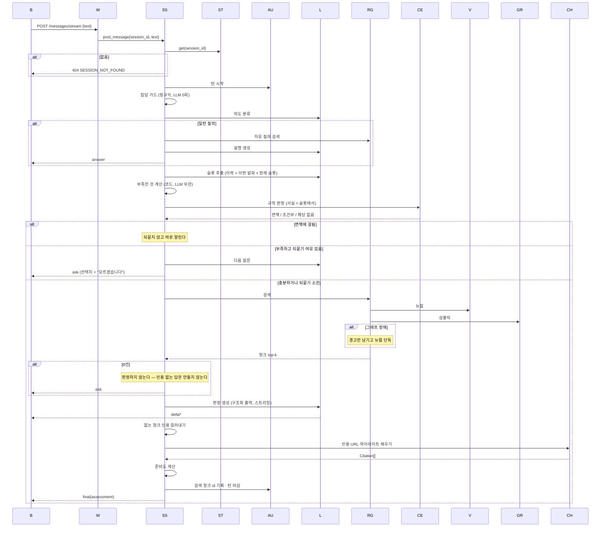
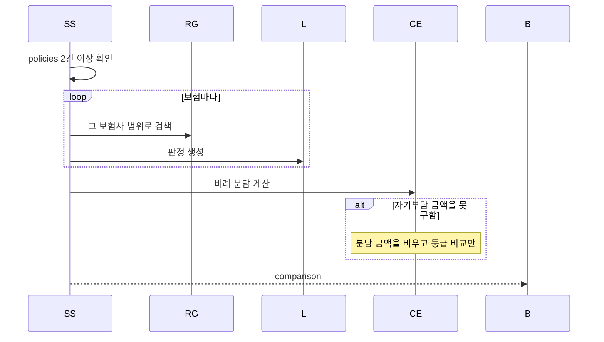
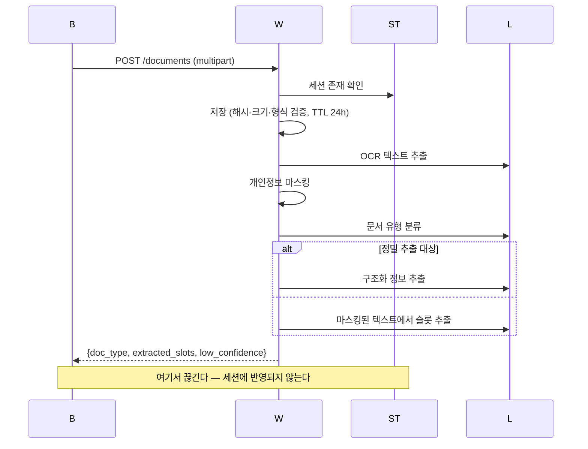
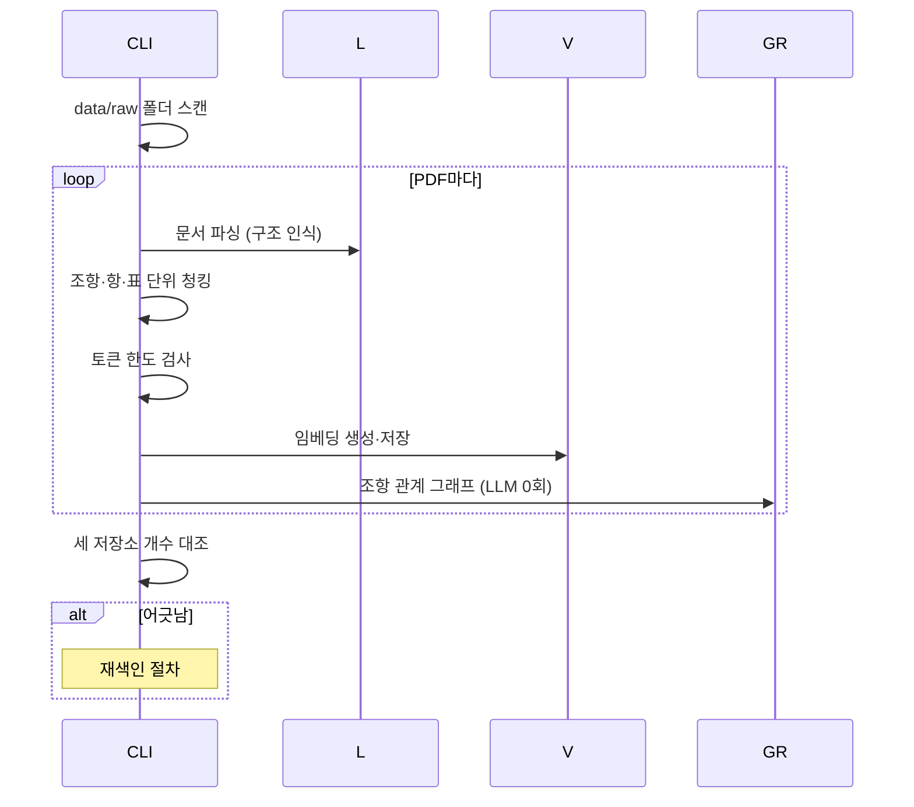
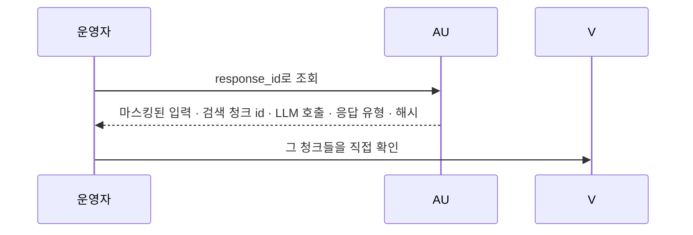

# 시퀀스: 보험청구심사 어시스턴트

## 1. 생명선

| 약칭 | 무엇 |
|---|---|
| B | 브라우저 |
| W | HTTP 라우터 |
| SS | SessionService |
| ST | SessionStore (메모리) |
| L | LlmGateway (Solar) |
| RG | NeuroSymbolicRetriever |
| V | 벡터 저장소 |
| GR | 그래프 저장소 |
| CE | CoverageEngine (규칙) |
| CH | CitationHydrator |
| AU | 감사 |

## 2. 시퀀스

#### SEQ-1 한 턴을 처리한다

근거: [[INS-UC-001#UC-H4]] · [[INS-API-001#POST/api/v1/sessions/{sessionId}/messages/stream]]

**읽을 때 볼 것**
- 규칙 판정(`CE`)이 **되묻기보다 먼저**다. 면책이면 물어볼 이유가 없다
- **인용 URL은 서버가 채운다.** 모델이 URL을 만들면 환각이 그대로 화면에 나간다
- 검색 0건이면 판정을 만들지 않는다. 근거: [[INS-PRD-001#R6]]
- 감사는 턴 **시작**에 열고 끝에 닫는다 — 도중에 죽어도 기록이 남는다

#### SEQ-2 여러 보험을 비교한다

근거: [[INS-UC-001#UC-H6]]

#### SEQ-3 서류를 올린다

근거: [[INS-UC-001#UC-H7]]

**되먹일 것**: 추출한 슬롯을 `POST /slots`로 넣는 경로가 이미 있는데 부르지 않는다. 근거: [[INS-PRD-001#R11]]

#### SEQ-4 약관을 적재한다

근거: [[INS-UC-001#UC-A12]]

#### SEQ-5 감사 기록을 되짚는다

근거: [[INS-UC-001#UC-A11]]

## 3. 대응표

| 시퀀스 | 유스케이스 | 엔드포인트 |
|---|---|---|
| [[#SEQ-1]] | [[INS-UC-001#UC-H4]] | [[INS-API-001#POST/api/v1/sessions/{sessionId}/messages/stream]] |
| [[#SEQ-2]] | [[INS-UC-001#UC-H6]] | 동일 |
| [[#SEQ-3]] | [[INS-UC-001#UC-H7]] | [[INS-API-001#POST/api/v1/sessions/{sessionId}/documents]] |
| [[#SEQ-4]] | [[INS-UC-001#UC-A12]] | CLI |
| [[#SEQ-5]] | [[INS-UC-001#UC-A11]] | — |

## 4. 되먹일 것

- **[[#SEQ-3]]이 끊겨 있다.** OCR 슬롯이 세션에 안 들어간다. 화면이 "인식된 정보"를 보여주지만 그건 화면 안에만 있고, 다음 턴의 슬롯 추출이 보는 이력에는 없다. 근거: [[INS-PRD-001#R11]]
- **[[#SEQ-1]]의 규칙 판정이 절반만 돈다.** 면책은 발화하는데 보장기간·자기부담은 사실이 안 채워져 못 돈다. 연쇄로 [[#SEQ-2]]의 분담 금액이 늘 빈다. 근거: [[INS-PRD-001#R10]]
- **인용 채우기가 요청 경로에서 PDF를 연다.** 인용 건수만큼 페이지를 스캔해 응답 지연에 직결된다. 미리 만들어 두는 편이 낫다
