# 시퀀스 — 보험길잡이

> 1. 주 흐름 11개(SEQ-1~11)와 공통 흐름 4개(SEQ-C1~C4)다. 주 흐름은 사용자·관리자·운영자의 유스케이스이고, 공통 흐름은 여러 주 흐름이 함께 부르는 하위기능 유스케이스다.
> 2. 화면 코드(`AppFlow`·`useSession`)에서 라우터·서비스·저장소·외부 호출까지 코드의 호출 순서대로 그렸다.
> 3. 그리다 보니 유스케이스·API 명세와 코드가 다른 곳이 14군데 나왔다. 「되먹일 것」에 적었다.

## 0. 이 문서가 다루는 것

- 기준은 저장소 코드다. 흐름마다 근거 유스케이스([[INS-UC-002]])를 첫 줄에 적는다
- HTTP 요청은 메서드와 경로로, 함수 호출은 함수 이름으로 적는다. 경로의 `/api/v1`은 처음 한 번만 적고 줄인다
- 여러 흐름이 같이 쓰는 부분은 공통 흐름(SEQ-C)으로 떼고, 주 흐름에서는 노트로 가리킨다
- 시퀀스가 없는 유스케이스는 1장 끝에 이유와 함께 적었다

### 0.1 생명선

| 생명선 | 약어 | 실체 | 종류 | 정의한 곳 |
|---|---|---|---|---|
| 사용자 · 로그인 사용자 | U | 브라우저를 쓰는 사람 | 액터 | [[INS-UC-002]] 1장 |
| 관리자 | AD | 약관 그래프를 점검하는 사람 | 액터 | [[INS-UC-002]] 1장 |
| 운영자 | OP | 터미널에서 `ica`를 쓰는 개발자·운영자·보고서 팀원 | 액터 | [[INS-UC-002]] 1장 |
| 화면 | FE | `AppFlow`·`useSession`·API 클라이언트 | 프런트엔드 | [[INS-DOM-005#ApiClient]] |
| nginx | NG | 화면 서빙과 `/api`·`/static` 프록시 | 웹 서버 | [[INS-INFRA-002]] 2장 |
| 라우터 | R | `app/domains/*/router.py` | 백엔드 입구 | [[INS-API-002]] |
| CLI | CLI | `ica` 명령 | 운영 입구 | [[INS-DOM-005]] 1.4 |
| 세션 서비스 | SS | 한 턴 처리 | 서비스 | [[INS-DOM-005#SessionService]] |
| 세션 저장소 | ST | 프로세스 메모리 | 저장소 | [[INS-DOM-005#SessionStore]] |
| 대화 LLM | SL | 의도·사실 추출과 답 생성 | 모듈 | [[INS-DOM-005#SessionLlm]] |
| 판정 엔진 | CE | 결정론 규칙 11개 | 모듈 | [[INS-DOM-005#CoverageEngine]] |
| 비례 안분 | PR | 추천과 안분 | 모듈 | [[INS-DOM-005#ProrationCalculator]] |
| 준비도 | RC | 0~100점 | 모듈 | [[INS-DOM-005#ReadinessCalculator]] |
| 검색 서비스 | RS | 서킷 브레이커 | 서비스 | [[INS-DOM-005#RagService]] |
| 뉴로심볼릭 검색기 | NS | 가중 RRF | 클래스 | [[INS-DOM-005#NeuroSymbolicRetriever]] |
| 벡터 저장소 | VS | `PgVectorAdapter` | 어댑터 | [[INS-DOM-005#VectorStoreAdapter]] |
| 심볼릭 채널 | SG | 결정론 Cypher | 클래스 | [[INS-DOM-005#SymbolicGraphChannel]] |
| 임베딩 | EM | solar-embedding | 모듈 | [[INS-DOM-005#EmbeddingService]] |
| 원본 캡처 | PI | 페이지 이미지·하이라이트 | 모듈 | [[INS-DOM-005#PdfImageService]] |
| 문서 서비스 | DS | 약관 메타 | 서비스 | [[INS-DOM-005#DocumentsService]] |
| 청구 준비 | CL | 요약·체크리스트·접수 | 서비스 | [[INS-DOM-005#ClaimsService]] |
| 감사 기록 | AU | `audit_log` 한 행 | 서비스 | [[INS-DOM-005#AuditService]] |
| 시연 계정 | DP | 이름·휴대폰으로 찾기 | 모듈 | [[INS-DOM-005#DemoPersonaRegistry]] |
| 로그인 토큰 | TK | JWT·쿠키 | 모듈 | [[INS-DOM-005#TokenService]] |
| 마이데이터 | MY | 더미 어댑터 | 어댑터 | [[INS-DOM-005#MydataAdapter]] |
| 진료내역 | HD | 더미 어댑터 | 어댑터 | [[INS-DOM-005#HealthDataAdapter]] |
| 첨부 | AT | 디스크 저장 | 서비스 | [[INS-DOM-005#AttachmentsService]] |
| 서류 인식 | OC | Upstage OCR·IE | 어댑터 | [[INS-DOM-005#OcrAdapter]] |
| 관리자 그래프 | AG | `MemgraphGraphSource` | 어댑터 | [[INS-DOM-005#GraphSourcePort]] |
| 적재 | IN | 문서 단위 적재 | 서비스 | [[INS-DOM-005#IngestionService]] |
| 청크 서비스 | CH | 파싱·구조·자르기 | 서비스 | [[INS-DOM-005#ChunksService]] |
| 그래프 적재 | GI | Memgraph MERGE | 모듈 | [[INS-DOM-005#GraphIndexer]] |
| PostgreSQL | PG | pgvector 포함 | 저장소 | [[INS-INFRA-002#C5]] · [[INS-DOM-006]] |
| Memgraph | MG | 조항 그래프 | 저장소 | [[INS-INFRA-002#C5]] · [[INS-DOM-006]] 4장 |
| Upstage | UP | Solar·임베딩·문서 파싱·OCR·IE | 외부 | [[INS-INFRA-002#C1]] |
| 디스크 | DK | 원본 PDF·페이지 이미지·첨부 | 파일 | [[INS-INFRA-002]] 6장 |

## SEQ-1 상황을 보내 첫 판정 받기

[[INS-UC-002#UC-H1]] 기본 흐름 1~9. 로그인 여부와 상관없이 같은 길이다.

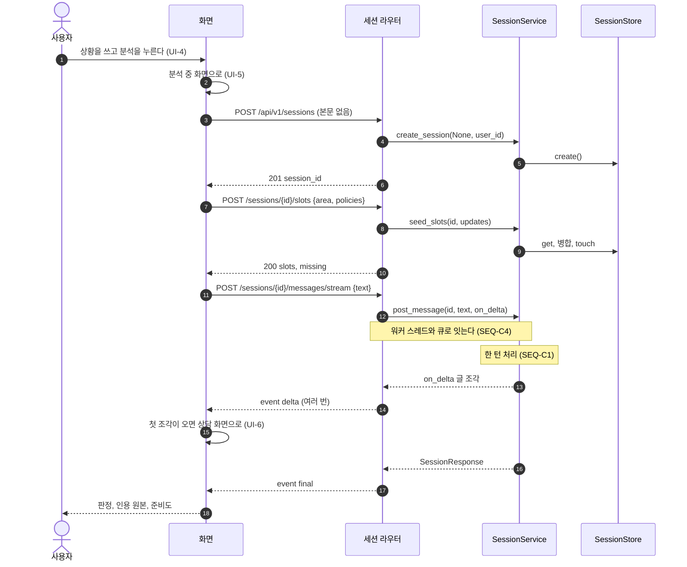

**읽을 때 볼 것**
- 첫 메시지도 스트림으로 간다. 화면은 세션을 본문 없이 만들고, 영역(`area`)과 고른 보험(`policies`)을 먼저 채운 뒤 글을 보낸다. 로그인하지 않았어도 `area`는 채운다
- 고른 보험이 둘 이상이면 `policies`가 여럿이 되고, 한 턴 처리가 비교로 갈라진다([[#SEQ-5]])
- 분석 중 화면의 단계 문구는 서버 이벤트가 아니다. 서버가 보내는 이벤트는 `delta`·`final`·`error` 셋이다
- 스트림 도중 `SESSION_NOT_FOUND`가 오면 화면이 새 세션을 만들면서 같은 글을 `initial_message`로 보낸다. 이 복구 경로만 스트림이 아니다
- 요청 한도 확인(유스케이스 2a)은 지금 없다(2장)

## SEQ-2 근거를 원본에서 보기

[[INS-UC-002#UC-H2]] 기본 흐름 1~4. 캡처는 답을 만들 때 이미 그려 둔다([[#SEQ-C3]]).

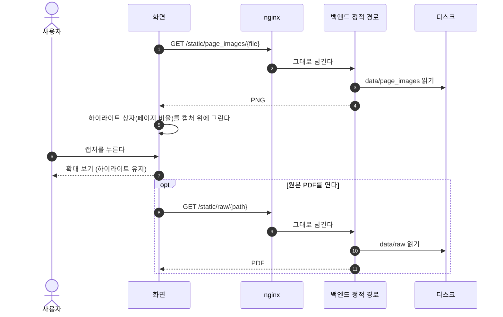

**읽을 때 볼 것**
- 이 흐름에는 API 호출이 없다. 이미지 주소·PDF 주소·하이라이트 상자는 판정 답의 인용에 이미 실려 온다([[INS-DOM-005#Citation]])
- 답을 만들 때 그리기가 실패했으면 인용의 이미지 주소가 비어 온다. 그때는 원문 텍스트만 있다

## SEQ-3 판정 뒤 이어 묻기

[[INS-UC-002#UC-H3]] 기본 흐름 1~3과 3a.

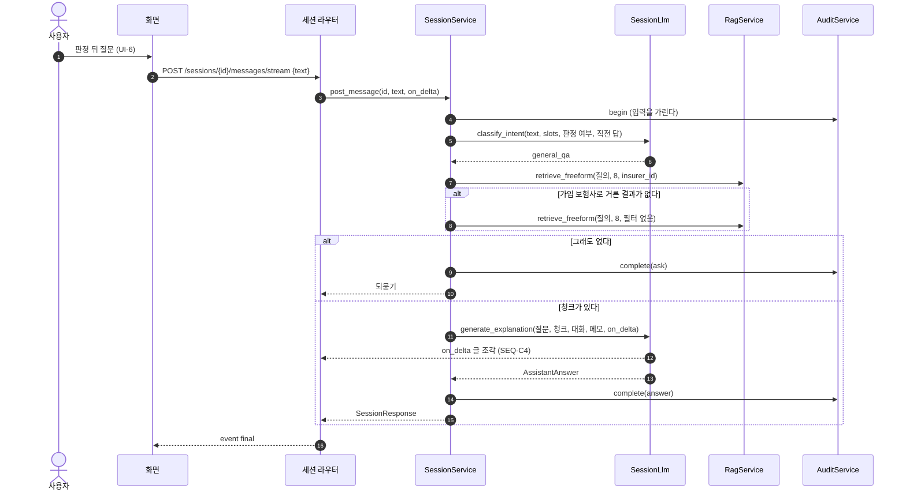

**읽을 때 볼 것**
- 사실을 고치는 말(예: 입원이 아니라 통원이다)은 `claim_diagnosis`로 분류돼 한 턴 처리([[#SEQ-C1]])로 다시 판정한다
- 질문이 20자보다 짧으면 직전 안내의 앞 120자를 검색 질의에 붙인다. 모델에는 대화 전체를 보낸다
- 가입 보험사로 거른 검색이 비면 필터 없이 다시 찾는다. 판정 흐름에는 이 폴백이 없다(2장)
- 설명 답에는 등급이 없다. 감사 기록에는 인용한 청크 id만 남는다

## SEQ-4 내 보험 불러오기

[[INS-UC-002#UC-H4]] 기본 흐름 1~6, [[INS-UC-002#UC-S7]] 기본 흐름 1~3.

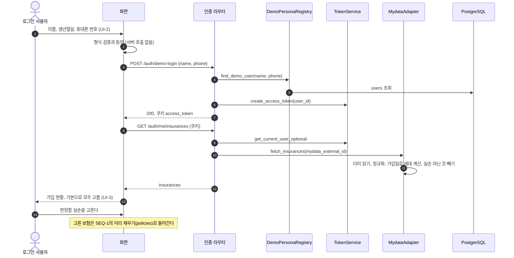

**읽을 때 볼 것**
- 생년월일은 화면에서 형식만 본다. 서버로 가는 것은 이름과 휴대폰 번호다
- 진료내역은 이 흐름에서 가져오지 않는다. 도움 챗봇의 진료내역 패널이 따로 부른다([[#SEQ-8]], 2장)
- 시연 로그인 실패(404)와 조회 실패를 화면이 가리지 않고 한 가지 실패로 보여 준다. 두 에러는 모양이 달라 코드가 `UNKNOWN`으로 읽힌다([[INS-DOM-005#ApiClient]])
- 운영 모드에서는 시연 로그인이 404이고, 로그인 쿠키에 `secure`가 걸린다

## SEQ-5 여러 실손 비교하기

[[INS-UC-002#UC-H5]] 기본 흐름 1~4. 한 턴 처리([[#SEQ-C1]])에서 판정 대상 보험이 둘 이상일 때 갈라진다.

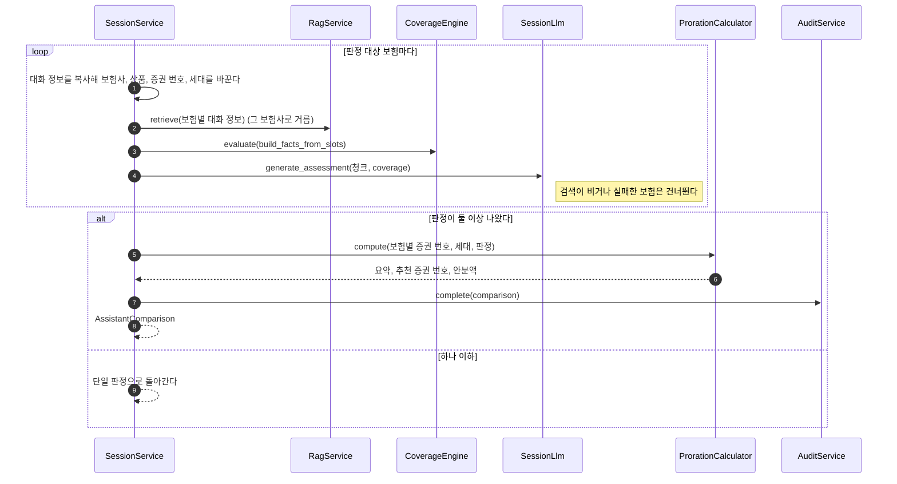

**읽을 때 볼 것**
- 보험마다 검색·판정·답 생성을 한 번씩 한다. 보험이 둘이면 LLM 호출도 두 번이다
- 비교 답은 조각으로 흘려보내지 않는다. 끝나면 `final` 한 번으로 온다
- 추천은 보장되는 계약 가운데 비급여 자기부담률이 가장 낮은 계약이다. 안분액은 지급 추정액이 있어야 나오는데, 급여·비급여 금액을 받는 칸이 없어 지금은 나오지 않는다(2장)

## SEQ-6 서류 사진 올리기

[[INS-UC-002#UC-H6]] 기본 흐름 1~3, [[INS-UC-002#UC-S8]] 기본 흐름 1~3.

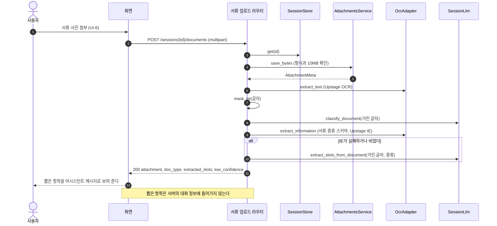

**읽을 때 볼 것**
- OCR이 먼저다. 서류 종류를 가리려면 글자가 있어야 해서, 정보 추출(IE)은 분류 뒤에 한다(2장)
- 모델에는 가린 글자를 보낸다. OCR과 IE에는 원본 이미지가 그대로 간다
- 분류·추출이 실패해도 저장은 성공으로 돌려준다. OCR 신뢰도가 0.6보다 낮으면 `low_confidence`로 다시 찍어 달라고 안내한다
- 뽑은 항목은 응답으로만 온다. 화면도 서버로 다시 보내지 않아 판정에 쓰이지 않는다(2장)

## SEQ-7 청구 준비하고 접수하기

[[INS-UC-002#UC-H7]] 기본 흐름 1~4.

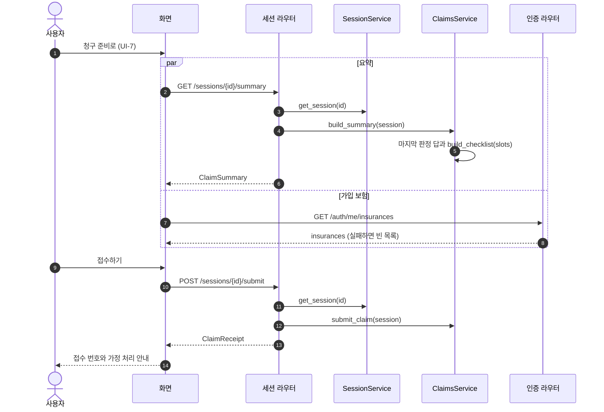

**읽을 때 볼 것**
- LLM도 DB도 부르지 않는다. 요약은 세션의 마지막 판정 답에 체크리스트를 더한 것이다
- 이 화면에는 준비도가 없다. 준비도는 판정 답에만 있다(2장)
- 서류 상태는 필수·선택 둘뿐이다(2장)
- 접수는 아무 데도 보내지 않는다. 같은 세션을 같은 날 다시 접수하면 같은 번호가 나온다

## SEQ-8 도움 챗봇과 진료내역

[[INS-UC-002#UC-H8]] 기본 흐름 1~3과 1a(최근 진료 내역 가져오기).

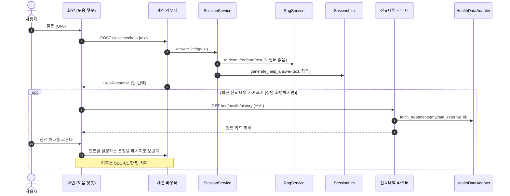

**읽을 때 볼 것**
- 도움 답은 세션·판정·감사 기록 없이 한 번에 온다. 스트리밍이 아니다
- 도움말 문서를 따로 두지 않았다. 약관을 보험사 필터 없이 찾아 근거를 단다(2장)
- 진료를 고르면 카드의 `slot_mapping`을 쓰지 않고 문장을 만들어 보낸다. 그래서 진료 정보는 모델 추출을 거친다(2장)
- 진료내역은 로그인해야 한다. 로그인하지 않으면 `UNAUTHORIZED`다

## SEQ-9 약관 그래프 탐색하기

[[INS-UC-002#UC-A1]] 기본 흐름 1~3과 2b·3b.

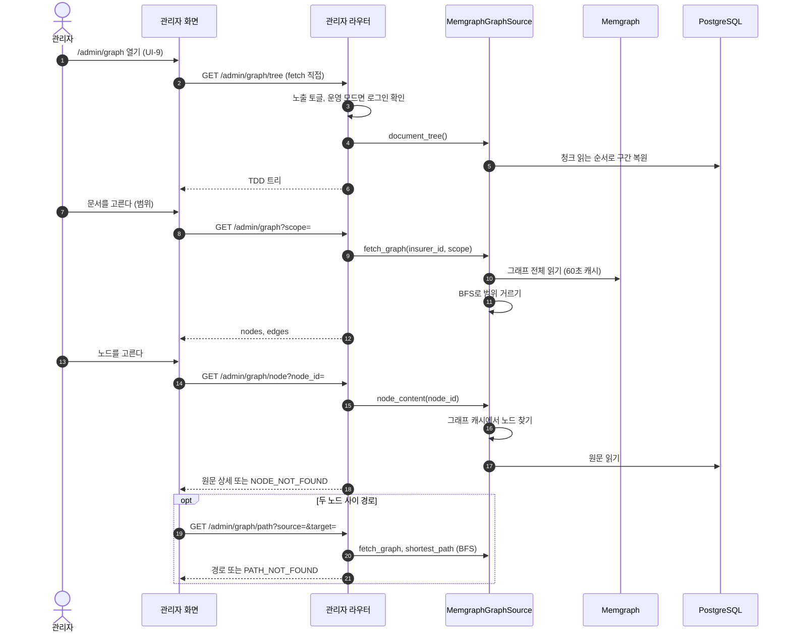

**읽을 때 볼 것**
- 관리자 화면은 API 클라이언트를 거치지 않고 `fetch`를 직접 쓴다([[INS-DOM-005]] 3.2)
- 그래프 전체를 60초 동안 캐시하고, 범위 거르기와 최단 경로는 메모리에서 BFS로 한다
- 트리는 PostgreSQL에서 만든다. 트리 요청의 DB 오류는 `GRAPH_UNAVAILABLE`이 아니라 500이다
- 노출 토글이 꺼져 있으면 모든 경로가 404다. 범위 목록(`/admin/graph/scopes`)은 화면이 부르지 않는다

## SEQ-10 약관 적재하고 검증하기

[[INS-UC-002#UC-A2]] 기본 흐름 1~5.

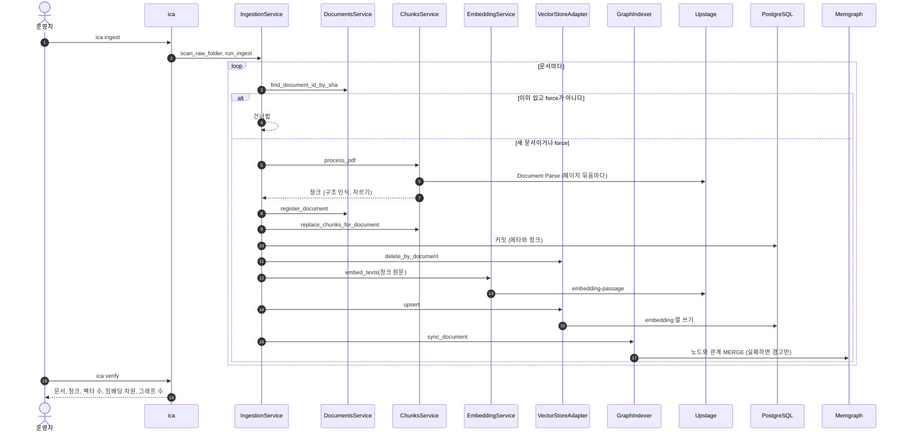

**읽을 때 볼 것**
- 청크를 먼저 커밋하고 임베딩은 그 뒤에 넣는다. 임베딩에서 실패하면 청크만 남는데, 해시가 이미 등록돼 있어 다음 `ica ingest`가 이 문서를 건너뛴다. `--force`나 `ica rebuild`로 다시 넣어야 한다(3장)
- 그래프 동기화가 실패해도 적재는 성공이다(2장). 어긋남은 `ica verify`의 수 비교로 드러난다
- 구간(본문·특약)을 구분해 붙이지 않는다(2장)

## SEQ-11 검색 골든셋 재기

[[INS-UC-002#UC-G2]] 기본 흐름 2.

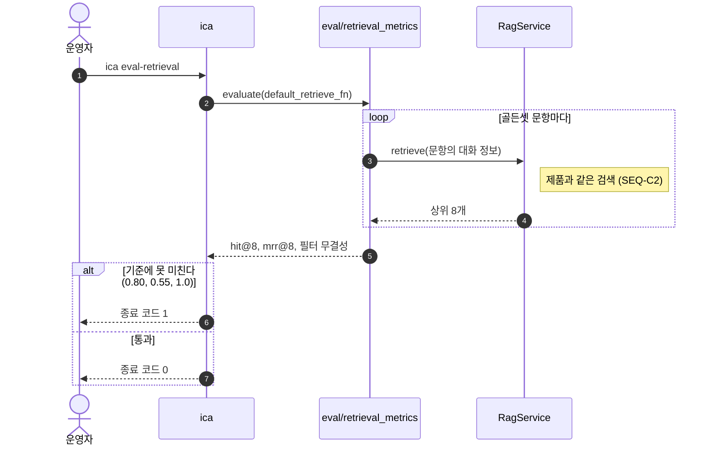

**읽을 때 볼 것**
- 제품과 같은 검색 함수를 부른다. 평가만을 위한 우회 경로가 없다
- 기준에 못 미치면 종료 코드가 1이라 스크립트나 CI가 막을 수 있다

## SEQ-C1 한 턴 처리

[[INS-UC-002#UC-S1]] · [[INS-UC-002#UC-S3]] · [[INS-UC-002#UC-S9]]. [[#SEQ-1]]·[[#SEQ-3]]·[[#SEQ-5]]·[[#SEQ-8]]이 여기로 들어온다.

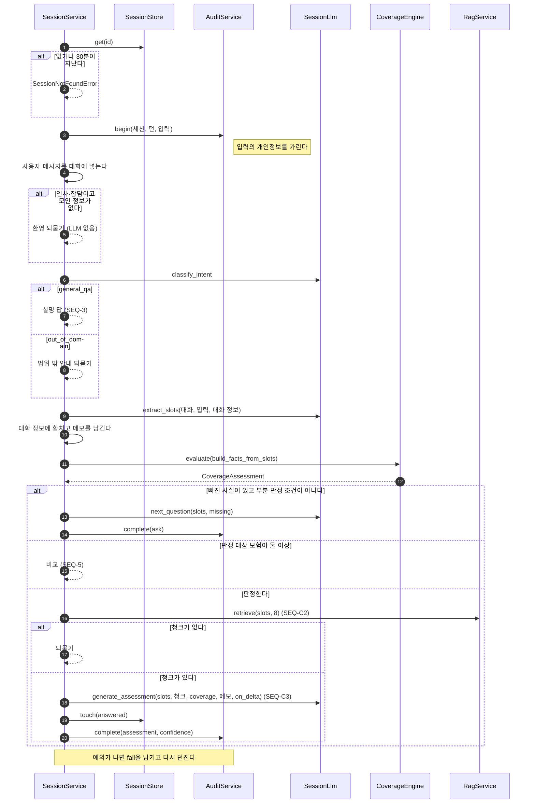

**읽을 때 볼 것**
- 판정 엔진은 되묻기보다 먼저 돈다. 판정이 면책·조건부로 정해지면 빠진 사실이 있어도 되묻지 않는다
- 부분 판정 조건은 넷이다. 이미 한 번 되물었다, 모른다고 한 칸이 둘 이상이다, 지금 답해 달라고 했다, 판정이 면책·조건부다
- 모든 분기가 감사 기록을 마친 뒤 응답한다
- `RAG_REACT`를 켜면 검색을 LangGraph 에이전트가 맡는다(기본 꺼짐). 에이전트가 실패하면 이 검색으로 돌아온다

## SEQ-C2 조항 찾기

[[INS-UC-002#UC-S2]] 기본 흐름 1~4와 2a.

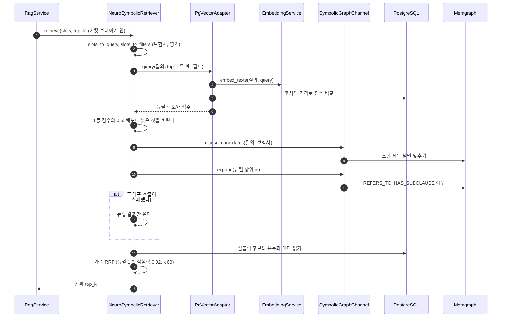

**읽을 때 볼 것**
- 검색 전체가 실패하면(브레이커가 열리거나 예외) 빈 목록이다. 한 턴 처리가 판정 대신 되묻기를 보낸다
- 보험사 이름이 알려진 다섯 곳이 아니면 보험사 필터 없이 찾는다. 판정 흐름에는 결과가 빌 때의 교차 검색 폴백이 없다(2장)
- 임베딩 인덱스가 없어 거른 행 전부와 거리를 잰다([[INS-DOM-006]] 3.1)

## SEQ-C3 판정 답과 인용 만들기

[[INS-UC-002#UC-S4]] · [[INS-UC-002#UC-S5]] · [[INS-UC-002#UC-S6]].

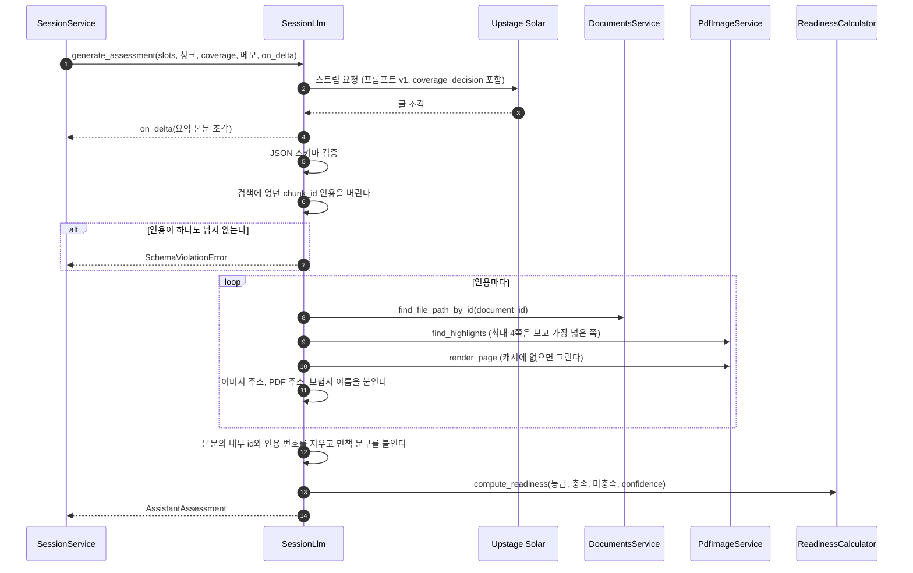

**읽을 때 볼 것**
- 등급은 모델이 정한다. 면책이면 '낮음', 조건부면 '중간'으로 하라는 것은 프롬프트 지시뿐이고 코드가 확인하지 않는다(2장)
- 원본 캡처는 답을 만들 때 그린다. 그리기가 실패하면 이미지 없이 인용한다
- 준비도는 모델 없이 계산한다. 등급(55·35·15) + 요건 충족 비율(최대 30) + 정보 완성도(15·5)다

## SEQ-C4 스트리밍 전달

[[INS-UC-002#UC-S4]] 기본 흐름 2와 2a.

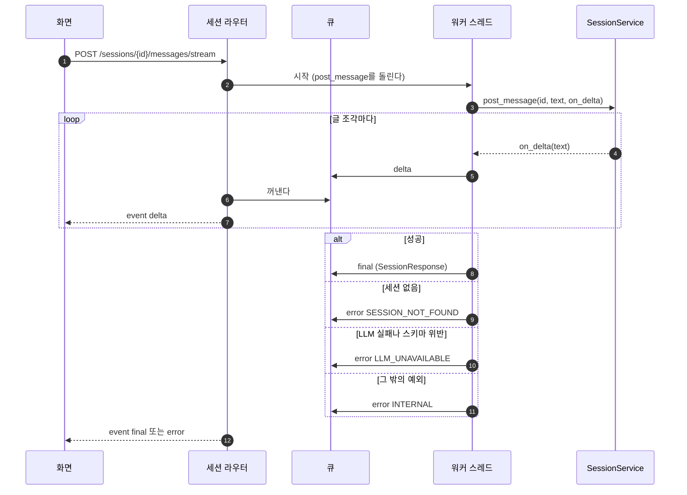

**읽을 때 볼 것**
- 스트림 안의 에러는 HTTP 상태가 아니라 `error` 이벤트로 온다. HTTP 상태는 200이다
- 응답 머리에 `X-Accel-Buffering: no`를 달아 nginx가 모아 두지 않고 바로 흘려보내게 한다
- 화면이 연결을 끊어도 워커 스레드를 멈추는 장치가 없다. 판정은 끝까지 돌고 세션과 감사 기록이 남는다(3장)

## 1. 대응표

| 시퀀스 | 유스케이스 | API | 화면 |
|---|---|---|---|
| [[#SEQ-1]] | [[INS-UC-002#UC-H1]] | [[INS-API-002#POST/api/v1/sessions]] · [[INS-API-002#POST/api/v1/sessions/{session_id}/slots]] · [[INS-API-002#POST/api/v1/sessions/{session_id}/messages/stream]] | [[INS-UI-003#UI-4]] · [[INS-UI-003#UI-5]] · [[INS-UI-003#UI-6]] |
| [[#SEQ-2]] | [[INS-UC-002#UC-H2]] | [[INS-API-002#GET/static/page_images/{file}]] · [[INS-API-002#GET/static/raw/{path}]] | [[INS-UI-003#UI-6]] |
| [[#SEQ-3]] | [[INS-UC-002#UC-H3]] | [[INS-API-002#POST/api/v1/sessions/{session_id}/messages/stream]] | [[INS-UI-003#UI-6]] |
| [[#SEQ-4]] | [[INS-UC-002#UC-H4]] · [[INS-UC-002#UC-S7]] | [[INS-API-002#POST/api/v1/auth/demo-login]] · [[INS-API-002#GET/api/v1/auth/me/insurances]] | [[INS-UI-003#UI-2]] · [[INS-UI-003#UI-3]] |
| [[#SEQ-5]] | [[INS-UC-002#UC-H5]] | [[INS-API-002#POST/api/v1/sessions/{session_id}/messages/stream]] | [[INS-UI-003#UI-6]] |
| [[#SEQ-6]] | [[INS-UC-002#UC-H6]] · [[INS-UC-002#UC-S8]] | [[INS-API-002#POST/api/v1/sessions/{session_id}/documents]] | [[INS-UI-003#UI-6]] |
| [[#SEQ-7]] | [[INS-UC-002#UC-H7]] | [[INS-API-002#GET/api/v1/sessions/{session_id}/summary]] · [[INS-API-002#POST/api/v1/sessions/{session_id}/submit]] · [[INS-API-002#GET/api/v1/auth/me/insurances]] | [[INS-UI-003#UI-7]] |
| [[#SEQ-8]] | [[INS-UC-002#UC-H8]] | [[INS-API-002#POST/api/v1/sessions/help]] · [[INS-API-002#GET/api/v1/me/health/history]] | [[INS-UI-003#UI-8]] |
| [[#SEQ-9]] | [[INS-UC-002#UC-A1]] | [[INS-API-002#GET/api/v1/admin/graph/tree]] · [[INS-API-002#GET/api/v1/admin/graph]] · [[INS-API-002#GET/api/v1/admin/graph/node]] · [[INS-API-002#GET/api/v1/admin/graph/path]] | [[INS-UI-003#UI-9]] |
| [[#SEQ-10]] | [[INS-UC-002#UC-A2]] | — (CLI) | — |
| [[#SEQ-11]] | [[INS-UC-002#UC-G2]] | — (CLI) | — |
| [[#SEQ-C1]] | [[INS-UC-002#UC-S1]] · [[INS-UC-002#UC-S3]] · [[INS-UC-002#UC-S9]] | — | — |
| [[#SEQ-C2]] | [[INS-UC-002#UC-S2]] | — | — |
| [[#SEQ-C3]] | [[INS-UC-002#UC-S4]] · [[INS-UC-002#UC-S5]] · [[INS-UC-002#UC-S6]] | — | — |
| [[#SEQ-C4]] | [[INS-UC-002#UC-S4]] | [[INS-API-002#POST/api/v1/sessions/{session_id}/messages/stream]] | — |

시퀀스가 없는 유스케이스는 셋이다. [[INS-UC-002#UC-G1]](변경을 재서 반영하기)은 CI·배포 과정이고, [[INS-UC-002#UC-G3]](모델 비교)는 오프라인 비교 스크립트이며, [[INS-UC-002#UC-G4]](환경 살리기)는 저장소와 인계 패키지를 복원하는 사람의 작업 순서다. 실행 중인 시스템 안의 호출이 아니라서 그리지 않았다.

## 2. 되먹일 것

그리다 찾은, 상위 문서와 코드가 다른 곳이다. 상위 문서를 코드에 맞출지, 코드를 문서에 맞출지는 항목마다 정한다.

1. [[INS-UC-002#UC-S8]] 흐름 순서 — 코드는 OCR → 가림 → 분류 → IE → (실패하거나 비면) 모델 추출이다. IE가 먼저가 아니고, 2a의 "IE가 실패하면 OCR"과 달리 OCR은 늘 먼저 한다([[#SEQ-6]])
2. [[INS-UC-002#UC-H6]] 3단계·성공 보장, [[INS-UI-003#UI-6]] 규칙 — 뽑은 항목이 대화 정보에 들어가지 않는다([[#SEQ-6]], [[INS-DOM-005]] 5장과 같은 항목)
3. [[INS-UC-002#UC-S1]] 1a, [[INS-UC-002#UC-S7]] 4단계 — 모델 없이 대화 정보에 들어가는 것은 영역과 고른 가입 보험(미리 채우기)뿐이다. 진료내역은 문장으로 바꿔 보내 모델이 추출하고, 서류 항목은 들어가지 않는다. [[INS-DOM-005#TreatmentCard]]의 `slot_mapping`은 쓰이지 않는다([[#SEQ-8]])
4. [[INS-UC-002#UC-S1]] 2a — 스키마 위반은 다시 요청하지 않고 바로 실패한다(`LLM_UNAVAILABLE`). 다시 시도하는 것은 연결·한도·시간 초과·서버 오류뿐이고 3번까지다
5. [[INS-UC-002#UC-S2]] 4a — 교차 검색 폴백은 설명 답 흐름에만 있다. 판정 흐름은 검색이 비면 되묻기로 간다([[#SEQ-3]]·[[#SEQ-C2]])
6. [[INS-UC-002#UC-S3]] 3a·3b — 면책은 '낮음', 조건부는 '중간'이라는 등급은 프롬프트 지시로만 건다. 문서는 결정론으로 읽힌다([[#SEQ-C3]])
7. [[INS-UC-002#UC-H4]] 4단계 — 진료내역은 이 흐름에서 가져오지 않는다. 도움 챗봇의 진료내역 패널이 따로 부른다([[#SEQ-4]]·[[#SEQ-8]])
8. [[INS-UC-002#UC-S7]] 2b·3a, [[INS-UC-002#UC-S9]] 3a — 차단기는 검색과 심평원 도구에만 있다. 마이데이터·진료내역·OCR·LLM 호출에는 없다. 실손이 아닌 보험은 목록에 남지 않고 빠진다
9. [[INS-UC-002#UC-A2]] 3a·4a — 구간을 구분해 붙이지 않는다. 그래프 동기화가 실패해도 경고만 남기고 적재는 성공으로 끝난다([[#SEQ-10]])
10. [[INS-UC-002#UC-H7]] 1·2단계 — 서류 상태는 필수·선택 둘뿐이고, 청구 준비 화면에는 준비도가 없다([[#SEQ-7]])
11. [[INS-UC-002#UC-H1]] 2a, [[INS-UC-002#UC-S9]] 1단계·1a — 요청 한도가 걸려 있지 않다([[INS-API-002]] 5장과 같은 항목)
12. [[INS-UC-002#UC-H8]] 3단계 — 도움말 문서가 없다. 약관을 필터 없이 찾아 답한다([[#SEQ-8]])
13. [[INS-UC-002#UC-H5]] 1a — 급여·비급여 금액을 받는 칸이 없어 예상 분담액이 나오지 않는다([[#SEQ-5]])
14. [[INS-API-002#POST/api/v1/sessions]] — 화면은 본문 없이 부르고, 첫 상황은 미리 채우기 뒤 스트림으로 보낸다. `initial_message`는 세션이 만료된 뒤의 자동 복구에만 쓴다. [[INS-API-002#POST/api/v1/sessions/{session_id}/slots]]는 UI-3에서 고른 값을 UI-5로 넘어갈 때 보낸다([[#SEQ-1]])

## 3. 미결사항

- [ ] **임베딩이 실패한 문서를 다음 적재가 건너뛴다** — 청크를 커밋한 뒤 임베딩이 실패하면, 해시가 이미 있어 다음 `ica ingest`가 그 문서를 건너뛴다. 청크는 임베딩 없이 남는다. 실패한 문서의 해시를 지우거나, 임베딩까지 끝나야 적재 완료로 칠지([[#SEQ-10]])
- [ ] **등급을 코드로 고정할지** — 판정 엔진이 면책·조건부로 정했을 때 모델이 낸 등급을 코드가 확인해 덮어쓸지([[#SEQ-C3]])
- [ ] **끊긴 스트림** — 화면이 연결을 끊어도 워커 스레드가 판정을 끝까지 돌려 LLM 호출이 이어진다. 멈출 장치를 둘지([[#SEQ-C4]])
- [ ] **비교 답의 스트리밍** — 비교는 보험 수만큼 LLM을 불러 오래 걸리는데 조각으로 흘려보내지 않는다. 분석 중 화면에 오래 머무른다([[#SEQ-5]])
