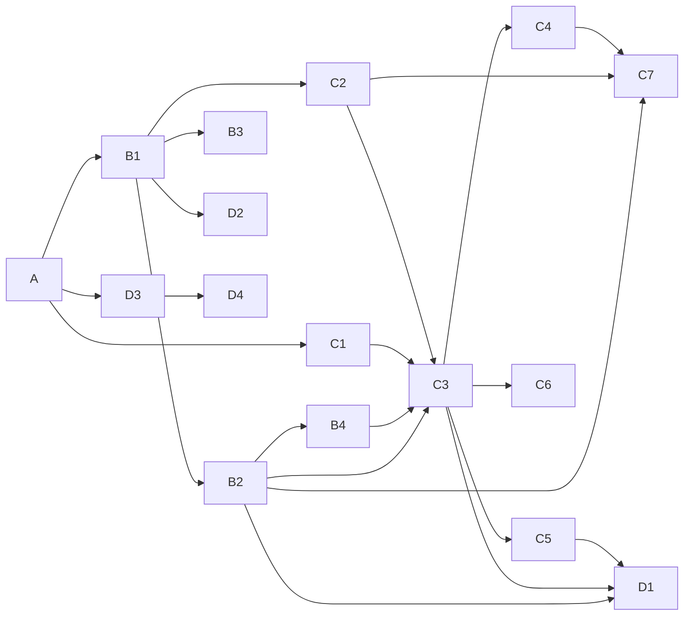
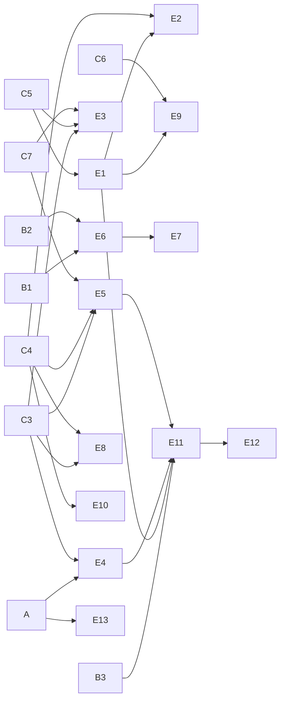

# 구현 계획 — 보험길잡이

> 1. 이미 만든 기능을 슬라이스 16개로 나눴다. 코드가 명세보다 먼저 있었으므로 계획이 아니라 소급 기록이다. 완료란에는 그 슬라이스를 만들거나 크게 바꾼 커밋을 적었다.
> 2. 명세를 쓰며 찾은 빈 곳 가운데 코드를 고쳐야 하는 것을 남은 슬라이스 13개(E1~E13)로 묶었다. 10/1~10/2에 E1(서류 항목을 대화 정보에 넣기)과 E2(급여/비급여 금액·계약 기간을 판정에 넣기)를 끝냈고, 화면 리디자인(D4)을 했다. 셋 다 아직 커밋 전이고, 명세 되먹임은 끝냈다. 남은 것 가운데 사용자에게 보이는 빈 곳은 청구 준비 세 상태(E9), 운영 위험은 요청 한도(E4)·배포 게이트(E13)다.
> 3. 10/2에 CI와 같은 조건으로 돌린 pytest 1,187건이 모두 통과했다(E1 3건 · E2 23건 추가). E2E 42문항은 7/30 실행에서 38문항이 결정론 채점을 모두 통과했다. 두 문항은 판정 대신 되묻기로 갔고, 두 문항은 인용 키워드·필수 언급이 하나씩 모자랐다.

## 0. 이 문서가 다루는 것

- 기준은 저장소 코드와 git 기록이다. main `d00e233`까지 80커밋이고, 날짜는 2026년 KST다. 10/1~10/2 작업(E1·E2·D4)은 작업 트리에만 있고 아직 커밋하지 않았다
- **완료 슬라이스는 소급 기록이다.** 카드의 구현 함수는 [[INS-MS-002]] 항목으로 적었고, 완료란에는 그 카드의 코드를 만들거나 크게 바꾼 커밋을 적었다. PR 없이 main에 바로 올렸으므로 PR 번호는 없다
- 첫 커밋 `7e09095`는 스프린트 1~20을 하나로 합친 것이다. 그 안의 순서는 알 수 없어 여러 카드에 "합본"으로 적었다
- 한 커밋이 여러 카드에 걸치면 카드마다 적었다. 어느 카드에도 적지 않은 커밋 넷은 3장에 있다
- 카드는 호출 그래프로 닫혀 있다. 카드의 함수가 부르는 함수([[INS-MS-002]] 「호출하는 것」)는 같은 카드나 선행 카드에 있다. 스텁은 없다
- 완료 조건 가운데 docstring 항목 ID 대조·시그니처 검사·`check_calls.py`는 이 저장소에 도구가 없어 따지지 않았다. 따진 것은 CI 게이트(ruff · pytest · `tsc -b && vite build`)다. 화면 카드의 사람 확인은 10/1~10/2 로컬 도커 스택(`docker-compose.local-data.yml`)에서 했다. 라이브는 8/5부터 멈춰 있다
- 테스트 건수는 10/2에 기본 설정(`-m 'not eval'`)으로 모은 것이다. 모두 1,212건이고 카드별 건수를 더하면 이 수가 된다. CI는 여기서 Docker가 필요한 pgvector 테스트 25건을 더 빼고 1,187건을 돌린다
- 남은 슬라이스(E)는 앞 문서들의 미결사항·되먹일 것 가운데 코드를 고쳐야 하는 것만 모았다. 문서만 고치면 되는 것은 4장에 적었다

## 1. 슬라이스

### 1.1 만든 것

#### A 기반

| 항목 | 내용 |
|---|---|
| 근거 | [[INS-INFRA-002]] · [[INS-INFRA-002#C1]] · [[INS-INFRA-002#C3]] · [[INS-INFRA-002#C5]] · [[INS-INFRA-002#C7]] · [[INS-INFRA-002#C9]] · [[INS-INFRA-002#C10]] · [[INS-INFRA-002#C11]] · [[INS-PRD-002#N1]] · [[INS-PRD-002#N2]] · [[INS-PRD-002#N5]] |
| 구현 | 4계층 폴더(`app/domains`·`infrastructure`·`shared`·`interfaces`) · 설정(`.env`) · Alembic 마이그레이션 · 외부 연동 클라이언트(Upstage 추론·임베딩·문서 파싱·OCR·IE, pgvector, Memgraph) · JWT 쿠키 인증 · 감사 기록과 개인정보 가림 · 컨테이너·nginx·VM 배포 · CI |
| 구현 함수 | [[INS-MS-002#TokenService.get_current_user_optional]] · [[INS-MS-002#AuditService.begin]] · [[INS-MS-002#AuditService.complete]] · [[INS-MS-002#AuditService.fail]] · [[INS-MS-002#PiiMasker.mask_pii]] |
| API | [[INS-API-002#GET/health]] · [[INS-API-002#GET/metrics]] · [[INS-API-002#POST/api/v1/auth/signup]] · [[INS-API-002#POST/api/v1/auth/login]] · [[INS-API-002#POST/api/v1/auth/logout]] · [[INS-API-002#GET/api/v1/auth/me]] |
| 화면 | — |
| 테스트 | 148건 — `tests/security` 35 · `tests/audit` 35 · `tests/core` 24 · `tests/test_main_*` 26 · `tests/auth/test_auth_jwt.py` 10 · `tests/users` 10 · `tests/llm/test_client.py` 8 |
| 선행 | 없음 |
| 완료 | `7e09095` 6/23 합본(4계층·설정·마이그레이션·JWT·감사·가림) · `2ece31b` 6/24 완전 국내화(OpenAI 제거) · `5f469f6` 6/24 컨테이너화 · `df2abbe` 6/24 자동 배포 워크플로 · `c090b89` 6/24 Azure 프로비저닝 · `baf63fe` 6/24 VM 한 대 올인원 · `11de8d6` 6/24 buildx · `31d1224` 7/2 배포 대상 저장소 · `b93967d` 7/10 배포 전후 디스크 정리 · `789e8b0` 7/20 CI 게이트 · `ae1ada7` 7/20 운영 모드 게이팅 |

#### B1 약관 적재

| 항목 | 내용 |
|---|---|
| 근거 | [[INS-SCN-002#S14]] · [[INS-UC-002#UC-A2]] · [[INS-PRD-002#R21]] · [[INS-SEQ-002#SEQ-10]] · [[INS-INFRA-002#C6]] |
| 구현 함수 | [[INS-MS-002#IngestionService.run_ingest]] · [[INS-MS-002#IngestionService.parse_pdf_path]] · [[INS-MS-002#ChunksService.process_pdf]] · [[INS-MS-002#DocumentsService.register_document]] · [[INS-MS-002#GraphIndexer.sync_document]] · [[INS-MS-002#EmbeddingService.embed_texts]] |
| API | [[INS-API-002#GET/api/v1/documents/insurers]] · [[INS-API-002#GET/api/v1/documents/products]] |
| 화면 | — (명령줄 `ica ingest` · `ica verify`) |
| 테스트 | 188건 — `tests/chunks` 110 · `tests/ingestion` 30 · `tests/documents` 28 · `tests/embeddings` 11 · `tests/rag/test_indexer.py` 9 + 적재 뒤 `ica verify`(청크 수가 DB·벡터·그래프에서 같은지, 임베딩 4096차원) |
| 선행 | A |
| 완료 | `7e09095` 6/23 합본(파서·청커·적재 명령) · `a564fcc` 6/23 Upstage 문서 파싱·`ica verify` · `2ece31b` 6/24 실손 5사 적재 · `7d4fd7c` 6/24 파서 0.2 노이즈 거르기 · `0e5c50a` 6/24 파서 0.3 조 경계 · `dcb9b35` 6/24 파서 0.4 조 번호 상한 · `5209863` 7/9 별첨 인식·임베딩 절단 · `0bc6211` 7/9 적재가 그래프 동기화·세 저장소 검증 · `d9a6258` 7/9 청크 메타 · `1d3d55d` 7/20 머리말·꼬리말 제거 복구 · `3ed545e` 7/21 토큰 한도 결합 제거 |

#### B2 뉴로심볼릭 검색

| 항목 | 내용 |
|---|---|
| 근거 | [[INS-SCN-002#S12]] · [[INS-SCN-002#S9]] · [[INS-UC-002#UC-S2]] · [[INS-UC-002#UC-G1]] · [[INS-PRD-002#R22]] · [[INS-SEQ-002#SEQ-C2]] · [[INS-INFRA-002#C6]] |
| 구현 함수 | [[INS-MS-002#RagService.retrieve]] · [[INS-MS-002#RagService.retrieve_freeform]] · [[INS-MS-002#NeuroSymbolicRetriever.retrieve]] · [[INS-MS-002#NeuroSymbolicRetriever.retrieve_freeform]] · [[INS-MS-002#NeuroSymbolicRetriever.retrieve_fused]] · [[INS-MS-002#VectorStoreAdapter.query]] · [[INS-MS-002#SymbolicGraphChannel.clause_candidates]] · [[INS-MS-002#SymbolicGraphChannel.expand]] |
| API | — (내부 호출) |
| 화면 | — |
| 테스트 | 102건 — `tests/rag`의 검색 파일 89(그중 Docker가 필요한 pgvector 25건은 CI 밖) · `tests/search` 13 + 골든셋 회귀선([[#D1]]) |
| 선행 | B1 |
| 완료 | `7e09095` 6/23 합본(벡터 검색) · `96a05a8` 7/3 인용을 가입 보험사로 한정 · `057054e` 7/9 상대 점수 컷·리랭커 옵션 · `0bc6211` 7/9 뉴로심볼릭(심볼릭 채널·가중 RRF·그래프 장애 시 뉴럴 단독) · `ec6fdee` 7/9 운영에 Memgraph · `515b168` 7/21 심볼릭 가중 0.1→0.02 |

#### B3 약관 지식그래프 탐색

| 항목 | 내용 |
|---|---|
| 근거 | [[INS-SCN-002#S10]] · [[INS-UC-002#UC-A1]] · [[INS-PRD-002#R24]] · [[INS-PRD-002#R19]] · [[INS-SEQ-002#SEQ-9]] |
| 구현 함수 | [[INS-MS-002#AdminGraphService.fetch_graph]] |
| API | [[INS-API-002#GET/api/v1/admin/graph]] · [[INS-API-002#GET/api/v1/admin/graph/tree]] · [[INS-API-002#GET/api/v1/admin/graph/node]] · [[INS-API-002#GET/api/v1/admin/graph/path]] · [[INS-API-002#GET/api/v1/admin/graph/scopes]] |
| 화면 | [[INS-UI-003#UI-9]] · [[INS-UI-003#UI-1]] 11 |
| 테스트 | 29건 — `tests/admin` |
| 선행 | B1 |
| 완료 | `b4a8392` 7/29 탐색기 · `05413d1` 7/29 라이브 500 수정·노출 토글 · `45cfad1` 7/29 라이브에 노출 · `d00e233` 7/30 메인 ↔ 탐색기 이동 버튼 |

#### B4 ReAct 에이전트 경로

| 항목 | 내용 |
|---|---|
| 근거 | [[INS-PRD-002#R23]] |
| 구현 | LangGraph 상태 그래프(`app/domains/rag/langgraph_agent.py`) · 도구 정의·디스패처·계산(`app/shared/tools/`) · 설정으로 켜고 끈다(기본 꺼짐, 꺼지면 결정론 판정 흐름이 답한다) |
| 구현 함수 | — ([[INS-MS-002]]에 항목 없음. 4장) |
| API | — |
| 화면 | — |
| 테스트 | 130건 — `tests/tools` 104 · `tests/rag/test_langgraph_agent.py` 22 · `tests/rag/test_agent.py` 4 |
| 선행 | B2 |
| 완료 | `7e09095` 6/23 합본(에이전트·도구) · `a564fcc` 6/23 LangGraph 한 경로로·관측성 · `45ee889` 6/24 검색 도구가 pgvector를 거침 · `4aa0903` 7/6 자동차 성격 도구 둘 제거 · `057054e` 7/9 에이전트 검색 필터 버그 |

#### C1 판정 엔진

| 항목 | 내용 |
|---|---|
| 근거 | [[INS-UC-002#UC-S3]] · [[INS-UC-002#UC-S5]] · [[INS-PRD-002#R1]] · [[INS-PRD-002#R17]] · [[INS-PRD-002#R25]] · [[INS-SEQ-002#SEQ-C1]] · [[INS-SEQ-002#SEQ-5]] |
| 구현 함수 | [[INS-MS-002#CoverageEngine.build_facts_from_slots]] · [[INS-MS-002#CoverageEngine.evaluate]] · [[INS-MS-002#CoverageEngine.rules_for]] · [[INS-MS-002#CoverageEngine.compute_deductible]] · [[INS-MS-002#ProrationCalculator.compute]] · [[INS-MS-002#ReadinessCalculator.compute_readiness]] |
| API | — (내부 호출) |
| 화면 | — |
| 테스트 | 60건 — `tests/coverage` 51(그중 5건은 E2: 금액·계약 기간 배선, 공제 산정, 무기한 보장기간) · `tests/sessions/test_readiness.py` 9 |
| 선행 | A |
| 완료 | `b71832e` 7/8 실손 보장 룰 엔진 · `c21a5e2` 7/9 세대별 자기부담·비례 안분 · `789e8b0` 7/20 준비도 점수 · `ae1ada7` 7/20 목적 면책을 엔진으로 · `862269a` 7/20 자해·범죄 면책 · `edd795e` 7/20 부분 보상(조건부) · 10/2 보장기간 규칙이 만료일 없이도 시작일로 판정(미커밋, [[#E2]]) |

#### C2 원본 캡처와 하이라이트

| 항목 | 내용 |
|---|---|
| 근거 | [[INS-SCN-002#S4]] · [[INS-UC-002#UC-H2]] · [[INS-UC-002#UC-S6]] · [[INS-PRD-002#R2]] · [[INS-PRD-002#R3]] · [[INS-PRD-002#R4]] · [[INS-SEQ-002#SEQ-2]] |
| 구현 함수 | [[INS-MS-002#PdfImageService.find_highlights]] · [[INS-MS-002#PdfImageService.render_page]] |
| API | [[INS-API-002#GET/static/page_images/{file}]] · [[INS-API-002#GET/static/raw/{path}]] |
| 화면 | [[INS-UI-003#UI-6]] 3 · 3.1 · 3.2 |
| 테스트 | 22건 — `tests/pdfimage` + 가로 약관 반 크롭은 7/9에 Playwright로 확인(`c21a5e2` 메시지). 자동 화면 테스트는 저장소에 없다 |
| 선행 | B1 |
| 완료 | `7e09095` 6/23 합본(페이지 이미지) · `bf229d0` 7/6 인용 카드 한글 이름 · `413cb9c` 7/8 하이라이트 · `b15159a` 7/8 인용 원본 패널 · `c21a5e2` 7/9 가로 약관 반 크롭 · `02f81e3` 7/10 하이라이트 3차 재작성 · `f8d2cf8` 7/10 인용 페이지 고르기 · `3936a74` 7/13 보험사를 바꾸면 캡처도 바뀜 |

#### C3 한 턴 — 판정·되묻기·설명

| 항목 | 내용 |
|---|---|
| 근거 | [[INS-SCN-002#S1]] · [[INS-SCN-002#S2]] · [[INS-SCN-002#S3]] · [[INS-SCN-002#S7]] · [[INS-UC-002#UC-H1]] · [[INS-UC-002#UC-H3]] · [[INS-UC-002#UC-S1]] · [[INS-UC-002#UC-S4]] · [[INS-SEQ-002#SEQ-1]] · [[INS-SEQ-002#SEQ-3]] · [[INS-SEQ-002#SEQ-C1]] · [[INS-SEQ-002#SEQ-C3]] · [[INS-SEQ-002#SEQ-C4]] |
| 구현 함수 | [[INS-MS-002#SessionService.create_session]] · [[INS-MS-002#SessionService.post_message]] · [[INS-MS-002#SessionService.seed_slots]] · [[INS-MS-002#SessionStore.get]] · [[INS-MS-002#SessionLlm.classify_intent]] · [[INS-MS-002#SessionLlm.extract_slots]] · [[INS-MS-002#SessionLlm.next_question]] · [[INS-MS-002#SessionLlm.generate_assessment]] · [[INS-MS-002#SessionLlm.generate_explanation]] |
| API | [[INS-API-002#POST/api/v1/sessions]] · [[INS-API-002#POST/api/v1/sessions/{session_id}/messages/stream]] · [[INS-API-002#POST/api/v1/sessions/{session_id}/messages]] · [[INS-API-002#POST/api/v1/sessions/{session_id}/slots]] · [[INS-API-002#GET/api/v1/sessions/{session_id}]] · [[INS-API-002#DELETE/api/v1/sessions/{session_id}]] |
| 화면 | [[INS-UI-003#UI-1]] 4 · [[INS-UI-003#UI-4]] · [[INS-UI-003#UI-5]] · [[INS-UI-003#UI-6]] 2 · 2.1 · 4 · 5 · 5.1 · 5.3 · 6 · 8 |
| 테스트 | 364건 — `tests/sessions`에서 344(서비스 91은 도움 답 포함 · 스키마 54 · LLM 55 · 저장소 33 · 스몰토크 24 · 라우터 29(그중 2건은 E2 미리 채우기) · CLI 14 · 대화 정보 10 · 추출 방어 10(E2) · 자유 질의 8 · 인용 조립 7 · 재청구 6 · 엔진 연결 3) · `tests/llm`의 의도·프롬프트 13 · `tests/shared` 7 + E2E 평가셋(2장) |
| 선행 | B2 · B4 · C1 · C2 |
| 완료 | `7e09095` 6/23 합본(세션·대화 정보·판정 흐름) · `865f60c` 6/24 가입 정보가 없을 때 일반 안내 · `d6422c9` 7/3 대화 정보 미리 채우기 · `f5db143` 7/3 자동차·화재 걷어냄 · `d0087fe` 7/6 자동차·화재 잔재 · `d437fbd` 7/6 설명 답과 의도 분류 · `b71832e` 7/8 판정 흐름에 엔진 연결 · `413cb9c` 7/8 SSE 스트리밍 · `b15159a` 7/8 스트리밍 대화 화면 · `c21a5e2` 7/9 답 먼저·되묻기 한 번·표준약관 모드 · `02f81e3` 7/10 판정 뒤 멀티턴·요약 구조·식별자 차단 · `f8d2cf8` 7/10 체감 타이핑 · `e1eb271` 7/10 의도 분류에 직전 발화 · `dd7f6dc` 7/10 각주 표시 제거 · `6fd9fb1` 7/10 세션 메모 · `789e8b0` 7/20 프롬프트 파일 분리 · `dfc2809` 7/20 재청구 논리 · `ae1ada7` 7/20 면책 확정 시 되묻기 생략 · `862269a` 7/20 면책 목적 여섯 배선 · `edd795e` 7/20 조건부 답 · `195dbb4` 7/20 의도 판단을 모델로 · `67a4bf8` 7/21 보험사 목록 하나로 · `3ed545e` 7/21 조용한 폴백에 로그 · 10/2 대화 추출 프롬프트 보강 + 결정론 방어 3종(미커밋, [[#E2]]) |

#### C4 내 보험 불러오기와 비교

| 항목 | 내용 |
|---|---|
| 근거 | [[INS-SCN-002#S5]] · [[INS-SCN-002#S6]] · [[INS-UC-002#UC-H4]] · [[INS-UC-002#UC-H5]] · [[INS-UC-002#UC-S7]] · [[INS-PRD-002#R13]] · [[INS-PRD-002#R14]] · [[INS-PRD-002#R15]] · [[INS-PRD-002#R16]] · [[INS-PRD-002#R17]] · [[INS-SEQ-002#SEQ-4]] · [[INS-SEQ-002#SEQ-5]] |
| 구현 함수 | [[INS-MS-002#DemoPersonaRegistry.find_demo_user]] · [[INS-MS-002#MydataAdapter.fetch_insurances]] |
| API | [[INS-API-002#POST/api/v1/auth/demo-login]] · [[INS-API-002#GET/api/v1/auth/demo-personas]] · [[INS-API-002#GET/api/v1/auth/me/insurances]] |
| 화면 | [[INS-UI-003#UI-1]] 3 · [[INS-UI-003#UI-2]] · [[INS-UI-003#UI-3]] 2 · 3 · 6 · [[INS-UI-003#UI-6]] 9 |
| 테스트 | 70건 — `tests/external/test_mydata_*` 26 · `tests/demo_data` 25(페르소나·마이데이터·진료내역 조인 무결성) · `tests/auth/test_demo_personas.py` 13 · `tests/sessions/test_comparison.py` 6(그중 2건은 E2: 보험별 계약 기간 판정 · seed 계약 기간) + E2E 다중비교 |
| 선행 | C3 |
| 완료 | `7e09095` 6/23 합본(마이데이터 어댑터) · `f7403d8` 6/23 진입 흐름 · `7edc151` 6/23 가입 보험 자동 연동 · `4487124` 6/23 시연 페르소나·가정 연동 · `2ece31b` 6/24 페르소나 가입 보험을 5사 실손으로 · `01e168e` 6/24 시연 데이터 보험사 교체 · `2ba6853` 6/24 시연 사용자 직접 입력 · `d6422c9` 7/3 가입 보험을 구조로 넘김 · `ab67440` 7/8 본인 확인 입력 검증 · `4055514` 7/8 본인 확인 정렬 · `7315b74` 7/9 가입 현황 먼저·비례분담 안내 · `c21a5e2` 7/9 다중 실손 비교 · `02f81e3` 7/10 마이데이터 표준 정합 · `99510f4` 7/13 경계 페르소나·조인 무결성 · `ae1ada7` 7/20 운영 모드에서 시연 로그인 차단 · 10/2 seed·비교에 계약 기간(미커밋, [[#E2]]) |

#### C5 서류 올리기

| 항목 | 내용 |
|---|---|
| 근거 | [[INS-SCN-002#S5]] · [[INS-UC-002#UC-H6]] · [[INS-UC-002#UC-S8]] · [[INS-PRD-002#R12]] · [[INS-SEQ-002#SEQ-6]] |
| 구현 함수 | [[INS-MS-002#attachments_router.upload_document]] · [[INS-MS-002#AttachmentsService.save_bytes]] · [[INS-MS-002#AttachmentsService.cleanup_expired]] · [[INS-MS-002#SessionLlm.classify_document]] · [[INS-MS-002#SessionLlm.extract_slots_from_document]] |
| API | [[INS-API-002#POST/api/v1/sessions/{session_id}/documents]] |
| 화면 | [[INS-UI-003#UI-6]] 6 |
| 테스트 | 56건 — `tests/attachments` 28(그중 3건은 E1, 4건은 E2 IE 매핑) · `tests/sessions/test_llm_ocr.py` 18 · `tests/external/test_ocr_adapter.py` 10 + 서류 추출 벤치([[#D1]]) |
| 선행 | C3 |
| 완료 | `7e09095` 6/23 합본(업로드·OCR) · `f7403d8` 6/23 업로드 화면 · `e66f21b` 7/9 IE 전환·저신뢰 게이트 · 10/2 IE 스키마에 급여/비급여 합계·보험기간, 금액 정수 보정(미커밋, [[#E2]]) |

#### C6 청구 준비

| 항목 | 내용 |
|---|---|
| 근거 | [[INS-SCN-002#S5]] · [[INS-UC-002#UC-H7]] · [[INS-PRD-002#R18]] · [[INS-SEQ-002#SEQ-7]] |
| 구현 함수 | [[INS-MS-002#ClaimsService.build_checklist]] · [[INS-MS-002#ClaimsService.build_summary]] · [[INS-MS-002#ClaimsService.submit_claim]] |
| API | [[INS-API-002#GET/api/v1/sessions/{session_id}/checklist]] · [[INS-API-002#GET/api/v1/sessions/{session_id}/summary]] · [[INS-API-002#POST/api/v1/sessions/{session_id}/submit]] |
| 화면 | [[INS-UI-003#UI-7]] |
| 테스트 | 15건 — `tests/claims` |
| 선행 | C3 |
| 완료 | `3db558e` 6/23 필요 서류·요약·가정 접수 · `2ecf996` 7/6 청구 준비 버튼을 액션 바로 |

#### C7 도움 챗봇과 진료내역

| 항목 | 내용 |
|---|---|
| 근거 | [[INS-SCN-002#S8]] · [[INS-UC-002#UC-H8]] · [[INS-PRD-002#R11]] · [[INS-PRD-002#R13]] · [[INS-SEQ-002#SEQ-8]] |
| 구현 함수 | [[INS-MS-002#SessionService.answer_help]] · [[INS-MS-002#SessionLlm.generate_help_answer]] |
| API | [[INS-API-002#POST/api/v1/sessions/help]] · [[INS-API-002#GET/api/v1/me/health/history]] |
| 화면 | [[INS-UI-003#UI-8]] |
| 테스트 | 19건 — `tests/external/test_health_data_*` + 도움 답은 `tests/sessions/test_sessions_service.py`에 있다([[#C3]]에서 셈) |
| 선행 | B2 · C2 · C4 |
| 완료 | `7e09095` 6/23 합본(진료내역 어댑터·라우터) · `f7403d8` 6/23 진료내역 패널 · `3ddc9de` 6/24 패널을 팝오버로 · `2ecf996` 7/6 액션 바 · `ab67440` 7/8 떠 있는 도움 챗봇 · `413cb9c` 7/8 도움 답(약관 검색) · `c21a5e2` 7/9 모든 화면에 도움 버튼 · `862269a` 7/20 사용법 질문 크래시 복구 |

#### D1 품질 측정과 기록

| 항목 | 내용 |
|---|---|
| 근거 | [[INS-SCN-002#S11]] · [[INS-SCN-002#S12]] · [[INS-UC-002#UC-G1]] · [[INS-UC-002#UC-G2]] · [[INS-UC-002#UC-G3]] · [[INS-PRD-002#R27]] · [[INS-PRD-002#N6]] · [[INS-PRD-002#N7]] · [[INS-SEQ-002#SEQ-11]] |
| 구현 | 검색 골든셋과 회귀선(`eval/golden/retrieval_v1.json` 45문항, `python -m eval.retrieval_metrics`) · E2E 평가셋(`eval/e2e_judge/` 42문항, 결정론 채점 + 진단용 모델 채점) · 서류 추출 벤치(`python -m eval.ie_bench.run`) · 대화 문맥 벤치 · 성능 기록(`docs/perf-log.md`, 10/1~10/2 E1·E2·리디자인 항목 추가) |
| 구현 함수 | — ([[INS-MS-002]]에 항목 없음) |
| API | — |
| 화면 | — |
| 테스트 | 9건 — `tests/eval_harness` 7 · `tests/rag/test_retrieval_golden.py` 2(골든셋 형식·코퍼스 정합). 회귀선 검사는 `-m eval`로 따로 돈다 |
| 선행 | B2 · C3 · C5 |
| 완료 | `e056e1d` 7/9 골든셋 30문항·회귀 하네스·성능 기록 · `4593f74` 7/9 서류 추출 벤치 · `24b0b4a` 7/10 대화 문맥 벤치 · `bf78771` 7/10 E2E 22문항 · `99510f4` 7/13 E2E 42문항·등급 일관성 · `dfc2809` 7/20 EXAONE 미채택 사유 · `d136378` 7/21 골든셋 45문항·회귀선 재보정 · `b4b1ac4` 7/21 재적재 전후 기록 |

#### D2 저장소 이어받기

| 항목 | 내용 |
|---|---|
| 근거 | [[INS-SCN-002#S13]] · [[INS-UC-002#UC-G4]] · [[INS-PRD-002#N8]] · [[INS-INFRA-002#C9]] |
| 구현 | 첫 안내 문서(README · CLAUDE.md) · 재인덱싱·Memgraph 운영 런북(`docs/ops/reindex-runbook.md`) · 로컬 개발 스크립트 · 인계 패키지(저장소 밖, 체크섬과 로더 둘) · 로컬 데이터로 도커 스택을 띄우는 오버라이드(`docker-compose.local-data.yml`, 10/1, 미커밋) |
| 구현 함수 | — |
| API | — |
| 화면 | — |
| 테스트 | 9/22에 인계 패키지의 로더 둘로 복원 라운드트립을 검증했다. 복원 뒤 `ica verify` 기대값은 청크 2,505 · 임베딩 4096차원이다. 기록은 커밋되지 않은 `docs/infra/data-handoff.md`에 있다 |
| 선행 | B1 |
| 완료 | `c213ee6` 6/23 README 공개용 정리 · `cd0b639` 7/8 로컬 개발 서버 스크립트 · `7400c83` 7/9 운영 런북 · `50b0593` 7/9 문서 계층 정리 |

#### D3 안내 문서와 큰 글씨

| 항목 | 내용 |
|---|---|
| 근거 | [[INS-PRD-002#R20]] · [[INS-PRD-002#R1]] · [[INS-PRD-002#N2]] · [[INS-SCN-002#S1]] |
| 구현 | 안내 문서 네 쪽(`frontend/src/pages/legal/`) · 글자 크기 전환 · 전역 접근성. 10/1에 글자 크기 전환이 px 글자에 먹지 않던 것을 고쳤다 — 모든 글자 크기를 `calc(Npx * var(--fs-k))`로 바꿔 0.87 / 1 / 1.2배([[#D4]]) |
| 구현 함수 | — |
| API | — |
| 화면 | [[INS-UI-003#UI-10]] · [[INS-UI-003#UI-1]] 1.2 · 10 |
| 테스트 | 프론트 빌드(`tsc -b && vite build`)만 있다. 자동 화면 테스트는 없다 |
| 선행 | A |
| 완료 | `78c62a6` 6/23 안내 문서 네 쪽·전역 접근성 · `7b49a96` 6/24 안내 문서를 실손 5사로 · `c21a5e2` 7/9 모든 화면에 글자 크기 전환 · 10/1 글자 크기 배율(미커밋, [[#D4]]와 함께) |

#### D4 화면 리디자인

| 항목 | 내용 |
|---|---|
| 근거 | [[INS-UI-003]] 3장 · [[INS-UI-003#UI-1]] · [[INS-UI-003#UI-2]] · [[INS-UI-003#UI-3]] · [[INS-UI-003#UI-4]] · [[INS-UI-003#UI-5]] · [[INS-UI-003#UI-6]] · [[INS-UI-003#UI-7]] · [[INS-UI-003#UI-8]] · [[INS-PRD-002#R20]] |
| 구현 | 토큰(`tokens.css`: IBM Plex Sans KR·리디자인 색·크기·`--fs-k` 배율) → 기본(`base.css`) → 공통 부품(버튼·입력칸·카드·탭, 머리글 브랜드·글자 스텝·서비스 푸터, `page.module.css`의 12칸 그리드·선 블록·등급 알약·게이지) → 화면 8장. 첫 화면은 서비스 홈(판정 결과 미리보기·근거 데이터 줄·3단계·다른 점), 상담은 보낸이 표시 + 본문·색 선 박스·밑줄 탭. 문구는 짧고 단정하게. 쇼케이스·관리자 화면은 손대지 않았다 |
| 구현 함수 | — (화면만) |
| API | — |
| 화면 | [[INS-UI-003#UI-1]] ~ [[INS-UI-003#UI-8]] |
| 테스트 | 프론트 빌드(`tsc -b && vite build`) + 10/1 로컬 도커 스택(`docker-compose.local-data.yml`, nginx :8080)에서 Playwright로 첫 화면 → 본인 확인 → 가입 현황 → 상황 입력 → 분석 중 → 상담(김민서 2건 비교) → 청구 준비까지 눈으로 확인. 사용자 확인 뒤 글자 크기·브랜드·밀도·첫 화면·문구를 다시 손봤다 |
| 선행 | D3 |
| 완료 | 10/1 구현(미커밋 — `frontend/src` 45개 파일, 새 파일 `page.module.css` 포함). 명세 [[INS-UI-003]] v5·v6와 캔버스(version 9)가 같은 모습 |

### 1.2 남은 것

앞 문서의 미결사항·되먹일 것에서 코드를 고쳐야 하는 것이다. 순서는 정하지 않았다(4장). E1·E2는 끝났다.

#### E1 서류 항목을 대화 정보에 넣기

| 항목 | 내용 |
|---|---|
| 근거 | [[INS-UC-002#UC-H6]] · [[INS-UI-003#UI-6]] · [[INS-SEQ-002#SEQ-6]] · [[INS-DOM-005#AttachmentsService]] · [[INS-PRD-002#R12]] |
| 구현 | 업로드가 세션에 합치는 쪽으로 만들었다. `upload_document`가 서류에서 뽑은 항목을 `seed_slots`로 세션 대화 정보에 병합한다(LLM 호출 없음). 인식 신뢰도 0.6 미만이면 병합하지 않고 응답으로만 돌려주고, 값 형식이 틀리면(pydantic 검증 실패) 병합을 건너뛰고 경고 로그를 남긴다. 응답에 `applied`·`slots`·`missing`을 더했다. 화면은 채운 항목을 어시스턴트 메시지로 보여 주고, 흐린 사진이면 다시 올리거나 직접 알려 달라고 안내한다. 파일 선택에서 PDF를 뺐다(서버가 거절하므로) |
| 구현 함수 | [[INS-MS-002#attachments_router.upload_document]] · [[INS-MS-002#SessionService.seed_slots]] |
| API | [[INS-API-002#POST/api/v1/sessions/{session_id}/documents]] · [[INS-API-002#POST/api/v1/sessions/{session_id}/slots]] |
| 화면 | [[INS-UI-003#UI-6]] 6 |
| 테스트 | `tests/attachments/test_attachments_router.py` `TestUploadAppliesSlots` 3건 — 병합됨 · 저신뢰면 병합 안 됨 · 형식 오류면 병합 안 되고 응답으로만. 서류를 올린 뒤 다음 판정이 그 항목을 쓰는지 E2E는 아직 돌리지 않았다 |
| 선행 | C5 |
| 완료 | 10/1 구현(미커밋 — `app/domains/attachments/router.py` · `frontend/src/hooks/useSession.ts` · `frontend/src/pages/app/ChatPage.tsx` · `frontend/src/types/api.ts` · `tests/attachments/test_attachments_router.py`). 명세 반영: [[INS-API-002]] v3 · [[INS-MS-002]] v3 · [[INS-DOM-005]] v4 · [[INS-SEQ-002]] v3 · [[INS-UI-003]] v4 |

#### E2 판정 입력의 빈칸 채우기

| 항목 | 내용 |
|---|---|
| 근거 | [[INS-DOM-005#CoverageEngine]] · [[INS-DOM-005#ProrationCalculator]] · [[INS-DOM-004#ClaimFacts]] · [[INS-UC-002#UC-H5]] · [[INS-PRD-002#R17]] · [[INS-SEQ-002#SEQ-5]] |
| 구현 | ① `SlotState`에 `covered_amount`·`non_covered_amount`·`policy_start_date`·`policy_end_date`를 두고 `build_facts_from_slots`가 청구 사실로 넘긴다 ② 마이데이터 seed의 `PolicyRef.valid_from/valid_to`가 계약 기간을 슬롯에 얹고, 다중 비교는 보험마다 자기 계약 기간으로 판정한다. 화면 seed에 `valid_from/valid_to`를 넣었다 ③ 보장기간 규칙이 만료일 None(무기한)이어도 시작일만으로 '개시 전 사고'를 잡는다 ④ 영수증 IE 스키마에 급여/비급여 합계, 청구서에 보험기간을 더하고 금액 문자열('1,317,400')을 정수로 보정한다 ⑤ 대화 추출 도구에 네 필드와 규칙(증상→진단명, 'N일 입원'→정수, 만원 변환, 언급 안 한 필드는 unknown 금지)을 넣었다. 긴 발화에서 모델이 입원 일수·금액을 빼먹고 언급 안 한 12개 필드를 '모름' 처리하는 흔들림을 실관측해, 사용자가 문자 그대로 말한 것만 읽는 결정론 방어 셋을 더했다 — 무지 표현 없는 `unknown_slots` 폐기 · 라벨 붙은 금액 백필 · 라벨 붙은 치료량 백필(모델이 채운 값은 덮지 않음). 금액 라벨에는 진료내역을 고르면 화면이 보내는 문장의 '환자 부담금'도 넣었다 ⑥ HTTP 미리 채우기 요청 모델(`SlotSeedRequest`)이 모르는 칸을 버려 최상위 급여·비급여 금액과 계약 시작·만료일이 조용히 사라지던 것을, 네 칸을 받게 고쳤다 |
| 구현 함수 | [[INS-MS-002#CoverageEngine.build_facts_from_slots]] · [[INS-MS-002#MydataAdapter.fetch_insurances]] · [[INS-MS-002#SessionLlm.extract_slots_from_document]] · [[INS-MS-002#SessionLlm.extract_slots]] · [[INS-MS-002#SessionService.seed_slots]] · [[INS-MS-002#ProrationCalculator.compute]] |
| API | [[INS-API-002#GET/api/v1/auth/me/insurances]] · [[INS-API-002#POST/api/v1/sessions/{session_id}/slots]] |
| 화면 | [[INS-UI-003#UI-6]] 9 |
| 테스트 | 23건 — `tests/coverage/test_rules.py` 5(배선·ISO 날짜 보정·공제 산정 210,000/590,000·무기한 보장기간 면책·기간 안 보장) · `tests/sessions/test_comparison.py` 2(보험별 계약 기간 판정·seed 계약 기간) · `tests/attachments/test_ie_schemas.py` 4(금액 정수화·숫자 없는 금액 폐기·청구서 보험기간·스키마 필드명 = 슬롯 필드명) · `tests/sessions/test_extract_guards.py` 10(만원 변환·금액 백필·치료량 백필·무지 가드·진료내역 문장의 환자 부담금) · `tests/sessions/test_sessions_router.py` 2(HTTP 미리 채우기가 금액·계약 기간을 받는지 · 음수 금액은 422). IE 실측(`receipt__clean.png`): 154,000 = 급여 84,000 + 비급여 70,000. 로컬 도커 실측(김민서 2건, "급여 30만원, 비급여 50만원"): 비교표 삼성 313,730원 / 현대 356,270원 · 둘 다 '높음' · 현대 먼저 청구 추천(이전엔 '중간'·"금액 입력 시"). 경계 페르소나 p13(만기 뒤 진료)·p14(가입 전 진료)를 진료내역 문장 그대로 돌리면 둘 다 보장기간 면책 '낮음'과 제1조(보험기간) 인용이 나온다. E2 전에는 이 규칙이 한 번도 맞지 않았다 |
| 선행 | C4 · E1 |
| 완료 | 10/2 구현(미커밋 — `app/domains/sessions/schemas.py` · `service.py` · `llm.py` · `app/domains/coverage/facts.py` · `rules.py` · `engine.py` · `app/domains/attachments/ie_schemas.py` · `frontend/src/pages/app/AppFlow.tsx` · `frontend/src/types/api.ts` + 테스트 6파일 · `docs/perf-log.md`). 명세 반영: [[INS-DOM-004]] v3 · [[INS-MS-002]] v4 · [[INS-API-002]] v4 · [[INS-DOM-005]] v5 · [[INS-SEQ-002]] v4 |

#### E3 LLM 호출 견고성

| 항목 | 내용 |
|---|---|
| 근거 | [[INS-UC-002#UC-S1]] · [[INS-UC-002#UC-S3]] · [[INS-SEQ-002#SEQ-C3]] · [[INS-SEQ-002#SEQ-6]] · [[INS-PRD-002#N3]] |
| 구현 | 재시도 데코레이터가 JSON 조각 파서에 붙어 있다. 구조화 호출로 옮긴다. 서류 분류·추출이 SDK 예외를 감싸지 않아 연결 오류가 500이 된다. `LLMError`로 감싼다. 엔진이 면책·조건부로 정했을 때 모델이 낸 등급을 코드로 확인할지 정하고, 정하면 넣는다. 대화 추출의 흔들림(unknown_slots 환각·금액/치료량 누락)은 E2에서 결정론 방어로 막았다. 진단명을 긴 발화에서 가끔 놓치는 것은 남아 있다(되묻기로 보완) |
| 구현 함수 | [[INS-MS-002#SessionLlm.generate_assessment]] · [[INS-MS-002#SessionLlm.generate_explanation]] · [[INS-MS-002#SessionLlm.generate_help_answer]] · [[INS-MS-002#SessionLlm.classify_document]] · [[INS-MS-002#SessionLlm.extract_slots_from_document]] |
| API | [[INS-API-002#POST/api/v1/sessions/{session_id}/documents]] |
| 화면 | — |
| 테스트 | 구현 함수의 테스트 관점 전부 + 연결 오류가 이어질 때 재시도 뒤 업로드가 500이 아닌 코드로 끝나는지 · 엔진이 면책인데 모델이 '높음'을 낸 경우 |
| 선행 | C3 · C5 · C7 |
| 완료 | — |

#### E4 요청 한도와 세션 보호

| 항목 | 내용 |
|---|---|
| 근거 | [[INS-SCN-002#S9]] · [[INS-UC-002#UC-S9]] · [[INS-UC-002#UC-H1]] · [[INS-PRD-002#N2]] · [[INS-PRD-002#N3]] · [[INS-INFRA-002#C4]] |
| 구현 | 설정에만 있는 요청 한도(IP당 분당 10회, 세션당 분당 30회)를 엔드포인트에 건다. 세션을 쿠키에 묶어 id만 아는 요청이 남의 대화 정보를 읽거나 쓰지 못하게 한다. 로그아웃을 부르는 화면을 둔다 |
| 구현 함수 | [[INS-MS-002#SessionStore.get]] · [[INS-MS-002#TokenService.get_current_user_optional]] |
| API | [[INS-API-002#POST/api/v1/sessions]] · [[INS-API-002#POST/api/v1/sessions/{session_id}/messages/stream]] · [[INS-API-002#POST/api/v1/sessions/help]] · [[INS-API-002#POST/api/v1/auth/logout]] |
| 화면 | 로그아웃 자리가 [[INS-UI-003]]에 없다. 화면 명세부터 고친다 |
| 테스트 | 구현 함수의 테스트 관점 전부 + 한도를 넘으면 429로 거절되고 잠시 뒤 다시 되는지 · 다른 쿠키로 세션을 읽으면 거절되는지 |
| 선행 | A · C3 |
| 완료 | — |

#### E5 에러 모양 통일

| 항목 | 내용 |
|---|---|
| 근거 | [[INS-API-002]] 5장 · [[INS-DOM-005#ApiClient]] · [[INS-DOM-005#MydataAdapter]] |
| 구현 | 에러 본문이 세 모양으로 갈려 화면 클라이언트가 인증·진료내역 에러를 `UNKNOWN`으로 읽는다. 한 모양으로 맞추는 처리기를 둔다. 마이데이터 실연동이 설정되지 않았을 때의 예외가 500이 된다. 진료내역처럼 503 코드로 바꾼다. 미리 채우기 요청이 모르는 칸을 오류 없이 버려, 10/2까지 E2의 새 칸이 조용히 사라졌다. 422로 거절할지 정한다 |
| 구현 함수 | [[INS-MS-002#MydataAdapter.fetch_insurances]] |
| API | [[INS-API-002#POST/api/v1/auth/demo-login]] · [[INS-API-002#GET/api/v1/auth/me/insurances]] · [[INS-API-002#GET/api/v1/me/health/history]] · [[INS-API-002#POST/api/v1/sessions/{session_id}/slots]] |
| 화면 | [[INS-UI-003#UI-2]] · [[INS-UI-003#UI-8]] |
| 테스트 | 구현 함수의 테스트 관점 전부 + 에러 코드마다 화면 문구가 맞게 나오는지 · 미리 채우기에 모르는 칸을 보내면 정한 대로 끝나는지 |
| 선행 | C3 · C4 · C7 |
| 완료 | — |

#### E6 적재 원자성과 검색 명령

| 항목 | 내용 |
|---|---|
| 근거 | [[INS-UC-002#UC-A2]] · [[INS-SEQ-002#SEQ-10]] · [[INS-DOM-005#RagService]] · [[INS-DOM-006#insurers]] · [[INS-SCN-002#S14]] |
| 구현 | 청크를 커밋한 뒤 임베딩이 실패하면 다음 적재가 해시 때문에 그 문서를 건너뛴다. 임베딩까지 끝나야 적재 완료로 친다. 그래프 동기화가 실패해도 적재가 성공으로 끝난다. 결과에 드러낸다. 새 보험사·상품의 이름 자리에 코드가 들어간다. 코드 → 이름 목록을 쓴다. `ica search`가 운영 저장소가 아닌 Chroma를 본다. [[INS-MS-002#RagService.retrieve_freeform]]을 부르게 한다 |
| 구현 함수 | [[INS-MS-002#IngestionService.run_ingest]] · [[INS-MS-002#DocumentsService.register_document]] · [[INS-MS-002#GraphIndexer.sync_document]] |
| API | — |
| 화면 | — (명령줄) |
| 테스트 | 구현 함수의 테스트 관점 전부 + 임베딩 실패 뒤 다시 적재하면 그 문서가 채워지는지 · 그래프 실패 때 종료 코드 |
| 선행 | B1 · B2 |
| 완료 | — |

#### E7 구간 저장

| 항목 | 내용 |
|---|---|
| 근거 | [[INS-DOM-004#Section]] · [[INS-DOM-006#clause_chunks]] · [[INS-SCN-002#S14]] · [[INS-UC-002#UC-A2]] · [[INS-PRD-002#R21]] |
| 구현 | 청크에 구간(본문·특약·별표) 열이 없어, 구간마다 다시 시작하는 조 번호가 겹친다. 열과 마이그레이션을 더하고 그래프와 형제 찾기가 구간을 쓴다. 5사를 다시 적재한다(Upstage 비용) |
| 구현 함수 | [[INS-MS-002#ChunksService.process_pdf]] · [[INS-MS-002#GraphIndexer.sync_document]] · [[INS-MS-002#SymbolicGraphChannel.expand]] |
| API | — |
| 화면 | [[INS-UI-003#UI-9]] |
| 테스트 | 구현 함수의 테스트 관점 전부 + 같은 조 번호가 두 구간에 있을 때 인용과 그래프가 갈리는지 · 재적재 전후 골든셋 |
| 선행 | E6 |
| 완료 | — |

#### E8 스트리밍 보강

| 항목 | 내용 |
|---|---|
| 근거 | [[INS-SEQ-002#SEQ-C4]] · [[INS-SEQ-002#SEQ-5]] · [[INS-PRD-002#R10]] · [[INS-UI-003#UI-5]] |
| 구현 | 화면이 연결을 끊어도 워커가 판정을 끝까지 돌려 LLM 호출이 이어진다. 끊기면 멈춘다. 비교 답은 보험 수만큼 LLM을 부르는데 조각으로 흘려보내지 않는다. 흘려보낸다 |
| 구현 함수 | [[INS-MS-002#SessionService.post_message]] |
| API | [[INS-API-002#POST/api/v1/sessions/{session_id}/messages/stream]] |
| 화면 | [[INS-UI-003#UI-5]] · [[INS-UI-003#UI-6]] 9 |
| 테스트 | 구현 함수의 테스트 관점 전부 + 끊은 뒤 LLM 호출이 더 나가지 않는지 · 비교의 첫 조각까지 시간 |
| 선행 | C3 · C4 |
| 완료 | — |

#### E9 청구 준비 보강

| 항목 | 내용 |
|---|---|
| 근거 | [[INS-UC-002#UC-H7]] · [[INS-UI-003#UI-7]] · [[INS-DOM-004#ClaimChecklist]] · [[INS-PRD-002#R18]] · [[INS-PRD-002#R25]] · [[INS-SEQ-002#SEQ-7]] |
| 구현 | 필요 서류가 모두 필수라 화면의 "선택" 표시가 나올 일이 없다. 자동 확인·업로드 필요·선택 세 상태로 만든다. 청구 준비 화면에 준비도를 보인다 |
| 구현 함수 | [[INS-MS-002#ClaimsService.build_checklist]] · [[INS-MS-002#ClaimsService.build_summary]] · [[INS-MS-002#ReadinessCalculator.compute_readiness]] |
| API | [[INS-API-002#GET/api/v1/sessions/{session_id}/checklist]] · [[INS-API-002#GET/api/v1/sessions/{session_id}/summary]] |
| 화면 | [[INS-UI-003#UI-7]] |
| 테스트 | 구현 함수의 테스트 관점 전부 + 올린 서류가 자동 확인으로 바뀌는지 · 준비도가 판정 카드와 같은지 |
| 선행 | C6 · E1 |
| 완료 | — |

#### E10 가입 현황의 모든 보험

| 항목 | 내용 |
|---|---|
| 근거 | [[INS-PRD-002#R16]] · [[INS-UI-003#UI-3]] · [[INS-DOM-004#PolicyRef]] |
| 구현 | 어댑터가 실손이 아닌 보험을 버려, 가입 현황에 흐린 줄로 보여 줄 수 없다. 버리지 않고 표시만 다르게 넘긴다 |
| 구현 함수 | [[INS-MS-002#MydataAdapter.fetch_insurances]] |
| API | [[INS-API-002#GET/api/v1/auth/me/insurances]] |
| 화면 | [[INS-UI-003#UI-3]] 5 |
| 테스트 | 구현 함수의 테스트 관점 전부 + 실손이 아닌 보험이 흐린 줄로 나오고 고를 수 없는지 |
| 선행 | C4 |
| 완료 | — |

#### E11 계층과 폴더 정리

| 항목 | 내용 |
|---|---|
| 근거 | [[INS-DOM-005]] 1장·3.2절 · [[INS-PRD-002#N5]] · [[INS-INFRA-002]] 9장 |
| 구현 | 서비스 없는 라우터(서류 업로드·시연 로그인·가입 보험·진료내역)의 절차를 서비스로 옮긴다. crud 없는 도메인(users·시연 계정·관리자 그래프·검색기)의 쿼리를 crud로 모은다. `sessions/router.py`의 응답 모델을 `schemas.py`로 옮긴다. 쓰는 곳이 하나인 외부 어댑터·감사 기록·진료내역 라우터를 그 도메인으로 옮긴다. `SessionLlm`에서 인용 조립을 나눈다. 관리자 화면의 직접 fetch를 클라이언트로 옮긴다. 테스트 폴더를 `app/`의 거울로 맞춘다. 서버를 `backend/`로 옮길지는 4장 |
| 구현 함수 | [[INS-MS-002#attachments_router.upload_document]] · [[INS-MS-002#DemoPersonaRegistry.find_demo_user]] · [[INS-MS-002#AdminGraphService.fetch_graph]] |
| API | — (경로와 응답은 그대로) |
| 화면 | [[INS-UI-003#UI-9]] |
| 테스트 | 있던 테스트가 그대로 통과 |
| 선행 | B3 · E1 · E4 · E5 |
| 완료 | — |

#### E12 쓰지 않는 것과 스키마 잔재 정리

| 항목 | 내용 |
|---|---|
| 근거 | [[INS-DOM-005]] 5장 · [[INS-DOM-006]] 5장 · [[INS-API-002]] 5장 · [[INS-INFRA-002#C1]] · [[INS-INFRA-002#C9]] |
| 구현 | 쓰이지 않는 함수·빈 라우터·화면이 부르지 않는 클라이언트 함수를 걷는다. 자동차 잔재(`fault_ratio`, 영역 허용값 `auto`·`fire`)와 `docker-compose.neo4j.yml`을 걷는다. 모든 행이 빈 컬럼, 원본보다 짧은 복사 컬럼, 두 번 걸린 이메일 유일성, 섞인 시각 타입, 빈 JSON 값을 마이그레이션으로 맞춘다. `.env.example`에서 OpenAI 키와 사라진 설정을 뺀다. 제품과 무관한 발표 스크립트를 공개 저장소에서 뺀다. 리디자인 뒤 아무도 가져오지 않는 대화 패턴 16개(`AppShell`·`StepNavigator`·`ChatHead`·`MessageBubble` 등)를 걷는다. 쇼케이스도 이 패턴을 쓰지 않는다([[INS-DOM-005]] 1.5) |
| 구현 함수 | — |
| API | 화면이 쓰지 않는 엔드포인트 10개를 남길지 정한다([[INS-API-002]] 5장) |
| 화면 | — |
| 테스트 | 마이그레이션 올리고 내리기 · 있던 테스트가 그대로 통과 |
| 선행 | E11 |
| 완료 | — |

#### E13 배포 게이트

| 항목 | 내용 |
|---|---|
| 근거 | [[INS-INFRA-002#C10]] · [[INS-INFRA-002#C7]] · [[INS-PRD-002#N6]] |
| 구현 | 배포 워크플로가 CI 결과를 기다리지 않아, 게이트를 통과하지 못한 커밋도 배포된다. CI 통과 뒤에 배포하게 한다. CI(Python 3.11 · Node 20)와 이미지(Python 3.12 · Node 22)의 런타임 버전을 맞춘다. Memgraph 이미지를 `latest`가 아닌 버전으로 고정한다 |
| 구현 함수 | — |
| API | — |
| 화면 | — |
| 테스트 | CI가 실패한 커밋이 배포되지 않는지 |
| 선행 | A |
| 완료 | — |

## 2. 통합 테스트

시나리오 흐름을 그대로 도는 검증이다. 단위 테스트는 카드의 테스트 행에 있다. E2E는 `eval/e2e_judge/`의 42문항을 결정론으로 채점한다(`python -m eval.e2e_judge.runner --no-judge`). 7/30 결과는 모델 비교 스크립트의 제품 구성 변형(`python -m eval.e2e_judge.model_ab --model solar --workers 4`, solar-pro2)으로 같은 채점을 돌린 것이다. 결과 파일(`ab_results_solar.json`)과 스크립트가 커밋되지 않았다.

| 시나리오 | 슬라이스 | 검증하는 것 | 최근 결과 |
|---|---|---|---|
| [[INS-SCN-002#S1]] | C3 · D3 · D4 | 짧거나 흐트러진 말에도 되묻기보다 판정이 먼저 오는지 — E2E 발화변형 6 · 경계정보부족 1 | 7/30 발화변형 5/6. `style_elderly_speech`가 판정 대신 되묻기로 갔다 |
| [[INS-SCN-002#S2]] | C3 · C1 · B2 · E2 | 보험사만 준 판정의 등급·인용·필수 언급·금지 표현 — E2E 교통사고 3 · 질병통원 3 · 도수치료 3 · 암입원 2 · 경계면책 8 | 7/30 19문항 중 17문항 전부 통과. `traffic_not_workplace` 인용 키워드, `cancer_upper_room` 필수 언급이 모자랐다. 10/2 로컬 도커에서 경계 페르소나 p13(만기 뒤 진료)·p14(가입 전 진료)가 보장기간 면책 '낮음'으로 나왔다(E2) |
| [[INS-SCN-002#S3]] | C3 · B2 | 보험사를 모를 때 표준약관 모드와 교차 검색 — E2E 익명표준 3 | 7/30 3/3 |
| [[INS-SCN-002#S4]] | C2 | 인용 → 원본 페이지·하이라이트·가로 크롭 — `tests/pdfimage` | 10/2 통과. 가로 크롭·보험사 탭 전환은 10/1 리디자인 확인 때 눈으로 봤다 |
| [[INS-SCN-002#S5]] | C4 · C5 · C6 · E1 · E2 | 로그인 → 서류 → 청구 준비 — `tests/claims` · `tests/attachments` · 서류 추출 벤치 | 10/2 통과(E1 3건 · E2 IE 매핑 4건 포함). 벤치 7/9 1.000(90/90). 서류 항목이 세션에 병합되고(E1) 영수증 급여/비급여가 자기부담 계산으로 간다(E2, fixture 실측 84,000/70,000). 올린 뒤 다음 판정까지 E2E는 아직 |
| [[INS-SCN-002#S6]] | C4 · C1 · E2 | 여러 실손 비교와 추천 — E2E 다중비교 2 · `tests/coverage/test_proration.py` · `tests/sessions/test_comparison.py` | 7/30 2/2. 10/2 로컬 도커에서 금액 포함 발화로 분담액 실측 — 삼성 313,730원 / 현대 356,270원, 둘 다 '높음', 현대 추천(E2 전엔 '중간'·"금액 입력 시") |
| [[INS-SCN-002#S7]] | C3 | 판정 뒤 질문과 사실 정정 — E2E 멀티턴QA 3 · 긴멀티턴 4 | 7/30 6/7. `qa_fact_addition_rejudge`가 재판정 대신 되묻기로 갔다 |
| [[INS-SCN-002#S8]] | C7 | 사용법·일반 질문 답, 인용 없는 답 허용 — `tests/sessions/test_sessions_service.py` | 10/2 통과 |
| [[INS-SCN-002#S9]] | A · B2 · E4 | 그래프 저장소가 멈추면 벡터만으로 답하는지 · 차단기 · 감사 기록의 가림 — `tests/rag/test_neurosymbolic.py` · `tests/rag/test_service.py` · `tests/audit` · `tests/security` | 10/2 통과. 10/1 로컬에서 Memgraph 없이도 판정이 나오는 것(뉴럴 단독)을 봤다. 요청 한도는 걸려 있지 않다(E4) |
| [[INS-SCN-002#S10]] | B3 | 트리·노드·경로·범위 — `tests/admin` | 10/2 통과 |
| [[INS-SCN-002#S11]] | D1 | 같은 조건의 모델 비교와 성능 기록 | 7/30 모델 비교 결과와 스크립트(`eval/e2e_judge/model_ab.py`)가 커밋되지 않았다 |
| [[INS-SCN-002#S12]] | B2 · D1 · A | 골든셋 회귀선(hit@8 0.80 · mrr@8 0.55 · 필터 정합 1.0, 밑돌면 종료 코드 1) · CI 게이트 | 7/21 hit@8 0.844 · mrr@8 0.575 · 필터 1.0 |
| [[INS-SCN-002#S13]] | D2 | 인계 패키지 복원 → `ica verify`(청크 2,505 · 4096차원) | 9/22 로더 둘의 복원 라운드트립 검증(인계 문서 기록). 10/1 로컬 SQLite·Chroma·Memgraph(2,525노드)로 도커 백엔드가 검색하는 것 확인 |
| [[INS-SCN-002#S14]] | B1 | 적재 → `ica verify` → 골든셋 전후 비교 | 7/21 재적재 전후 hit@8 0.844 그대로, mrr@8 0.589 → 0.575 |

- CI 게이트(`.github/workflows/ci.yml`)는 main 푸시·PR마다 `ruff check app tests eval`, `pytest -m "not eval and not pgvector_integration"`, 프론트 `npm ci`·`npm run build`를 돌린다. 10/2 로컬에서 같은 pytest 선택 1,187건이 모두 통과했고 ruff와 프론트 빌드도 통과했다
- E2E 견고성 4문항(프롬프트 주입·잘못된 전제·압박·엉뚱한 질문)은 한 시나리오가 아니라 답의 원칙(단정하지 않기·약관 밖 답 거절)을 본다. 7/30 4/4
- 등급 일관성(같은 질문 3회)은 7/13에 25문항으로 쟀고 등급 역전이 없었다
- 모델 채점(Bedrock)은 진단용이다. 제품 경로에는 쓰지 않는다([[INS-INFRA-002#C1]])

## 3. 커밋·PR 목록

슬라이스 카드의 `완료` 행에 기록.

- PR은 없다. 모든 커밋을 main에 바로 올렸고, main 푸시가 배포를 부른다
- 기간은 6/23(`7e09095`, 스프린트 1~20 합본)부터 7/30(`d00e233`)까지다
- 어느 카드에도 적지 않은 커밋 넷 — `2bde04d` 7/3 저장소 메타데이터 · `c07b6bd` 6/24 디자인 견본 화면 라벨 · `3e32c0b` 7/9 스프린트 기록 · `260c5a6` 7/20 import 정렬
- 남은 슬라이스(E)의 커밋은 `code(슬라이스): 함수명 — 요약` 형식으로 하고, 완료란에 해시·날짜를 적는다
- 10/1~10/2 작업은 아직 커밋 전이다. 셋으로 나눠 이 순서로 올린다 — ① `code(E1): upload_document — 서류 항목을 세션 대화 정보에 병합`(`app/domains/attachments/router.py` · `frontend/src/hooks/useSession.ts` · `frontend/src/types/api.ts`의 업로드 응답 부분 · 테스트 1개) ② `feat(front): 화면 리디자인 — 서비스 톤(브랜드·글자 스텝·선 블록·첫 화면·문구)`(`frontend/src` 45개 파일 + `docker-compose.local-data.yml`) ③ `code(E2): build_facts_from_slots — 급여/비급여 금액·계약 기간을 판정에 연결`(백엔드 7개 · `types/api.ts`의 대화 정보 네 칸 · `AppFlow.tsx`의 계약 기간 줄 · 테스트 6개 · `docs/perf-log.md`). 두 작업이 섞인 `types/api.ts`와 `AppFlow.tsx`는 hunk 단위로 나눠 담는다. `ChatPage.tsx`는 리디자인이 거의 다시 쓴 파일이라 E1의 첨부 형식 변경(PDF 제외)도 ②에 담긴다. 커밋 뒤 이 문서의 완료란에 해시를 적는다

## 4. 미결사항

- [ ] **남은 슬라이스 순서** — 사용자에게 보이는 빈 곳(E9 청구 준비)과 운영 위험(E4 요청 한도 · E13 배포 게이트)을 먼저 하기를 권한다. E11·E12는 동작이 바뀌지 않으므로 마지막이다. E1·E2는 끝났다
- [ ] **E2E 실패 두 문항** — 7/30에 `style_elderly_speech`·`qa_fact_addition_rejudge`가 판정 대신 되묻기로 갔다. 반복 실행으로 흔들림인지 먼저 볼지, 슬라이스로 만들지. 10/2 E2 작업 중 같은 성격의 흔들림(긴 발화에서 입원 일수·금액 누락, 언급 안 한 필드 '모름' 처리)을 실관측해 결정론 방어로 막았다 — 두 문항도 같은 원인일 수 있으니 E2E를 다시 돌려 본다
- [x] ~~E2 명세 되먹임~~ — 10/2 [[INS-DOM-004]] v3 · [[INS-MS-002]] v4 · [[INS-API-002]] v4 · [[INS-DOM-005]] v5 · [[INS-SEQ-002]] v4에 적었다. 뒤이어 [[INS-DOM-005]] v6에서 `sessions/llm.py` 줄 수를 E2 뒤 값(1,795줄)으로 고쳤고, v7에서 폴더 구조에 층 표를 넣어 미완성 경고를 없앴다
- [ ] **계약 기간의 출처가 둘** — 마이데이터 미리 채우기와 청구서 IE가 대화 정보의 같은 칸을 채우고 나중 값이 덮는데, 비교 판정은 보험마다 마이데이터 값을 쓴다([[INS-SEQ-002]] 3장). 무엇을 우선할지 정하면 E2 후속으로 고친다
- [ ] **함수 명세에 없는 카드** — B4(ReAct 에이전트)와 D1~D4는 [[INS-MS-002]]에 항목이 없다. 판정 흐름이 부르는 `run_agent`를 함수 명세에 올릴지
- [ ] **완료 조건 도구** — docstring 항목 ID 대조·시그니처 검사·`check_calls.py`가 이 저장소에 없다. 남은 슬라이스부터 쓸지
- [ ] **커밋되지 않은 산출물** — 10/1~10/2 E1·E2·D4 코드와 `docker-compose.local-data.yml`·`docs/perf-log.md` 추가분, 7/30 모델 비교 결과와 스크립트(`eval/e2e_judge/`), 인계·Azure·EXAONE 문서(`docs/infra/`)가 저장소에 없다. 성공지표의 7/30 수치가 이 결과 파일에 기대어 있다. 공개 저장소이므로 올리기 전에 비밀값이 없는지 본다. 커밋·contributor에 Claude를 적지 않는다
- [ ] **라이브 확인** — 라이브가 8/5부터 멈춰 있어 운영 DB 건수 확인을 하지 못했다. 화면은 10/1~10/2 로컬 도커 스택으로 확인했다. main에 올리면 자동 배포로 다시 뜬다
- [ ] **서버 폴더 위치** — 기본형은 `backend/app/`인데 루트 `app/`이다. 옮기면 Dockerfile·CI·`ica` 진입점·테스트 경로가 함께 바뀐다(E11)
- [ ] **도움 답 스트리밍** — [[INS-PRD-002#R11]]·[[INS-UC-002#UC-H8]]·[[INS-SCN-002#S8]]은 도움 답이 흘러나오듯 보인다고 적었는데, 코드는 한 번에 받아 통째로 보인다([[INS-SEQ-002]] 2장 7번). E8에 더해 코드를 맞출지, 세 문서에서 그 문장을 뺄지
- [ ] **E1·E2 뒤 E2E** — 서류를 올린 뒤 다음 판정이 병합된 항목을 쓰는지, 금액을 말했을 때 분담액이 나오는지 E2E 문항이 없다. 문항을 더하고 7/30 기준선과 함께 다시 돌릴지
- [ ] **범위 밖으로 둔 것** — HTTPS·도메인([[INS-INFRA-002#C8]])과 여러 백엔드용 세션 저장소([[INS-INFRA-002#C3]])는 슬라이스로 만들지 않았다. 운영 모드를 켜거나 백엔드를 늘릴 때 먼저 정한다
